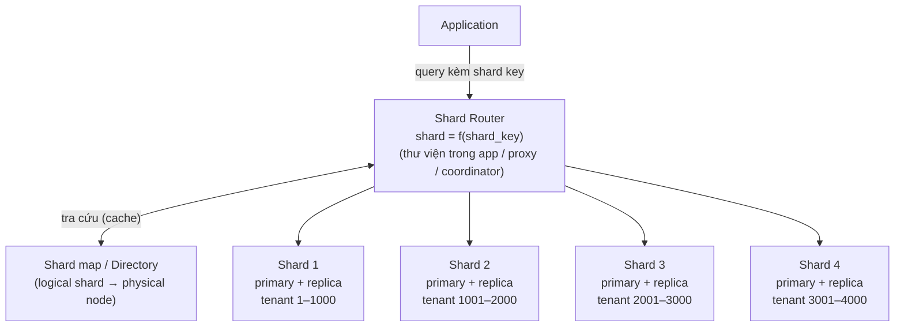
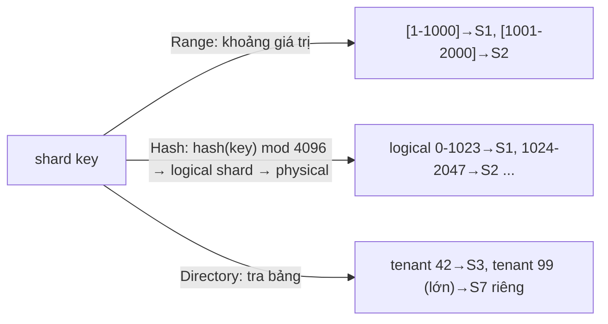
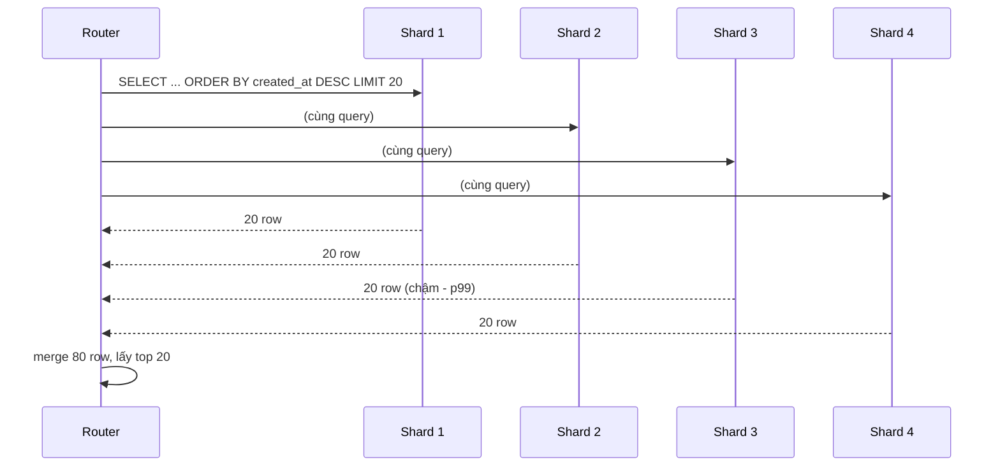
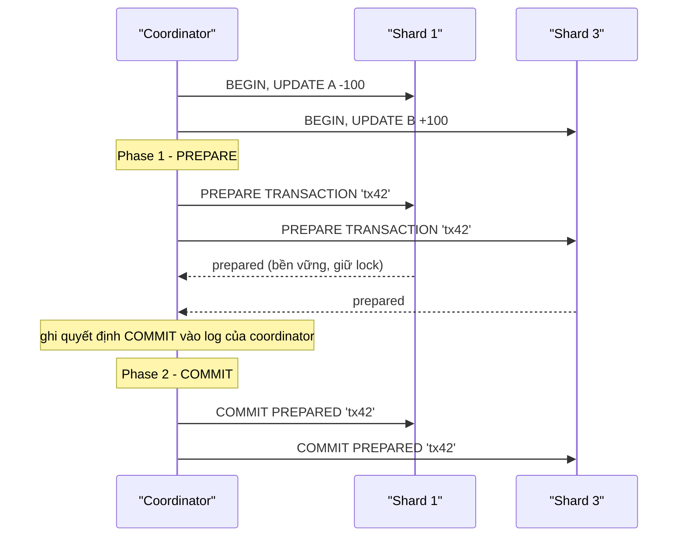
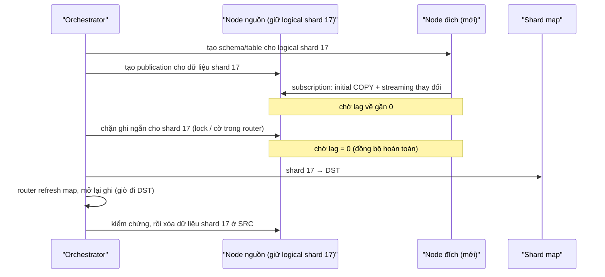

# PART 33 — SHARDING

> **Trước:** [32 — Partitioning](32-partitioning.md) · **Tiếp:** [34 — Partitioning vs Sharding](34-partitioning-vs-sharding.md)
> **Độ ưu tiên:** Rất cao.

---

## Mục lục

1. [Simple mental model](#1-simple-mental-model)
2. [WHAT — Shard, shard key, horizontal sharding](#2-what)
3. [WHY — Khi nào một node không đủ](#3-why)
4. [HOW — Kiến trúc và Shard Router](#4-how--kiến-trúc-và-shard-router)
5. [Chiến lược sharding: Range, Hash, Directory](#5-chiến-lược-sharding)
6. [Chọn Shard Key](#6-chọn-shard-key)
7. [Hot Shard](#7-hot-shard)
8. [Cross-shard Query](#8-cross-shard-query)
9. [Distributed Transaction](#9-distributed-transaction)
10. [Global Unique ID](#10-global-unique-id)
11. [Rebalancing và Resharding](#11-rebalancing-và-resharding)
12. [Những gì mất đi khi shard](#12-những-gì-mất-đi-khi-shard)
13. [Sharding PostgreSQL trong thực tế: Citus, application-level](#13-sharding-postgresql-trong-thực-tế)
14. [WHAT HAPPENS IF...](#14-what-happens-if)
15. [TRADE-OFF / WHEN TO USE](#15-trade-off--when-to-use)
16. [COMMON MISUNDERSTANDINGS](#16-common-misunderstandings)
- [Concept card — khung 13 điểm](#concept-card--)
17. [INTERVIEW QUESTIONS](#17-interview-questions)
18. [KEY TAKEAWAYS](#18-key-takeaways)

---

## 1. Simple mental model

Một ngân hàng quá đông khách cho một chi nhánh. Giải pháp: mở **nhiều chi nhánh**, mỗi chi nhánh phục vụ **một nhóm khách hàng cố định** (ví dụ theo họ A–F, G–M...). Khách luôn đến đúng chi nhánh của mình (**shard key → shard**) — cần một **bàn hướng dẫn** ở cửa (**router**). Mọi việc của một khách xử lý gọn trong một chi nhánh. Nhưng: chuyển tiền giữa hai khách ở hai chi nhánh khác nhau cần **phối hợp** (distributed transaction); báo cáo toàn ngân hàng phải **hỏi mọi chi nhánh** (scatter-gather); một chi nhánh có "khách VIP" siêu đông (**hot shard**); và mở thêm chi nhánh đòi hỏi **chuyển hồ sơ** khách (resharding).

---

## 2. WHAT

- **Sharding (horizontal sharding)**: chia **các row** của dữ liệu ra **nhiều database server độc lập** (shard), mỗi shard giữ một tập con các row, theo **shard key**.
- **Shard**: một database (thường có primary + replica riêng) chứa một phần dữ liệu. Mỗi shard có **schema giống nhau**.
- **Shard key** (distribution key/column): cột (hoặc tập cột) quyết định row thuộc shard nào.
- **Shard router**: thành phần ánh xạ shard key → shard và định tuyến query.
- **Vertical partitioning/sharding** (khác): tách **các table/cột** sang server khác nhau (ví dụ table `users` ở DB A, `analytics_events` ở DB B) — đơn giản hơn, thường là bước đầu trước horizontal sharding.

---

## 3. WHY

Một node PostgreSQL có giới hạn:
- **Ghi:** một primary, một WAL stream, một bộ disk/CPU → giới hạn throughput ghi. Replica **không** giúp ghi.
- **Dung lượng:** disk tối đa của một máy (và thời gian backup/restore/rebuild replica tăng theo).
- **Working set:** RAM một máy.
- **Blast radius:** một sự cố ảnh hưởng mọi khách hàng.
- **Vận hành:** vacuum, index build, upgrade trên database 50TB đau đớn.

Khi đã tối ưu query, index, vertical scaling, read replica, partitioning, cache, và vẫn chạm trần — sharding là bước tiếp theo. Cái giá rất cao (mục 12) nên **đừng shard sớm**.

---

## 4. HOW — Kiến trúc và Shard Router

### Diagram bắt buộc

**Cách đọc diagram (trên xuống):** Application gửi query **kèm shard key** (vd `tenant_id = 1500`). Router tính/tra shard (Shard 2) dựa trên **shard map** (thường cache trong router) và gửi query tới shard đó. Query **không** có shard key → router phải gửi tới **mọi shard** (fan-out) và gộp kết quả. Mỗi shard là một PostgreSQL độc lập với HA riêng.

### Vị trí của router

| Vị trí | Ví dụ | Ưu | Nhược |
|---|---|---|---|
| **Thư viện trong application** | Instagram, Notion (logic trong app) | Không thêm hop, linh hoạt | Mọi service/ngôn ngữ phải tích hợp; khó đổi |
| **Proxy** | Vitess vtgate (MySQL), PgCat/pgdog (proxy PostgreSQL có hỗ trợ sharding) | Trong suốt với app | Thêm hop, thành phần HA mới |
| **Coordinator trong DB** | **Citus coordinator** | SQL gần như bình thường, planner phân tán | Coordinator là thành phần đặc biệt cần HA |

---

## 5. Chiến lược sharding

### 5.1 Range sharding

Shard theo **khoảng** giá trị key: tenant 1–1000 → S1, 1001–2000 → S2...

| Ưu | Nhược |
|---|---|
| Range query theo key chỉ chạm ít shard | **Hot spot**: key tăng dần (id, thời gian) → mọi ghi mới dồn vào shard cuối |
| Split khoảng khi shard lớn (dễ hình dung) | Phân bố không đều nếu dữ liệu lệch |

### 5.2 Hash sharding

`shard = hash(key) mod N` (hoặc hash → khoảng hash).

| Ưu | Nhược |
|---|---|
| Phân bố **đều** | Range query theo key phải fan-out |
| Key tăng dần không gây hot spot | **`mod N` đổi N → gần như mọi key đổi shard** (resharding khổng lồ) |

Giải pháp cho vấn đề `mod N`:
- **Consistent hashing:** key và node trên một vòng hash; thêm node chỉ di chuyển ~1/N dữ liệu.
- **Nhiều logical shard cố định** (phổ biến nhất với PostgreSQL): chọn số logical shard lớn và **không bao giờ đổi** (ví dụ 4096 hoặc 480), `logical = hash(key) mod 4096`; ánh xạ **logical → physical** trong shard map. Thêm node = **di chuyển một số logical shard** nguyên khối sang node mới, không re-hash.

### 5.3 Directory-based sharding

Một **lookup table** (directory) lưu ánh xạ key → shard (vd `tenant_id → shard`).

| Ưu | Nhược |
|---|---|
| Linh hoạt tối đa: đặt tenant lớn lên shard riêng, di chuyển từng tenant | Directory là **dependency quan trọng** (phải HA, cache, nhất quán) |
| Không phụ thuộc phân bố hash | Thêm một lookup mỗi request (giảm bằng cache) |

### 5.4 Geo-sharding

Theo vùng địa lý (data residency, latency). Thường kết hợp directory.

**Cách đọc diagram:** Ba cách biến shard key thành vị trí vật lý. Thực tế thường **lai**: hash → logical shard (phân bố đều) + directory cho ngoại lệ (tenant lớn được tách riêng).

---

## 6. Chọn Shard Key

Quyết định quan trọng nhất và **khó đổi nhất** trong sharding.

| Tiêu chí | Giải thích |
|---|---|
| **Query locality** | Phần lớn query (đặc biệt query nóng) phải **chứa shard key** → single-shard. |
| **Transaction locality** | Dữ liệu cần thay đổi cùng transaction nên **cùng shard** → tránh distributed transaction. |
| **Co-location** | Các table liên quan shard theo **cùng key** (orders, order_items, payments theo `tenant_id`/`customer_id`) → join trong một shard. |
| **Phân bố đều** | Cardinality cao, không lệch (tránh key có vài giá trị khổng lồ). |
| **Ổn định** | Key không đổi theo thời gian (đổi key = di chuyển row giữa shard). |
| **Tránh monotonic với range** | Timestamp/sequence với range sharding → hot shard. |

**Ví dụ:**
- SaaS B2B: `tenant_id` — gần như mọi query trong phạm vi một tenant; co-location tự nhiên; rủi ro: tenant lớn → hot shard.
- Social network: `user_id` — dữ liệu của một user cùng shard; nhưng feed (đọc bài của nhiều người) là cross-shard → giải bằng fan-out on write vào timeline của từng user.
- E-commerce: `customer_id` cho orders; nhưng inventory theo `product_id` → hai miền shard khác nhau, giao dịch đặt hàng chạm cả hai → cần thiết kế saga/reservation.

---

## 7. Hot Shard

### 7.1 Nguyên nhân

- Key lệch: một tenant chiếm 30% traffic; một "celebrity" user có hàng triệu follower.
- Range sharding với key tăng dần.
- Sự kiện: flash sale của một merchant.

### 7.2 Hệ quả

Một shard quá tải trong khi các shard khác rảnh → throughput toàn hệ thống bị giới hạn bởi shard nóng nhất; p99 latency tăng.

### 7.3 Giảm thiểu

| Kỹ thuật | Mô tả |
|---|---|
| **Tách tenant lớn** | Directory: đưa tenant lớn lên shard riêng (hoặc cụm riêng) |
| **Key salting** | Thêm hậu tố ngẫu nhiên cho key nóng (`user_id#0..7`) → rải ra nhiều shard; đọc phải gộp |
| **Hash thay vì range** | Cho key tăng dần |
| **Cache** | Cho đọc nóng |
| **Logical shard nhỏ** | Di chuyển logical shard nóng sang node ít tải |

---

## 8. Cross-shard Query

### 8.1 Scatter-gather

Query không có shard key (hoặc cần dữ liệu nhiều shard) → gửi tới **mọi shard**, gộp kết quả.

**Cách đọc diagram:** Mỗi shard trả top-20 cục bộ; router merge và lấy top-20 toàn cục (đúng về logic). Chi phí:
- **Tải nhân N**: mỗi query đơn lẻ thành N query.
- **Tail latency**: latency = **max** của N shard → khi N lớn, gần như luôn chờ shard chậm nhất.
- **Pagination sâu**: OFFSET 10.000 → mỗi shard trả 10.020 row.
- **Aggregate**: `COUNT/SUM` gộp dễ; `AVG` cần sum + count; `COUNT(DISTINCT)`, percentile khó (cần dữ liệu thô hoặc sketch như HyperLogLog).

### 8.2 Cross-shard join

| Cách | Mô tả |
|---|---|
| **Co-location** | Shard hai table theo cùng key → join trong shard |
| **Reference table** | Table nhỏ, ít đổi (countries, plans) **nhân bản ra mọi shard** |
| **Denormalization** | Sao chép dữ liệu cần vào shard |
| **Application-side join** | Lấy từ shard A, rồi batch query shard B |
| **Đẩy sang hệ analytics** | CDC → warehouse cho query toàn cục |

### 8.3 Global secondary index

Tìm theo cột không phải shard key (vd `email` khi shard theo `user_id`) → hoặc fan-out, hoặc duy trì **bảng tra ngược** (email → user_id) shard theo email — đồng bộ hai nơi là bài toán distributed transaction/eventual consistency.

---

## 9. Distributed Transaction

### 9.1 Vấn đề

Chuyển tiền từ user A (shard 1) sang user B (shard 3): hai database độc lập, mỗi bên có transaction riêng. Commit S1 thành công, S3 thất bại → mất tính nguyên tử.

### 9.2 Two-Phase Commit (2PC)

**Cách đọc diagram:** Phase 1: mọi participant **chuẩn bị** — đảm bảo có thể commit dù có crash (dữ liệu và lock bền vững, [Chương 09 §12](09-transaction.md#12-two-phase-commit)). Nếu tất cả OK, coordinator **ghi quyết định** rồi Phase 2: commit ở mọi nơi. Nếu bất kỳ bên nào lỗi ở Phase 1 → rollback tất cả.

**Vấn đề của 2PC:**
- **Blocking:** coordinator chết sau Phase 1 → participant giữ transaction prepared (lock, xmin horizon) **không biết commit hay rollback** → chờ coordinator phục hồi. Prepared transaction bị bỏ quên → bloat, lock, wraparound.
- **Latency:** thêm round-trip và fsync.
- **Availability:** mọi participant phải sẵn sàng.

PostgreSQL cung cấp **cơ chế participant** (`PREPARE TRANSACTION`, `max_prepared_transactions` phải > 0), **không** cung cấp coordinator/transaction manager. Citus dùng 2PC nội bộ cho ghi nhiều shard (có cơ chế phục hồi transaction dở).

### 9.3 Thay thế: tránh distributed transaction

- **Thiết kế shard key** để transaction nằm trong một shard (co-location).
- **Saga**: chuỗi transaction cục bộ + **compensating transaction** khi một bước thất bại (eventual consistency) — [Chương 39](39-distributed-database.md).
- **Outbox + message broker**: bước 1 ghi DB + outbox trong một transaction cục bộ; consumer thực hiện bước 2 (idempotent).
- **Ledger/escrow**: chuyển tiền qua tài khoản trung gian với trạng thái (reserved → settled).

---

## 10. Global Unique ID

Sequence của mỗi shard độc lập → trùng id giữa shard. Các phương án:

| Phương án | Mô tả | Ưu | Nhược |
|---|---|---|---|
| **Sequence với offset/step** | Shard k: `START k INCREMENT N` | Đơn giản, 8 byte | Đổi N khó; lộ số shard |
| **UUIDv4** | Ngẫu nhiên 128 bit | Không phối hợp | 16 byte, insert ngẫu nhiên vào B-Tree ([Chương 01 §6.4](01-relational-database.md#64-surrogate-key-bigint-identity-vs-uuid)) |
| **UUIDv7** | Timestamp ms + random (RFC 9562); PG 18 có `uuidv7()` | Không phối hợp, **sắp theo thời gian** (B-Tree thân thiện) | 16 byte |
| **Snowflake-style 64-bit** | `timestamp (41 bit) + shard/machine id + sequence` | 8 byte, sắp theo thời gian, **mã hóa shard trong id** (router suy ra shard từ id) | Phụ thuộc đồng hồ, cần cấp machine id |
| **Ticket server** | Service cấp id theo lô | Liên tục | Single point, thêm hop |

**Ví dụ nổi tiếng:** Instagram (2012) sinh id 64-bit ngay trong PostgreSQL bằng PL/pgSQL: **41 bit thời gian + 13 bit logical shard id + 10 bit sequence** (mỗi logical shard là một schema PostgreSQL) — từ id suy ra được shard, và id sắp theo thời gian.

---

## 11. Rebalancing và Resharding

### 11.1 WHY

Dữ liệu tăng, shard đầy; phân bố lệch; cần thêm node.

### 11.2 HOW — Di chuyển logical shard online

**Cách đọc diagram:** Với **nhiều logical shard cố định**, resharding = **di chuyển nguyên khối** logical shard qua logical replication (PostgreSQL) rồi **cutover** trong cửa sổ ghi bị chặn vài giây. Không cần re-hash từng row. Notion mô tả cách tiếp cận tương tự (480 logical shard trên 32 database vật lý năm 2021, sau đó mở rộng số database vật lý năm 2023); Citus có **shard rebalancer** tự động di chuyển shard (dùng logical replication để giảm thời gian chặn ghi).

### 11.3 Nếu dùng `hash mod N_physical`

Thêm node → gần như mọi row đổi chỗ → phải di chuyển gần toàn bộ dữ liệu. Đây là lý do **luôn tách logical shard khỏi physical node** ngay từ đầu.

---

## 12. Những gì mất đi khi shard

| Tính năng single-node | Sau khi shard |
|---|---|
| FK giữa table | Chỉ trong shard (co-located); cross-shard không có |
| UNIQUE toàn cục | Chỉ khi chứa shard key; còn lại phải dùng table tra ngược/logic |
| Transaction ACID bất kỳ | Chỉ trong shard; cross-shard cần 2PC/saga |
| JOIN tùy ý | Co-located/reference table; còn lại tốn kém |
| Sequence | Cần global ID |
| Schema migration | Chạy trên N shard, phải điều phối, có thể lệch tạm thời |
| Backup nhất quán toàn cục | Không có snapshot chung tự nhiên; PITR mỗi shard tới cùng thời điểm chỉ xấp xỉ |
| Ad-hoc query/report | Scatter-gather hoặc warehouse |
| Vận hành | N cluster × (primary + replica + backup + monitoring) |

---

## 13. Sharding PostgreSQL trong thực tế

### 13.1 Citus (extension)

- **Coordinator** + **worker nodes**. Table được khai báo **distributed** theo một **distribution column**: `SELECT create_distributed_table('orders', 'tenant_id');` → chia thành các shard (mặc định **32**) phân bố trên worker.
- **Reference table**: nhân bản toàn bộ tới mọi worker (join với mọi distributed table).
- **Co-location**: table cùng distribution column và cùng số shard được đặt cùng node → join/FK/transaction trong shard.
- **Distributed planner**: query có điều kiện trên distribution column → **router query** (một shard); không có → **multi-shard** (song song trên các worker, gộp ở coordinator).
- Ghi nhiều shard dùng **2PC** nội bộ; **shard rebalancer**; từ Citus 11, có thể gửi query tới bất kỳ node nào (không chỉ coordinator).
- Là một phần của Azure Cosmos DB for PostgreSQL; mã nguồn mở.

### 13.2 Application-level sharding

App tự giữ shard map, tự routing, tự migration. Ví dụ công khai: Instagram (logical shard = schema), Notion (logical shard theo workspace), Figma (horizontal sharding PostgreSQL nhiều năm). Ưu: toàn quyền kiểm soát; nhược: rất nhiều code hạ tầng.

### 13.3 Hoặc: không shard PostgreSQL

- **Distributed SQL** (CockroachDB, YugabyteDB — tương thích wire protocol/SQL PostgreSQL ở mức khác nhau, Spanner): sharding + replication + distributed transaction **tự động** (Raft mỗi range), đổi lại latency ghi cao hơn, hành vi khác PostgreSQL ở nhiều chi tiết.
- **Tách miền (vertical/service split)**: mỗi bounded context một database.

---

## 14. WHAT HAPPENS IF...

| Tình huống | Hệ quả |
|---|---|
| **Một shard chết** | Chỉ khách hàng trên shard đó bị ảnh hưởng (blast radius nhỏ) — nếu query của họ không fan-out; query fan-out lỗi toàn bộ hoặc trả kết quả thiếu |
| **Router có shard map cũ** | Gửi query tới shard sai → dữ liệu "không tồn tại" hoặc ghi vào nhầm chỗ → cần versioning shard map, shard từ chối key không thuộc mình |
| **Coordinator 2PC chết sau PREPARE** | Prepared transaction treo, giữ lock/horizon — cần cơ chế phục hồi |
| **Chọn sai shard key** | Phần lớn query là fan-out → hệ thống chậm hơn single node; resharding theo key mới = migration toàn bộ |
| **Tenant tăng trưởng vượt một shard** | Phải shard bên trong tenant (key phức hợp) — thiết kế từ đầu nếu có khả năng |
| **Migration schema thất bại ở 3/32 shard** | Trạng thái lệch; app phải tương thích cả hai schema trong lúc chuyển |

---

## 15. TRADE-OFF / WHEN TO USE

**Shard khi:** ghi hoặc dung lượng vượt khả năng một node tốt nhất có thể mua (sau khi đã tối ưu), hoặc yêu cầu cách ly/blast radius/data residency; và dữ liệu có **shard key tự nhiên** (tenant, user) với query locality cao.

**Chưa shard khi:** chưa thử vertical scaling, read replica, partitioning, cache, tối ưu query/index, tách service; hoặc không có shard key tốt.

| Lợi | Hại |
|---|---|
| Scale ghi và dung lượng gần tuyến tính | Mất FK/unique/transaction/join toàn cục |
| Blast radius nhỏ | Cross-shard query đắt, tail latency |
| Mỗi node nhỏ hơn → vận hành từng node dễ hơn | Vận hành N cụm; migration, backup phối hợp |
| Data residency | Resharding phức tạp; hot shard |

---

## 16. COMMON MISUNDERSTANDINGS

1. **"Sharding = partitioning."** — Partition cùng server; shard khác server ([Chương 34](34-partitioning-vs-sharding.md)).
2. **"Shard càng sớm càng tốt để sẵn sàng scale."** — Chi phí phức tạp trả ngay; lợi ích chỉ khi thật sự cần.
3. **"Hash sharding giải quyết mọi hot spot."** — Không giải quyết key đơn lẻ quá nóng (celebrity).
4. **"Thêm shard là thêm máy vào."** — Cần di chuyển dữ liệu; với `mod N` là di chuyển gần hết.
5. **"2PC làm distributed transaction miễn phí."** — Blocking, latency, availability.
6. **"PostgreSQL có sharding built-in."** — Core không có; Citus (extension) hoặc tầng application/proxy.

---

## Concept card — Sharding theo khung 13 điểm

| # | Khía cạnh | Tóm tắt |
|---|---|---|
| 1 | **WHAT** | Chia row ra nhiều database server theo shard key; router ánh xạ key → shard — §2. |
| 2 | **WHY** | Vượt giới hạn ghi/dung lượng/working set của một node, thu nhỏ blast radius — §3. |
| 3 | **HOW** | Router (app library / proxy / coordinator) + shard map; range/hash/directory — §4, §5. |
| 4 | **INTERNALS** | Logical shard cố định → physical node; 2PC với PREPARE TRANSACTION; global ID; di chuyển shard bằng logical replication — §5.2, §9, §10, §11. |
| 5 | **EXAMPLE** | SaaS theo tenant_id, tenant lớn tách riêng qua directory; Instagram ID 64-bit — §6, §10. |
| 6 | **WHAT HAPPENS IF** | Một shard chết, shard map cũ, coordinator 2PC chết, sai shard key — §14. |
| 7 | **PERFORMANCE IMPACT** | Single-shard nhanh như một node; scatter-gather nhân tải ×N và chịu tail latency — §8. |
| 8 | **PRODUCTION BEHAVIOR** | Hot shard, resharding, migration schema trên N shard, backup không có điểm nhất quán chung — §7, §12. |
| 9 | **TRADE-OFF** | Scale ngang ↔ mất FK/unique/transaction/join toàn cục, vận hành ×N — §15. |
| 10 | **WHEN TO USE / NOT** | Khi một node không đủ sau khi đã tối ưu mọi cách khác và có shard key tự nhiên; không shard sớm — §15. |
| 11 | **MISUNDERSTANDINGS** | "Sharding = partitioning", "hash giải quyết mọi hot spot", "PostgreSQL có sharding built-in" — §16. |
| 12 | **INTERVIEW** | Chiến lược, shard key, cross-shard transaction, global ID — §17. |
| 13 | **KEY TAKEAWAYS** | Shard key quyết định mọi thứ; tách logical khỏi physical shard — §18. |

---

## 17. INTERVIEW QUESTIONS

**Q1. Sharding là gì? Khi nào cần?**
- *Short:* Chia row ra nhiều database server theo shard key để scale ghi/dung lượng; cần khi một node không đủ sau khi đã tối ưu các cách khác.

**Q2. Range vs hash vs directory sharding?**
- *Short:* Range: range query tốt, hot spot với key tăng dần. Hash: đều, range query fan-out, resharding khó nếu mod N. Directory: linh hoạt, cần lookup HA.
- *Follow-up:* Làm sao thêm node mà không di chuyển toàn bộ dữ liệu? (Logical shard cố định, consistent hashing.)

**Q3. Chọn shard key thế nào?**
- *Short:* Query/transaction locality, co-location, phân bố đều, ổn định, tránh monotonic với range.

**Q4. Xử lý transaction chạm hai shard?**
- *Short:* Tránh bằng thiết kế; nếu buộc: 2PC (blocking) hoặc saga + outbox + idempotency.

**Q5. Global unique ID?**
- *Short:* UUIDv7/Snowflake (có thời gian, có thể mã hóa shard), sequence offset, ticket server.

**Q6. (Senior) Thiết kế sharding cho SaaS multi-tenant với vài tenant cực lớn.**
- *Short:* Shard theo tenant_id với logical shard cố định + directory override cho tenant lớn (shard riêng); co-location mọi table theo tenant_id; reference table cho dữ liệu dùng chung; resharding bằng logical replication; analytics toàn cục qua CDC → warehouse.

**Q7. (Staff) So sánh Citus với distributed SQL (CockroachDB/Yugabyte).**
- *Short:* Citus: PostgreSQL thật (extension), shard theo distribution column, hiệu năng single-shard như PostgreSQL, HA mỗi node bằng streaming replication, 2PC cho multi-shard. Distributed SQL: Raft cho mọi range, auto-rebalance, serializable phân tán, latency ghi cao hơn, tương thích PostgreSQL một phần.

---

## 18. KEY TAKEAWAYS

1. Sharding = chia **row** ra **nhiều server** theo **shard key**; router ánh xạ key → shard.
2. Range (locality, hot spot) / Hash (đều, fan-out range) / Directory (linh hoạt, dependency) — thực tế lai: **hash → logical shard cố định → physical qua map**.
3. **Shard key** quyết định mọi thứ: query/transaction locality, co-location, phân bố, ổn định.
4. Cross-shard query = scatter-gather (tải ×N, tail latency); cross-shard transaction = 2PC (blocking) hoặc saga.
5. Global ID: UUIDv7/Snowflake; tách logical khỏi physical shard để resharding = di chuyển nguyên khối qua logical replication.
6. Mất FK/unique/transaction/join toàn cục; vận hành ×N. **Đừng shard sớm.**

---

## Nguồn tham khảo

- Citus Documentation: https://docs.citusdata.com/
- Instagram Engineering, *Sharding & IDs at Instagram* (2012).
- Notion Engineering, *Herding elephants: Lessons learned from sharding Postgres at Notion* (2021) và *The Great Re-shard* (2023).
- Figma Engineering, *How Figma's databases team lived to tell the scale* (2024).
- Martin Kleppmann, *Designing Data-Intensive Applications*, chương 6 (Partitioning) và chương 9.
- PostgreSQL Docs — *PREPARE TRANSACTION*.
