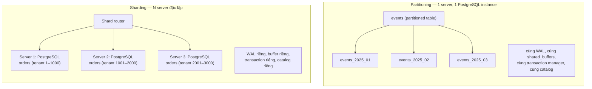
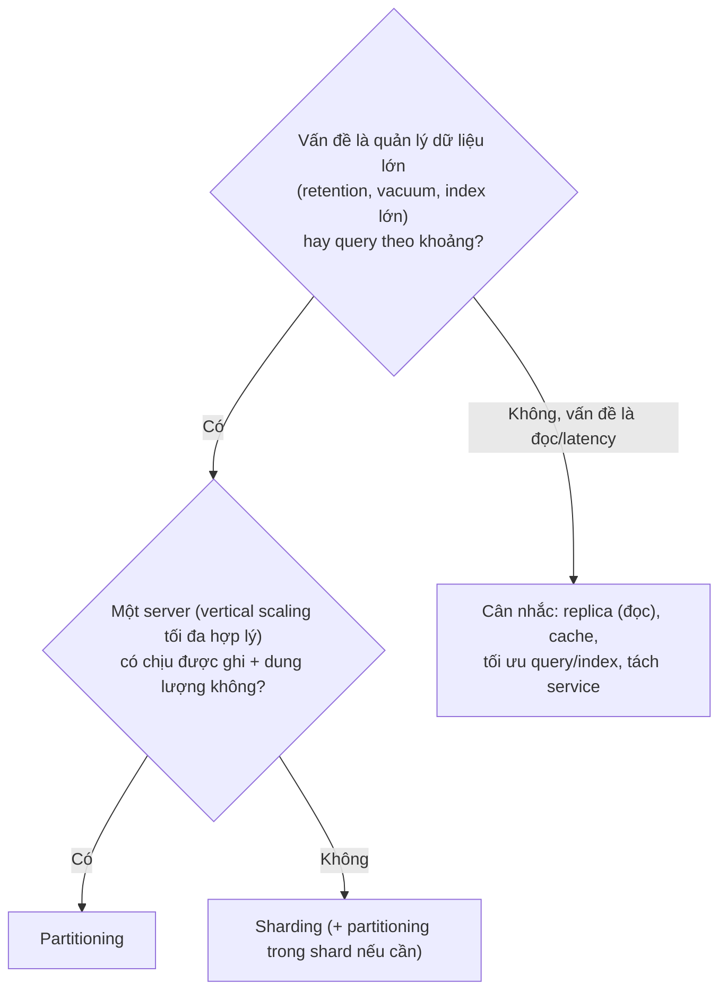

# PART 34 — PARTITIONING VS SHARDING

> **Trước:** [33 — Sharding](33-sharding.md) · **Tiếp:** [35 — Database Cluster](35-database-cluster.md)

Hai khái niệm đều "chia dữ liệu theo một khóa", nên thường bị nhầm. Khác biệt cốt lõi nằm ở **ranh giới vật lý**: partitioning chia **bên trong một database server**; sharding chia **giữa nhiều database server**. Mọi khác biệt khác là hệ quả của điều đó.

---

## 1. Simple mental model

- **Partitioning:** một tủ hồ sơ có nhiều ngăn — **cùng một phòng, cùng một người quản lý**.
- **Sharding:** nhiều văn phòng ở nhiều tòa nhà, mỗi văn phòng có tủ và người quản lý riêng.

---

## 2. Diagram so sánh

**Cách đọc diagram:** Bên trái, mọi partition dùng chung **mọi tài nguyên** của một instance: một WAL stream, một bộ nhớ, một transaction manager — nên transaction, FK, join giữa các partition hoạt động như bình thường. Bên phải, mỗi shard là **một PostgreSQL độc lập** — không có gì chung, nên mọi thứ "xuyên shard" phải được phối hợp bên ngoài database.

---

## 3. Bảng so sánh chi tiết

| Tiêu chí | Partitioning | Sharding |
|---|---|---|
| **Vị trí dữ liệu** | Nhiều table vật lý trong **một database, một server** | Nhiều database trên **nhiều server** |
| **Ai định tuyến** | **PostgreSQL** (tuple routing, partition pruning) — trong suốt với app | **Router bên ngoài** (app library, proxy, coordinator như Citus) |
| **Query routing** | Planner/executor prune partition | Router chọn shard; không có key → fan-out qua mạng |
| **Transaction** | ACID bình thường xuyên partition (một transaction manager, một WAL) | ACID chỉ trong một shard; xuyên shard cần 2PC/saga |
| **Foreign key / JOIN** | Hoạt động (FK tới/từ partitioned table từ PG 11/12) | Chỉ trong shard (co-location) hoặc reference table |
| **Unique toàn cục** | Chỉ khi chứa partition key | Chỉ khi chứa shard key |
| **Failure domain** | **Một**: server chết → mọi partition không truy cập được | **Nhiều**: một shard chết chỉ ảnh hưởng dữ liệu của shard đó |
| **Scaling** | Không tăng CPU/RAM/disk/WAL throughput — cùng máy; giúp **quản lý** dữ liệu lớn và hiệu năng query theo key | **Scale ngang**: thêm server = thêm CPU, RAM, disk, **throughput ghi** |
| **Giới hạn trên** | Giới hạn của một máy | Gần như không (số shard) |
| **Operational complexity** | Thấp–trung bình (tạo/xóa partition, pg_partman) | **Cao** (N cụm HA, backup, migration phối hợp, rebalancing, global ID, monitoring) |
| **Schema change** | Một lệnh DDL (lan tới partition) | Điều phối N database |
| **Backup/PITR** | Một backup nhất quán | N backup, không có điểm nhất quán chung tự nhiên |
| **Retention** | DROP partition — rất tốt | Tùy (có thể kết hợp partition trong mỗi shard) |
| **Có trong PostgreSQL core** | **Có** (declarative, PG 10+) | **Không** (Citus extension, app-level, proxy) |

---

## 4. Chúng kết hợp với nhau

Không loại trừ nhau — hệ thống lớn thường dùng **cả hai**:
- **Shard theo `tenant_id`** (scale ngang, cách ly) **và** trong mỗi shard, **partition `events` theo thời gian** (retention, vacuum).
- Citus: distributed table có thể đồng thời là partitioned table (time-partitioned distributed table).
- Hash partitioning trong một node đôi khi là **bước chuẩn bị** cho sharding (logic phân chia giống nhau, sau này tách partition sang server khác).

---

## 5. Quyết định: dùng cái nào?

**Cách đọc diagram:** Partitioning là công cụ **tổ chức** dữ liệu trong giới hạn một máy; sharding là công cụ **vượt** giới hạn một máy. Nếu một máy vẫn đủ, partitioning (và các kỹ thuật khác) rẻ hơn rất nhiều.

---

## 6. Common misunderstandings

1. **"Partitioning là sharding trên một máy."** — Cách nói gây nhầm lẫn; partitioning không có router bên ngoài, không mất transaction/FK, không scale tài nguyên.
2. **"Partition giúp scale write."** — Cùng WAL, cùng disk; có thể giảm contention cục bộ (ví dụ index nhỏ hơn) nhưng không vượt giới hạn máy.
3. **"Sharding thay thế partitioning."** — Thường dùng cùng nhau.
4. **"Hash partition = hash shard."** — Cùng ý tưởng phân phối, khác hoàn toàn về ranh giới vật lý và hệ quả.

---

## 7. Interview Questions

**Q1. Partitioning khác sharding thế nào?**
- *Short:* Partitioning chia table trong một database/server, PostgreSQL tự route, giữ ACID/FK/join; sharding chia dữ liệu ra nhiều server, cần router ngoài, mất transaction/join xuyên shard, scale ngang, failure domain riêng, vận hành phức tạp.
- *Follow-up:* Khi nào dùng cả hai?

**Q2. Partitioning có giúp khi CPU của primary 100% do ghi không?**
- *Short:* Thường không; cùng máy. Cần giảm chi phí ghi (index, HOT, batch) hoặc shard.

---

## 8. Key Takeaways

1. **Partition = cùng server; Shard = khác server.** Mọi khác biệt khác bắt nguồn từ đây.
2. Partitioning: PostgreSQL core, trong suốt, giữ ACID/FK/join, một failure domain, không scale tài nguyên, rất tốt cho retention/vacuum/pruning.
3. Sharding: router ngoài, scale ngang, nhiều failure domain, mất transaction/join/unique toàn cục, vận hành ×N.
4. Hệ thống lớn thường kết hợp: shard theo tenant, partition theo thời gian bên trong shard.

---

## Nguồn tham khảo

- PostgreSQL Docs — *Table Partitioning*: https://www.postgresql.org/docs/current/ddl-partitioning.html
- Citus Docs — *Distributed tables*, *Timeseries data (partitioned distributed tables)*.
- Martin Kleppmann, *Designing Data-Intensive Applications*, chương 6.
