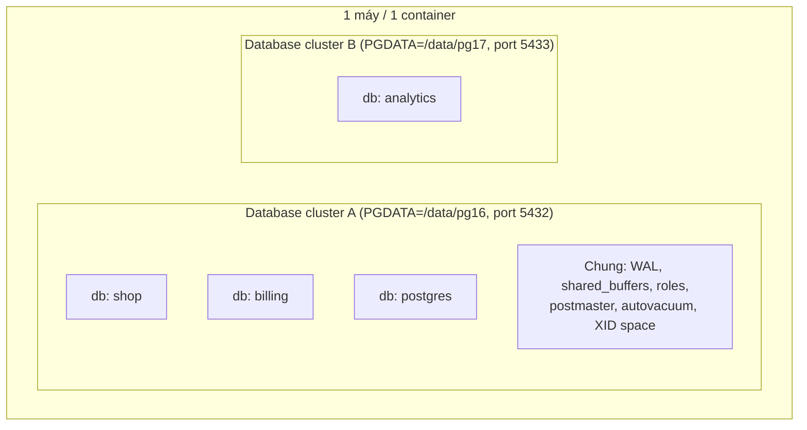
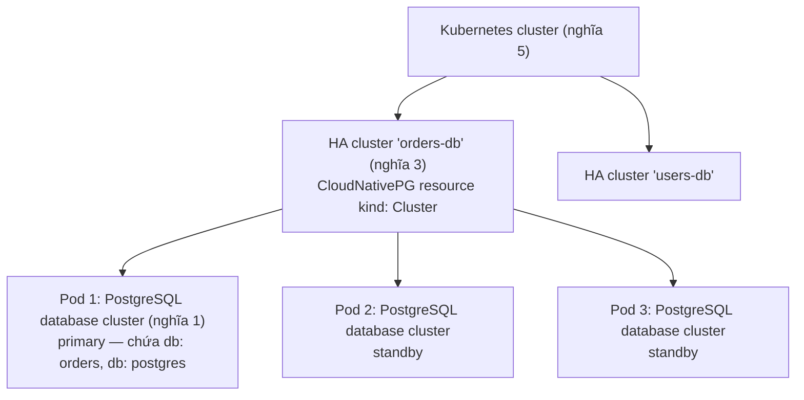

# PART 35 — DATABASE CLUSTER

> **Trước:** [34 — Partitioning vs Sharding](34-partitioning-vs-sharding.md) · **Tiếp:** [36 — Scaling](36-scaling.md)

Từ **"cluster"** là một trong những từ gây nhầm lẫn nhất trong thế giới database, vì nó có **ít nhất năm nghĩa khác nhau** tùy ngữ cảnh. Một kỹ sư nói "cluster PostgreSQL của chúng tôi có 3 node" và một DBA nói "cluster này có 12 database" có thể đều đúng — nhưng đang nói về hai thứ khác nhau.

---

## 1. Năm nghĩa của "cluster"

| # | Nghĩa | Ngữ cảnh | Ví dụ |
|---|---|---|---|
| 1 | **PostgreSQL database cluster** | Thuật ngữ chính thức trong PostgreSQL docs | Một thư mục PGDATA + một instance server, chứa nhiều database |
| 2 | **`CLUSTER` command** | Lệnh SQL | Sắp xếp lại vật lý một table theo một index |
| 3 | **HA cluster** | Vận hành | Primary + replicas + HA manager (Patroni) |
| 4 | **Distributed database cluster** | Scale-out | Citus coordinator + workers; CockroachDB nodes |
| 5 | **Kubernetes cluster** | Hạ tầng | Tập node chạy container, nơi PostgreSQL có thể được triển khai |

---

## 2. Nghĩa 1 — PostgreSQL Database Cluster

### 2.1 WHAT

Theo PostgreSQL documentation: *"a database cluster is a collection of databases that is managed by a single instance of a running database server."* Cụ thể:
- **Một** thư mục dữ liệu (**PGDATA**), được tạo bởi `initdb`.
- **Một** postmaster, lắng nghe **một** port.
- Chứa **nhiều database** (`postgres`, `template0`, `template1`, và database của người dùng).
- **Chia sẻ**: shared buffers, WAL (một luồng WAL cho mọi database), background processes, roles, tablespaces, cấu hình, **không gian XID**.



**Cách đọc diagram:** Một máy có thể chạy **nhiều database cluster** (nhiều instance, khác port, khác PGDATA, có thể khác version). Mỗi cluster chứa nhiều database. Ở nghĩa này, "cluster" **không liên quan gì đến nhiều máy**.

### 2.2 Hệ quả thực tế của "chung cluster"

- **Physical replication và backup là theo cluster**: không thể replicate/backup vật lý chỉ một database — standby nhận **toàn bộ** cluster.
- **WAL chung**: database A ghi nặng làm replication lag cho cả database B.
- **Tài nguyên chung**: một query tệ ở database A tốn CPU/I/O của database B.
- **Replication slot, `hot_standby_feedback`**: ảnh hưởng xmin horizon toàn cluster.
- **XID wraparound**: không gian XID là của cluster; `datfrozenxid` theo từng database nhưng giới hạn là chung.
- `pg_upgrade`, restart, thay đổi `postgresql.conf` ảnh hưởng mọi database.

→ Đặt nhiều database "không liên quan" vào một cluster là **chia sẻ số phận** (noisy neighbor).

---

## 3. Nghĩa 2 — `CLUSTER` command

```sql
CLUSTER orders USING orders_created_at_idx;
```
Viết lại table **theo thứ tự của index** (tăng `correlation` → range scan, BRIN hiệu quả hơn). Lấy **ACCESS EXCLUSIVE**, rewrite toàn table (như VACUUM FULL), thứ tự **không được duy trì** khi có ghi mới. Không liên quan gì tới "cluster nhiều máy". PG 19 (beta) gộp chức năng này vào lệnh `REPACK`. Xem [Chương 23 §7](23-vacuum.md#7-vacuum-full-cluster-pg_repack-repack).

---

## 4. Nghĩa 3 — HA Cluster

Nhiều **database cluster** (nghĩa 1) trên nhiều máy, liên kết bằng **replication**, được quản lý bởi **HA tooling**:
- 1 primary + N standby (mỗi node là một PostgreSQL database cluster đầy đủ, bản sao vật lý của nhau);
- DCS (etcd) + agent (Patroni) + routing.

Patroni gọi tập này là "cluster" (có `scope`/tên cluster). Mọi node chứa **cùng dữ liệu** — đây là cluster để **sẵn sàng**, **không** phải để chia dữ liệu. Xem [Chương 29](29-high-availability.md).

---

## 5. Nghĩa 4 — Distributed Database Cluster

Nhiều node, **mỗi node giữ một phần dữ liệu** (và thường cũng có bản sao), phối hợp để trả lời query như một database:
- **Citus**: coordinator + workers, dữ liệu shard theo distribution column; mỗi worker là một PostgreSQL database cluster; HA của mỗi node là một HA cluster riêng.
- **CockroachDB/YugabyteDB/TiDB**: node ngang hàng, dữ liệu chia thành range/tablet, mỗi range replicate bằng Raft.

Đây là cluster để **scale** (và sẵn sàng).

---

## 6. Nghĩa 5 — Kubernetes Cluster

Tập máy (node) chạy Kubernetes. PostgreSQL có thể chạy trong đó (thường qua **operator** như CloudNativePG, Zalando postgres-operator, Crunchy PGO). Một Kubernetes cluster có thể chứa **nhiều** HA cluster PostgreSQL, mỗi HA cluster gồm nhiều pod, mỗi pod là một PostgreSQL database cluster. CloudNativePG gọi custom resource của nó là `Cluster` — thêm một lớp trùng tên.



**Cách đọc diagram:** Các nghĩa **lồng nhau**: Kubernetes cluster chứa HA cluster, HA cluster gồm nhiều PostgreSQL database cluster (mỗi pod một cái), mỗi database cluster chứa nhiều database. Khi ai đó nói "cluster", hãy hỏi: "cluster theo nghĩa nào?"

---

## 7. Bảng tổng hợp

| | PostgreSQL database cluster | HA cluster | Distributed DB cluster | Kubernetes cluster |
|---|---|---|---|---|
| Số máy | 1 | Nhiều | Nhiều | Nhiều |
| Dữ liệu giữa các node | — | **Giống nhau** (replica) | **Chia nhau** (+ replica) | — (hạ tầng) |
| Mục đích | Đơn vị quản lý của một instance | Sẵn sàng | Scale + sẵn sàng | Chạy workload container |
| Nhận ghi | Instance đó | Chỉ primary | Nhiều node (mỗi node cho phần dữ liệu của nó) | — |

---

## 8. Common misunderstandings

1. **"Cluster = replica."** — HA cluster *có* replica, nhưng "PostgreSQL database cluster" là một instance; distributed cluster chia dữ liệu.
2. **"Một database cluster nghĩa là nhiều máy."** — Trong PostgreSQL docs, nó là một instance.
3. **"Có thể replicate vật lý một database trong cluster."** — Physical replication là cả cluster; muốn một database/một table → logical replication.
4. **"Chạy trên Kubernetes là có HA."** — Kubernetes restart pod; HA cho database cần replication + operator xử lý failover/fencing.

---

## 9. Interview Questions

**Q1. "Database cluster" trong PostgreSQL nghĩa là gì?**
- *Short:* Một PGDATA + một instance server chứa nhiều database, chung WAL/buffers/roles/XID space.
- *Follow-up:* Hệ quả với replication và backup? (Theo cả cluster.)

**Q2. HA cluster khác distributed database cluster thế nào?**
- *Short:* HA cluster: các node giữ cùng dữ liệu, một primary nhận ghi. Distributed: node giữ phần dữ liệu khác nhau (+ replica), scale ghi.

**Q3. Lệnh `CLUSTER` làm gì?**
- *Short:* Rewrite table theo thứ tự index, ACCESS EXCLUSIVE, không duy trì thứ tự.

---

## 10. Key Takeaways

1. "Cluster" có nhiều nghĩa: **PostgreSQL database cluster** (một instance), **lệnh CLUSTER**, **HA cluster**, **distributed cluster**, **Kubernetes cluster**.
2. PostgreSQL database cluster = đơn vị của replication vật lý, backup vật lý, WAL, XID space, tài nguyên — mọi database trong đó chia sẻ số phận.
3. Luôn làm rõ "cluster theo nghĩa nào" trong thảo luận thiết kế và phỏng vấn.

---

## Nguồn tham khảo

- PostgreSQL Docs — *Creating a Database Cluster*: https://www.postgresql.org/docs/current/creating-cluster.html
- PostgreSQL Docs — *CLUSTER*: https://www.postgresql.org/docs/current/sql-cluster.html
- Patroni, Citus, CloudNativePG documentation.
