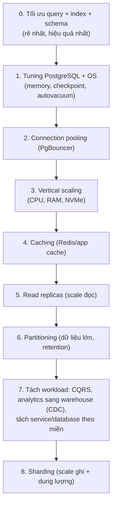
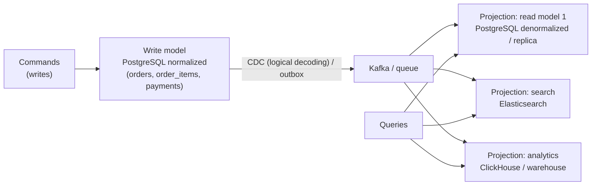

# PART 36 — SCALING DATABASE

> **Trước:** [35 — Database Cluster](35-database-cluster.md) · **Tiếp:** [37 — Connection Management](37-connection-management.md)

---

## Mục lục

1. [Simple mental model](#1-simple-mental-model)
2. [Trước khi scale: xác định nút thắt](#2-trước-khi-scale-xác-định-nút-thắt)
3. [Scaling ladder](#3-scaling-ladder)
4. [Vertical Scaling](#4-vertical-scaling)
5. [Read Replicas](#5-read-replicas)
6. [Caching](#6-caching)
7. [Connection Pooling](#7-connection-pooling)
8. [Denormalization và Materialized View](#8-denormalization-và-materialized-view)
9. [CQRS ở mức database](#9-cqrs-ở-mức-database)
10. [Partitioning](#10-partitioning)
11. [Sharding / Horizontal scaling](#11-sharding--horizontal-scaling)
12. [Scale ghi: các kỹ thuật trước khi shard](#12-scale-ghi-các-kỹ-thuật-trước-khi-shard)
13. [WHAT HAPPENS IF...](#13-what-happens-if)
14. [COMMON MISUNDERSTANDINGS](#14-common-misunderstandings)
15. [INTERVIEW QUESTIONS](#15-interview-questions)
16. [KEY TAKEAWAYS](#16-key-takeaways)

---

## 1. Simple mental model

Một quán ăn đông khách. Trước khi mở thêm chi nhánh (shard), hãy hỏi: bếp chậm vì **đầu bếp** (CPU), **tủ lạnh nhỏ** (RAM), **kho xa** (disk I/O), **quá ít bàn/quá nhiều khách chen** (connections), hay **mọi người tranh một cái chảo** (lock)? Mỗi nút thắt có cách chữa khác nhau; mở chi nhánh là cách đắt nhất.

---

## 2. Trước khi scale: xác định nút thắt

| Tài nguyên | Dấu hiệu | Công cụ |
|---|---|---|
| **CPU** | CPU cao, `wait_event` NULL (đang chạy) nhiều | `pg_stat_statements` (total_exec_time), `top`, EXPLAIN |
| **Memory/cache** | Cache hit thấp, `shared_blks_read` cao, OS page cache nhỏ | `pg_stat_io`, `pg_statio_*` |
| **Disk I/O** | Wait event `IO:DataFileRead`, `WALWrite`, `WALSync`; I/O util 100% | `pg_stat_io`, iostat |
| **WAL/commit** | Wait `WALSync`, commit latency cao | `pg_stat_wal` |
| **Connections** | Chạm `max_connections`, nhiều idle | `pg_stat_activity` |
| **Lock** | Wait `Lock:*` | `pg_locks`, `pg_blocking_pids` |
| **LWLock contention** | Wait `LWLock:*` (LockManager, BufferMapping, WALInsert...) | `pg_stat_activity` sampling |
| **Vacuum/bloat** | Table phình, dead tuple cao | `pg_stat_user_tables` |

**Nguyên tắc số 1:** phần lớn vấn đề "cần scale" thực ra là **một vài query tệ** — kiểm tra `pg_stat_statements` trước tiên. Một index đúng có thể giảm tải 100 lần; không phương án scale hạ tầng nào rẻ như vậy.

**Little's Law** (định luật Little): `L = λ × W` — số request đồng thời trong hệ thống = throughput × latency. Latency query tăng gấp đôi → số connection active cần gấp đôi cho cùng throughput → pool cạn → lỗi dây chuyền. Giảm latency query là cách scale "miễn phí".

---

## 3. Scaling ladder



**Cách đọc diagram (trên xuống):** Mỗi bậc tăng **độ phức tạp** và thường **chi phí vận hành**. Thứ tự không cứng nhắc (ví dụ pooling nên có từ sớm; partitioning có thể cần sớm cho table log), nhưng nguyên tắc: **đi bậc thấp trước**, chỉ lên bậc cao khi đã chứng minh bậc thấp không đủ.

---

## 4. Vertical Scaling

### 4.1 WHAT & WHY

Nâng cấp máy: nhiều CPU core hơn, nhiều RAM hơn, disk nhanh hơn (NVMe, IOPS cao). PostgreSQL tận dụng vertical scaling rất tốt: nhiều connection song song, parallel query, shared_buffers + page cache lớn.

### 4.2 Trade-off

| Ưu | Nhược |
|---|---|
| **Không đổi application** | Giới hạn trên (máy lớn nhất có thể mua/thuê) |
| Giữ nguyên ACID, join, FK | Chi phí tăng phi tuyến ở phân khúc cao |
| Nhanh triển khai (cloud: đổi instance type) | Thường cần restart/failover (downtime ngắn) |
| | Không giải quyết lock contention, hot row, query tệ |
| | Một số nút thắt không scale theo core (WAL insert, replay single-threaded trên replica, một số LWLock) |

Máy hiện đại (hàng trăm core, vài TB RAM, NVMe) đủ cho **phần lớn** hệ thống — đừng đánh giá thấp vertical scaling.

---

## 5. Read Replicas

Scale đọc bằng cách chuyển query read-only sang replica ([Chương 26](26-primary-replica.md)). Cái giá: stale read, read-after-write, routing, replication lag, chi phí hạ tầng. **Không scale ghi.**

---

## 6. Caching

### 6.1 WHAT

Lưu kết quả đọc (hoặc object đã tính) ở tầng nhanh hơn (Redis, Memcached, cache trong process) để giảm tải database.

### 6.2 Các pattern

| Pattern | Cách | Ghi chú |
|---|---|---|
| **Cache-aside** (phổ biến nhất) | App đọc cache → miss → đọc DB → ghi cache (TTL) | Cache có thể stale; invalidation khi ghi |
| **Read-through** | Cache tự tải từ DB khi miss | Cần lớp cache hỗ trợ |
| **Write-through** | Ghi DB và cache đồng thời | Ghi chậm hơn; nhất quán tốt hơn |
| **Write-behind** | Ghi cache, đẩy xuống DB sau | Rủi ro mất dữ liệu |

### 6.3 Các vấn đề

- **Invalidation** ("one of two hard things"): ghi DB rồi xóa cache — race: request đọc cũ nạp lại giá trị cũ sau khi xóa. Giảm bằng TTL ngắn, xóa trễ (delayed double delete), versioning, hoặc invalidation qua **CDC** (nghe WAL → xóa key) — đảm bảo mọi thay đổi (kể cả từ script/job khác) đều invalidate.
- **Cache stampede / thundering herd**: key nóng hết hạn → hàng nghìn request cùng miss → cùng đập vào DB. Giảm bằng request coalescing (single-flight), lock khi nạp, TTL ngẫu nhiên, refresh sớm.
- **Cold cache sau restart/failover Redis** → tải dồn DB → DB phải có khả năng chịu hoặc có cơ chế giới hạn.
- **Consistency**: cache là **eventual consistency**; không dùng cache cho dữ liệu cần đọc chính xác để quyết định ghi.

### 6.4 Khi nào dùng

Đọc nhiều, dữ liệu ít đổi hoặc chấp nhận stale, query đắt lặp lại (profile, catalog, cấu hình, bảng xếp hạng). Không dùng như "băng keo" che query thiếu index.

---

## 7. Connection Pooling

Process-per-connection khiến PostgreSQL không phục vụ tốt hàng nghìn connection. Pooler (PgBouncer) cho phép hàng nghìn client dùng chung vài chục connection server → giảm memory, context switch, snapshot cost. Chi tiết [Chương 37](37-connection-management.md). Đây là bậc "scale" rẻ và thường cần sớm.

---

## 8. Denormalization và Materialized View

### 8.1 Denormalization

Lưu sẵn dữ liệu dẫn xuất/sao chép để tránh join/aggregate khi đọc ([Chương 02 §6](02-data-modeling.md#6-denormalization)). Cái giá: write amplification (MVCC nhân lên), đồng bộ.

### 8.2 Materialized View

```sql
CREATE MATERIALIZED VIEW daily_revenue AS
SELECT date_trunc('day', created_at) AS day, sum(amount) AS revenue
FROM orders WHERE status = 'paid' GROUP BY 1;

CREATE UNIQUE INDEX ON daily_revenue (day);
REFRESH MATERIALIZED VIEW CONCURRENTLY daily_revenue;
```

| Khía cạnh | Chi tiết |
|---|---|
| Lưu trữ | Như table thật (có thể index) |
| `REFRESH` | **Tính lại toàn bộ** query; lấy ACCESS EXCLUSIVE → chặn đọc trong lúc refresh |
| `REFRESH ... CONCURRENTLY` | Cần **unique index**; tính kết quả mới rồi **diff** với dữ liệu cũ, áp INSERT/UPDATE/DELETE → không chặn đọc (lấy EXCLUSIVE — chặn refresh khác và ghi, cho phép SELECT); tốn gấp đôi công sức |
| Incremental refresh | **Không có** trong core (extension `pg_ivm` cung cấp incremental view maintenance) |
| Tươi | Stale giữa hai lần refresh |

**Dùng khi:** aggregate đắt, chấp nhận trễ phút/giờ (dashboard, báo cáo). **Không dùng khi:** cần real-time hoặc dữ liệu nguồn rất lớn và thay đổi liên tục (refresh toàn bộ quá đắt) — cân nhắc bảng tổng hợp cập nhật incremental (trigger/batch/CDC) hoặc hệ analytics.

---

## 9. CQRS ở mức database

**Command Query Responsibility Segregation:** tách **mô hình ghi** (normalized, tối ưu cho transaction, ràng buộc) khỏi **mô hình đọc** (denormalized, tối ưu cho màn hình/query cụ thể).



**Cách đọc diagram:** Ghi đi vào write model với đầy đủ ACID. Thay đổi được phát ra (CDC từ WAL hoặc outbox) và **projection** cập nhật các read model chuyên dụng. Đọc đi vào read model phù hợp. Cái giá: **eventual consistency** giữa write và read model (read-after-write lại xuất hiện), hạ tầng thêm (broker, consumer), xử lý replay/lỗi projection. Chỉ đáng khi yêu cầu đọc rất khác yêu cầu ghi (search, analytics, fan-out feed).

---

## 10. Partitioning

Giúp quản lý dữ liệu lớn (retention, vacuum, index nhỏ, pruning) — **không** thêm tài nguyên ([Chương 32](32-partitioning.md), [34](34-partitioning-vs-sharding.md)).

---

## 11. Sharding / Horizontal scaling

Scale ghi và dung lượng vượt một máy, đổi lại mất các đảm bảo toàn cục và tăng vận hành ([Chương 33](33-sharding.md)).

---

## 12. Scale ghi: các kỹ thuật trước khi shard

| Kỹ thuật | Cơ chế |
|---|---|
| **Giảm index** | Mỗi index bớt đi = bớt write amplification |
| **Tăng HOT** | fillfactor, không index cột hay đổi ([Chương 24](24-hot-update.md)) |
| **Batching** | Nhiều row mỗi transaction/COPY → ít fsync, ít overhead |
| **`synchronous_commit = off`** cho dữ liệu kém quan trọng | Bỏ chờ fsync |
| **Tránh no-op/hot-row update** | Counter sharding, gom cập nhật |
| **Async processing** | Đẩy việc không cần đồng bộ qua queue |
| **Append-only + partition** | Insert rẻ, xóa bằng drop |
| **Tách table ghi nặng sang database riêng** | Vertical split |
| **Storage nhanh hơn** (WAL fsync latency) | Commit rate |
| **Unlogged table** cho dữ liệu tạm | Bỏ WAL |

---

## 13. WHAT HAPPENS IF...

| Tình huống | Hệ quả |
|---|---|
| **Thêm replica để giải quyết CPU cao do ghi** | Không tác dụng |
| **Thêm cache nhưng không xử lý invalidation** | Dữ liệu sai hiển thị cho người dùng |
| **Tăng max_connections thay vì pool** | Tệ hơn dưới tải |
| **Shard khi vấn đề là một query thiếu index** | Phức tạp tăng vọt, vấn đề vẫn còn (nhân N) |
| **Materialized view refresh mỗi phút trên dữ liệu lớn** | Tốn tài nguyên liên tục, WAL lớn, bloat |

---

## 14. COMMON MISUNDERSTANDINGS

1. **"Scale = thêm máy."** — Thường là tối ưu query/index trước.
2. **"Read replica scale được write."** — Không.
3. **"Cache làm mọi thứ nhanh mà không có cái giá."** — Invalidation, stampede, consistency.
4. **"Vertical scaling là tạm bợ."** — Máy hiện đại đủ cho phần lớn workload; đơn giản nhất.
5. **"Materialized view tự cập nhật."** — Phải REFRESH (toàn bộ).

---

## 15. INTERVIEW QUESTIONS

**Q1. Database chậm dưới tải tăng. Bạn scale thế nào?**
- *Short:* Xác định nút thắt (pg_stat_statements, wait events), tối ưu query/index, tuning, pooling, vertical, cache, replica cho đọc, partition cho dữ liệu lớn, tách workload, cuối cùng shard.

**Q2. Vertical vs horizontal scaling?**
- *Short:* Vertical: máy lớn hơn, đơn giản, có giới hạn. Horizontal: nhiều máy (replica cho đọc, shard cho ghi), phức tạp.

**Q3. Cache invalidation xử lý thế nào?**
- *Short:* TTL, xóa sau ghi, versioning, CDC-based invalidation, single-flight chống stampede.

**Q4. Materialized view vs bảng tổng hợp tự duy trì?**
- *Short:* MV refresh toàn bộ (CONCURRENTLY cần unique index), stale; bảng tổng hợp incremental (trigger/batch/CDC) tươi hơn, phức tạp hơn.

**Q5. (Senior) Scale ghi PostgreSQL trước khi shard?**
- *Short:* Giảm index, HOT, batching, async commit chọn lọc, async processing, append-only + partition, tách database theo miền, storage nhanh.

---

## 16. KEY TAKEAWAYS

1. Xác định nút thắt trước; phần lớn "vấn đề scale" là query/index.
2. Ladder: tối ưu → tuning → pooling → vertical → cache → replica → partition → tách workload/CQRS → shard.
3. Replica scale **đọc**; shard scale **ghi**; partition scale **quản lý dữ liệu**.
4. Cache và CQRS đổi consistency lấy hiệu năng — thiết kế invalidation/projection cẩn thận.
5. Materialized view: refresh toàn bộ; CONCURRENTLY cần unique index; không incremental trong core.
6. Little's Law: giảm latency là cách tăng capacity rẻ nhất.

---

## Nguồn tham khảo

- PostgreSQL Docs — *Materialized Views*: https://www.postgresql.org/docs/current/rules-materializedviews.html
- PostgreSQL Docs — *REFRESH MATERIALIZED VIEW*.
- pg_ivm: https://github.com/sraoss/pg_ivm
- Martin Kleppmann, *Designing Data-Intensive Applications* (chương 1, 11, 12).
