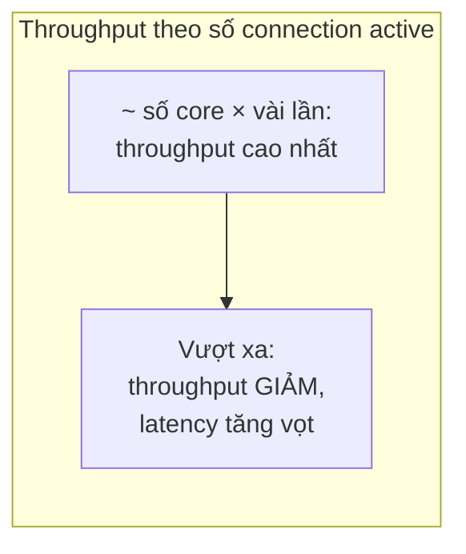
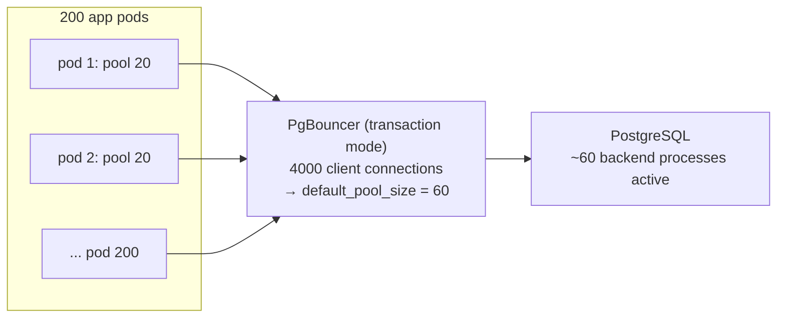
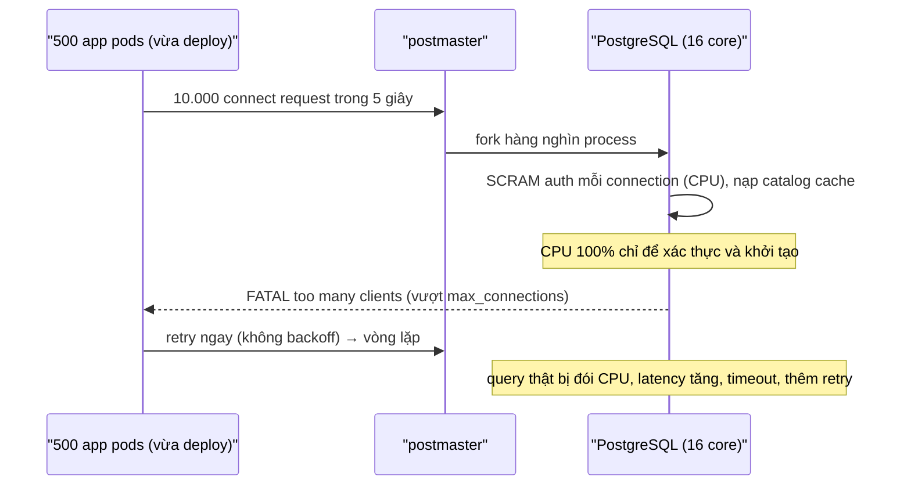

# PART 37 — CONNECTION MANAGEMENT

> **Trước:** [36 — Scaling](36-scaling.md) · **Tiếp:** [38 — Consistency](38-consistency.md)

---

## Mục lục

1. [Simple mental model](#1-simple-mental-model)
2. [Kiến trúc connection của PostgreSQL (nhắc lại)](#2-kiến-trúc-connection)
3. [max_connections và chi phí mỗi connection](#3-max_connections-và-chi-phí-mỗi-connection)
4. [Tại sao nhiều connection active làm chậm hệ thống](#4-tại-sao-nhiều-connection-active-làm-chậm-hệ-thống)
5. [Concept: Connection Pool](#5-concept-connection-pool)
6. [PgBouncer và ba chế độ pooling](#6-pgbouncer-và-ba-chế-độ-pooling)
7. [Pool sizing](#7-pool-sizing)
8. [Connection storm](#8-connection-storm)
9. [Timeouts và phát hiện connection chết](#9-timeouts)
10. [WHAT HAPPENS IF...](#10-what-happens-if)
11. [PRODUCTION BEHAVIOR](#11-production-behavior)
12. [COMMON MISUNDERSTANDINGS](#12-common-misunderstandings)
- [Concept card — khung 13 điểm](#concept-card--)
13. [INTERVIEW QUESTIONS](#13-interview-questions)
14. [KEY TAKEAWAYS](#14-key-takeaways)

---

## 1. Simple mental model

Một ngân hàng có **20 quầy giao dịch** (CPU core). Nếu cho **1000 khách** vào cùng lúc đứng chen trước 20 quầy, nhân viên liên tục bị ngắt quãng, khách chen lấn — **mọi người đều chậm hơn**. Tốt hơn: một **hàng chờ có tổ chức** (pool) ở cửa, mỗi lúc chỉ ~40 khách được vào khu quầy. Tổng thời gian phục vụ **giảm**, dù có khách phải chờ ở cửa.

---

## 2. Kiến trúc connection

Mỗi connection = **một backend process** ([Chương 04 §3](04-postgresql-architecture.md#3-concept-process-per-connection-architecture)): fork từ postmaster, xác thực, nạp catalog cache, chiếm một slot PGPROC trong shared memory. Process sống cho tới khi client đóng connection.

---

## 3. max_connections và chi phí mỗi connection

### 3.1 max_connections

- Mặc định **100**; đổi cần **restart** (quyết định kích thước PGPROC array, lock table, các cấu trúc shared memory).
- `superuser_reserved_connections` (3) dành cho superuser; `reserved_connections` (PG 16) dành cho role có `pg_use_reserved_connections` (vd role giám sát/quản trị) → vẫn vào được khi đầy để xử lý sự cố.
- Vượt → `FATAL: sorry, too many clients already` (hoặc `remaining connection slots are reserved...`).

### 3.2 Chi phí

| Chi phí | Chi tiết |
|---|---|
| **Thiết lập** | fork + TLS handshake + xác thực (SCRAM-SHA-256 có chủ đích tốn CPU) + nạp catalog → vài ms tới hàng chục ms |
| **Memory mỗi process** | Vài MB cơ bản + catalog/relcache/plan cache (tăng theo số object đã chạm — nhiều partition/table → hàng chục MB) + work_mem khi query chạy |
| **Page table** | Không có huge pages + shared_buffers lớn → mỗi process có page table riêng cho vùng shared memory đã chạm |
| **Shared memory** | Slot PGPROC, lock table capacity tỉ lệ max_connections |
| **Snapshot** | `GetSnapshotData` duyệt ProcArray — chi phí tỉ lệ số backend (PG 14 cải thiện đáng kể) |

**Connection idle vẫn tốn**: memory, slot, và nếu `idle in transaction` thì giữ snapshot/lock ([Chương 11](11-mvcc.md), [13](13-locking.md)).

---

## 4. Tại sao nhiều connection active làm chậm hệ thống

Với **N core**, tối đa N backend thực sự chạy CPU cùng lúc. Nhiều backend active hơn:
- **Context switching** và **CPU cache thrashing**.
- **Contention** trên LWLock (buffer mapping, WAL insert, lock manager, ProcArray) tăng phi tuyến.
- **I/O queue** dài hơn → mỗi I/O chậm hơn.
- **Memory**: nhiều query đồng thời × work_mem × số node → nguy cơ OOM.



**Cách đọc diagram:** Đường throughput tăng khi số connection active tăng tới khoảng vài lần số core (đủ để che thời gian chờ I/O), rồi **đi xuống** — thêm connection làm hệ thống chậm hơn. Đây là lý do "tăng max_connections" thường làm sự cố tệ hơn.

---

## 5. Concept: Connection Pool

### 5.1 WHAT

**Connection pool** giữ một tập connection **mở sẵn, dùng lại** và cho các request **mượn/trả**. Hai tầng:

| Tầng | Ví dụ | Phạm vi |
|---|---|---|
| **Application-side pool** | HikariCP (Java), pgxpool (Go), SQLAlchemy pool, node-postgres Pool | Trong một process application |
| **External pooler / proxy** | **PgBouncer**, Pgpool-II, Odyssey, PgCat, Supavisor, RDS Proxy | Giữa mọi application instance và PostgreSQL |

### 5.2 WHY cần cả hai

- App pool loại bỏ chi phí mở connection mỗi request.
- Nhưng: 200 pod × pool 20 = **4000 connection** tới PostgreSQL — vượt xa mức hiệu quả. **External pooler** gom 4000 client connection thành ~50–100 server connection (**multiplexing**).



**Cách đọc diagram:** Client connection tới PgBouncer rất rẻ (PgBouncer là process event-driven, mỗi client vài KB). PgBouncer chỉ gán một **server connection** cho client **khi client đang trong transaction** (transaction mode); khi transaction kết thúc, server connection được trả về cho client khác. Kết quả: PostgreSQL chỉ thấy ~60 backend.

---

## 6. PgBouncer và ba chế độ pooling

| Mode | Server connection được gán cho client | Multiplexing | Hỗ trợ tính năng session |
|---|---|---|---|
| **Session** | Suốt thời gian client kết nối | Thấp (chỉ tiết kiệm chi phí mở connection) | **Đầy đủ** |
| **Transaction** | Trong **một transaction** | **Cao** | **Mất state session** |
| **Statement** | Trong **một câu lệnh** | Cao nhất | Không cho phép transaction nhiều câu |

### 6.1 Transaction mode phá vỡ những gì?

Vì transaction tiếp theo của cùng client có thể chạy trên **backend khác**, mọi **state gắn với session** không đáng tin:

| Tính năng | Vấn đề | Giải pháp |
|---|---|---|
| `SET` (session) — vd `SET search_path`, `SET timezone` | Rò rỉ sang client khác / mất | `SET LOCAL` trong transaction; đặt ở role/database level (`ALTER ROLE ... SET`) |
| **Prepared statements** (protocol-level) | "prepared statement does not exist" | PgBouncer **1.21+** hỗ trợ theo dõi prepared statement (`max_prepared_statements`); hoặc tắt server-side prepare ở driver |
| **Advisory lock session-level** | Lock rò rỉ sang backend khác | Dùng `pg_advisory_xact_lock` |
| `LISTEN/NOTIFY` | LISTEN gắn session | Connection riêng (session mode) cho listener |
| **Temp table** | Gắn session | `ON COMMIT DROP` trong transaction, hoặc session mode |
| `WITH HOLD` cursor | Sống ngoài transaction | Tránh |
| Session-level `statement_timeout` qua SET | | Đặt ở role level |

### 6.2 Các đặc điểm khác của PgBouncer

- Single-threaded (một process xử lý mọi connection bằng event loop) → một instance có giới hạn CPU; scale bằng nhiều instance (`so_reuseport`) hoặc pooler multi-threaded (PgCat, Odyssey).
- Pool theo cặp **(database, user)**: nhiều user/database → nhiều pool nhỏ.
- **Hàng đợi client**: khi pool hết, client **chờ** trong PgBouncer (`cl_waiting`) — bảo vệ PostgreSQL khỏi quá tải; cần timeout (`query_wait_timeout`).
- Không routing đọc/ghi, không hiểu SQL.

---

## 7. Pool sizing

### 7.1 Công thức kinh nghiệm

Công thức phổ biến (PostgreSQL wiki, được HikariCP trích dẫn):

```
connections ≈ (số core × 2) + số spindle hiệu dụng
```

Với SSD/NVMe "spindle" không còn ý nghĩa chính xác — tinh thần là: **số connection active tối ưu nhỏ, cỡ vài lần số core**. Máy 16 core → khởi điểm ~30–50 connection active tới PostgreSQL, rồi đo và điều chỉnh.

### 7.2 Little's Law cho pool

`pool_size_cần ≈ throughput (req/s) × thời gian giữ connection mỗi request (s)`

Ví dụ: 2000 req/s, mỗi request giữ connection 10ms → cần ~20 connection. Nếu query chậm lên 100ms → cần 200 → pool cạn → request chờ. **Giữ connection ngắn** (không làm việc khác trong lúc giữ connection/transaction) quan trọng hơn pool lớn.

### 7.3 App pool

Tổng `số instance × max pool size` không nên vượt khả năng của pooler/DB. Đặt **min idle nhỏ**, **max lifetime** (để connection được làm mới, cân bằng sau failover), **connection timeout** (chờ pool) ngắn để fail fast.

---

## 8. Connection storm

### 8.1 WHAT

Rất nhiều client **cùng lúc** mở connection mới tới database.

### 8.2 Nguyên nhân

- **Deploy/restart** hàng trăm pod đồng thời, mỗi pod mở đủ `min idle` connection ngay khi khởi động.
- **Failover/restart database** → mọi client reconnect cùng lúc.
- **Retry storm**: request timeout → retry ngay không backoff → nhân đôi tải.
- **Autoscaling** thêm hàng loạt instance khi tải tăng (đúng lúc DB đang chật vật).
- Pool bị reset do lỗi mạng tạm thời.

### 8.3 Cơ chế gây hại



**Cách đọc diagram:** Chi phí thiết lập connection (fork, xác thực, catalog) dồn vào vài giây → CPU bão hòa → query thật chậm → timeout → retry → thêm connection → vòng xoáy. Database có thể "sập" dù tải nghiệp vụ không đổi.

### 8.4 Giảm thiểu

| Biện pháp | Tác dụng |
|---|---|
| **External pooler** | PostgreSQL không thấy storm (PgBouncer hấp thụ, connection tới PgBouncer rẻ) |
| **Backoff + jitter** khi retry/reconnect | Rải đều thời điểm |
| **Min idle nhỏ**, mở connection dần | Không mở ồ ạt lúc khởi động |
| **Rolling deploy** có giới hạn tốc độ | |
| **Giới hạn connection theo role/database** (`ALTER ROLE ... CONNECTION LIMIT`) | Một service không chiếm hết |
| **Reserved connections** | DBA vẫn vào được |
| **Circuit breaker** ở app | Ngừng đập vào DB khi nó đang lỗi |

---

## 9. Timeouts

| Tham số | Tác dụng |
|---|---|
| `connect_timeout` (client) | Không chờ mãi khi DB không phản hồi |
| `statement_timeout` (role/app) | Chặn query chạy quá lâu giữ connection |
| `idle_in_transaction_session_timeout` | Ngắt session mở transaction rồi bỏ đó |
| `idle_session_timeout` (PG 14) | Ngắt session idle quá lâu (cẩn thận với pool — pool có thể giữ connection đã bị ngắt) |
| `transaction_timeout` (PG 17) | Giới hạn tổng thời gian transaction |
| `tcp_keepalives_idle/interval/count` | Phát hiện peer chết (mạng) |
| `client_connection_check_interval` (PG 14) | Phát hiện client đã ngắt trong lúc query dài đang chạy → hủy sớm |
| PgBouncer `server_idle_timeout`, `query_wait_timeout`, `server_lifetime` | Quản lý connection phía pooler |

---

## 10. WHAT HAPPENS IF...

| Tình huống | Hệ quả |
|---|---|
| **Đạt max_connections** | Connection mới bị từ chối; app lỗi; DBA không vào được nếu không có reserved |
| **Tăng max_connections lên 5000** | Memory, contention, snapshot cost; dưới tải throughput giảm |
| **Pool app quá lớn × nhiều pod** | Tổng connection vượt DB; hoặc DB chịu nhưng chậm |
| **Transaction mode + session SET** | Setting rò rỉ sang request khác (bug khó tìm: timezone, search_path sai) |
| **Nhiều connection `idle in transaction`** | Lock + horizon bị giữ; pool cạn |
| **Failover, pool giữ connection chết** | Lỗi hàng loạt tới khi pool phát hiện (validation/keepalive) |
| **PgBouncer single-threaded bão hòa CPU** | Latency tăng ở pooler dù DB rảnh |

---

## 11. PRODUCTION BEHAVIOR

```sql
SELECT usename, application_name, state, count(*)
FROM pg_stat_activity GROUP BY 1, 2, 3 ORDER BY 4 DESC;

SELECT count(*) FILTER (WHERE state = 'active') AS active,
       count(*) FILTER (WHERE state = 'idle') AS idle,
       count(*) FILTER (WHERE state LIKE 'idle in transaction%') AS idle_in_tx,
       current_setting('max_connections') AS max
FROM pg_stat_activity WHERE backend_type = 'client backend';
```

PgBouncer: `SHOW POOLS;` (`cl_active`, `cl_waiting`, `sv_active`, `sv_idle`, `maxwait`), `SHOW STATS;`. `cl_waiting` > 0 kéo dài và `maxwait` tăng → pool nhỏ so với nhu cầu **hoặc** query chậm giữ connection lâu.

---

## 12. COMMON MISUNDERSTANDINGS

1. **"Nhiều connection = nhiều throughput."** — Vượt vài lần số core thì ngược lại.
2. **"Idle connection miễn phí."** — Tốn memory/slot; idle in transaction nguy hiểm.
3. **"App pool là đủ."** — Nhiều instance × pool → cần external pooler.
4. **"Transaction pooling trong suốt với app."** — Phá session state.
5. **"PgBouncer tách đọc/ghi."** — Không.

---

## Concept card — Connection Management theo khung 13 điểm

| # | Khía cạnh | Tóm tắt |
|---|---|---|
| 1 | **WHAT** | Quản lý số lượng và vòng đời connection tới PostgreSQL, thường qua app pool + external pooler. |
| 2 | **WHY** | Mỗi connection là một process đắt; quá nhiều connection active làm throughput giảm — §3, §4. |
| 3 | **HOW** | Pool giữ connection mở sẵn; PgBouncer multiplex client vào ít server connection — §5, §6. |
| 4 | **INTERNALS** | PGPROC slot, snapshot cost theo số backend, catalog cache per backend, transaction status indicator trong ReadyForQuery (PgBouncer dựa vào) — §2–§4. |
| 5 | **EXAMPLE** | 200 pod × pool 20 = 4000 client → PgBouncer pool 60 — §5.2. |
| 6 | **WHAT HAPPENS IF** | Chạm max_connections, SET rò rỉ ở transaction mode, pool giữ connection chết sau failover — §10. |
| 7 | **PERFORMANCE IMPACT** | Throughput đạt đỉnh ở vài lần số core; connection storm làm CPU bão hòa vì fork/auth — §4, §8. |
| 8 | **PRODUCTION BEHAVIOR** | `pg_stat_activity` theo state; PgBouncer `SHOW POOLS` (cl_waiting, maxwait) — §11. |
| 9 | **TRADE-OFF** | Transaction pooling multiplex tốt ↔ mất session state; pool nhỏ ↔ chờ ở pool. |
| 10 | **WHEN TO USE / NOT** | Luôn dùng app pool; thêm PgBouncer khi nhiều instance/serverless; session mode khi cần LISTEN/temp table. |
| 11 | **MISUNDERSTANDINGS** | "Nhiều connection = nhiều throughput", "idle connection miễn phí" — §12. |
| 12 | **INTERVIEW** | Vì sao cần pooler, pool modes, pool sizing, connection storm — §13. |
| 13 | **KEY TAKEAWAYS** | Pool nhỏ, connection giữ ngắn, timeouts ở mọi tầng — §14. |

---

## 13. INTERVIEW QUESTIONS

**Q1. Tại sao PostgreSQL cần connection pooler?**
- *Short:* Process-per-connection: mỗi connection đắt (fork, auth, memory, snapshot cost); nhiều connection active gây contention; pooler multiplex nhiều client vào ít backend.

**Q2. Session vs transaction vs statement pooling?**
- *Short:* Gán server connection theo session/transaction/câu lệnh; transaction mode multiplex tốt nhất nhưng mất session state (SET, prepared stmt (trước 1.21), advisory session lock, LISTEN, temp table).

**Q3. Pool size nên bao nhiêu?**
- *Short:* Nhỏ — vài lần số core; tính bằng Little's Law; ưu tiên giảm thời gian giữ connection.

**Q4. Connection storm là gì, phòng thế nào?**
- *Short:* Mở connection ồ ạt (deploy, failover, retry) → CPU bão hòa vì fork/auth; pooler, backoff+jitter, min idle nhỏ, rolling deploy, connection limit.

**Q5. (Senior) Sau khi chuyển sang PgBouncer transaction mode, một số user thấy dữ liệu múi giờ sai. Vì sao?**
- *Short:* App dùng `SET timezone` ở session; server connection bị chia sẻ → setting rò rỉ. Dùng SET LOCAL hoặc cấu hình ở role/client.

---

## 14. KEY TAKEAWAYS

1. 1 connection = 1 process: thiết lập đắt, idle vẫn tốn, active quá nhiều thì chậm.
2. `max_connections` nhỏ (vài trăm), dùng **reserved_connections** cho vận hành.
3. **App pool + external pooler (PgBouncer)**; transaction mode cho multiplexing, cẩn thận session state.
4. Pool size ≈ vài lần số core; Little's Law; giữ connection ngắn.
5. **Connection storm**: pooler, backoff+jitter, min idle nhỏ, rolling deploy.
6. Timeouts ở mọi tầng: statement, idle in transaction, transaction, keepalive.

---

## Nguồn tham khảo

- PostgreSQL Docs — *Connections and Authentication*: https://www.postgresql.org/docs/current/runtime-config-connection.html
- PostgreSQL Wiki — *Number Of Database Connections*: https://wiki.postgresql.org/wiki/Number_Of_Database_Connections
- PgBouncer Documentation (pool modes, features): https://www.pgbouncer.org/features.html
- HikariCP — *About Pool Sizing*: https://github.com/brettwooldridge/HikariCP/wiki/About-Pool-Sizing
- Andres Freund, *Improving Postgres Connection Scalability: Snapshots* (2020).
