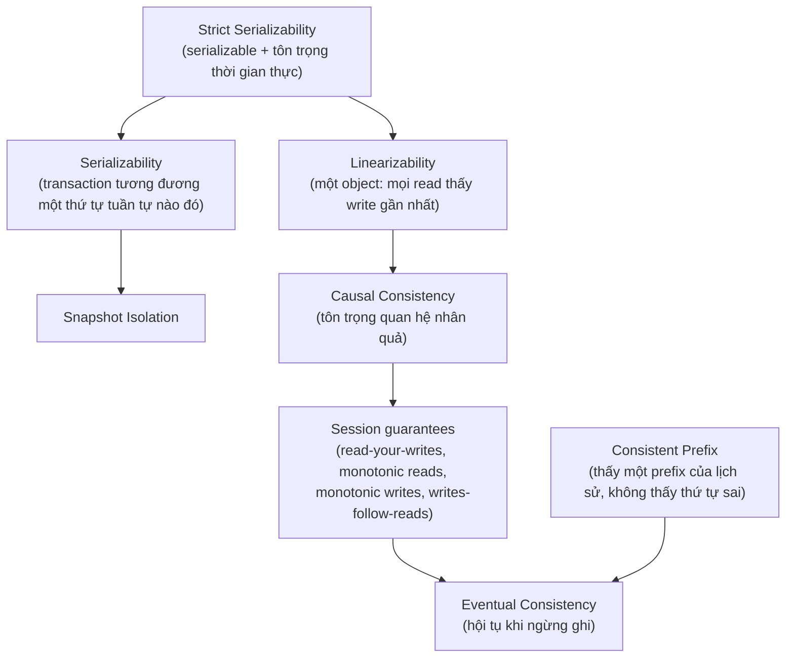
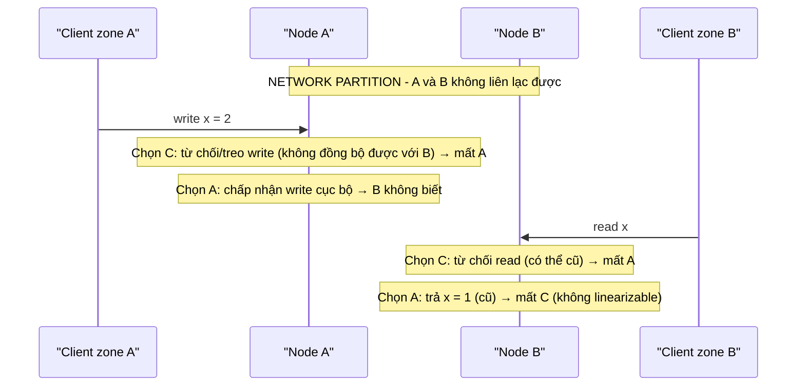

# PART 38 — CONSISTENCY

> **Trước:** [37 — Connection Management](37-connection-management.md) · **Tiếp:** [39 — Distributed Database Fundamentals](39-distributed-database.md)

---

## Mục lục

1. [Hai nghĩa của "consistency"](#1-hai-nghĩa-của-consistency)
2. [Simple mental model](#2-simple-mental-model)
3. [Phổ các consistency model](#3-phổ-các-consistency-model)
4. [Strong consistency: Linearizability](#4-strong-consistency-linearizability)
5. [Serializability vs Linearizability](#5-serializability-vs-linearizability)
6. [Eventual consistency và các session guarantee](#6-eventual-consistency-và-session-guarantees)
7. [Replication consistency trong PostgreSQL](#7-replication-consistency-trong-postgresql)
8. [CAP — phát biểu chính xác](#8-cap--phát-biểu-chính-xác)
9. [PACELC](#9-pacelc)
10. [WHAT HAPPENS IF (các kịch bản partition với PostgreSQL)](#10-what-happens-if)
11. [COMMON MISUNDERSTANDINGS](#11-common-misunderstandings)
- [Concept card — khung 13 điểm](#concept-card--)
12. [INTERVIEW QUESTIONS](#12-interview-questions)
13. [KEY TAKEAWAYS](#13-key-takeaways)

---

## 1. Hai nghĩa của "consistency"

| | Nghĩa | Chương |
|---|---|---|
| **C trong ACID** | Transaction giữ **bất biến dữ liệu** (constraint, quy tắc nghiệp vụ) | [10](10-acid.md#3-consistency) |
| **Consistency trong hệ phân tán / replication** | Các **bản sao** và các **lần đọc** nhìn thấy dữ liệu theo **quy tắc thứ tự/độ mới** nào | Chương này |

Nhầm hai nghĩa này là lỗi phổ biến nhất khi thảo luận CAP.

---

## 2. Simple mental model

Một bảng thông báo có nhiều **bản sao** ở các tầng của tòa nhà:
- **Strong (linearizable):** mọi người, ở mọi tầng, ngay khi một thông báo được dán xong, đều thấy nó — như thể chỉ có **một** bảng.
- **Eventual:** thông báo được chép sang các tầng khác **dần dần**; nếu ngừng dán thông báo mới, sớm muộn mọi bảng giống nhau. Trong lúc đó, người ở tầng 5 có thể thấy thông báo cũ.
- **Read-your-writes:** ít nhất **người dán** luôn thấy thông báo mình vừa dán, dù đi tầng nào.
- **Monotonic reads:** một người không bao giờ thấy bảng "quay ngược thời gian" (thấy thông báo mới rồi lát sau lại thấy bản cũ hơn).

---

## 3. Phổ các consistency model

**Cách đọc diagram (trên xuống = mạnh → yếu):** Hai nhánh trên đỉnh: **linearizability** (về *độ mới* trên từng object, mô hình "một bản duy nhất") và **serializability** (về *transaction* nhiều object, không nói gì về thời gian thực). **Strict serializability** = cả hai. Đi xuống là các mô hình yếu hơn, rẻ hơn, sẵn sàng hơn dưới partition. (Sơ đồ đơn giản hóa — thực tế các mô hình là một lattice phức tạp hơn.)

---

## 4. Strong consistency: Linearizability

### 4.1 WHAT

Hệ thống hoạt động **như thể chỉ có một bản dữ liệu**, và mỗi thao tác có hiệu lực **nguyên tử tại một thời điểm** giữa lúc gửi và lúc nhận phản hồi. Hệ quả: **sau khi một write hoàn tất, mọi read bắt đầu sau đó (theo thời gian thực) phải thấy write đó hoặc mới hơn.**

### 4.2 Chi phí

Mọi read/write phải phối hợp với một nguồn sự thật duy nhất hoặc một quorum → latency (round-trip, đồng thuận), và **không thể duy trì khi mạng bị chia cắt** mà vẫn phục vụ mọi phía (CAP).

### 4.3 PostgreSQL

Đọc/ghi **cùng một primary**: một read bắt đầu sau khi một commit đã báo thành công sẽ thấy commit đó (snapshot chụp sau khi transaction đã gỡ khỏi ProcArray). Với primary đơn, hành vi này tương đương linearizable cho dữ liệu đã commit. **Đọc từ replica async phá vỡ điều đó.**

---

## 5. Serializability vs Linearizability

| | Serializability | Linearizability |
|---|---|---|
| Nói về | **Transaction** (nhiều object) | **Thao tác đơn** trên một object |
| Đảm bảo | Kết quả = một thứ tự tuần tự **nào đó** | Thứ tự **tôn trọng thời gian thực**; read thấy write gần nhất |
| Có thể "thấy dữ liệu cũ"? | **Có** (thứ tự tuần tự có thể đặt transaction đọc "trước" write dù về thời gian nó chạy sau) | Không |
| Thuộc | Isolation (ACID "I") | Consistency của hệ phân tán ("C" của CAP) |

**Strict serializability** = serializability + thứ tự tôn trọng thời gian thực. Spanner cung cấp (external consistency). Một PostgreSQL node dùng SERIALIZABLE và mọi đọc/ghi qua primary cho hành vi rất gần strict serializable; khi thêm replica async, đọc từ replica chỉ còn **snapshot cũ nhất quán**.

---

## 6. Eventual consistency và session guarantees

### 6.1 Eventual consistency

"Nếu không có write mới, **sau một khoảng thời gian không xác định**, mọi bản sao sẽ hội tụ." Đảm bảo rất yếu: không nói bao lâu, không nói trong lúc chờ đọc thấy gì.

### 6.2 Session guarantees (Terry et al., 1994) — những gì ứng dụng thực sự cần

| Guarantee | Ý nghĩa | Vi phạm điển hình với PostgreSQL replica |
|---|---|---|
| **Read-your-writes** | Một client luôn thấy write của chính mình | Ghi vào primary, đọc từ replica lag ([Chương 26 §7](26-primary-replica.md#7-read-after-write-problem)) |
| **Monotonic reads** | Một client không thấy dữ liệu "lùi" | Hai request tới hai replica lag khác nhau |
| **Monotonic writes** | Write của một client được áp theo thứ tự client gửi | Hiếm với single primary (luôn đúng) |
| **Writes-follow-reads** | Write dựa trên dữ liệu đã đọc được áp **sau** dữ liệu đó ở mọi nơi | Đọc từ replica cũ rồi ghi dựa trên đó (check-then-act sai) |

### 6.3 Consistent prefix

Người đọc thấy **một prefix** của lịch sử write (không thấy B mà thiếu A nếu A xảy ra trước B). Physical replication của PostgreSQL **đảm bảo consistent prefix** trên mỗi replica (replay theo thứ tự WAL). Hệ thống sharded/multi-leader thường **không** đảm bảo điều này giữa các shard.

---

## 7. Replication consistency trong PostgreSQL

| Cấu hình | Đọc từ primary | Đọc từ replica |
|---|---|---|
| Async (mặc định) | Mới nhất | **Eventual + consistent prefix**; stale theo lag |
| Sync `on` / `remote_write` | Mới nhất | Vẫn có thể stale (standby đã flush nhưng chưa replay) |
| Sync `remote_apply` | Mới nhất | Replica sync **đã replay** trước khi commit trả về → **read-your-writes** trên replica đó (với client đọc sau khi nhận commit) |
| LSN token (app chờ replay ≥ LSN) | — | Read-your-writes / monotonic reads theo session |
| Logical replication | Mới nhất | Eventual; mỗi subscription có thể có thứ tự apply riêng |

---

## 8. CAP — phát biểu chính xác

### 8.1 Phát biểu

Theo chứng minh của **Gilbert & Lynch (2002)** cho phỏng đoán của **Brewer (2000)**:

> Trong một hệ thống dữ liệu phân tán, **khi xảy ra network partition** (mạng giữa các node bị chia cắt, message bị mất), hệ thống **không thể đồng thời** đảm bảo:
> - **C — Consistency** theo nghĩa **linearizability** (mọi read thấy write gần nhất), và
> - **A — Availability** theo nghĩa **mọi request tới một node không bị lỗi đều nhận được phản hồi không phải lỗi** (không giới hạn thời gian cụ thể, nhưng phải phản hồi).

### 8.2 Tại sao "chọn 2 trong 3" là cách nói sai

1. **P không phải lựa chọn.** Trong hệ phân tán thật, partition **sẽ** xảy ra (switch hỏng, cấu hình firewall, GC pause dài khiến node bị coi là mất liên lạc). Hệ thống không thể "chọn không có P". Câu hỏi thực sự: **khi P xảy ra, hy sinh C hay A?**
2. **"CA system"** chỉ có nghĩa với hệ **không phân tán** (một node) — không có partition giữa các node vì chỉ có một node. Một PostgreSQL đơn lẻ không phải "CA distributed system"; nó đơn giản không phân tán.
3. **Định nghĩa C và A trong CAP rất hẹp**: C = linearizability (không phải ACID consistency, không phải serializability); A = **mọi** node không lỗi phải trả lời (không phải "uptime 99.99%"). Nhiều hệ thực tế **không** thỏa C lẫn A theo nghĩa chặt chẽ này — chúng nằm ở giữa (ví dụ đọc từ replica stale nhưng ghi bị chặn ở phía thiểu số).
4. **Khi không có partition**, CAP không nói gì — hệ thống vẫn có thể vừa consistent vừa available. Trade-off lúc bình thường là **latency vs consistency** (PACELC).

### 8.3 Minh họa

**Cách đọc diagram:** Trong partition, mỗi node chỉ có hai lựa chọn khi nhận request mà không thể liên lạc phía bên kia: **từ chối/chờ** (giữ C, mất A) hoặc **trả lời bằng dữ liệu cục bộ** (giữ A, mất C). Không có lựa chọn thứ ba.

---

## 9. PACELC

**PACELC** (Daniel Abadi, 2010/2012): **if Partition → trade Availability vs Consistency; Else → trade Latency vs Consistency.**

Phần "Else" quan trọng hơn trong đời thường vì partition hiếm:

| Hệ thống | P → | E → |
|---|---|---|
| PostgreSQL primary + **async** replica, đọc từ replica | A (replica phục vụ stale) | **L** (commit nhanh, replica stale) |
| PostgreSQL + **sync** replication (`on`/`remote_apply`) | C (primary treo commit khi mất standby sync) | **C** (commit chờ standby → latency) |
| Distributed SQL (Spanner, CockroachDB) | C (range mất quorum không phục vụ) | C (mỗi ghi qua consensus) |
| Cassandra/Dynamo-style (tunable) | A (mặc định) | L |

---

## 10. WHAT HAPPENS IF

| Kịch bản partition | Hành vi PostgreSQL (với Patroni) | Theo CAP |
|---|---|---|
| Primary bị cô lập khỏi DCS và replica, app zone A vẫn tới được primary | Primary mất leader lease → **tự demote** → từ chối ghi; phía đa số promote replica | Ghi: chọn **C** (phía thiểu số không available) |
| Primary bị cô lập khỏi sync standby duy nhất | Commit **treo** | **C** (không available cho ghi) |
| Replica async bị cô lập khỏi primary, vẫn phục vụ đọc | Trả dữ liệu ngày càng cũ | **A** cho đọc (không linearizable) |
| Primary + async replica, promote replica khi partition (không fencing) | Split brain — hai phía nhận ghi | **A** cho ghi, mất C (và mất dữ liệu khi hợp nhất) |

---

## 11. COMMON MISUNDERSTANDINGS

1. **"CAP: chọn 2 trong 3."** — P không phải lựa chọn; CAP chỉ nói về lúc có partition: C hoặc A.
2. **"PostgreSQL là hệ CA."** — PostgreSQL đơn node không phải hệ phân tán; PostgreSQL có replica thì hành vi phụ thuộc cấu hình (sync/async, đọc ở đâu, HA).
3. **"Consistency trong CAP = C trong ACID."** — CAP C = linearizability.
4. **"Serializable = linearizable."** — Khác nhau (transaction vs recency).
5. **"Eventual consistency nghĩa là 'hơi trễ một chút'."** — Không có giới hạn thời gian; trong sự cố có thể rất lâu.
6. **"Sync replication cho read-your-writes trên replica."** — Chỉ `remote_apply`.

---

## Concept card — Consistency theo khung 13 điểm

| # | Khía cạnh | Tóm tắt |
|---|---|---|
| 1 | **WHAT** | Quy tắc về độ mới và thứ tự mà các lần đọc/bản sao nhìn thấy (khác C của ACID) — §1. |
| 2 | **WHY** | Replica, cache, hệ phân tán khiến "đọc thấy gì" không còn hiển nhiên; ứng dụng cần đảm bảo tối thiểu (read-your-writes...) — §6. |
| 3 | **HOW** | Phổ mô hình từ linearizable/strict serializable tới eventual; session guarantees — §3–§6. |
| 4 | **INTERNALS** | PostgreSQL: primary đơn cho hành vi gần linearizable; replica = consistent prefix; remote_apply/LSN token cho read-your-writes — §4.3, §7. |
| 5 | **EXAMPLE** | Kịch bản partition giữa hai node (§8.3); PostgreSQL + Patroni dưới partition (§10). |
| 6 | **WHAT HAPPENS IF** | Primary cô lập tự demote, sync standby mất → commit treo, replica cô lập trả dữ liệu cũ — §10. |
| 7 | **PERFORMANCE IMPACT** | Consistency mạnh hơn → latency cao hơn (PACELC) — §9. |
| 8 | **PRODUCTION BEHAVIOR** | Stale read, monotonic read violation, split brain khi chọn A cho ghi. |
| 9 | **TRADE-OFF** | Khi partition: C hoặc A; khi bình thường: latency hoặc consistency — §8, §9. |
| 10 | **WHEN TO USE / NOT** | Strong cho tiền/tồn kho/quyền; eventual + session guarantees cho feed, catalog, analytics. |
| 11 | **MISUNDERSTANDINGS** | "Chọn 2 trong 3", "PostgreSQL là CA", "serializable = linearizable" — §11. |
| 12 | **INTERVIEW** | CAP chính xác, session guarantees — §12. |
| 13 | **KEY TAKEAWAYS** | CAP chỉ nói về lúc partition; PACELC cho lúc bình thường — §13. |

---

## 12. INTERVIEW QUESTIONS

**Q1. Giải thích CAP chính xác.**
- *Short:* Khi có network partition, hệ phân tán không thể vừa linearizable vừa đảm bảo mọi node không lỗi đều phản hồi; phải chọn từ chối (C) hoặc trả dữ liệu có thể cũ/ghi phân kỳ (A). Không phải "chọn 2 trong 3".
- *Follow-up:* Khi không có partition, trade-off là gì? (PACELC: latency vs consistency.)

**Q2. Strong vs eventual consistency?**
- *Short:* Strong (linearizable): như một bản duy nhất, read thấy write gần nhất. Eventual: hội tụ khi ngừng ghi, không đảm bảo trong lúc chờ.

**Q3. Read-your-writes và monotonic reads là gì? Làm sao đạt được với PostgreSQL replica?**
- *Short:* Thấy write của mình; không thấy dữ liệu lùi. Sticky routing, LSN token, remote_apply.

**Q4. Serializability khác linearizability thế nào?**
- *Short:* Serializability về transaction đa object (một thứ tự tuần tự nào đó); linearizability về độ mới một object theo thời gian thực.

**Q5. (Senior) Hệ PostgreSQL với Patroni là CP hay AP?**
- *Short:* Với ghi: gần CP (phía thiểu số demote, sync rep treo commit). Với đọc từ replica: AP (stale). Nhãn CP/AP đơn giản hóa quá mức; nên mô tả hành vi từng thao tác dưới partition.

---

## 13. KEY TAKEAWAYS

1. "Consistency" có hai nghĩa: ACID (bất biến) và phân tán (độ mới/thứ tự).
2. Linearizability = như một bản duy nhất; serializability = transaction tương đương thứ tự tuần tự; strict serializability = cả hai.
3. Eventual consistency rất yếu; ứng dụng cần **session guarantees** (read-your-writes, monotonic reads...).
4. PostgreSQL replica async = eventual + **consistent prefix**; `remote_apply`/LSN token cho read-your-writes.
5. **CAP**: chỉ nói về lúc partition: C (linearizable) hoặc A (mọi node phản hồi). "Chọn 2 trong 3" là sai.
6. **PACELC**: lúc bình thường, trade-off là latency vs consistency (sync vs async replication).

---

## Nguồn tham khảo

- Seth Gilbert & Nancy Lynch, *Brewer's Conjecture and the Feasibility of Consistent, Available, Partition-Tolerant Web Services*, SIGACT News 2002.
- Eric Brewer, *CAP Twelve Years Later: How the "Rules" Have Changed*, IEEE Computer 2012.
- Daniel Abadi, *Consistency Tradeoffs in Modern Distributed Database System Design (PACELC)*, IEEE Computer 2012.
- Herlihy & Wing, *Linearizability: A Correctness Condition for Concurrent Objects*, ACM TOPLAS 1990.
- Terry et al., *Session Guarantees for Weakly Consistent Replicated Data*, 1994.
- Martin Kleppmann, *Designing Data-Intensive Applications*, chương 5 và 9; *A Critique of the CAP Theorem* (2015).
- Jepsen — consistency models: https://jepsen.io/consistency
