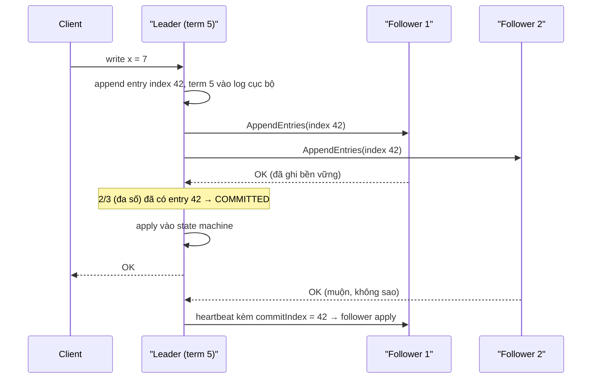
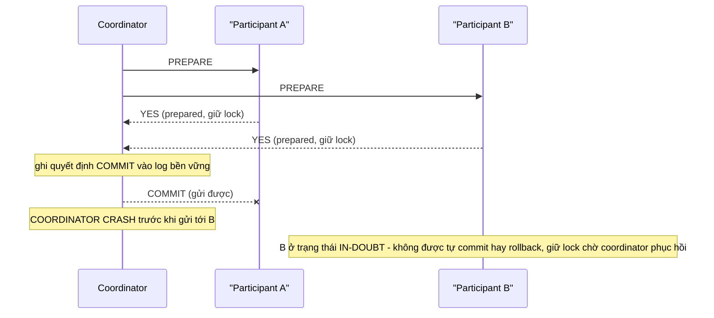
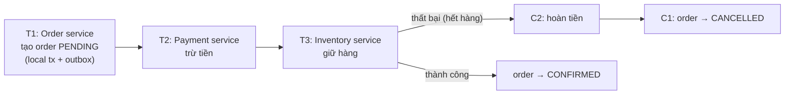

# PART 39 — DISTRIBUTED DATABASE FUNDAMENTALS

> **Trước:** [38 — Consistency](38-consistency.md) · **Tiếp:** [40 — Production Behavior](40-production-behavior.md)

Chương này là "ngữ pháp" của hệ phân tán, áp dụng cho PostgreSQL có replica/HA/sharding và cho distributed SQL. Mục tiêu: hiểu **tại sao** các bài toán ở chương 25–38 khó, và các hệ thống khác giải chúng thế nào.

---

## Mục lục

1. [Simple mental model: tại sao phân tán khó](#1-simple-mental-model)
2. [Partial failure và network partition](#2-partial-failure-và-network-partition)
3. [Replication models: single-leader, multi-leader, leaderless](#3-replication-models)
4. [Leader, Follower, Quorum](#4-leader-follower-quorum)
5. [Consensus (Raft ở mức khái niệm)](#5-consensus)
6. [Split brain (nhìn từ lý thuyết)](#6-split-brain)
7. [Partitioning / Sharding (nhắc lại)](#7-partitioning--sharding)
8. [Distributed Transaction và 2PC](#8-distributed-transaction-và-2pc)
9. [Saga và quan hệ với database](#9-saga)
10. [Clock problems](#10-clock-problems)
11. [Idempotency, retry, exactly-once](#11-idempotency-retry-exactly-once)
12. [Distributed SQL khác PostgreSQL truyền thống thế nào](#12-distributed-sql-khác-postgresql-truyền-thống-thế-nào)
13. [COMMON MISUNDERSTANDINGS](#13-common-misunderstandings)
14. [INTERVIEW QUESTIONS](#14-interview-questions)
15. [KEY TAKEAWAYS](#15-key-takeaways)

---

## 1. Simple mental model

Một nhóm người phải cùng giữ một cuốn sổ, nhưng mỗi người ở một thành phố, chỉ liên lạc qua **thư tay**: thư có thể đến muộn, đến sai thứ tự, hoặc mất; một người có thể ốm mà không báo; đồng hồ mỗi người chạy lệch nhau. Họ phải thống nhất "dòng nào là dòng tiếp theo trong sổ". Mọi khó khăn của database phân tán đến từ ba thứ: **mạng không tin cậy, node hỏng một phần, và không có đồng hồ chung.**

---

## 2. Partial failure và network partition

### 2.1 Partial failure

Trong một máy, lỗi thường là "tất cả hoặc không" (crash). Trong hệ phân tán, **một phần hỏng, phần khác vẫn chạy**, và thường **không thể biết chắc** phần nào hỏng:

Khi gửi request tới node B và không nhận được phản hồi, có thể:
1. Request mất trên đường đi;
2. B chết trước khi xử lý;
3. B đang xử lý chậm (GC pause, I/O stall, quá tải);
4. B đã xử lý xong nhưng **phản hồi** bị mất;
5. B xử lý xong và phản hồi đang trên đường tới (sẽ đến muộn).

Trường hợp 4 là nguồn gốc của **ambiguous commit** ([Chương 30 §6](30-failover.md#6-application-reconnect-và-ambiguous-commit)) và nhu cầu **idempotency**.

### 2.2 Network partition

Mạng bị chia thành các nhóm không liên lạc được với nhau (switch hỏng, firewall, cáp, cấu hình). Các node ở mỗi nhóm vẫn sống. Mỗi nhóm thấy nhóm kia "như đã chết". Đây là bối cảnh của CAP ([Chương 38 §8](38-consistency.md#8-cap--phát-biểu-chính-xác)).

### 2.3 Fallacies of distributed computing

Các giả định sai kinh điển (Deutsch/Gosling): mạng tin cậy; latency bằng 0; băng thông vô hạn; mạng an toàn; topology không đổi; có một quản trị viên; chi phí truyền bằng 0; mạng đồng nhất. Mỗi giả định sai dẫn tới một lớp bug.

---

## 3. Replication models

| Model | Ghi ở đâu | Ví dụ | Ưu | Nhược |
|---|---|---|---|---|
| **Single-leader** | Chỉ leader | PostgreSQL streaming, MySQL, MongoDB replica set | Đơn giản, thứ tự ghi rõ ràng, không xung đột | Leader là nút thắt ghi; failover |
| **Multi-leader** | Nhiều leader (vd mỗi datacenter một) | PostgreSQL BDR/pglogical bidirectional, MySQL group replication multi-primary | Ghi cục bộ ở mỗi vùng, chịu mất vùng | **Xung đột ghi** phải phân giải (last-write-wins, merge, CRDT) |
| **Leaderless** | Ghi tới nhiều node, đọc từ nhiều node (quorum) | Dynamo, Cassandra, Riak | Availability cao | Consistency yếu/tunable, read repair, anti-entropy |
| **Consensus-based (per-range)** | Leader của mỗi range, ghi được commit khi đa số đồng ý | CockroachDB, Spanner, YugabyteDB, TiKV, etcd | Strong consistency + tự failover | Latency ghi = round-trip tới đa số |

---

## 4. Leader, Follower, Quorum

- **Leader**: node duy nhất quyết định thứ tự ghi (cho toàn bộ dữ liệu hoặc một range).
- **Follower**: nhận và áp dụng log của leader.
- **Quorum**: tập con node đủ lớn để mọi hai quorum **giao nhau**. Với N bản sao, ghi cần W xác nhận, đọc hỏi R bản sao: nếu **W + R > N** thì mọi read quorum giao với mọi write quorum → đọc thấy ít nhất một bản có write mới nhất (với nhiều điều kiện phụ — không tự động thành linearizable).
- **Majority quorum** (⌊N/2⌋+1) cho bầu leader/commit: hai nhóm bị partition không thể cùng có đa số → không thể có hai leader cùng term.

---

## 5. Consensus

### 5.1 WHAT

**Consensus**: nhiều node **thống nhất một giá trị** (hoặc một chuỗi giá trị — một log) sao cho: mọi node không lỗi quyết định cùng giá trị (**agreement**), giá trị đó do ai đó đề xuất (**validity**), và cuối cùng quyết định được (**termination**) — chịu được thiểu số node lỗi.

Định lý **FLP** (1985): trong mô hình hoàn toàn bất đồng bộ, không thuật toán deterministic nào đảm bảo consensus nếu dù chỉ một node có thể crash. Thực tế vượt qua bằng timeout/giả định đồng bộ một phần — **safety** luôn đúng, **liveness** chỉ khi mạng "đủ ổn định".

### 5.2 Raft (mức khái niệm)

**Cách đọc diagram:** Leader chỉ báo thành công khi entry đã nằm trên **đa số** node. Nếu leader chết, một follower có log **đầy đủ nhất** (điều kiện bầu chọn trong Raft) sẽ thắng bầu cử ở **term mới** — và vì mọi entry đã commit nằm trên đa số, leader mới chắc chắn có nó. Leader cũ (nếu còn sống ở phía thiểu số) không thể commit gì (không có đa số) và sẽ lùi về follower khi thấy term lớn hơn.

**Các thành phần Raft:** leader election (timeout ngẫu nhiên, vote, term), log replication (AppendEntries, commitIndex), safety (chỉ node có log mới nhất được bầu), membership change, snapshot.

### 5.3 Liên hệ PostgreSQL

- PostgreSQL streaming replication **không phải consensus**: primary do bên ngoài chỉ định; commit không cần đa số (async) hoặc cần N standby theo cấu hình (sync) — nhưng không có cơ chế bầu leader hay term nội tại.
- Patroni dùng **etcd (Raft)** để đạt consensus về **ai là leader**; dữ liệu vẫn đi qua streaming replication. Sync quorum (`ANY k`) + Patroni cho hành vi gần với "commit trên đa số" nhưng vẫn không phải Raft (ví dụ: sự tinh tế ở [Chương 27 §5](27-sync-async-replication.md#5-internals--commit-chờ-ở-đâu)).

---

## 6. Split brain

Về lý thuyết, split brain xảy ra khi hệ thống cho phép **hai leader cùng tồn tại** trong cùng "nhiệm kỳ" — tức vi phạm tính duy nhất của leader. Consensus chống lại bằng **term/epoch** + **quorum**: leader chỉ hợp lệ khi được đa số bầu trong term đó; mọi thao tác mang term; node từ chối thao tác có term cũ (**fencing token**). Hệ thống không có quorum (2 node tự bầu) hoặc không fencing (leader cũ vẫn ghi vào storage/nhận client) sẽ bị split brain. Thực hành với PostgreSQL: [Chương 29 §7](29-high-availability.md#7-split-brain), [30 §9](30-failover.md#9-split-brain-trong-failover).

---

## 7. Partitioning / Sharding

Chia dữ liệu để scale ([Chương 32](32-partitioning.md), [33](33-sharding.md)). Trong hệ phân tán, mỗi partition/shard thường **được replicate** (leader + follower mỗi shard) → hai trục độc lập: **chia** (scale) và **nhân bản** (chịu lỗi).

---

## 8. Distributed Transaction và 2PC

### 8.1 Two-Phase Commit — các failure mode

**Cách đọc diagram:** Sau khi vote YES, participant **mất quyền tự quyết** — nó phải chờ coordinator. Coordinator crash sau khi có quyết định nhưng trước khi thông báo hết → participant **in-doubt**, giữ lock (và trong PostgreSQL: giữ xmin horizon → bloat, tiến tới wraparound). Đây là tính **blocking** của 2PC.

| Failure | Hệ quả |
|---|---|
| Participant lỗi trước khi vote | Coordinator rollback tất cả |
| Participant lỗi sau khi vote YES | Khi phục hồi, prepared transaction vẫn còn (bền vững) → chờ quyết định |
| Coordinator lỗi trước khi quyết định | Participant đã prepared phải chờ (hoặc timeout → hỏi coordinator phục hồi) |
| Coordinator lỗi sau khi quyết định | In-doubt tới khi coordinator phục hồi và gửi lại quyết định |

**3PC** thêm pha để giảm blocking nhưng không an toàn dưới network partition — ít dùng. Hệ distributed SQL hiện đại đặt **trạng thái transaction trong một bản ghi được replicate bằng consensus** (transaction record — CockroachDB; Percolator-style primary lock — TiDB) → không còn coordinator là điểm lỗi đơn.

### 8.2 PostgreSQL và 2PC

`PREPARE TRANSACTION` / `COMMIT PREPARED` biến PostgreSQL thành participant; cần transaction manager bên ngoài (XA trong Java EE, Citus nội bộ, `postgres_fdw` với tùy chọn 2PC ở một số bản mở rộng). `max_prepared_transactions` mặc định 0. **Giám sát `pg_prepared_xacts`** là bắt buộc nếu dùng.

---

## 9. Saga

### 9.1 WHAT

**Saga** (Garcia-Molina & Salem, 1987): chia một "transaction" dài/xuyên dịch vụ thành chuỗi **transaction cục bộ** T1, T2, ..., Tn; nếu Tk thất bại, chạy **compensating transaction** Ck−1, ..., C1 để hoàn tác về mặt nghiệp vụ.

**Cách đọc diagram:** Mỗi bước là một transaction ACID **trong một database**; giữa các bước là **eventual consistency** (có khoảng thời gian order PENDING mà tiền đã trừ). Thất bại ở bước sau kích hoạt bù trừ theo thứ tự ngược.

### 9.2 Quan hệ với database

- Mỗi bước cần **atomic: thay đổi DB + phát sự kiện** → **transactional outbox**: ghi sự kiện vào table outbox trong **cùng transaction**; relay (poller hoặc CDC đọc WAL) publish ra broker ([Chương 43](43-data-engineer-perspective.md)).
- Consumer phải **idempotent** (sự kiện có thể giao nhiều lần) → table `processed_messages(message_id PRIMARY KEY)` trong cùng transaction với tác dụng.
- Không có **isolation** giữa các saga: saga khác có thể thấy trạng thái trung gian (PENDING) → thiết kế trạng thái nghiệp vụ rõ ràng (semantic lock, reservation).
- **Orchestration** (một điều phối viên gọi từng bước) vs **choreography** (các service phản ứng với sự kiện của nhau).

### 9.3 2PC vs Saga

| | 2PC | Saga |
|---|---|---|
| Consistency | Atomic (tất cả hoặc không) | Eventual, qua bù trừ |
| Isolation | Có (giữ lock tới commit) | Không |
| Availability | Thấp (mọi participant phải sẵn sàng; blocking) | Cao |
| Phù hợp | Trong một hệ database (Citus nội bộ, distributed SQL) | Xuyên microservice |

---

## 10. Clock problems

### 10.1 Hai loại đồng hồ

- **Wall-clock (time-of-day)**: `now()`, đồng bộ bằng NTP — có thể **nhảy lùi/nhảy tới**, lệch giữa các máy vài ms tới hàng giây (hoặc hơn khi NTP lỗi).
- **Monotonic clock**: chỉ tăng, dùng đo khoảng thời gian trên **một** máy; không so sánh được giữa các máy.

### 10.2 Tại sao nguy hiểm

- **Last-write-wins theo timestamp** (multi-leader, Cassandra): máy có đồng hồ chạy trước "thắng" dù ghi xảy ra trước → **mất dữ liệu âm thầm**.
- **Lease/lock theo thời gian**: node nghĩ lease còn (đồng hồ chậm, hoặc bị GC pause 30s) trong khi đã hết → hai node cùng nghĩ mình giữ lock → cần **fencing token** (số tăng dần kèm mỗi thao tác, storage từ chối token cũ).
- **Snapshot/ordering theo thời gian** giữa các node: không thể dùng timestamp wall-clock để xác định "cái gì xảy ra trước" một cách an toàn.

### 10.3 Giải pháp trong distributed SQL

| Hệ thống | Cách |
|---|---|
| **Spanner** | **TrueTime**: API trả khoảng [earliest, latest] với sai số được đảm bảo (GPS + đồng hồ nguyên tử); commit **chờ** hết khoảng không chắc chắn (commit wait) → external consistency |
| **CockroachDB / YugabyteDB** | **Hybrid Logical Clock (HLC)**: kết hợp wall-clock + bộ đếm logic; giới hạn max clock offset (vd 500ms); đọc gặp giá trị trong "vùng không chắc chắn" thì restart transaction với timestamp cao hơn |
| **Lamport clock / vector clock** | Thứ tự nhân quả không cần đồng hồ vật lý |

### 10.4 PostgreSQL

Single primary → thứ tự do **LSN/XID** quyết định, không dựa vào đồng hồ → không có vấn đề này bên trong một cluster. Đồng hồ chỉ ảnh hưởng: `now()` (thời điểm bắt đầu transaction), `recovery_target_time`, heartbeat lag, và các hệ thống bên ngoài dùng timestamp của PostgreSQL để sắp thứ tự (ví dụ CDC merge nhiều nguồn).

---

## 11. Idempotency, retry, exactly-once

- **Retry** là bắt buộc trong hệ phân tán (timeout, failover, 40001, 40P01). Retry + partial failure → thao tác có thể **xảy ra hai lần**.
- **Idempotency**: thực hiện nhiều lần có cùng hiệu ứng như một lần. Kỹ thuật với PostgreSQL:
  - Idempotency key với UNIQUE constraint trong cùng transaction với tác dụng;
  - `INSERT ... ON CONFLICT DO NOTHING`;
  - Update có điều kiện trạng thái (`UPDATE ... WHERE status = 'pending'`);
  - Table "đã xử lý" cho consumer message.
- **Exactly-once** end-to-end = **at-least-once delivery + idempotent processing** (hoặc transaction bao trùm cả đọc offset và ghi kết quả). Không có "exactly-once delivery" thuần túy qua mạng không tin cậy.

---

## 12. Distributed SQL khác PostgreSQL truyền thống thế nào

| | PostgreSQL (+ replica) | Distributed SQL (CockroachDB, YugabyteDB, Spanner, TiDB) |
|---|---|---|
| Ghi | Một primary | Mọi node (mỗi node là leader của một số range) |
| Replication | Streaming WAL (async/sync), không consensus | **Raft/Paxos mỗi range** |
| Sharding | Không tự động (Citus/app) | **Tự động** chia range, auto-rebalance |
| Failover | Tooling ngoài (Patroni), timeline | **Tự động** qua bầu leader Raft mỗi range (giây) |
| Distributed transaction | 2PC thủ công | **Built-in** (transaction record replicate) |
| Isolation mặc định | Read Committed | Thường **Serializable** (CockroachDB), SI/RC tùy hệ |
| Latency ghi | fsync local (+ standby nếu sync) | Round-trip tới đa số replica (+ đôi khi đa vùng) |
| Latency đọc | Local | Local nếu đọc tại leaseholder; follower read (stale) |
| Tính năng SQL/extension | Đầy đủ PostgreSQL | Tương thích một phần (YugabyteDB dùng query layer của PostgreSQL nên tương thích cao hơn; CockroachDB tương thích wire protocol và nhiều cú pháp) |
| Vận hành | Quen thuộc, nhiều công cụ | Khác biệt, cần kiến thức riêng |
| Phù hợp | Phần lớn workload vừa một node (+replica) | Ghi vượt một node, multi-region active-active, cần auto-failover mạnh |

---

## 13. COMMON MISUNDERSTANDINGS

1. **"Không nhận được phản hồi = thao tác thất bại."** — Có thể đã thành công.
2. **"2PC là giải pháp cho mọi distributed transaction."** — Blocking, latency; xuyên service thường dùng saga.
3. **"Đồng bộ NTP là đủ để sắp thứ tự sự kiện giữa các máy."** — Không; clock skew, jump.
4. **"Distributed SQL = PostgreSQL scale ngang miễn phí."** — Latency, khác biệt tính năng, vận hành khác.
5. **"Exactly-once delivery tồn tại."** — Chỉ exactly-once *processing* qua idempotency/transaction.
6. **"Consensus cho streaming replication của PostgreSQL."** — Replication không dùng consensus; HA tool dùng consensus cho metadata leader.

---

## 14. INTERVIEW QUESTIONS

**Q1. Partial failure là gì và tại sao khó?**
- *Short:* Một phần hệ thống hỏng trong khi phần khác chạy; không phân biệt được chết/chậm/mất phản hồi → cần timeout, retry, idempotency.

**Q2. Raft hoạt động thế nào (mức cao)?**
- *Short:* Bầu leader theo term, leader replicate log, entry commit khi đa số ghi, chỉ node có log mới nhất được bầu → không mất entry đã commit.

**Q3. 2PC là gì? Vấn đề?**
- *Short:* Prepare rồi commit; blocking khi coordinator lỗi sau prepare, participant in-doubt giữ lock.

**Q4. Saga là gì? Liên quan database thế nào?**
- *Short:* Chuỗi local transaction + compensation; mỗi bước cần outbox (atomic DB + event), consumer idempotent; không có isolation.

**Q5. Tại sao đồng hồ là vấn đề trong hệ phân tán?**
- *Short:* Skew/jump → LWW mất dữ liệu, lease sai; giải bằng logical clock, HLC, TrueTime, fencing token.

**Q6. (Staff) Khi nào chọn distributed SQL thay vì PostgreSQL + Citus/app sharding?**
- *Short:* Cần ghi multi-region active-active, auto-failover/rebalance mạnh, serializable phân tán, chấp nhận latency ghi và khác biệt tính năng; ngược lại PostgreSQL + sharding cho hiệu năng single-shard tốt và hệ sinh thái đầy đủ.

---

## 15. KEY TAKEAWAYS

1. Phân tán khó vì **mạng không tin cậy, partial failure, không có đồng hồ chung**.
2. Replication: single-leader (PostgreSQL), multi-leader (xung đột), leaderless (quorum), consensus per range (distributed SQL).
3. **Quorum** giao nhau → không hai leader cùng term; **consensus (Raft)** commit khi đa số.
4. **2PC** atomic nhưng blocking; **saga** available nhưng eventual, không isolation, cần outbox + idempotency.
5. **Clock**: không dùng wall-clock để sắp thứ tự; HLC/TrueTime/fencing token.
6. **Exactly-once = at-least-once + idempotency.**
7. PostgreSQL chọn đơn giản (single primary, thứ tự theo LSN); distributed SQL chọn tự động hóa phân tán với cái giá latency/độ phức tạp.

---

## Nguồn tham khảo

- Martin Kleppmann, *Designing Data-Intensive Applications*, chương 5, 7, 8, 9.
- Ongaro & Ousterhout, *In Search of an Understandable Consensus Algorithm (Raft)*, 2014.
- Fischer, Lynch, Paterson, *Impossibility of Distributed Consensus with One Faulty Process*, JACM 1985.
- Garcia-Molina & Salem, *Sagas*, SIGMOD 1987.
- Corbett et al., *Spanner: Google's Globally-Distributed Database*, OSDI 2012.
- Kulkarni et al., *Logical Physical Clocks (HLC)*, 2014.
- CockroachDB Architecture docs; YugabyteDB Architecture docs.
