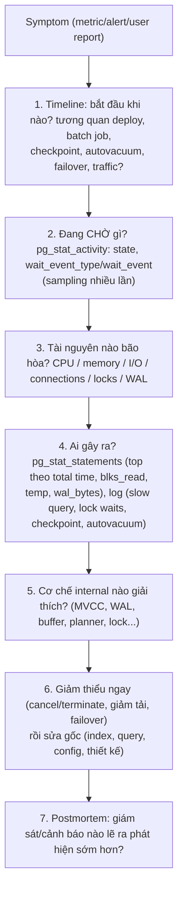
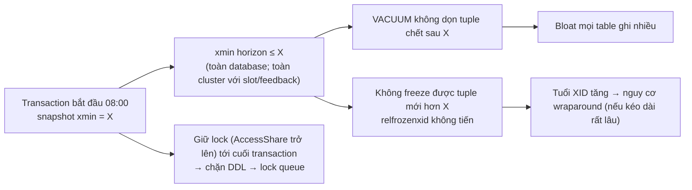
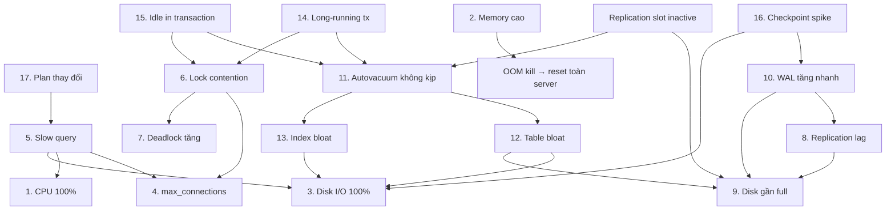

# PART 40 — DATABASE PRODUCTION BEHAVIOR

> **Trước:** [39 — Distributed Database](39-distributed-database.md) · **Tiếp:** [41 — Database System Design](41-database-system-design.md)
> **Độ ưu tiên:** Rất cao. Chương này là nơi mọi kiến thức internals được dùng để **chẩn đoán**.

Mỗi scenario đi theo cấu trúc: **Symptom → Possible causes → Internal mechanism → Impact → Diagnosis logic → Possible fixes → Trade-offs**. Các query SQL chỉ nhằm minh họa **logic chẩn đoán** (dữ liệu nào cần nhìn), không phải script vận hành.

---

## Mục lục

- [Phương pháp chung](#phương-pháp-chung)
- [Scenario 1 — CPU 100%](#scenario-1--cpu-100)
- [Scenario 2 — Database memory tăng cao](#scenario-2--database-memory-tăng-cao)
- [Scenario 3 — Disk I/O 100%](#scenario-3--disk-io-100)
- [Scenario 4 — Connection đạt max_connections](#scenario-4--connection-đạt-max_connections)
- [Scenario 5 — Slow query](#scenario-5--slow-query)
- [Scenario 6 — Lock contention](#scenario-6--lock-contention)
- [Scenario 7 — Deadlock tăng](#scenario-7--deadlock-tăng)
- [Scenario 8 — Replication lag](#scenario-8--replication-lag)
- [Scenario 9 — Disk gần full](#scenario-9--disk-gần-full)
- [Scenario 10 — WAL tăng nhanh](#scenario-10--wal-tăng-nhanh)
- [Scenario 11 — Autovacuum không theo kịp](#scenario-11--autovacuum-không-theo-kịp)
- [Scenario 12 — Table bloat](#scenario-12--table-bloat)
- [Scenario 13 — Index bloat](#scenario-13--index-bloat)
- [Scenario 14 — Long-running transaction](#scenario-14--long-running-transaction)
- [Scenario 15 — Idle in transaction](#scenario-15--idle-in-transaction)
- [Scenario 16 — Checkpoint spike](#scenario-16--checkpoint-spike)
- [Scenario 17 — Query plan đột nhiên thay đổi](#scenario-17--query-plan-đột-nhiên-thay-đổi)
- [Bản đồ quan hệ nhân quả giữa các scenario](#bản-đồ-quan-hệ-nhân-quả-giữa-các-scenario)
- [Interview Questions](#interview-questions)
- [Key Takeaways](#key-takeaways)

---

## Phương pháp chung

**Cách đọc diagram:** Luôn bắt đầu bằng **timeline** và **wait events** — "database đang làm gì / chờ gì" — trước khi đoán. Hầu hết sự cố có một **nguyên nhân gốc** và một **chuỗi hệ quả**; sửa hệ quả (ví dụ tăng max_connections) mà không sửa gốc (query chậm giữ connection) thường làm tệ hơn.

**Các nguồn dữ liệu chính:**

| Câu hỏi | Nguồn |
|---|---|
| Backend đang làm gì/chờ gì | `pg_stat_activity` |
| Query nào tốn tài nguyên | `pg_stat_statements` |
| Ai chặn ai | `pg_locks`, `pg_blocking_pids()` |
| I/O theo loại | `pg_stat_io` (PG 16+), `pg_statio_*` |
| WAL | `pg_stat_wal`, `pg_current_wal_lsn()` |
| Checkpoint | `pg_stat_checkpointer` (PG 17+), log checkpoints |
| Vacuum | `pg_stat_user_tables`, `pg_stat_progress_vacuum`, log autovacuum |
| Replication | `pg_stat_replication`, `pg_replication_slots`, `pg_stat_wal_receiver` |
| Database-level | `pg_stat_database` (xact, blks, temp, deadlocks, conflicts) |
| Plan | `EXPLAIN (ANALYZE, BUFFERS)`, `auto_explain` |
| OS | CPU, memory (RSS, page cache), iostat, network |

---

## Scenario 1 — CPU 100%

**Symptom:** CPU của máy database ở 90–100%; latency mọi query tăng; load average cao.

**Possible causes:**
1. Một/vài query tệ: seq scan lớn thiếu index, nested loop với outer bị underestimate, hàm tốn CPU, regex/JSON xử lý nhiều row.
2. Plan thay đổi (Scenario 17).
3. Quá nhiều connection active (vượt số core nhiều lần) → context switch + contention.
4. JIT compile cho query OLTP (estimate thổi phồng).
5. Spinlock/LWLock contention (CPU "bận" vì spin).
6. Hash/sort nặng; parallel query dùng nhiều worker.
7. Tăng traffic thật.
8. Autovacuum/ANALYZE nhiều worker (thường I/O hơn CPU).

**Internal mechanism:** CPU bị tiêu vào: kiểm tra visibility từng tuple, deform tuple, đánh giá biểu thức, sort/hash, so sánh B-Tree, compile JIT, spin trên lock. Seq scan table 10GB trong cache = hàng chục triệu tuple phải xử lý — CPU-bound dù không I/O.

**Impact:** Mọi query chậm (kể cả query rẻ vì chờ CPU); timeout → retry → thêm tải; replication có thể lag (walsender/startup ít CPU).

**Diagnosis logic:**
1. `pg_stat_activity`: số backend `active` so với số core; nhiều active với `wait_event IS NULL` → đang dùng CPU.
2. `pg_stat_statements` sắp theo `total_exec_time` (và delta theo thời gian) → query chiếm CPU; so `calls` với trước để phân biệt "query mới tệ" vs "gọi nhiều hơn".
3. EXPLAIN (ANALYZE, BUFFERS) query hàng đầu: seq scan? rows removed by filter lớn? loops lớn? JIT time?
4. Wait event `LWLock:*` nhiều → contention (Scenario 6 / fast-path).
5. OS: `top` theo process — backend nào; `perf` nếu cần.

**Possible fixes:**
- Tức thời: `pg_cancel_backend` query tệ; giảm concurrency (pooler giới hạn); tắt JIT (`jit = off`) nếu JIT là thủ phạm.
- Gốc: index phù hợp, sửa query, sửa ước lượng (ANALYZE/extended stats), giảm số connection active (pool), cache kết quả, vertical scaling.

**Trade-offs:** Thêm index giảm CPU đọc nhưng tăng chi phí ghi; giới hạn concurrency tăng thời gian chờ ở pool nhưng giảm tổng latency.

---

## Scenario 2 — Database memory tăng cao

**Symptom:** RAM sử dụng tăng dần hoặc đột biến; swap; OOM killer giết backend → **toàn server reset** (log: `server process (PID ...) was terminated by signal 9: Killed`, `terminating any other active server processes`).

**Possible causes:**
1. `work_mem` × (số node sort/hash mỗi query) × (số query đồng thời) × (parallel workers) vượt RAM.
2. Hash aggregate/hash join với ước lượng sai (trước PG 13 HashAgg có thể vượt work_mem không giới hạn).
3. Quá nhiều connection, mỗi connection giữ catalog cache lớn (nhiều partition/table) hoặc plan cache lớn.
4. Memory leak trong extension hoặc PL function (ít gặp).
5. `maintenance_work_mem` lớn × nhiều autovacuum worker / CREATE INDEX song song.
6. Không có huge pages + shared_buffers lớn + nhiều connection → page table khổng lồ.
7. Hiểu nhầm: "free" thấp vì **OS page cache** dùng RAM — đây là **bình thường** (page cache được giải phóng khi cần).

**Internal mechanism:** Memory local của backend (memory contexts) được cấp phát theo nhu cầu; `work_mem` là giới hạn **mỗi node**, không mỗi query ([Chương 04 §8](04-postgresql-architecture.md#8-concept-local-backend-private-memory)). Linux overcommit mặc định cho phép cấp phát vượt RAM → OOM killer thay vì lỗi cấp phát.

**Impact:** OOM kill một backend → postmaster **reset toàn server** + crash recovery → downtime, mất mọi connection.

**Diagnosis logic:**
1. Phân biệt RSS thật của process PostgreSQL vs page cache (lưu ý shared memory được tính vào RSS của mọi process đã chạm → cộng RSS sai; dùng PSS/USS).
2. Backend nào lớn: `pg_log_backend_memory_contexts(pid)` (PG 14) → xem context nào lớn (ExecutorState, HashTableContext, CacheMemoryContext...).
3. `pg_stat_statements`/log: query nào chạy lúc memory tăng; EXPLAIN: Hash Memory Usage, Batches, Sort Memory.
4. Số connection và số partition/table.

**Possible fixes:**
- `vm.overcommit_memory = 2` (strict) + ratio phù hợp → query vượt memory nhận `ERROR: out of memory` thay vì OOM kill toàn server.
- Giảm `work_mem` toàn cục, tăng theo session cho job cần.
- Pooler giảm số backend; `max_connections` hợp lý.
- Huge pages.
- Sửa ước lượng để hash không bị underestimate.
- Giới hạn autovacuum_work_mem.

**Trade-offs:** work_mem thấp → nhiều spill ra disk (chậm) nhưng an toàn; strict overcommit có thể từ chối cấp phát sớm hơn cần thiết.

---

## Scenario 3 — Disk I/O 100%

**Symptom:** Disk utilization/IOPS/throughput bão hòa; `await` cao; wait event `IO:DataFileRead`, `IO:WALWrite/WALSync`, `IO:BufFileRead/Write`.

**Possible causes:**
1. **Read**: working set vượt RAM (cache miss), seq scan lớn, bloat (đọc page trống), index-only scan với nhiều heap fetch, replica replay random I/O.
2. **Write**: checkpoint (Scenario 16), bgwriter/backend flush, **FPI** sau checkpoint, bulk load, vacuum (dirty page + WAL), CREATE INDEX.
3. **Temp files**: sort/hash spill (work_mem nhỏ) — `temp_blks_written`.
4. **WAL**: nhiều commit nhỏ (fsync liên tục), WAL volume lớn.
5. Cloud: hết **burst credit** IOPS/throughput (gp2/gp3 baseline) → hiệu năng rơi đột ngột dù tải không đổi.
6. Hoạt động ngoài PostgreSQL: backup, log, antivirus.

**Internal mechanism:** Cache miss ở shared_buffers và page cache → `pread` tới disk; dirty page phải ghi; fsync cuối checkpoint xả dirty page kernel; temp file cho spill; FPI làm WAL lớn.

**Impact:** Latency tăng toàn hệ thống; commit chậm (WAL fsync tranh I/O); replication lag.

**Diagnosis logic:**
1. Read hay write? (iostat r/s vs w/s; `pg_stat_io` theo `backend_type`, `context`, `object`).
2. Nếu read: `pg_stat_statements` sắp theo `shared_blks_read`; EXPLAIN Buffers; cache hit theo table (`pg_statio_user_tables`); bloat.
3. Nếu write: log checkpoint (timed vs wal, write/sync time), `pg_stat_io` writes by client backend (backend tự ghi), `pg_stat_wal`, autovacuum log, temp (`pg_stat_database.temp_bytes`, `log_temp_files`).
4. Cloud metrics: burst balance.

**Possible fixes:**
- Read: index, sửa query, giảm bloat, tăng RAM (cache), partition + pruning, index-only scan (VACUUM cho VM).
- Write: checkpoint thưa hơn + completion_target 0.9, `wal_compression`, giảm index/tăng HOT, batch, work_mem cho spill, WAL disk riêng.
- Hạ tầng: IOPS/throughput provisioned, NVMe.

**Trade-offs:** Checkpoint thưa → recovery lâu hơn; work_mem cao → rủi ro memory.

---

## Scenario 4 — Connection đạt max_connections

**Symptom:** `FATAL: sorry, too many clients already`; app không lấy được connection; có thể DBA cũng không vào được.

**Possible causes:**
1. Query chậm/lock → connection bị giữ lâu (Little's Law) → pool mở thêm → chạm giới hạn. (**Nguyên nhân thường gặp nhất** — số connection là *triệu chứng*.)
2. Nhiều app instance × pool size quá lớn (autoscaling).
3. Connection leak (app không trả connection), `idle in transaction`.
4. Connection storm (deploy, failover, retry storm).
5. Không có pooler.

**Internal mechanism:** Mỗi connection chiếm một PGPROC slot; `max_connections` là giới hạn cứng (shared memory cố định).

**Impact:** Request mới lỗi; cascading failure; không vào được để chẩn đoán (nếu không có reserved connections).

**Diagnosis logic:**
1. `pg_stat_activity` group by `state`, `application_name`, `usename`, `client_addr`: nhiều `idle`? (pool quá lớn/leak) nhiều `idle in transaction`? (bug app) nhiều `active`? (query chậm / chờ lock — xem `wait_event`).
2. Nếu `active` đang chờ `Lock` → Scenario 6 là gốc.
3. Nếu `active` chạy lâu → Scenario 5 là gốc.
4. Tương quan với deploy/autoscale/failover.

**Possible fixes:**
- Tức thời: kết nối qua reserved slot; terminate idle in transaction/leak; cancel query gốc gây chặn.
- Gốc: pooler (PgBouncer transaction mode), giảm pool size mỗi instance, timeouts (`idle_in_transaction_session_timeout`, `statement_timeout`), sửa query chậm, backoff khi retry, `reserved_connections`.
- **Không** tăng max_connections như phản xạ đầu tiên.

**Trade-offs:** Pool nhỏ → request chờ ở pool (nhưng DB khỏe); transaction pooling hạn chế session features.

---

## Scenario 5 — Slow query

**Symptom:** Một query (hoặc endpoint) chậm; `log_min_duration_statement` ghi nhận; p99 tăng.

**Possible causes:** thiếu index; điều kiện không sargable; estimate sai → plan tệ; bloat; spill (work_mem); chờ lock; cache lạnh; generic plan tệ; network/kết quả lớn; N+1 queries (từng query nhanh, tổng chậm); JIT.

**Internal mechanism:** Tùy nguyên nhân — xem [Chương 17](17-query-planner.md), [18](18-explain-analyze.md).

**Impact:** Người dùng chậm; giữ connection lâu → Scenario 4; giữ snapshot → vacuum.

**Diagnosis logic:** Quy trình ở [Chương 18 §11](18-explain-analyze.md#11-quy-trình-phân-tích-query-chậm):
1. Chậm luôn hay thỉnh thoảng? (thỉnh thoảng → lock, cache, plan cache, tham số cụ thể, checkpoint)
2. `pg_stat_statements`: mean vs max, `shared_blks_read`, `temp_blks_written`.
3. EXPLAIN (ANALYZE, BUFFERS) với tham số thật (và `GENERIC_PLAN`).
4. Node nào tốn; estimate vs actual; spill; loops.
5. Khi chạy thật: `wait_event` của backend.

**Possible fixes:** index (composite/partial/covering), viết lại query, ANALYZE/statistics, work_mem cục bộ, force custom plan, giảm bloat, keyset pagination, cache, gộp N+1.

**Trade-offs:** Mỗi index thêm chi phí ghi; work_mem cao rủi ro memory.

---

## Scenario 6 — Lock contention

**Symptom:** Nhiều backend `wait_event_type = 'Lock'`; throughput giảm; request timeout hàng loạt; có thể "treo" đột ngột toàn table.

**Possible causes:**
1. **DDL chờ sau query dài** → lock queue hazard ([Chương 13 §8.2](13-locking.md#82-how--luật-hàng-đợi-và-lock-queue-hazard)).
2. **Hot row**: nhiều transaction update cùng row (counter, balance tổng, inventory SKU hot).
3. Transaction giữ row lock lâu (gọi dịch vụ ngoài, `idle in transaction`).
4. FK tới row cha nóng (KEY SHARE + MultiXact).
5. `SELECT FOR UPDATE` trên phạm vi rộng.
6. Anti-wraparound autovacuum chặn DDL.
7. LWLock contention (`LWLock:LockManager`, `BufferContent` trên page nóng, `WALInsert`) — không phải heavyweight lock nhưng biểu hiện tương tự.

**Internal mechanism:** Heavyweight lock xung đột theo conflict matrix; row lock chờ trên transactionid; hàng đợi FIFO với luật "không vượt người đang chờ xung đột".

**Impact:** Chuỗi chặn lan rộng; pool cạn (Scenario 4); timeout.

**Diagnosis logic:**
1. `pg_blocking_pids()` → dựng cây chặn, tìm **root blocker** (chặn người khác nhưng không bị ai chặn).
2. Root blocker đang làm gì: `state` (`idle in transaction`?), `query`, `xact_start`.
3. `wait_event`: `relation` (table lock — DDL?), `transactionid` (row lock), `tuple` (nhiều người xếp hàng một row → hot row).
4. `log_lock_waits` để xem lịch sử.

**Possible fixes:**
- Tức thời: cancel/terminate root blocker (thường idle in transaction hoặc DDL).
- Gốc: `lock_timeout` cho DDL + retry; transaction ngắn; không gọi dịch vụ ngoài trong transaction; hot row → sharded counter/batch/async; `SKIP LOCKED` cho queue; index FK; tránh DDL lúc anti-wraparound.

**Trade-offs:** Sharded counter phức tạp đọc; lock_timeout làm DDL fail và cần retry.

---

## Scenario 7 — Deadlock tăng

**Symptom:** Log `deadlock detected` tăng; `pg_stat_database.deadlocks` tăng; app nhận SQLSTATE 40P01.

**Possible causes:** thứ tự khóa không nhất quán giữa code path; batch update không sắp xếp; lock upgrade (FOR SHARE → UPDATE); upsert hàng loạt thứ tự khác nhau; FK/cascade; plan đổi làm thứ tự scan đổi; tăng concurrency (thêm worker).

**Internal mechanism:** Chu trình wait-for graph; detector chạy sau `deadlock_timeout`, backend phát hiện tự abort ([Chương 14](14-deadlock.md)).

**Impact:** Transaction bị hủy (công việc lãng phí), latency ≥ 1s cho các bên liên quan, lỗi cho user nếu không retry.

**Diagnosis logic:** Đọc DETAIL trong log (process, lock type, relation, tuple, query); dựng thứ tự khóa của hai code path; tương quan với deploy/job mới/plan change.

**Possible fixes:** thứ tự khóa nhất quán (ORDER BY id FOR UPDATE), khóa sớm và mạnh, batch sắp xếp theo key, transaction ngắn, retry có backoff; advisory lock theo entity cho luồng phức tạp.

**Trade-offs:** Khóa sớm/thô giảm concurrency.

---

## Scenario 8 — Replication lag

**Symptom:** `replay_lag` tăng; replica trả dữ liệu cũ; health check loại replica; (sync) commit chậm.

**Possible causes & mechanism & diagnosis & fixes:** chi tiết đầy đủ ở [Chương 28](28-replication-lag.md). Tóm tắt:

| Chặng | Nguyên nhân | Dấu hiệu | Fix |
|---|---|---|---|
| Primary | WAL burst (batch, index build, vacuum freeze, FPI) | `pg_stat_wal` tăng vọt | Chia batch, checkpoint/wal_compression |
| Network | Băng thông/RTT | sent − write lớn | Băng thông, nén |
| Standby disk | fsync chậm | flush_lag | Disk tốt hơn |
| Replay | Single-thread CPU/I/O, **conflict với query standby** | flush − replay lớn; startup `wait_event` | recovery_prefetch, tách replica analytics, max_standby_streaming_delay, giảm WAL |

**Impact:** Stale read, read-after-write lỗi, RPO/RTO failover xấu, WAL tích lũy trên primary (slot).

**Trade-offs:** hot_standby_feedback (ít hủy query) ↔ bloat primary; delay lớn ↔ lag.

---

## Scenario 9 — Disk gần full

**Symptom:** Dung lượng disk > 85–90%; tăng nhanh; nếu 100%: lỗi `could not extend file`, `No space left on device`; nếu `pg_wal` không ghi được → **PANIC**, server dừng.

**Possible causes:**
1. **`pg_wal` phình**: replication slot inactive (CDC chết, standby bị gỡ), `archive_command` lỗi, `wal_keep_size` lớn, checkpoint không theo kịp, transaction/batch khổng lồ.
2. **Table/index bloat** (Scenario 11–13).
3. **Temp files** khổng lồ (query sort/hash spill; một query tệ có thể ghi hàng trăm GB).
4. Tăng trưởng dữ liệu thật; không có retention.
5. Log file PostgreSQL (log_statement = all, auto_explain không giới hạn).
6. `pg_dump`/backup lưu cùng disk.
7. Logical decoding spill (`pg_replslot/` chứa file spill của transaction lớn).

**Internal mechanism:** WAL chỉ được recycle khi: đã qua checkpoint redo, đã archive, không slot nào cần, ngoài wal_keep_size ([Chương 20 §8.2](20-wal.md#82-vòng-đời-segment)). Plain VACUUM không trả disk cho OS.

**Impact:** Disk đầy data → ghi lỗi (transaction abort); disk đầy WAL → **PANIC**, server không khởi động lại được cho tới khi giải phóng chỗ.

**Diagnosis logic:**
1. Thư mục nào lớn: `pg_wal/`, `base/` (table nào: `pg_total_relation_size`), `base/pgsql_tmp/`, `pg_replslot/`, `log/`.
2. Nếu pg_wal: `pg_replication_slots` (active=false, retained WAL), `pg_stat_archiver` (failed_count), log checkpoint.
3. Nếu base: top table/index theo kích thước và tốc độ tăng; bloat estimate; `n_dead_tup`.
4. Nếu temp: `pg_stat_database.temp_bytes`, `log_temp_files`, query đang chạy.

**Possible fixes:**
- **Không bao giờ xóa tay file trong `pg_wal`**.
- Slot bỏ rơi: `pg_drop_replication_slot` (sau khi xác nhận consumer không cần — CDC sẽ phải snapshot lại).
- Archive lỗi: sửa archive_command/credential/đích.
- Temp: cancel query; `temp_file_limit` để giới hạn temp mỗi process.
- Bloat: pg_repack (cần chỗ trống!) → có thể phải mở rộng disk trước.
- Retention: partition + drop.
- Phòng ngừa: `max_slot_wal_keep_size`, `idle_replication_slot_timeout` (PG 18), cảnh báo 70/80/90%, disk có thể mở rộng online.

**Trade-offs:** Drop slot → consumer phải khởi tạo lại; max_slot_wal_keep_size → slot có thể bị invalidate.

---

## Scenario 10 — WAL tăng nhanh

**Symptom:** Tốc độ sinh WAL (bytes/phút) tăng mạnh; archive tắc; replication lag; pg_wal phình.

**Possible causes:**
1. **FPI**: checkpoint quá thường xuyên (max_wal_size nhỏ), key ngẫu nhiên (UUIDv4) chạm nhiều page, bật checksums/wal_log_hints (FPI cho hint bits sau checkpoint).
2. Batch lớn: bulk UPDATE/DELETE, backfill cột, `ALTER TABLE` rewrite, `CREATE INDEX`.
3. Nhiều index + non-HOT update.
4. VACUUM FREEZE/anti-wraparound trên table lớn (freeze records + FPI).
5. `REPLICA IDENTITY FULL` với logical decoding.
6. No-op update hàng loạt (ORM save mọi cột, "touch updated_at").
7. Unlogged → logged table conversion, `CREATE DATABASE` strategy WAL_LOG (PG 15+ mặc định) cho template lớn.

**Internal mechanism:** Mỗi thay đổi page → WAL record; lần đầu sửa page sau checkpoint → FPI 8KB; mỗi index → record riêng.

**Impact:** I/O ghi, replication lag, archive/backup storage tăng, thời gian recovery tăng, disk.

**Diagnosis logic:**
1. `pg_stat_wal`: `wal_fpi / wal_records` (tỉ lệ FPI), `wal_bytes` theo thời gian.
2. `pg_stat_statements.wal_bytes`, `wal_fpi` → query nào sinh WAL.
3. `pg_waldump --stats` trên segment → rmgr nào chiếm (Heap, Btree, Heap2/FREEZE, XLOG/FPI_FOR_HINT...).
4. Log checkpoint: requested (wal) quá nhiều?
5. Tương quan batch job, autovacuum (to prevent wraparound).

**Possible fixes:** tăng max_wal_size/checkpoint_timeout, wal_compression, giảm index/tăng HOT, key tuần tự (UUIDv7/bigint), chia batch + throttle, tránh no-op update, replica identity phù hợp, freeze chủ động giờ thấp điểm.

**Trade-offs:** Checkpoint thưa → recovery lâu; wal_compression → CPU.

---

## Scenario 11 — Autovacuum không theo kịp

**Symptom:** `n_dead_tup` tăng liên tục; `last_autovacuum` cũ trên table nóng; autovacuum worker luôn bận (đủ `autovacuum_max_workers`); `age(datfrozenxid)` tăng dần; query chậm dần.

**Possible causes:**
1. **Horizon bị giữ** (long tx, idle in tx, slot, hot_standby_feedback, prepared xact) → vacuum chạy nhưng không dọn được ("dead but not yet removable").
2. **Throttle quá chặt**: cost_limit 200 chia cho mọi worker ([Chương 23 §5.5](23-vacuum.md#55-cost-based-vacuum-delay)).
3. **Ngưỡng scale factor 20%** quá lớn cho table lớn → vacuum hiếm và khổng lồ.
4. **Quá ít worker** so với số table cần vacuum; một table khổng lồ chiếm worker hàng giờ.
5. `maintenance_work_mem` nhỏ (trước PG 17) → nhiều lượt quét index.
6. Nhiều index lớn → mỗi vacuum quét hết.
7. Autovacuum bị hủy liên tục (DDL/lock conflict).
8. Stats bị reset (sau crash/failover) → autovacuum không biết table cần vacuum.

**Internal mechanism:** Autovacuum được kích hoạt theo stats; chạy với cost-based delay; mỗi lượt quét heap (không all-visible) + mọi index.

**Impact:** Bloat (Scenario 12–13), VM không cập nhật (index-only scan kém), thống kê cũ (plan tệ), tiến tới wraparound.

**Diagnosis logic:**
1. `VACUUM VERBOSE`/log autovacuum: "dead but not yet removable" lớn → **horizon** (Scenario 14/15, slot).
2. `pg_stat_progress_vacuum`: vacuum đang ở pha nào, bao lâu; `index_vacuum_count` > 1?
3. Số worker đang chạy vs max; table nào chiếm lâu.
4. Log `canceling autovacuum task` → bị hủy do lock.
5. So ngưỡng (threshold + scale × reltuples) với tốc độ sinh dead tuple.

**Possible fixes:** giải phóng horizon; tăng `autovacuum_vacuum_cost_limit` (1000–4000+), giảm delay; tăng workers (PG 18: `autovacuum_worker_slots`); per-table scale_factor nhỏ; maintenance/autovacuum_work_mem đủ (hoặc nâng PG 17); giảm index; HOT; partition table khổng lồ; chạy VACUUM thủ công có kiểm soát giờ thấp điểm.

**Trade-offs:** Autovacuum aggressive tăng I/O nền (có thể ảnh hưởng latency) — nhưng rẻ hơn bloat/wraparound.

---

## Scenario 12 — Table bloat

**Symptom:** Kích thước table lớn hơn nhiều so với dữ liệu live; seq scan chậm dần; cache hit giảm; disk tăng dù số row ổn định.

**Possible causes:** autovacuum không theo kịp (Scenario 11); horizon giữ lâu trong quá khứ (bloat còn lại sau sự cố); batch DELETE/UPDATE lớn; update pattern non-HOT; fillfactor 100 với update nhiều (không liên quan trực tiếp bloat nhưng giảm HOT).

**Internal mechanism:** MVCC để lại dead tuple; vacuum biến chúng thành chỗ trống tái sử dụng nhưng không co file; chỗ trống chỉ lấp lại khi có insert/update phù hợp ([Chương 23 §11](23-vacuum.md#11-table-bloat)).

**Impact:** I/O và cache lãng phí; backup lớn; thời gian vacuum tăng.

**Diagnosis logic:** `pgstattuple` (chính xác, tốn I/O) hoặc bloat estimate; `n_dead_tup`; tỉ lệ kích thước/row count theo thời gian; kiểm tra horizon.

**Possible fixes:** sửa gốc (Scenario 11/14); pg_repack (online, cần 2× chỗ); VACUUM FULL (downtime); PG 19 REPACK CONCURRENTLY (khi phát hành); partition để dữ liệu cũ drop được.

**Trade-offs:** Rebuild tốn I/O/WAL/chỗ; steady-state bloat 10–30% có thể chấp nhận (chỗ trống phục vụ HOT).

---

## Scenario 13 — Index bloat

**Symptom:** Index lớn bất thường so với số row; index scan đọc nhiều page; `avg_leaf_density` thấp.

**Possible causes:** non-HOT update churn (trước PG 14 nặng hơn); key ngẫu nhiên (split 50/50); xóa hàng loạt để lại page thưa (không merge); pattern queue (insert phải, delete trái); vacuum chậm/horizon.

**Internal mechanism:** B-Tree không merge page thưa; chỉ xóa page rỗng; entry chết chờ vacuum/bottom-up ([Chương 15 §3.8](15-index-internals.md#38-index-bloat)).

**Impact:** Cache kém, I/O, vacuum chậm (quét toàn index), insert chậm.

**Diagnosis logic:** `pgstatindex` (avg_leaf_density, leaf_fragmentation), so kích thước ước lượng; xem pattern ghi.

**Possible fixes:** `REINDEX INDEX CONCURRENTLY`; sửa gốc (HOT, key tuần tự, horizon); định kỳ reindex cho index pattern queue; xóa index không dùng.

**Trade-offs:** REINDEX CONCURRENTLY tốn I/O, chờ transaction cũ, có thể để lại index INVALID khi lỗi.

---

## Scenario 14 — Long-running transaction

**Symptom:** Một transaction có `xact_start` cách đây hàng giờ; `age(backend_xmin)` lớn; dead tuple "not yet removable" tăng trên nhiều table; DDL bị treo; replication slot/standby có thể liên quan.

**Possible causes:** report/analytics trên primary; `pg_dump` dài; batch job xử lý trong một transaction khổng lồ; migration dữ liệu; job bị treo (chờ lock, chờ dịch vụ ngoài); REPEATABLE READ transaction mở lâu; CDC initial snapshot.

**Internal mechanism:**

**Cách đọc diagram:** Một transaction dài có **hai** loại hệ quả độc lập: qua **snapshot** (horizon → vacuum/freeze) và qua **lock** (chặn DDL, gây lock queue). Hệ quả qua snapshot lan ra **mọi table**, không chỉ table nó đọc.

**Impact:** Bloat toàn hệ thống, query chậm dần, DDL/migration treo, autovacuum chạy vô ích (I/O lãng phí), nếu có XID và kéo dài nhiều ngày → nguy cơ wraparound.

**Diagnosis logic:**
1. `pg_stat_activity` sắp theo `xact_start` / `age(backend_xmin)`; loại `backend_type`.
2. Kiểm tra cả `pg_replication_slots` (xmin, catalog_xmin), `pg_prepared_xacts`, standby có `hot_standby_feedback`.
3. Transaction đó làm gì (`state`, `query`, `wait_event`) — đang chạy thật hay treo?

**Possible fixes:**
- Tức thời: thống nhất với chủ job rồi `pg_cancel_backend`/`pg_terminate_backend`.
- Gốc: chạy report trên replica (hoặc warehouse); batch chia transaction nhỏ (commit mỗi N row); `statement_timeout`/`transaction_timeout` (PG 17) theo role; `SERIALIZABLE READ ONLY DEFERRABLE` hoặc replica cho export nhất quán; giám sát `age(backend_xmin)` với cảnh báo.

**Trade-offs:** Chia nhỏ batch mất tính nguyên tử của cả batch (cần idempotency/checkpoint trong job); report trên replica gặp conflict/lag.

---

## Scenario 15 — Idle in transaction

**Symptom:** Nhiều session `state = 'idle in transaction'` (hoặc `idle in transaction (aborted)`) kéo dài; lock chờ trên các row/table liên quan; pool cạn.

**Possible causes:** app mở transaction rồi gọi HTTP/queue/tính toán lâu trước khi commit; bug không commit/rollback ở nhánh lỗi; framework mở transaction ngầm (autocommit off) cho cả request; debug session của người dùng (psql BEGIN rồi bỏ đi); connection pool trả connection về khi transaction còn mở.

**Internal mechanism:** Session giữ snapshot (nếu đã chạy query ở RR, hoặc đang trong transaction có XID) và **mọi lock đã lấy**; `idle in transaction (aborted)`: transaction lỗi chờ ROLLBACK — vẫn giữ tài nguyên cho tới khi rollback.

**Impact:** Như Scenario 14 (horizon) + lock (row lock đã lấy chặn người khác vô thời hạn) + chiếm connection.

**Diagnosis logic:** `pg_stat_activity WHERE state LIKE 'idle in transaction%'` sắp theo `now() - state_change`; `query` cuối cùng (gợi ý code path); `application_name`, `client_addr` → service nào.

**Possible fixes:** `idle_in_transaction_session_timeout` (ví dụ 30s–5 phút tùy app) — database tự ngắt; sửa code: không làm I/O ngoài trong transaction, đảm bảo commit/rollback ở mọi nhánh (defer/finally), transaction scope nhỏ; kiểm tra cấu hình autocommit của framework.

**Trade-offs:** Timeout quá ngắn có thể ngắt transaction hợp lệ chậm (app phải xử lý lỗi và retry).

---

## Scenario 16 — Checkpoint spike

**Symptom:** Latency tăng theo chu kỳ (mỗi `checkpoint_timeout` hoặc dồn dập khi ghi nhiều); I/O write tăng vọt; commit chậm; replication lag theo chu kỳ; log `checkpoints are occurring too frequently`.

**Possible causes:** `max_wal_size` nhỏ → checkpoint do WAL liên tục; `checkpoint_completion_target` thấp (cấu hình cũ 0.5); kernel tích quá nhiều dirty page → fsync cuối checkpoint stall; FPI storm sau checkpoint; disk yếu; checkpoint thủ công/`pg_basebackup --checkpoint=fast`.

**Internal mechanism:** Checkpoint ghi mọi dirty buffer + fsync; ngay sau checkpoint mọi page bị sửa lần đầu sinh FPI ([Chương 21 §8](21-checkpoint.md#8-checkpoint-spike)).

**Impact:** Latency p99 dao động; commit chậm (WAL fsync tranh I/O); replication lag.

**Diagnosis logic:** Log checkpoint (`starting: time` vs `wal`, `write=`, `sync=`, `longest=`, `distance`); tương quan thời điểm latency spike với checkpoint; `pg_stat_checkpointer`; `pg_stat_wal.wal_fpi` theo thời gian; OS dirty page (`/proc/meminfo` Dirty/Writeback).

**Possible fixes:** tăng `max_wal_size` (để phần lớn là timed), `checkpoint_timeout` 15–30min, `checkpoint_completion_target = 0.9`, `checkpoint_flush_after`, kernel `vm.dirty_background_bytes` nhỏ, `wal_compression`, WAL disk riêng, storage tốt hơn.

**Trade-offs:** Checkpoint thưa → crash recovery lâu hơn, pg_wal lớn hơn.

---

## Scenario 17 — Query plan đột nhiên thay đổi

**Symptom:** Một query ổn định lâu nay đột nhiên chậm 10–1000×; không có deploy; EXPLAIN hiện plan khác trước.

**Possible causes:**
1. **Autoanalyze** cập nhật statistics → ước lượng vượt ngưỡng → plan khác.
2. **Tăng trưởng dữ liệu** vượt điểm chuyển (table nhỏ → lớn; phân bố đổi).
3. **Giá trị mới ngoài histogram** (cột tăng dần, thống kê cũ) → ước lượng ~0 row → nested loop.
4. **Plan cache**: prepared statement chuyển custom → **generic plan** sau 5 lần; hoặc bị invalidate và replan với tham số "xấu".
5. Index bị drop/INVALID, hoặc index mới khiến planner chọn khác.
6. Thay đổi tham số (`work_mem`, `random_page_cost`, `effective_cache_size`), nâng cấp PostgreSQL, pg_upgrade chưa ANALYZE (extended stats không được giữ).
7. Correlation vật lý thay đổi (sau pg_repack/CLUSTER hoặc pattern ghi).
8. JIT kích hoạt do estimate tăng.

**Internal mechanism:** Planner chọn plan rẻ nhất **theo ước lượng**; ước lượng phụ thuộc statistics (mẫu), tham số, cost constants; vài phần trăm thay đổi estimate có thể lật lựa chọn (ví dụ Index Scan ↔ Seq Scan, Nested Loop ↔ Hash Join) ([Chương 17 §12](17-query-planner.md#12-tại-sao-planner-chọn-sai)).

**Impact:** Query chậm → giữ connection → pool cạn → CPU/I/O tăng → lan toàn hệ thống.

**Diagnosis logic:**
1. So plan cũ/mới: `auto_explain` log, APM, hoặc chạy EXPLAIN trên replica/snapshot cũ.
2. EXPLAIN (ANALYZE, BUFFERS): node nào estimate lệch actual.
3. `pg_stat_user_tables.last_autoanalyze` — trùng thời điểm?
4. `pg_stats` cho cột liên quan (MCV/histogram/n_distinct đổi?).
5. Prepared statement: `pg_prepared_statements.generic_plans/custom_plans`; `EXPLAIN (GENERIC_PLAN)`.
6. `pg_stat_statements`: mean_exec_time tăng từ khi nào; plan time.

**Possible fixes:**
- Tức thời: `ANALYZE table` (nếu thống kê cũ), `plan_cache_mode = force_custom_plan` cho role/query, `SET` cục bộ tắt phương án tệ (enable_nestloop=off trong session của job cụ thể — tạm thời), pg_hint_plan nếu đã dùng.
- Gốc: statistics target cao hơn cho cột lệch; `CREATE STATISTICS` cho cột tương quan; index phù hợp giúp plan "ổn định" (có lựa chọn rẻ rõ rệt); viết lại query; autoanalyze thường xuyên hơn cho table tăng dần; cost constants đúng phần cứng; kiểm thử plan với dữ liệu production-like khi nâng cấp.

**Trade-offs:** Ép plan (hint/force_custom_plan/enable_*) có thể đúng hôm nay nhưng sai khi dữ liệu đổi; force_custom_plan tốn planning mỗi lần.

---

## Bản đồ quan hệ nhân quả giữa các scenario

**Cách đọc diagram:** Sự cố hiếm khi đơn lẻ. Ví dụ điển hình: **plan thay đổi** → query chậm → giữ connection → **max_connections**; hoặc **idle in transaction** → horizon + lock → **autovacuum không kịp** + **lock contention** → **bloat** → **I/O 100%** → **disk full**. Khi điều tra, lần ngược mũi tên để tìm **gốc**; khi phòng ngừa, cắt ở nguồn (timeouts, giám sát horizon, slot, checkpoint config, statistics).

---

## Interview Questions

**Q1. CPU database 100% đột ngột. Bạn điều tra thế nào?**
- *Short:* Timeline + pg_stat_activity (active vs core, wait_event) + pg_stat_statements (delta total_exec_time) → EXPLAIN query hàng đầu → phân biệt query mới tệ / plan đổi / traffic tăng / contention / JIT; cancel tức thời, sửa gốc.

**Q2. Disk gần đầy, pg_wal chiếm 80%. Nguyên nhân và xử lý?**
- *Short:* Slot inactive, archive lỗi, checkpoint chậm, transaction lớn. Kiểm tra pg_replication_slots, pg_stat_archiver; drop slot/sửa archive; không xóa tay WAL; đặt max_slot_wal_keep_size.

**Q3. Autovacuum chạy liên tục nhưng dead tuple không giảm. Vì sao?**
- *Short:* Horizon bị giữ (long tx, idle in tx, slot, feedback, prepared xact) — "dead but not yet removable".

**Q4. Query đột nhiên chậm sau nhiều tháng ổn định?**
- *Short:* Plan flip: autoanalyze, dữ liệu vượt ngưỡng, giá trị ngoài histogram, generic plan; so plan, estimate vs actual, xử lý stats/plan cache.

**Q5. Làm sao phân biệt lock contention và CPU saturation?**
- *Short:* wait_event: Lock/LWLock vs NULL (chạy CPU); CPU metric; pg_blocking_pids.

**Q6. (Senior) Sau deploy, max_connections bị chạm liên tục. Bạn làm gì?**
- *Short:* Xem state của connection: idle (pool quá lớn/leak), idle in transaction (bug), active chờ lock/chậm (query mới); rollback deploy nếu cần; pooler, timeouts; không tăng max_connections như phản xạ.

---

## Key Takeaways

1. Bắt đầu mọi điều tra bằng **timeline** và **wait events**; dùng `pg_stat_statements` để tìm thủ phạm.
2. Nhiều triệu chứng (max_connections, CPU, I/O) là **hệ quả**; gốc thường là query/plan, lock, horizon, WAL/slot.
3. **Horizon** (long tx, idle in tx, slot, feedback, prepared) là gốc của cả họ sự cố vacuum/bloat/disk.
4. **pg_wal đầy = PANIC**; slot và archive là nghi phạm hàng đầu; không bao giờ xóa tay.
5. OOM kill backend = reset toàn server → strict overcommit, work_mem có kiểm soát.
6. Phòng ngừa bằng: timeouts, `max_slot_wal_keep_size`/`idle_replication_slot_timeout`, cảnh báo disk/horizon/lag/XID age, checkpoint hợp lý, autovacuum tuning, `auto_explain` lưu plan.

---

## Nguồn tham khảo

- PostgreSQL Docs — *Monitoring Database Activity* (pg_stat_activity, wait events, pg_stat_io, pg_stat_wal, pg_stat_replication...): https://www.postgresql.org/docs/current/monitoring.html
- PostgreSQL Docs — *pg_stat_statements*, *auto_explain*, *pgstattuple*.
- PostgreSQL Docs — *Managing Kernel Resources* (Linux Memory Overcommit): https://www.postgresql.org/docs/current/kernel-resources.html#LINUX-MEMORY-OVERCOMMIT
- PostgreSQL Wiki — *Lock Monitoring*, *Show database bloat*.
