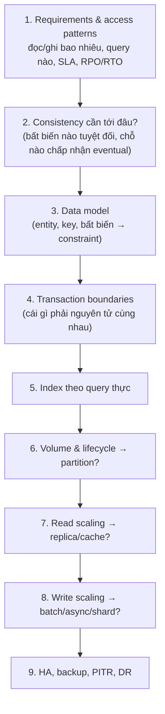
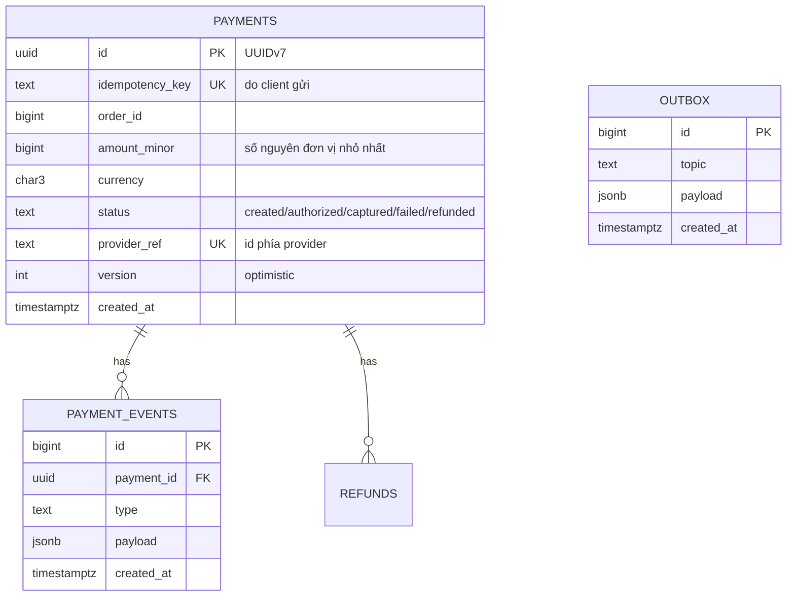
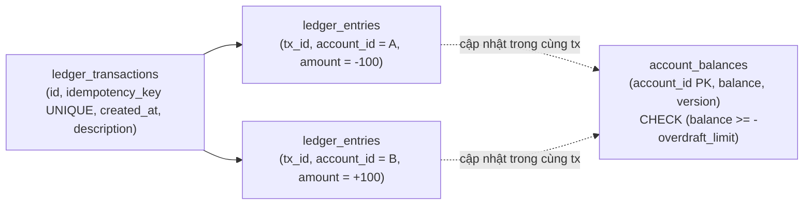
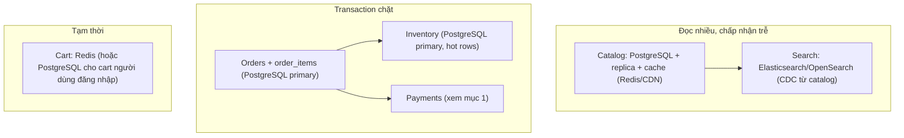
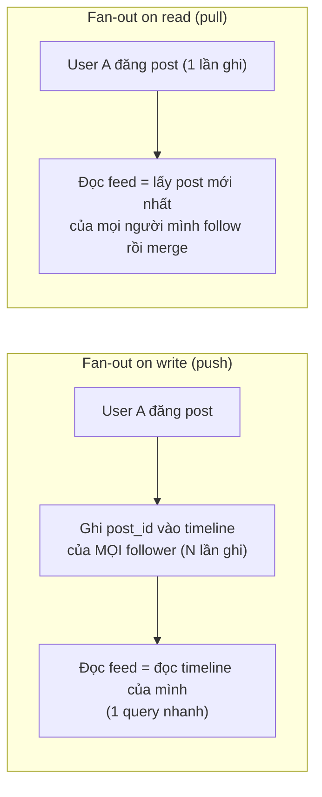
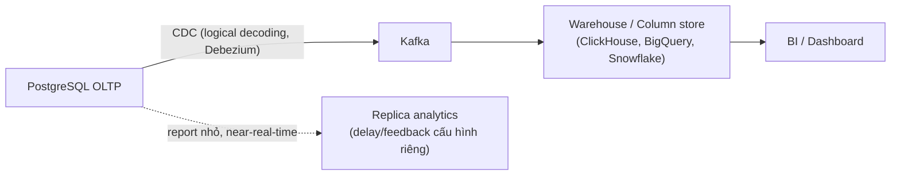
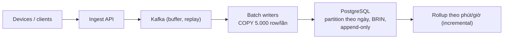

# PART 41 — DATABASE SYSTEM DESIGN

> **Trước:** [40 — Production Behavior](40-production-behavior.md) · **Tiếp:** [42 — Backend Engineer Database Design](42-backend-database-design.md)

Chương này không đưa "đáp án đúng" — nó trình bày **cách suy luận** khi thiết kế database cho từng loại hệ thống, dùng khung câu hỏi thống nhất. Mọi con số là giả định minh họa để tính toán.

---

## Mục lục

- [Khung suy luận chung](#khung-suy-luận-chung)
- [1. Payment system](#1-payment-system)
- [2. Banking system (core ledger)](#2-banking-system-core-ledger)
- [3. E-commerce](#3-e-commerce)
- [4. Social network](#4-social-network)
- [5. Logging system](#5-logging-system)
- [6. Analytics platform](#6-analytics-platform)
- [7. Notification system](#7-notification-system)
- [8. High-write system](#8-high-write-system)
- [9. High-read system](#9-high-read-system)
- [Interview Questions](#interview-questions)
- [Key Takeaways](#key-takeaways)

---

## Khung suy luận chung



**Cách đọc diagram:** Thứ tự quan trọng: **consistency và transaction boundaries quyết định data model**, không phải ngược lại. Quyết định scaling đến sau khi biết access pattern và volume.

Câu hỏi then chốt ở mỗi bước:

| Bước | Câu hỏi |
|---|---|
| Access pattern | Query nóng nhất là gì? Tỉ lệ đọc/ghi? Peak/average? |
| Consistency | Sai lệch nào gây mất tiền/pháp lý/an toàn? Chỗ nào stale vài giây OK? |
| Data model | Bất biến nào diễn đạt được bằng constraint (UNIQUE, CHECK, FK, EXCLUDE)? |
| Transaction | Ranh giới nguyên tử nhỏ nhất đảm bảo bất biến? Có cần lock/serializable? |
| Volume | Bao nhiêu row/ngày, giữ bao lâu, tổng kích thước sau 3 năm? |
| Failure | Mất primary thì sao? Xóa nhầm thì sao? Mất region thì sao? |

---

## 1. Payment system

### 1.1 Requirements

- Tạo payment, xác nhận qua payment provider (bên thứ ba), hoàn tiền; mỗi payment thuộc một order.
- **Không bao giờ charge hai lần**; không mất trạng thái payment đã xác nhận; audit đầy đủ.
- Ví dụ quy mô: 500 payment/s peak, đọc trạng thái nhiều hơn ghi.

### 1.2 Consistency

- **Strong** cho trạng thái payment và số tiền; **exactly-once về mặt nghiệp vụ** với provider bên ngoài (provider có thể timeout; retry có thể tạo charge thứ hai).
- Đọc từ replica chỉ cho màn hình lịch sử (chấp nhận trễ).

### 1.3 Data model



**Cách đọc diagram:** `idempotency_key` UNIQUE chống tạo trùng khi client retry. Số tiền lưu **integer đơn vị nhỏ nhất** (không float; `numeric` cũng được nhưng integer nhanh và rõ). `payment_events` là **append-only** audit trail. `outbox` để phát sự kiện nguyên tử cùng thay đổi trạng thái.

### 1.4 Transaction & state machine

- Chuyển trạng thái bằng **UPDATE có điều kiện**: `UPDATE payments SET status='captured', version=version+1 WHERE id=$1 AND status='authorized'` → 0 row = trạng thái đã đổi bởi người khác (idempotent, chống race).
- **Trong cùng transaction:** update trạng thái + insert payment_event + insert outbox.
- **Gọi provider ngoài transaction** (không giữ lock/connection khi chờ HTTP): (1) tạo payment `created` + commit, (2) gọi provider với **idempotency key của provider** (dùng id payment), (3) commit kết quả. Provider timeout → trạng thái "unknown" → job reconciliation hỏi lại provider.
- Isolation: Read Committed + update có điều kiện đủ; không cần Serializable toàn cục.

### 1.5 Index

`UNIQUE(idempotency_key)`, `UNIQUE(provider_ref)`, `(order_id)`, `(status, created_at)` partial cho trạng thái chờ xử lý (`WHERE status IN ('created','unknown')`) phục vụ job reconciliation.

### 1.6 Partition / Replication / HA / Backup

- `payment_events`, `outbox` tăng nhanh → partition theo thời gian; outbox dọn bằng drop partition hoặc xóa sau khi relay (CDC từ outbox qua logical decoding tránh polling).
- **Sync replication** trong region (RPO = 0) + Patroni + fencing; async DR region khác.
- PITR + retention dài (pháp lý), audit log bất biến.
- Read scaling: replica cho lịch sử/báo cáo; **mọi quyết định (refund có hợp lệ không) đọc từ primary**.

---

## 2. Banking system (core ledger)

### 2.1 Requirements

- Tài khoản, số dư, chuyển khoản nội bộ; **tổng tiền hệ thống bảo toàn**; không âm (hoặc hạn mức); audit không thể sửa; báo cáo đối soát cuối ngày.

### 2.2 Data model: **double-entry ledger**



**Cách đọc diagram:** Mỗi giao dịch tài chính là **một ledger transaction với ≥ 2 entry có tổng bằng 0** (bất biến kế toán). Entry **không bao giờ UPDATE/DELETE** — sửa sai bằng giao dịch đảo. `account_balances` là **số dư được duy trì** (denormalized) cho đọc nhanh và để CHECK constraint chặn âm; có thể đối soát lại từ `SUM(entries)`.

### 2.3 Transaction & concurrency

```sql
BEGIN;
-- khóa hai tài khoản theo thứ tự id để tránh deadlock (Chương 14)
SELECT account_id, balance FROM account_balances
WHERE account_id IN ($from, $to) ORDER BY account_id FOR UPDATE;
INSERT INTO ledger_transactions (idempotency_key, ...) VALUES ($key, ...);   -- UNIQUE: chống xử lý trùng
INSERT INTO ledger_entries VALUES ($tx, $from, -$amt), ($tx, $to, +$amt);
UPDATE account_balances SET balance = balance - $amt WHERE account_id = $from;   -- CHECK chặn âm
UPDATE account_balances SET balance = balance + $amt WHERE account_id = $to;
COMMIT;
```

- Row lock + thứ tự khóa cố định (chống deadlock); CHECK constraint bảo đảm bất biến ngay cả khi code lỗi.
- Bất biến "tổng entry của một tx = 0": constraint trigger deferred hoặc kiểm tra trong cùng transaction; hoặc Serializable cho luồng phức tạp.
- **Hot account** (tài khoản thu phí nhận hàng nghìn giao dịch/giây): row lock tuần tự hóa → dùng **sub-accounts** (N bucket) cộng lại khi đọc, hoặc cập nhật số dư theo batch từ entries (số dư trễ vài giây cho tài khoản nội bộ).

### 2.4 Partition / Replication / HA / Backup

- `ledger_entries` khổng lồ, append-only → partition theo thời gian (tháng); index `(account_id, created_at)` cho sao kê.
- Sync replication quorum trong region; DR async; PITR; backup immutable; retention nhiều năm (partition cũ → tablespace rẻ/lưu trữ lạnh, không drop).
- Báo cáo đối soát chạy trên replica/warehouse với snapshot nhất quán (`REPEATABLE READ` hoặc `SERIALIZABLE READ ONLY DEFERRABLE`).
- Scale ghi vượt một node → shard theo `account_id` (co-locate entries theo tài khoản); chuyển khoản xuyên shard → saga với tài khoản trung gian (clearing account) thay vì 2PC.

---

## 3. E-commerce

### 3.1 Requirements

Catalog (đọc cực nhiều), tìm kiếm, giỏ hàng, đặt hàng, tồn kho (không bán quá — oversell), thanh toán, lịch sử đơn. Flash sale: một SKU nhận hàng chục nghìn request/giây.

### 3.2 Chia miền dữ liệu



**Cách đọc diagram:** Không phải mọi dữ liệu cần cùng mức consistency. Catalog chấp nhận stale (replica + cache); tồn kho và đơn hàng cần transaction chặt; giỏ hàng là dữ liệu tạm.

### 3.3 Chống oversell — các lựa chọn

| Cách | Cơ chế | Throughput | Ghi chú |
|---|---|---|---|
| **Atomic conditional update** | `UPDATE inventory SET available = available - $q WHERE sku = $s AND available >= $q` → 0 row = hết hàng | Tốt (row lock ngắn) | Đơn giản, đúng; hot SKU tuần tự hóa |
| `SELECT FOR UPDATE` rồi kiểm tra | Pessimistic | Tương tự | Giữ lock lâu hơn nếu logic dài |
| **Reservation** | Tạo `reservations(sku, qty, expires_at)` + giảm available; hết hạn thì trả lại | Tốt | Giữ hàng trong lúc thanh toán |
| **Sharded stock** cho flash sale | Chia tồn kho SKU thành N bucket row, request chọn bucket ngẫu nhiên | Cao | Phân mảnh (bucket hết trong khi bucket khác còn) — cần rebalancing |
| **Queue/token trước DB** | Redis giảm counter nguyên tử + queue, DB xác nhận async | Rất cao | Consistency phức tạp hơn; DB vẫn là nguồn sự thật |

### 3.4 Data model & index

- `orders(id, customer_id, status, total, created_at)`, `order_items(order_id, line_no, product_id, qty, unit_price)` — `unit_price` là snapshot giá.
- Index: `(customer_id, created_at DESC)` cho lịch sử đơn (index quan trọng nhất); `(status, created_at)` partial cho xử lý đơn chờ.
- Đặt hàng: một transaction: tạo order + items + giảm inventory (conditional) + outbox event.

### 3.5 Scaling / Partition / HA

- Catalog: replica + cache; search qua CDC.
- Orders: partition theo thời gian (đơn cũ ít truy cập) hoặc shard theo `customer_id` khi quá lớn.
- Inventory: primary, hot row → kỹ thuật ở bảng trên.
- HA: Patroni, sync trong region cho orders/payments.

---

## 4. Social network

### 4.1 Requirements

Users, follow graph, posts, likes, comments, **news feed**; đọc feed ≫ ghi post; user nổi tiếng có hàng triệu follower.

### 4.2 Feed: fan-out on write vs on read



**Cách đọc diagram:** Push: ghi đắt (celebrity → hàng triệu ghi), đọc rẻ. Pull: ghi rẻ, đọc đắt (follow 500 người → 500 nguồn). **Hybrid** (thực tế): push cho user thường, pull cho celebrity, merge lúc đọc.

### 4.3 Data model & PostgreSQL

- `follows(follower_id, followee_id, created_at)` PK `(follower_id, followee_id)` + index `(followee_id, follower_id)` — hai chiều truy vấn.
- `posts(id UUIDv7/snowflake, author_id, created_at, body)` index `(author_id, created_at DESC)`.
- Timeline (push) thường ở Redis/Cassandra (ghi rất nhiều, dữ liệu dẫn xuất tái tạo được) — PostgreSQL giữ nguồn sự thật (posts, follows).
- **Counters** (likes, followers): hot row → không `UPDATE count+1` đồng bộ cho mọi like; dùng bảng `likes(post_id, user_id)` (UNIQUE chống like trùng) + counter tổng hợp async/sharded counter, hiển thị số gần đúng.

### 4.4 Scaling

- Shard theo `user_id` (dữ liệu của một user cùng shard); feed là cross-shard → fan-out qua hệ thống timeline riêng.
- Replica + cache cho profile, post đọc nhiều.
- Media ở object storage (chỉ metadata trong DB).

---

## 5. Logging system

### 5.1 Requirements

Ghi log/event cực nhiều (ví dụ 50.000 event/s), append-only, truy vấn theo khoảng thời gian + filter (service, level, trace_id), retention 30 ngày, đôi khi full-text.

### 5.2 PostgreSQL có phù hợp?

Ở quy mô vừa (vài nghìn event/s, vài trăm GB) — **có**, với thiết kế đúng. Ở quy mô lớn (hàng trăm nghìn event/s, TB/ngày, aggregate nhiều) — **column store / hệ chuyên dụng** (ClickHouse, Loki, Elasticsearch/OpenSearch) phù hợp hơn: nén tốt hơn 10×, scan cột nhanh hơn nhiều.

### 5.3 Thiết kế trên PostgreSQL

- **Partition theo thời gian** (ngày) → retention = `DROP PARTITION` (không DELETE, không bloat).
- **Append-only, không UPDATE** → không dead tuple (chỉ cần vacuum cho VM/freeze; PG 13+ insert-triggered autovacuum).
- **BRIN** trên `created_at` (dữ liệu tương quan vật lý hoàn hảo) thay vì B-Tree lớn; B-Tree chỉ cho cột lọc chọn lọc (`trace_id`), có thể partial.
- **Ít index** (mỗi index nhân chi phí ghi).
- Ghi theo **batch/COPY** (hàng nghìn row mỗi lần), `synchronous_commit = off` cho log (chấp nhận mất vài trăm ms khi crash).
- Có thể dùng **unlogged** cho staging (mất khi crash, không replicate) — thường không phù hợp cho log cần giữ.
- `jsonb` cho payload + GIN chỉ khi thực sự cần truy vấn bên trong (GIN ghi đắt).
- Extension TimescaleDB (hypertable, nén cột, continuous aggregate) là lựa chọn phổ biến khi muốn ở lại hệ sinh thái PostgreSQL.

---

## 6. Analytics platform

### 6.1 Requirements

Dashboard, báo cáo trên dữ liệu lịch sử lớn (hàng tỷ row), aggregate theo nhiều chiều, ad-hoc query; dữ liệu nguồn từ OLTP.

### 6.2 Kiến trúc



**Cách đọc diagram:** Không chạy analytics nặng trên primary OLTP (horizon, I/O, CPU). Dữ liệu đi qua CDC sang hệ column store; báo cáo gần thời gian thực quy mô nhỏ có thể dùng replica chuyên dụng.

### 6.3 Nếu dùng PostgreSQL làm analytics (quy mô vừa)

- Star schema (fact + dimension); fact partition theo thời gian; BRIN; parallel query (`max_parallel_workers_per_gather` cao cho role analytics); `work_mem` lớn cho session analytics.
- Pre-aggregation: bảng tổng hợp theo giờ/ngày (incremental), materialized view cho báo cáo chậm đổi.
- Replica riêng cho analytics với `max_standby_streaming_delay` lớn (không dùng replica này cho HA).
- Extension columnar (Citus columnar, Hydra...) nếu cần nén/scan cột.

---

## 7. Notification system

### 7.1 Requirements

Gửi thông báo (push/email/SMS) theo sự kiện, lịch; ít nhất một lần (at-least-once), không spam trùng; lưu lịch sử đã gửi, trạng thái đọc; volume lớn theo đợt (campaign).

### 7.2 Thiết kế

- **Queue**: dùng message broker (Kafka/RabbitMQ/SQS) cho volume lớn; PostgreSQL làm queue chấp nhận được ở quy mô vừa với `FOR UPDATE SKIP LOCKED` ([Chương 13 §7](13-locking.md#7-nowait-và-skip-locked)), nhưng chú ý MVCC churn ([Chương 11 §15.1](11-mvcc.md#151-queue-table-trên-postgresql)): partition theo thời gian, autovacuum aggressive, không để long transaction.
- **Idempotency**: `notifications(id, dedup_key UNIQUE, user_id, channel, status, created_at)` — `dedup_key` (vd `event_id:user_id:channel`) chống gửi trùng khi retry.
- **Outbox** từ service nghiệp vụ → notification service.
- **Lịch sử & inbox**: `(user_id, created_at DESC)` index; partition theo thời gian; retention.
- Trạng thái đọc: update nhiều → fillfactor thấp + HOT (không index cột `read_at`), hoặc bảng riêng.
- Campaign lớn: sinh notification theo batch, rate limit phía gửi.

---

## 8. High-write system

(IoT telemetry, event ingestion, click tracking, metrics.)

| Vấn đề | Giải pháp |
|---|---|
| Nhiều commit nhỏ → fsync | **Batch** (multi-row INSERT/COPY), gom ở tầng ingest; `synchronous_commit = off` nếu chấp nhận |
| Write amplification | Ít index; không UUIDv4 làm key B-Tree; BRIN cho thời gian |
| UPDATE | Thiết kế **append-only**; tránh update (MVCC churn) |
| Dead tuple, vacuum | Append-only + partition + drop |
| WAL volume | wal_compression, checkpoint thưa, tránh FPI (key tuần tự) |
| Replication lag | Replica đủ mạnh; giảm WAL |
| Vượt một node | Shard theo device/tenant; hoặc TimescaleDB/Citus; hoặc hệ chuyên dụng (ClickHouse, Cassandra) |
| Burst | Buffer bằng Kafka trước DB; consumer ghi theo batch với backpressure |



**Cách đọc diagram:** Kafka hấp thụ burst và cho phép ghi DB theo batch lớn với tốc độ ổn định (backpressure); writer idempotent (key dedup) để replay an toàn.

---

## 9. High-read system

(Catalog, content, profile, config, API công khai.)

| Tầng | Kỹ thuật |
|---|---|
| Query | Index phù hợp, index-only scan (INCLUDE + VM tốt), keyset pagination |
| Cache | CDN (nội dung công khai), Redis cache-aside, cache trong process cho dữ liệu cực nóng ít đổi; chống stampede; invalidation qua CDC/sự kiện |
| Replica | Nhiều read replica, routing theo loại query; sticky cho read-after-write |
| Denormalize | Read model/materialized view cho màn hình phức tạp |
| Connection | Pooler; pool nhỏ, query nhanh |
| Data | Vertical scaling RAM để working set vừa cache |

Cẩn thận: cache/replica đều là **eventual consistency** — xác định rõ dữ liệu nào cần đọc tươi (giá khi checkout, quyền truy cập) để đọc từ primary.

---

## Interview Questions

**Q1. Thiết kế database cho hệ chuyển tiền nội bộ.**
- *Short:* Double-entry ledger (entries append-only, tổng = 0), số dư duy trì với CHECK, idempotency key UNIQUE, transaction khóa tài khoản theo thứ tự, outbox, sync replication + PITR, partition entries theo thời gian, hot account → sub-accounts.

**Q2. Chống oversell trong flash sale?**
- *Short:* Conditional atomic update `available >= q`; reservation với TTL; sharded stock hoặc token/queue trước DB cho SKU cực nóng; DB là nguồn sự thật.

**Q3. Thiết kế lưu log 50k event/s trên PostgreSQL?**
- *Short:* Kafka buffer, COPY batch, partition theo ngày, BRIN, ít index, append-only, async commit, drop partition cho retention — hoặc chọn ClickHouse nếu cần aggregate lớn.

**Q4. News feed?**
- *Short:* Hybrid fan-out; PostgreSQL giữ posts/follows (index hai chiều), timeline ở store phù hợp ghi nhiều; counter async.

**Q5. (Senior) Khi nào đưa analytics ra khỏi PostgreSQL OLTP?**
- *Short:* Khi query phân tích giữ horizon/tốn I/O ảnh hưởng OLTP, cần scan tỷ row, cần join dữ liệu nhiều nguồn → CDC sang column store.

---

## Key Takeaways

1. Bắt đầu từ **access pattern và bất biến**, không từ công nghệ.
2. Bất biến quan trọng → **constraint** (UNIQUE idempotency key, CHECK số dư, FK) + transaction ngắn với thứ tự khóa rõ ràng.
3. Không phải mọi dữ liệu cần cùng consistency: tách miền (tiền/tồn kho chặt; catalog/feed/analytics eventual).
4. Hot row là kẻ thù của PostgreSQL MVCC + row lock → sharded counter, batch, async.
5. Dữ liệu append-only theo thời gian → partition + BRIN + drop; batch/COPY; async commit khi chấp nhận.
6. Analytics nặng → CDC ra column store; không chạy trên primary.
7. Luôn trả lời: mất primary? xóa nhầm? mất region? → replication, PITR, DR.

---

## Nguồn tham khảo

- Martin Kleppmann, *Designing Data-Intensive Applications* (chương 1–3, 11, 12).
- Stripe Engineering, *Designing robust and predictable APIs with idempotency* (2017).
- Modern Treasury / Square engineering blogs về double-entry ledger (tham khảo khái niệm).
- PostgreSQL Docs — *Table Partitioning*, *BRIN Indexes*, *Explicit Locking*.
- Timescale Docs (hypertables, compression) — tham khảo cho time-series trên PostgreSQL.
