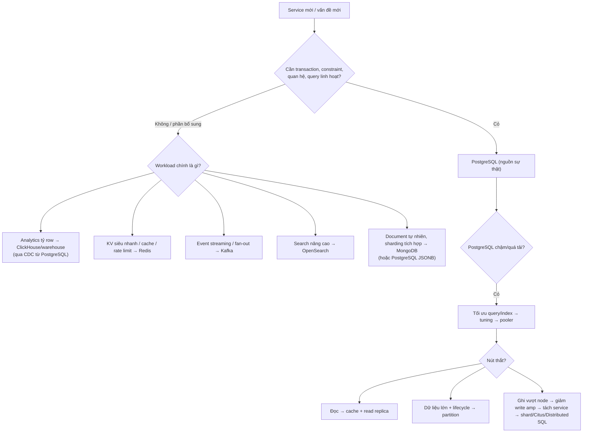

# PART 42 — BACKEND ENGINEER DATABASE DESIGN

> **Trước:** [41 — Database System Design](41-database-system-design.md) · **Tiếp:** [43 — Data Engineer Perspective](43-data-engineer-perspective.md)

Chương này trả lời các câu hỏi "khi nào dùng X" mà backend engineer gặp hàng ngày. Mỗi câu trả lời gồm: **tín hiệu nên dùng**, **tín hiệu chưa nên**, **cái giá**, và **cơ chế** giải thích vì sao.

---

## Mục lục

1. [Khi nào dùng PostgreSQL?](#1-khi-nào-dùng-postgresql)
2. [Khi nào không nên dùng PostgreSQL (hoặc không chỉ PostgreSQL)?](#2-khi-nào-không-nên-dùng-postgresql)
3. [Khi nào thêm Redis?](#3-khi-nào-thêm-redis)
4. [Khi nào thêm read replica?](#4-khi-nào-thêm-read-replica)
5. [Khi nào partition?](#5-khi-nào-partition)
6. [Khi nào shard?](#6-khi-nào-shard)
7. [Khi nào dùng MongoDB?](#7-khi-nào-dùng-mongodb)
8. [Khi nào dùng ClickHouse?](#8-khi-nào-dùng-clickhouse)
9. [Khi nào cần Kafka + CDC?](#9-khi-nào-cần-kafka--cdc)
10. [Decision map tổng hợp](#10-decision-map-tổng-hợp)
11. [Checklist thiết kế database cho một service mới](#11-checklist-thiết-kế-database-cho-một-service-mới)
12. [Interview Questions](#12-interview-questions)
13. [Key Takeaways](#13-key-takeaways)

---

## 1. Khi nào dùng PostgreSQL?

**Mặc định hợp lý cho phần lớn backend service** khi:
- Dữ liệu có quan hệ, cần **transaction ACID**, constraint (unique, FK, check), join, query linh hoạt.
- Quy mô vừa một node lớn + replica (từ vài GB tới vài TB; hàng nghìn–vài chục nghìn TPS tùy workload).
- Cần một hệ thống "làm được nhiều thứ đủ tốt": JSONB (document), full-text search cơ bản, geospatial (PostGIS), time-series (partition/TimescaleDB), vector search (pgvector), queue nhẹ (SKIP LOCKED), pub/sub nhẹ (LISTEN/NOTIFY).
- Team muốn **ít hệ thống phải vận hành**.

**Cơ chế làm nó mạnh:** MVCC (đọc không chặn ghi), planner cost-based, index đa dạng (B-Tree/GIN/GiST/BRIN), WAL cho durability + replication + CDC, hệ sinh thái extension.

---

## 2. Khi nào không nên dùng PostgreSQL?

| Tình huống | Vì sao PostgreSQL không tối ưu | Lựa chọn |
|---|---|---|
| **Analytics trên hàng tỷ row**, aggregate nhiều chiều, latency giây | Row store, không nén cột, không vectorized execution trong core | ClickHouse, BigQuery, Snowflake, DuckDB |
| **Cache/latency < 1ms**, hàng trăm nghìn ops/s key-value | Mỗi query qua parser/planner/executor, process-per-connection | Redis, Memcached |
| **Ghi vượt xa một node**, multi-region active-active | Single primary | Distributed SQL (CockroachDB, YugabyteDB, Spanner), Cassandra, sharding |
| **Queue/event streaming throughput cao**, replay, fan-out nhiều consumer | MVCC churn, không có consumer group/offset | Kafka, Pulsar, RabbitMQ, SQS |
| **Full-text search nâng cao** (relevance tuning, facet, typo tolerance ở quy mô lớn) | FTS của PostgreSQL tốt ở mức vừa | Elasticsearch/OpenSearch, Meilisearch |
| **Blob lớn** (video, ảnh) | TOAST tới 1GB/giá trị nhưng không hiệu quả, backup phình | Object storage (S3) + metadata trong PostgreSQL |
| **Graph traversal sâu** nhiều bước | Recursive CTE ổn cho độ sâu nhỏ | Graph DB (Neo4j) khi traversal là lõi |
| **Update cực nóng một key** (counter toàn cục hàng chục nghìn/s) | Row lock + MVCC tuple mới mỗi update | Redis INCR + flush định kỳ |

"Không nên dùng PostgreSQL" thường nghĩa là **"không chỉ PostgreSQL"**: PostgreSQL vẫn là nguồn sự thật, hệ chuyên dụng là phần bổ sung (qua CDC).

---

## 3. Khi nào thêm Redis?

**Nên:**
- Đọc lặp lại dữ liệu ít đổi (profile, config, catalog) chiếm phần lớn tải DB và chấp nhận stale ngắn.
- Cần cấu trúc dữ liệu đặc thù: rate limiting (counter + TTL), leaderboard (sorted set), session, distributed lock nhẹ (cẩn thận: Redlock có tranh cãi về an toàn), dedup ngắn hạn.
- Counter nóng không cần chính xác tuyệt đối ngay lập tức.

**Chưa nên:**
- Query chậm do thiếu index — sửa query trước.
- Dữ liệu cần consistency mạnh để ra quyết định (số dư, tồn kho cuối cùng) — Redis có thể là tầng phía trước nhưng DB phải là trọng tài.

**Cái giá:** invalidation, stampede, thêm hệ thống vận hành (HA Redis, persistence), eventual consistency, cold cache khi Redis restart → tải dồn DB ([Chương 36 §6](36-scaling.md#6-caching)).

---

## 4. Khi nào thêm read replica?

**Nên:**
- Primary bão hòa bởi **đọc** (không phải ghi) sau khi đã tối ưu query/index/cache.
- Cần HA (replica là điều kiện cho failover) — thường nên có từ đầu cho production quan trọng.
- Tách workload: report, backup, analytics nhẹ ra khỏi primary.

**Chưa nên / không giúp:**
- Primary bão hòa bởi **ghi**.
- App chưa xử lý được read-after-write/stale read.

**Cái giá:** routing, stale read, replication lag, conflict với query dài, chi phí ×N ([Chương 26](26-primary-replica.md)).

---

## 5. Khi nào partition?

**Nên:**
- Table rất lớn (hàng trăm GB–TB) với **lifecycle theo thời gian** (retention → drop partition).
- Query chủ yếu lọc theo partition key (thời gian, tenant).
- Vacuum/index maintenance trên table khổng lồ là vấn đề; dữ liệu cũ bất biến (freeze một lần).

**Chưa nên:**
- Table vài chục GB không có vấn đề vận hành.
- Query không theo một khóa chung; cần unique toàn cục trên cột khác.

**Cái giá:** PK phải chứa partition key, không global index, quản lý partition, overhead khi nhiều partition ([Chương 32](32-partitioning.md)).

---

## 6. Khi nào shard?

**Nên (khi tất cả đều đúng):**
- Ghi hoặc dung lượng vượt khả năng node lớn nhất hợp lý **sau khi** đã: tối ưu, vertical scale, giảm write amplification, partition, tách service.
- Có **shard key tự nhiên** với locality cao (tenant_id, user_id).
- Team chấp nhận vận hành phức tạp (hoặc dùng Citus/managed).

**Chưa nên:**
- "Để sẵn sàng cho tương lai" — chi phí trả ngay, lợi ích có thể không bao giờ đến.
- Chưa có shard key tốt (phần lớn query sẽ fan-out).

**Cái giá:** mất transaction/FK/join/unique toàn cục, resharding, global ID, vận hành ×N ([Chương 33](33-sharding.md)).

---

## 7. Khi nào dùng MongoDB?

**Có thể phù hợp khi:**
- Dữ liệu **tự nhiên là document** lồng nhau, được đọc/ghi **nguyên khối** theo một id, schema thay đổi thường xuyên giữa các loại entity (CMS, catalog với thuộc tính rất khác nhau, event payload).
- Cần **sharding tích hợp** (mongos, chunk balancing) sẵn có mà không muốn tự xây.
- Team và hệ sinh thái đã quen MongoDB.

**Cân nhắc với PostgreSQL:** JSONB + GIN index đáp ứng phần lớn nhu cầu document **cùng với** transaction/constraint/join khi cần. Nếu dữ liệu có quan hệ và cần integrity (đơn hàng, thanh toán), PostgreSQL thường phù hợp hơn. MongoDB có multi-document transaction (4.0+), nhưng mô hình dữ liệu nên được thiết kế để phần lớn thao tác là single-document (nguyên tử tự nhiên).

**Cái giá:** schema-on-read (application xử lý mọi phiên bản document), join hạn chế ($lookup), consistency phụ thuộc read/write concern cấu hình.

---

## 8. Khi nào dùng ClickHouse?

**Nên:**
- Analytics/OLAP: aggregate trên hàng trăm triệu – hàng tỷ row với latency giây; dashboard; log/event analytics; time-series lớn.
- Dữ liệu **append-mostly**, ít update/delete từng row.
- Cần nén cao (thường 5–20×) để lưu lịch sử dài.

**Cơ chế:** column store (chỉ đọc cột cần), nén theo cột, vectorized execution, MergeTree (sắp theo primary key, sparse index, merge nền), song song mạnh.

**Không nên:** OLTP (point update/delete, transaction đa row, unique constraint), dữ liệu cần consistency mạnh từng row.

**Mẫu kết hợp:** PostgreSQL (OLTP) → CDC → Kafka → ClickHouse (OLAP).

---

## 9. Khi nào cần Kafka + CDC?

**Nên:**
- Nhiều hệ thống downstream cần **mọi thay đổi** của PostgreSQL: search index, cache invalidation, warehouse, microservice khác.
- Cần **outbox pattern** đáng tin (sự kiện phát ra nguyên tử với thay đổi DB) mà không polling.
- Cần replay lịch sử thay đổi, tách producer/consumer, backpressure.
- Tránh **dual-write** (app ghi DB rồi ghi Kafka — một trong hai có thể thất bại → không nhất quán).

**Cơ chế:** logical decoding đọc WAL từ replication slot → Debezium chuyển thành event → Kafka ([Chương 43](43-data-engineer-perspective.md)).

**Chưa nên:** chỉ một consumer đơn giản, volume nhỏ → poller đọc outbox table có thể đủ.

**Cái giá:** replication slot (rủi ro disk full nếu connector chết), vận hành Kafka/Connect, schema evolution, at-least-once (consumer idempotent), `wal_level = logical`.

---

## 10. Decision map tổng hợp

**Cách đọc diagram:** Bắt đầu với PostgreSQL làm nguồn sự thật cho dữ liệu nghiệp vụ; thêm hệ chuyên dụng cho workload mà PostgreSQL không tối ưu, **nối qua CDC** thay vì dual-write. Khi PostgreSQL chậm, luôn đi từ tối ưu → pooler → rồi mới tới replica/partition/shard theo đúng loại nút thắt.

---

## 11. Checklist thiết kế database cho một service mới

**Data model**
- [ ] Entity, key (bigint identity hoặc UUIDv7), cardinality, bất biến → constraint.
- [ ] Tiền: integer minor unit hoặc numeric; không float.
- [ ] Thời gian: `timestamptz`.
- [ ] Index cho FK con; index theo query thực.
- [ ] Soft delete? (partial unique index).

**Transaction & concurrency**
- [ ] Ranh giới transaction nhỏ nhất đảm bảo bất biến; không I/O ngoài trong transaction.
- [ ] Idempotency key cho API ghi.
- [ ] Chiến lược chống lost update (atomic update / FOR UPDATE / version).
- [ ] Thứ tự khóa nhất quán; retry cho 40001/40P01.

**Vận hành**
- [ ] Pool size, pooler, timeouts (`statement_timeout`, `idle_in_transaction_session_timeout`, `lock_timeout` cho migration).
- [ ] Migration zero-downtime (CONCURRENTLY, NOT VALID, lock_timeout).
- [ ] Volume dự kiến 1–3 năm → partition/retention.
- [ ] Autovacuum per-table cho table nóng; fillfactor cho table update nhiều.
- [ ] Giám sát: pg_stat_statements, horizon, bloat, lag, slot, disk, XID age.

**Độ tin cậy**
- [ ] HA (replica + failover tooling), RPO/RTO rõ ràng.
- [ ] Backup + PITR + restore test.
- [ ] Sự kiện ra ngoài qua outbox/CDC, consumer idempotent.

---

## 12. Interview Questions

**Q1. Khi nào bạn chọn PostgreSQL và khi nào không?**
- *Short:* Mặc định cho dữ liệu quan hệ cần ACID/constraint/query linh hoạt; không cho OLAP tỷ row (column store), cache sub-ms (Redis), streaming (Kafka), ghi vượt node (distributed/shard) — thường là bổ sung, không thay thế.

**Q2. Primary quá tải. Thêm replica, thêm Redis, hay shard?**
- *Short:* Tùy nút thắt: đọc → cache/replica; ghi → giảm write amplification, tách, cuối cùng shard; trước hết tối ưu query.

**Q3. Tại sao không dual-write DB và Kafka?**
- *Short:* Không nguyên tử: một bên thành công, bên kia thất bại → lệch; dùng outbox + CDC.

**Q4. PostgreSQL JSONB vs MongoDB?**
- *Short:* JSONB đủ cho document trong hệ quan hệ, có transaction/constraint/join; MongoDB khi document là mô hình chính, cần sharding tích hợp, schema rất linh hoạt.

---

## 13. Key Takeaways

1. PostgreSQL là **nguồn sự thật mặc định** cho dữ liệu nghiệp vụ; hệ khác là **bổ sung** cho workload chuyên biệt.
2. Redis cho cache/cấu trúc đặc thù; ClickHouse cho OLAP; Kafka + CDC cho phân phối thay đổi; MongoDB khi document là mô hình tự nhiên.
3. Replica scale đọc, partition quản lý dữ liệu lớn, shard scale ghi — chọn theo **nút thắt thật**.
4. Không dual-write; dùng outbox/CDC; consumer idempotent.
5. Checklist: constraint, transaction ngắn, idempotency, timeouts, migration an toàn, retention, giám sát, HA, PITR.

---

## Nguồn tham khảo

- PostgreSQL Docs — *JSON Types*, *Full Text Search*, *Table Partitioning*.
- ClickHouse Docs — *MergeTree*, *Why ClickHouse is fast*.
- Debezium Docs — *PostgreSQL connector*, *Outbox Event Router*.
- Martin Kleppmann, *Designing Data-Intensive Applications*, chương 11–12 (derived data, unbundling databases).
