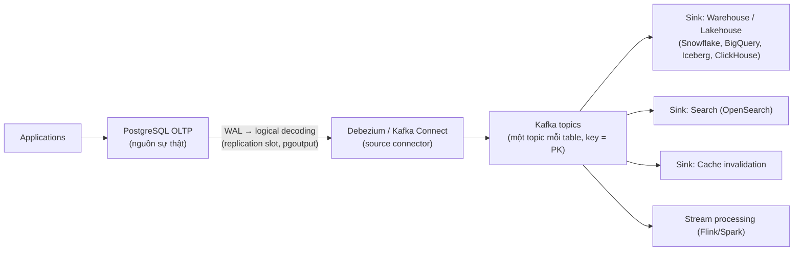
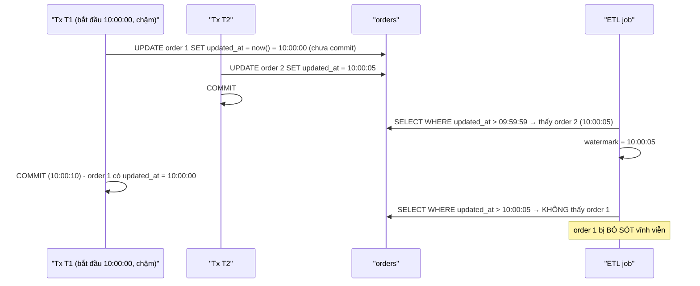
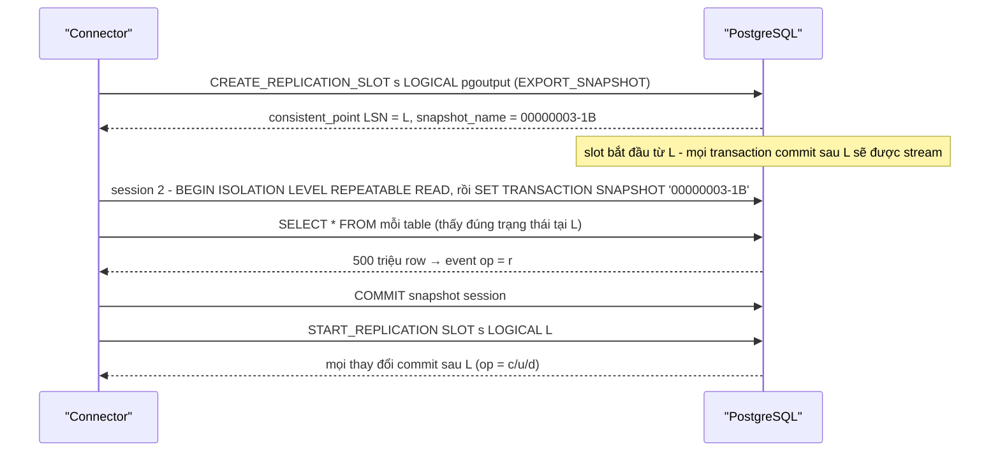
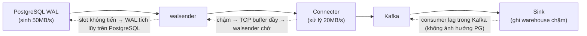

# PART 43 — DATA ENGINEER PERSPECTIVE

> **Trước:** [42 — Backend Database Design](42-backend-database-design.md) · **Tiếp:** [44 — Common Myths](44-common-myths.md)

Với data engineer, PostgreSQL thường là **nguồn (source)** của pipeline: dữ liệu nghiệp vụ phải được đưa sang warehouse/lake/search/cache **đầy đủ, đúng thứ tự, không làm hại OLTP**. Chương này giải thích các cách trích xuất, vì sao **CDC dựa trên WAL** là cách đúng cho phần lớn trường hợp, và các cơ chế/bẫy của nó.

---

## Mục lục

1. [PostgreSQL trong data pipeline](#1-postgresql-trong-data-pipeline)
2. [Ba cách trích xuất thay đổi](#2-ba-cách-trích-xuất-thay-đổi)
3. [Incremental load dựa trên query — và các bẫy](#3-incremental-load-dựa-trên-query)
4. [CDC dựa trên WAL (logical decoding)](#4-cdc-dựa-trên-wal)
5. [Snapshot + CDC: khởi tạo nhất quán](#5-snapshot--cdc)
6. [Replication slot trong CDC](#6-replication-slot-trong-cdc)
7. [Schema evolution](#7-schema-evolution)
8. [Backpressure](#8-backpressure)
9. [At-least-once, exactly-once (conceptual)](#9-at-least-once-exactly-once)
10. [Transactional outbox](#10-transactional-outbox)
11. [WHAT HAPPENS IF...](#11-what-happens-if)
12. [COMMON MISUNDERSTANDINGS](#12-common-misunderstandings)
13. [INTERVIEW QUESTIONS](#13-interview-questions)
14. [KEY TAKEAWAYS](#14-key-takeaways)

---

## 1. PostgreSQL trong data pipeline



**Cách đọc diagram (trái sang phải):** Ứng dụng chỉ ghi vào PostgreSQL. Mọi thay đổi được **đọc từ WAL** (không phải polling table), chuyển thành event theo từng row, đẩy vào Kafka với **key = primary key** (giữ thứ tự theo row trong một partition Kafka). Các sink độc lập tiêu thụ theo tốc độ của mình. PostgreSQL không cần biết có bao nhiêu hệ thống downstream.

---

## 2. Ba cách trích xuất thay đổi

| Cách | Cơ chế | Bắt DELETE? | Thứ tự/đầy đủ | Tải lên nguồn | Độ trễ |
|---|---|---|---|---|---|
| **Query-based** (polling) | `SELECT ... WHERE updated_at > :watermark` | **Không** (trừ soft delete) | Có thể **bỏ sót** (mục 3) | Query định kỳ, có thể nặng | Phút |
| **Trigger-based** | Trigger ghi mọi thay đổi vào audit table | Có | Tốt | **Mỗi ghi tốn thêm một insert** (write amplification) | Giây |
| **Log-based (CDC từ WAL)** | Logical decoding từ replication slot | **Có** | **Đầy đủ, theo thứ tự commit** | Thấp (đọc WAL) nhưng cần slot, `wal_level = logical` | Giây, sub-giây |

---

## 3. Incremental load dựa trên query

### 3.1 Timestamp watermark: `updated_at > last_max`



**Cách đọc diagram:** `now()` trong PostgreSQL là **thời điểm bắt đầu transaction**, không phải lúc commit. Transaction dài commit **sau** khi ETL đã đọc qua mốc thời gian đó → row có `updated_at` nhỏ hơn watermark → bị bỏ sót. MVCC đảm bảo ETL không thấy dữ liệu chưa commit — chính điều đó gây bỏ sót.

**Các bẫy khác:**
- **DELETE không bị bắt** (row biến mất); cần soft delete hoặc đối soát định kỳ.
- `updated_at` do app đặt → có code path quên cập nhật; clock skew giữa app server.
- Không có index trên `updated_at` → full scan mỗi lần; có index → cột bị update liên tục → **phá HOT** ([Chương 24](24-hot-update.md)).
- Nhiều update giữa hai lần poll → chỉ thấy trạng thái cuối (mất lịch sử trung gian).

**Giảm thiểu nếu buộc dùng:** watermark lùi một khoảng an toàn (overlap window, ví dụ 10 phút) + dedup ở đích; hoặc watermark bằng thời điểm bắt đầu của transaction cũ nhất đang chạy.

### 3.2 ID watermark: `id > last_max_id`

Chỉ bắt INSERT; và **sequence không đảm bảo thứ tự commit**: transaction lấy id 101 commit sau transaction lấy id 102 → ETL đọc 102, watermark = 102, bỏ sót 101. Cùng lớp vấn đề.

### 3.3 Khi nào query-based vẫn ổn

Snapshot đầy đủ theo ngày cho table nhỏ; dữ liệu append-only với cửa sổ chồng lấn + dedup; báo cáo không cần chính xác từng row.

---

## 4. CDC dựa trên WAL

### 4.1 HOW (nhắc lại cơ chế — [Chương 25 §8](25-replication.md#8-concept-logical-decoding))

1. `wal_level = logical`.
2. Connector tạo **logical replication slot** (plugin `pgoutput` — built-in; hoặc wal2json/decoderbufs) và (với pgoutput) một **publication** chọn table.
3. Walsender đọc WAL từ `restart_lsn` của slot → **reorder buffer** gom theo transaction → **phát theo thứ tự commit**, chỉ transaction đã commit.
4. Connector chuyển mỗi row change thành event; ghi vào Kafka; **xác nhận LSN** đã xử lý (flush) → slot tiến `confirmed_flush_lsn` → PostgreSQL được phép giải phóng WAL cũ.

### 4.2 Nội dung một event (kiểu Debezium)

```json
{
  "op": "u",
  "before": { "id": 42, "status": "pending", "amount": 100 },
  "after":  { "id": 42, "status": "paid",    "amount": 100 },
  "source": { "lsn": 24023128, "txId": 5012, "ts_ms": 1717228800123, "table": "orders" },
  "ts_ms": 1717228800456
}
```

- `op`: `c` (insert), `u`, `d`, `r` (read — từ snapshot).
- `before`: chỉ có đủ nếu **REPLICA IDENTITY FULL**; với DEFAULT chỉ có cột PK (hoặc null nếu PK không đổi).
- `source.lsn`, `txId`: dùng để sắp thứ tự/dedup ở đích.
- DELETE → event `d` + (tùy cấu hình) **tombstone** (key, value null) cho Kafka log compaction.

### 4.3 TOAST và "giá trị không đổi"

Khi UPDATE không đổi một cột lớn đã TOAST, WAL **không chứa** giá trị cột đó (chỉ chứa TOAST pointer không đổi) → logical decoding **không gửi** giá trị → Debezium đặt placeholder `__debezium_unavailable_value`. Sink phải hiểu "giữ nguyên giá trị cũ". Giải pháp: `REPLICA IDENTITY FULL` (WAL chứa cả tuple cũ — tăng WAL), hoặc xử lý placeholder ở sink.

### 4.4 Transaction boundaries và thứ tự

- Event được phát theo **thứ tự commit** của transaction; trong một transaction theo thứ tự thay đổi.
- Kafka partition theo PK → thứ tự **mỗi row** được giữ; thứ tự **giữa các row/table** không được giữ ở consumer song song. Debezium có topic **transaction metadata** (BEGIN/END kèm số event) để sink tái dựng ranh giới transaction nếu cần.
- **Transaction lớn**: decoding chỉ phát khi commit → độ trễ bằng thời gian transaction + spill ra disk (`logical_decoding_work_mem`); PG 14+ stream transaction đang chạy (pgoutput với `streaming`), connector phải hỗ trợ.

---

## 5. Snapshot + CDC

### 5.1 Vấn đề

Kafka rỗng, table có 500 triệu row. Cần: **toàn bộ dữ liệu hiện có** + **mọi thay đổi sau đó**, **không trùng, không thiếu**. Nếu snapshot (SELECT *) và stream (từ slot) không ăn khớp tại cùng một điểm, sẽ có khoảng hở hoặc trùng lặp.

### 5.2 Cơ chế: exported snapshot tại điểm nhất quán của slot



**Cách đọc diagram:** Khi tạo slot, PostgreSQL trả về **điểm nhất quán L** và **export một snapshot** tương ứng chính xác với L. Snapshot session đọc dữ liệu "như tại L"; streaming bắt đầu **đúng từ L** → mọi transaction hoặc nằm trong snapshot (commit trước L) hoặc nằm trong stream (commit sau L) — **không thiếu, không trùng**. Trong lúc snapshot chạy (có thể hàng giờ), slot giữ WAL từ L và snapshot session giữ **xmin horizon** → bloat trên nguồn (chạy trên thời điểm thấp tải, hoặc snapshot từ replica với logical decoding trên standby PG 16+).

### 5.3 Incremental snapshot (watermark-based)

Snapshot một lần cho table khổng lồ quá dài và không thể dừng/tiếp tục. Debezium hỗ trợ **incremental snapshot** (dựa trên thuật toán DBLog của Netflix): đọc table theo **chunk** (theo PK), xen kẽ với streaming, dùng **watermark** (ghi vào signaling table → xuất hiện trong WAL) để loại bỏ row trong chunk đã bị thay đổi bởi stream trong khoảng đọc chunk. Cho phép snapshot lại một table bất kỳ lúc nào mà không dừng streaming, có thể tạm dừng/tiếp tục.

---

## 6. Replication slot trong CDC

| Rủi ro | Cơ chế | Phòng |
|---|---|---|
| **Disk full trên nguồn** | Connector dừng/chậm → `restart_lsn` đứng yên → WAL tích lũy | Cảnh báo retained WAL; `max_slot_wal_keep_size`; PG 18 `idle_replication_slot_timeout`; xóa slot của connector đã bỏ |
| **Catalog bloat** | `catalog_xmin` giữ tuple catalog cũ | Như trên |
| **WAL tích lũy dù connector "khỏe"** | Database có ghi **ở table không nằm trong publication** (hoặc database khác cùng cluster) → WAL tăng, nhưng slot không có event nào để xác nhận → `confirmed_flush_lsn` không tiến | **Heartbeat**: connector định kỳ ghi vào một heartbeat table có trong publication (Debezium `heartbeat.interval.ms` + `heartbeat.action.query`) để có event mà xác nhận LSN |
| **Failover primary** | Trước PG 17, logical slot không có trên standby → mất vị trí → phải snapshot lại | PG 17 **failover slots** (`failover = true`, `sync_replication_slots` trên standby); hoặc HA tool đồng bộ slot (Patroni permanent slots) |
| **Slot bị invalidate** (vượt max_slot_wal_keep_size) | Connector không thể tiếp tục | Snapshot lại; cảnh báo sớm hơn ngưỡng |

---

## 7. Schema evolution

### 7.1 Logical decoding và DDL

DDL **không** được phát như event trong logical decoding. Với pgoutput, trước các thay đổi của một table, walsender gửi message **Relation** mô tả **cấu trúc hiện tại** (cột, kiểu, replica identity) — connector cập nhật schema từ đó. Historic snapshot đảm bảo mỗi row change được giải mã theo schema **tại thời điểm thay đổi**.

### 7.2 Loại thay đổi và tác động downstream

| Thay đổi | Nguồn (PostgreSQL) | Downstream (Kafka + schema registry + warehouse) |
|---|---|---|
| **ADD COLUMN nullable / có default** | Metadata-only (PG 11+) | Tương thích ngược (Avro backward compatible nếu field có default) |
| **DROP COLUMN** | Metadata-only | Consumer cũ có thể vỡ; cần deprecate trước |
| **RENAME COLUMN** | Metadata-only | = drop + add với downstream → mất liên tục dữ liệu cột |
| **ALTER TYPE** | Có thể rewrite | Có thể không tương thích |
| **Thêm table** | | Thêm vào publication (hoặc `FOR ALL TABLES`) + snapshot table mới |

### 7.3 Nguyên tắc

- **Expand/contract**: thêm cột mới → deploy consumer hiểu cả hai → chuyển ghi → ngừng dùng cột cũ → drop sau cùng.
- **Schema registry** với chế độ compatibility (BACKWARD/FORWARD/FULL) để chặn thay đổi phá vỡ.
- Hợp đồng dữ liệu (data contract) giữa team nguồn và team dữ liệu; review migration có ảnh hưởng CDC.

---

## 8. Backpressure



**Cách đọc diagram:** Nếu **connector** chậm hơn tốc độ sinh WAL, áp lực dồn ngược về PostgreSQL qua slot (WAL tích lũy — nguy hiểm cho nguồn). Nếu **sink** chậm, Kafka hấp thụ (consumer lag) — PostgreSQL không bị ảnh hưởng. Đây là lý do đặt **Kafka làm buffer** giữa nguồn và sink chậm, và giữ connector (đọc WAL → Kafka) nhanh, đơn giản, không phụ thuộc sink.

Theo dõi: `pg_wal_lsn_diff(pg_current_wal_lsn(), confirmed_flush_lsn)` của slot; consumer lag trong Kafka.

---

## 9. At-least-once, exactly-once

### 9.1 CDC là at-least-once

Connector ghi event vào Kafka rồi mới xác nhận LSN với PostgreSQL. Crash giữa hai bước → khởi động lại từ LSN đã xác nhận cuối → **gửi lại** một số event. Nếu làm ngược lại (xác nhận trước) → có thể **mất** event. CDC chọn **không mất, có thể trùng**.

### 9.2 Exactly-once ở mức conceptual

**Exactly-once processing = at-least-once delivery + idempotent/deduplicated application.**

| Kỹ thuật ở sink | Cơ chế |
|---|---|
| **Upsert theo PK** | Áp event trùng lần hai cho cùng kết quả (với event cùng phiên bản) |
| **So sánh phiên bản/LSN** | Chỉ áp nếu `event.lsn > stored.lsn` → loại event trùng và event đến muộn (out-of-order) |
| **Dedup table** | Lưu `(source_lsn, txId, table, pk)` đã xử lý |
| **Transaction ở sink** | Ghi kết quả + offset trong cùng transaction (sink là DB) |
| **Kafka transactions (EOS)** | Exactly-once trong phạm vi Kafka → Kafka (read-process-write); không tự mở rộng tới hệ ngoài |

DELETE: sink phải áp dụng xóa (hoặc soft delete) — và event xóa đến trùng phải vô hại.

---

## 10. Transactional outbox

Khi service muốn phát **sự kiện nghiệp vụ** (không phải thay đổi row thô), dùng outbox:

```sql
BEGIN;
UPDATE orders SET status = 'paid' WHERE id = 42;
INSERT INTO outbox (aggregate_type, aggregate_id, type, payload)
VALUES ('order', '42', 'OrderPaid', '{"orderId":42,"amount":100}');
COMMIT;
```

CDC đọc **table outbox** từ WAL (Debezium Outbox Event Router định tuyến theo `aggregate_type` → topic, key = `aggregate_id`). Ưu điểm: sự kiện phát ra **nguyên tử** với thay đổi nghiệp vụ; schema sự kiện độc lập schema table; outbox có thể xóa ngay sau insert (event đã nằm trong WAL) hoặc dọn theo partition.

---

## 11. WHAT HAPPENS IF...

| Tình huống | Hệ quả |
|---|---|
| **Connector chết cuối tuần** | Slot giữ WAL → disk nguồn đầy → PANIC (nếu không giới hạn) |
| **Primary failover (PG < 17, không đồng bộ slot)** | Slot mất → CDC phải snapshot lại; có thể mất/trùng event quanh thời điểm failover |
| **DROP COLUMN ở nguồn** | Consumer mong đợi cột → lỗi/NULL; schema registry chặn nếu vi phạm compatibility |
| **Bulk UPDATE 100 triệu row** | 100 triệu event; transaction lớn → spill/stream; Kafka + sink quá tải; lag lớn |
| **REPLICA IDENTITY DEFAULT, sink cần before image** | `before` thiếu cột → không làm được SCD/audit đầy đủ |
| **Table không có PK** | UPDATE/DELETE trên nguồn **lỗi** khi table trong publication (với publish update/delete) cho tới khi đặt replica identity |
| **Database ít ghi, không heartbeat** | WAL tích lũy vì slot không tiến |
| **Snapshot ban đầu 20 giờ** | Giữ horizon → bloat nguồn; nên dùng incremental snapshot hoặc snapshot từ standby |

---

## 12. COMMON MISUNDERSTANDINGS

1. **"`updated_at > watermark` là incremental load đáng tin."** — Bỏ sót do transaction commit muộn, không bắt DELETE.
2. **"CDC là exactly-once."** — At-least-once; exactly-once cần idempotency ở sink.
3. **"CDC không ảnh hưởng database nguồn."** — Slot giữ WAL và catalog_xmin; snapshot giữ horizon; wal_level logical tăng WAL.
4. **"Logical decoding gửi DDL."** — Không; chỉ Relation message mô tả schema hiện tại.
5. **"Kafka giữ thứ tự toàn cục."** — Chỉ trong một partition (theo key).
6. **"Dual-write DB + Kafka trong code là đủ."** — Không nguyên tử; outbox/CDC.

---

## 13. INTERVIEW QUESTIONS

**Q1. Tại sao dùng CDC dựa trên WAL thay vì query `updated_at`?**
- *Short:* WAL chứa mọi thay đổi đã commit theo thứ tự commit, kể cả DELETE; query-based bỏ sót do transaction commit muộn (now() = thời điểm bắt đầu tx), không bắt delete, tốn tải.

**Q2. Làm sao snapshot ban đầu và stream không trùng không thiếu?**
- *Short:* Tạo slot với exported snapshot tại consistent point; đọc snapshot bằng snapshot đó; stream từ LSN đó. Hoặc incremental snapshot với watermark.

**Q3. Replication slot gây rủi ro gì? Phòng thế nào?**
- *Short:* WAL tích lũy/disk full, catalog bloat; giám sát, max_slot_wal_keep_size, idle_replication_slot_timeout, heartbeat, failover slots.

**Q4. Exactly-once trong CDC pipeline?**
- *Short:* Không có exactly-once delivery; at-least-once + upsert theo PK + so LSN/dedup ở sink.

**Q5. Xử lý schema evolution thế nào?**
- *Short:* Expand/contract, schema registry compatibility, thêm cột nullable/default, tránh rename/drop đột ngột, phối hợp migration với team dữ liệu.

**Q6. (Senior) Database nguồn disk tăng dù connector báo "running". Vì sao?**
- *Short:* Slot không tiến vì không có event trong table được capture (ghi vào table khác/database khác) → cần heartbeat; hoặc connector bị backpressure.

---

## 14. KEY TAKEAWAYS

1. PostgreSQL là **source of truth**; pipeline nên đọc **WAL** (logical decoding) thay vì polling.
2. Query-based incremental load **bỏ sót** (now() là thời điểm bắt đầu tx; sequence không theo thứ tự commit) và không bắt DELETE.
3. CDC: slot + pgoutput + publication → event theo **thứ tự commit**, có before/after (phụ thuộc REPLICA IDENTITY), TOAST không đổi có thể thiếu.
4. **Snapshot + CDC** khớp nhau qua exported snapshot tại consistent point; incremental snapshot cho table lớn.
5. Slot là rủi ro vận hành số một: WAL/disk, catalog_xmin, heartbeat, failover slots (PG 17).
6. Backpressure: Kafka làm buffer để sink chậm không dồn áp lực về PostgreSQL.
7. **At-least-once + idempotent sink = exactly-once processing.** Outbox cho sự kiện nghiệp vụ.

---

## Nguồn tham khảo

- PostgreSQL Docs — *Logical Decoding* (Concepts, Exported Snapshots, Streaming Replication Protocol Interface): https://www.postgresql.org/docs/current/logicaldecoding.html
- PostgreSQL Docs — *Logical Replication Protocol Messages* (Relation message).
- Debezium Documentation — *PostgreSQL Connector*, *Incremental snapshots*, *Outbox Event Router*: https://debezium.io/documentation/
- Andreas Andreakis & Ioannis Papapanagiotou, *DBLog: A Watermark Based Change-Data-Capture Framework* (Netflix, 2019/2020).
- Martin Kleppmann, *Designing Data-Intensive Applications*, chương 11.
