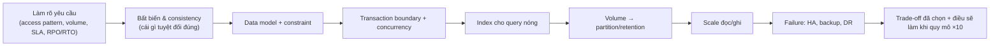

# PART 45 — INTERVIEW HANDBOOK

> **Trước:** [44 — Common Myths](44-common-myths.md) · **Tiếp:** [46 — End-to-End Database Story](46-end-to-end-database-story.md)

Câu hỏi được xếp theo cấp độ **Junior → Middle → Senior → Staff/Architect**. Mỗi câu gồm:
- **Short answer** — trả lời trong 30–60 giây;
- **Deep answer** — khi người phỏng vấn đào sâu (kèm chương tham chiếu);
- **Follow-ups** — câu hỏi tiếp theo thường gặp.

Mẹo chung: câu trả lời tốt đi theo chuỗi **cơ chế → hệ quả → trade-off → kinh nghiệm production**. Tránh các câu mơ hồ như "database tự tối ưu".

---

## Mục lục

- [Level 1 — Junior](#level-1--junior)
- [Level 2 — Middle](#level-2--middle)
- [Level 3 — Senior](#level-3--senior)
- [Level 4 — Staff / Architect](#level-4--staff--architect)
- [Cách trả lời câu hỏi thiết kế](#cách-trả-lời-câu-hỏi-thiết-kế)

---

## Level 1 — Junior

### J1. Primary key khác unique constraint thế nào?
- **Short:** PK = UNIQUE + NOT NULL, tối đa một mỗi table, là định danh chính; UNIQUE có thể nhiều, cho phép NULL (mặc định nhiều NULL không vi phạm).
- **Deep:** Cả hai được hiện thực bằng unique B-Tree index; PostgreSQL heap không sắp theo PK (không clustered). PK là mặc định cho replica identity của logical replication ([Ch 01](01-relational-database.md#6-keys)).
- **Follow-ups:** `NULLS NOT DISTINCT` là gì? Tại sao nên có PK trên mọi table?

### J2. Index là gì và tại sao làm query nhanh?
- **Short:** Cấu trúc phụ (thường B-Tree) ánh xạ giá trị → vị trí row, cho phép tìm trong O(log N) thay vì quét toàn table.
- **Deep:** B-Tree fanout hàng trăm → 3–4 level cho hàng tỷ key; index trả TID, executor đọc heap và kiểm tra visibility ([Ch 15](15-index-internals.md)).
- **Follow-ups:** Index có làm chậm gì không? Khi nào không dùng index?

### J3. WHERE khác HAVING thế nào?
- **Short:** WHERE lọc row trước GROUP BY; HAVING lọc nhóm sau aggregate.
- **Deep:** Thứ tự logic FROM → WHERE → GROUP BY → HAVING → SELECT → ORDER BY → LIMIT; điều kiện không chứa aggregate nên đặt ở WHERE để lọc sớm ([Ch 03](03-sql.md#phần-a--logical-query-processing-order)).
- **Follow-ups:** Tại sao không dùng alias SELECT trong WHERE?

### J4. INNER JOIN vs LEFT JOIN?
- **Short:** INNER chỉ giữ cặp khớp; LEFT giữ mọi row trái, không khớp thì cột phải là NULL.
- **Deep:** Điều kiện trên bảng phải đặt ở WHERE biến LEFT thành INNER (outer join reduction). Logical join khác physical join (NL/Hash/Merge) ([Ch 03 §C](03-sql.md#phần-c--join)).
- **Follow-ups:** EXISTS vs JOIN? Semi/anti join là gì?

### J5. Transaction và ACID là gì?
- **Short:** Transaction là đơn vị công việc nguyên tử; ACID: Atomicity, Consistency, Isolation, Durability.
- **Deep:** PostgreSQL: A qua XID + CLOG; C qua constraint; I qua MVCC + lock + SSI; D qua WAL fsync ([Ch 10](10-acid.md)).
- **Follow-ups:** Isolation level mặc định của PostgreSQL? (Read Committed.)

### J6. DELETE vs TRUNCATE vs DROP?
- **Short:** DELETE xóa theo row (đánh dấu, có WHERE); TRUNCATE xóa toàn bộ bằng file mới (nhanh, lock nặng); DROP xóa cả table.
- **Deep:** DELETE để lại dead tuple cần VACUUM; TRUNCATE đổi relfilenode, ACCESS EXCLUSIVE, không MVCC-safe, rollback được trong PostgreSQL ([Ch 03 §J.4](03-sql.md#j4-truncate)).
- **Follow-ups:** Xóa 100 triệu row cũ hiệu quả thế nào? (Partition + drop.)

### J7. Normalization là gì? Tại sao cần?
- **Short:** Tổ chức dữ liệu để mỗi sự thật lưu một lần, tránh update/insert/delete anomaly.
- **Deep:** Dựa trên functional dependency; 1NF/2NF/3NF/BCNF; trong PostgreSQL redundancy còn khuếch đại write qua MVCC ([Ch 02](02-data-modeling.md)).
- **Follow-ups:** Khi nào denormalize?

### J8. NULL hoạt động thế nào trong SQL?
- **Short:** NULL là "không biết"; so sánh với NULL cho UNKNOWN; dùng `IS NULL`.
- **Deep:** Three-valued logic; `NOT IN` với NULL trả rỗng và không thành anti join; COUNT(col) bỏ NULL ([Ch 01 §9](01-relational-database.md#9-null-và-logic-ba-giá-trị)).

### J9. N+1 query problem là gì?
- **Short:** Lấy N row rồi chạy thêm một query cho mỗi row → N+1 round-trip.
- **Deep:** Mỗi query có chi phí network + parse/plan; gộp bằng JOIN/`IN`/`= ANY($1)` hoặc batch loading; mỗi query nhanh nhưng tổng chậm.

### J10. Tại sao OFFSET lớn chậm?
- **Short:** Phải tạo và bỏ đi OFFSET row; dùng keyset pagination.
- **Deep:** B-Tree không hỗ trợ nhảy theo vị trí; keyset `WHERE (created_at, id) < (...) ORDER BY ... LIMIT` có chi phí hằng số ([Ch 03 §B.4](03-sql.md#b4-limit-offset--và-tại-sao-offset-lớn-chậm)).

### J11. Connection pool dùng để làm gì?
- **Short:** Tái sử dụng connection mở sẵn thay vì mở mới mỗi request.
- **Deep:** Mỗi connection PostgreSQL là một process (fork, auth, memory); nhiều connection active gây contention → pool nhỏ + PgBouncer ([Ch 37](37-connection-management.md)).

### J12. EXPLAIN dùng để làm gì?
- **Short:** Xem plan planner chọn (scan/join/sort) và chi phí ước lượng; EXPLAIN ANALYZE chạy thật và đo.
- **Deep:** cost=startup..total, rows, width; actual time per loop × loops; Buffers ([Ch 18](18-explain-analyze.md)).

---

## Level 2 — Middle

### M1. How does MVCC work? (MVCC hoạt động thế nào?)
- **Short:** Mỗi row có nhiều version (tuple) với xmin (tx tạo) và xmax (tx xóa/thay). Mỗi transaction có snapshot (xmin, xmax, danh sách XID đang chạy). Visibility rules chọn version phù hợp → đọc không chặn ghi.
- **Deep:** UPDATE = xmax trên cũ + tuple mới; DELETE = xmax. Visibility: "người tạo có hiệu lực với snapshot?" và "người xóa có hiệu lực?"; trạng thái commit từ CLOG, cache bằng hint bits. RC chụp snapshot mỗi câu, RR một lần. Version cũ được VACUUM dọn khi vượt xmin horizon ([Ch 11](11-mvcc.md)).
- **Follow-ups:** So với InnoDB? A đọc, B update commit, A đọc lại — A thấy gì ở RC/RR? Long transaction ảnh hưởng gì?

### M2. Why is PostgreSQL UPDATE expensive? (Tại sao UPDATE đắt?)
- **Short:** UPDATE không ghi đè: ghi cả tuple mới, đánh dấu tuple cũ, và (nếu không HOT) thêm entry vào **mọi** index; tạo dead tuple cần VACUUM.
- **Deep:** Write amplification: heap write + N index insert + WAL (có FPI sau checkpoint) + VM update; sau đó vacuum phải dọn heap và quét mọi index. HOT tránh index write khi không đổi cột được index và vừa cùng page (fillfactor). PG 13/14 dedup + bottom-up deletion giảm index bloat ([Ch 07 §7](07-read-write-behavior.md#7-write-amplification), [Ch 24](24-hot-update.md)).
- **Follow-ups:** Làm sao giảm chi phí UPDATE? Index trên `updated_at` gây gì?

### M3. Why does PostgreSQL need VACUUM?
- **Short:** Vì MVCC để version cũ trong heap; VACUUM thu hồi dead tuple, dọn index, cập nhật VM/FSM, và freeze XID để tránh wraparound.
- **Deep:** InnoDB dọn qua purge undo log; PostgreSQL không có undo nên phải quét heap/index. Autovacuum theo ngưỡng 50 + 20%; cost-based throttling; bị chặn bởi xmin horizon ([Ch 23](23-vacuum.md)).
- **Follow-ups:** Plain VACUUM vs FULL? Autovacuum chạy mà dead tuple không giảm — vì sao?

### M4. Why can adding an index slow down INSERT?
- **Short:** Mỗi INSERT phải chèn vào mọi index: descend B-Tree, có thể split page, sinh WAL; unique index kiểm tra trùng (có thể chờ).
- **Deep:** Index ngẫu nhiên (UUIDv4) làm working set = toàn index → cache miss, split rải rác, FPI; GIN insert càng đắt (pending list); index cũng làm UPDATE mất HOT ([Ch 15 §2.3](15-index-internals.md#23-chi-phí--index-không-miễn-phí)).
- **Follow-ups:** Làm sao tìm index không dùng? Bulk load nên xử lý index thế nào?

### M5. Why can a query ignore an index?
- **Short:** Planner ước lượng seq scan rẻ hơn (lấy nhiều row, table nhỏ, correlation thấp), hoặc index không dùng được (hàm trên cột, kiểu không khớp, không có leftmost prefix, LIKE với collation không phù hợp).
- **Deep:** Cost model: random_page_cost vs seq_page_cost, correlation, statistics; generic plan với tham số; estimate sai do thống kê cũ/cột tương quan ([Ch 17](17-query-planner.md)).
- **Follow-ups:** Làm sao chứng minh planner sai? (EXPLAIN ANALYZE estimate vs actual; enable_seqscan=off trong session để so.)

### M6. Why can COUNT(*) be expensive?
- **Short:** MVCC — không có số đếm chung; phải đếm tuple visible với snapshot → quét table (hoặc index-only scan nếu VM tốt).
- **Deep:** Index-only scan trên index nhỏ nhất + VM all-visible giảm I/O; parallel; bloat làm chậm thêm; số gần đúng từ `pg_class.reltuples` ([Ch 44 §5](44-common-myths.md#5-count-luôn-scan-toàn-bộ-table--đúng-một-phần)).

### M7. B-Tree vs Hash vs BRIN?
- **Short:** B-Tree: mặc định, equality + range + sort. Hash: chỉ equality, nhỏ với key dài. BRIN: tóm tắt min/max theo block range, cực nhỏ, chỉ hiệu quả khi dữ liệu tương quan vật lý (time-series).
- **Deep:** Hash crash-safe từ PG 10, không unique/multi-column/index-only; BRIN lossy → recheck, cần summarize; B-Tree có dedup (PG 13), skip scan (PG 18) ([Ch 15](15-index-internals.md)).
- **Follow-ups:** GIN dùng khi nào? BRIN trên cột ngẫu nhiên thì sao?

### M8. Nested Loop vs Hash Join?
- **Short:** Nested Loop: với mỗi row outer tra inner (tốt khi outer nhỏ + index inner, hỗ trợ non-equi, startup thấp). Hash Join: build hash bên nhỏ rồi probe (tốt cho hai tập lớn, chỉ equi-join, cần memory).
- **Deep:** Complexity O(N log M) vs O(N+M); Hash spill theo batch khi vượt work_mem × hash_mem_multiplier; NL thảm họa khi outer bị underestimate; Merge Join khi hai input đã sắp ([Ch 19](19-join-algorithms.md)).

### M9. Composite index (a, b, c): query nào dùng được?
- **Short:** a; a,b; a,b,c tốt. a,c: chỉ thu hẹp theo a, c lọc trong index. b hoặc b,c: không có leftmost prefix (PG 18 skip scan nếu a ít giá trị).
- **Deep:** Thứ tự từ điển; boundary vs non-boundary keys; range dừng việc thu hẹp; ORDER BY dùng index sau khi cố định cột equality ([Ch 16](16-composite-index.md)).

### M10. Isolation levels và anomaly?
- **Short:** RC (mặc định): snapshot mỗi câu, cho phép non-repeatable/phantom/lost update ở app/write skew. RR: snapshot một lần, không phantom (PG), lỗi 40001 khi xung đột ghi, vẫn write skew. Serializable: SSI chặn mọi anomaly, cần retry.
- **Deep:** EvalPlanQual ở RC; SIRead locks + dangerous structure; RU = RC ([Ch 12](12-isolation-level.md)).
- **Follow-ups:** Chống lost update ở RC thế nào?

### M11. Deadlock là gì, PostgreSQL xử lý thế nào?
- **Short:** Chu trình chờ lock; sau deadlock_timeout (1s) backend chạy detector, có chu trình → tự abort với 40P01.
- **Deep:** Wait-for graph, hard/soft edges; phòng bằng thứ tự khóa nhất quán, khóa sớm, transaction ngắn, retry ([Ch 14](14-deadlock.md)).

### M12. Tại sao ALTER TABLE có thể làm treo ứng dụng?
- **Short:** Cần ACCESS EXCLUSIVE; chờ sau query dài; mọi query mới xếp hàng sau nó.
- **Deep:** Lock queue fairness; dùng lock_timeout + retry; metadata-only vs rewrite; CONCURRENTLY, NOT VALID ([Ch 13 §8](13-locking.md#8-concept-blocking-và-wait-queue)).

### M13. What happens when COMMIT occurs?
- **Short:** Ghi commit record vào WAL, flush (fsync) WAL, đánh dấu CLOG committed, (chờ sync standby nếu có), gỡ khỏi ProcArray để visible, nhả lock.
- **Deep:** Durability point = WAL flush; visibility point = gỡ ProcArray; CLOG trước ProcArray để tránh khe hở; group commit; synchronous_commit levels ([Ch 09 §7](09-transaction.md#7-commit-từ-bên-trong)).
- **Follow-ups:** Data page có được ghi lúc commit không? (Không.)

### M14. Can replica return stale data?
- **Short:** Có — replication lag; async không chờ replica; ngay cả sync `on` chưa chắc đã replay.
- **Deep:** Consistent prefix nhưng trễ; read-after-write/monotonic reads vi phạm; giải bằng sticky primary, LSN token, remote_apply ([Ch 26](26-primary-replica.md)).

### M15. Partitioning vs sharding?
- **Short:** Partitioning chia table trong một server (PostgreSQL tự route, giữ ACID/FK); sharding chia dữ liệu ra nhiều server (router ngoài, scale ghi, mất transaction/join toàn cục).
- **Deep:** Failure domain, operational complexity, pruning vs router, kết hợp cả hai ([Ch 34](34-partitioning-vs-sharding.md)).

### M16. INSERT ON CONFLICT hoạt động thế nào?
- **Short:** Speculative insertion: thử chèn, phát hiện xung đột unique qua arbiter index → update/bỏ qua, không lỗi duplicate dưới concurrency.
- **Deep:** Pre-check, speculative token, super-delete khi race; khác MERGE (có thể lỗi unique violation) ([Ch 03 §I.4](03-sql.md#i4-upsert-insert--on-conflict)).

### M17. PgBouncer transaction mode phá vỡ gì?
- **Short:** Session state: SET, prepared statement (trước 1.21), advisory session lock, LISTEN, temp table.
- **Deep:** Server connection chỉ gán trong transaction; dùng SET LOCAL, xact lock, cấu hình role ([Ch 37 §6](37-connection-management.md#6-pgbouncer-và-ba-chế-độ-pooling)).

### M18. HOT update là gì?
- **Short:** UPDATE đặt version mới cùng page, không đổi cột được index → không thêm index entry; pruning dọn chain không cần vacuum index.
- **Deep:** HEAP_HOT_UPDATED/HEAP_ONLY_TUPLE, LP_REDIRECT, fillfactor, n_tup_hot_upd ([Ch 24](24-hot-update.md)).

---

## Level 3 — Senior

### S1. How does PostgreSQL guarantee durability?
- **Short:** WAL rule: mọi thay đổi được log trước; commit chỉ trả OK sau khi commit record được fsync; data page ghi sau; crash → redo từ WAL; full page writes chống torn page.
- **Deep:** Chuỗi: XLogInsert → WAL buffers → XLogFlush (fdatasync) → OK; buffer manager không ghi page trước khi WAL tới pd_lsn flush; checkpoint giới hạn recovery; CRC phát hiện record hỏng; checksums phát hiện hỏng page. Giả định: storage không nói dối fsync. Ngoài một máy: sync replication (RPO 0), WAL archive (PITR) ([Ch 10 §5](10-acid.md#5-durability), [Ch 20](20-wal.md)).
- **Follow-ups:** synchronous_commit=off mất gì? fsync=off nguy hiểm thế nào? Tại sao cần full_page_writes?

### S2. What happens if PostgreSQL crashes after WAL flush but before dirty page flush?
- **Short:** Khởi động lại, startup process đọc pg_control → redo point của checkpoint cuối → replay WAL; thay đổi được áp lại lên page (bỏ qua page đã mới hơn nhờ pd_lsn, ghi đè page rách bằng FPI). Transaction có commit record → committed; không có → aborted. Không mất dữ liệu đã commit.
- **Deep:** Ví dụ UPDATE 1 triệu row, 40% page đã ghi: replay toàn bộ, idempotent; nếu chưa commit → tuple mới invisible (CLOG), để lại dead tuple; không cần undo. Recovery time ∝ WAL từ redo point + random I/O; recovery_prefetch (PG 15) ([Ch 22](22-crash-recovery.md)).
- **Follow-ups:** Làm sao recovery biết cuối WAL? Tại sao không cần undo?

### S3. What happens when transaction ID wraps around?
- **Short:** XID 32-bit so sánh vòng tròn; tuple chưa freeze quá ~2.1 tỷ XID sẽ bị coi là "tương lai" → biến mất. PostgreSQL chống bằng freeze (VACUUM), anti-wraparound autovacuum ở 200M, failsafe ở 1.6B, và **ngừng cấp XID** khi còn 3M → database không nhận ghi.
- **Deep:** relfrozenxid/datfrozenxid, vacuum_freeze_min_age/table_age, VM all-frozen, MultiXact tương tự; thứ ngăn freeze: horizon cũ, autovacuum chậm, bị hủy; xử lý khi đã dừng ghi: tìm table cũ nhất, loại bỏ nguồn giữ horizon, VACUUM (không VACUUM FULL) ([Ch 23 §10](23-vacuum.md#10-freeze-và-transaction-id-wraparound)).
- **Follow-ups:** Tại sao table append-only 2TB bất ngờ bị anti-wraparound vacuum? PG 13 thay đổi gì?

### S4. Why are long transactions dangerous?
- **Short:** Giữ xmin horizon → VACUUM không dọn/freeze được tuple chết sau thời điểm đó ở mọi table → bloat, vacuum vô ích, tiến tới wraparound; giữ lock → chặn DDL, lock queue.
- **Deep:** Nguồn giữ horizon: long tx, idle in tx, replication slot (xmin/catalog_xmin), hot_standby_feedback, prepared xact, pg_dump. Phòng: timeouts (idle_in_transaction_session_timeout, transaction_timeout PG 17), giám sát age(backend_xmin), report trên replica ([Ch 40 Scenario 14](40-production-behavior.md#scenario-14--long-running-transaction)).

### S5. Why can replication lag happen?
- **Short:** WAL phải qua send → network → write → flush → replay; chặng nào chậm hơn tốc độ sinh WAL đều gây lag: WAL burst, mạng, disk standby, replay single-threaded/I/O-bound, recovery conflict với query standby.
- **Deep:** Phân biệt write/flush/replay lag trong pg_stat_replication; wait event của startup process; hot_standby_feedback vs max_standby_streaming_delay trade-off; heartbeat để đo đúng ([Ch 28](28-replication-lag.md)).

### S6. What is split brain?
- **Short:** Hai node cùng làm primary nhận ghi → dữ liệu phân kỳ không tự hợp nhất được.
- **Deep:** Nguyên nhân: partition + không quorum, promote thủ công, primary cũ tự khởi động làm primary, routing tĩnh, agent treo. Phòng: leader lease qua DCS quorum + self-demote, watchdog, STONITH, sync replication (primary cô lập không commit được), routing theo health check ([Ch 29 §7](29-high-availability.md#7-split-brain), [Ch 30 §9](30-failover.md#9-split-brain-trong-failover)).
- **Follow-ups:** Nếu split brain đã xảy ra, xử lý thế nào?

### S7. Mô tả failover với Patroni; old primary quay lại thì sao?
- **Short:** Leader key hết TTL → replica tốt nhất (sync/LSN cao) giành key → promote (timeline mới) → replica khác đi theo → routing cập nhật. Old primary: agent phát hiện không phải leader → pg_rewind → làm standby; ghi mồ côi bị loại.
- **Deep:** Ambiguous commit → idempotency; pg_rewind cần wal_log_hints/checksums; switchover không mất dữ liệu ([Ch 30](30-failover.md)).

### S8. Sync vs async replication — RPO/RTO?
- **Short:** Async: latency thấp, có thể mất dữ liệu (≤ lag) khi failover. Sync: commit chờ standby write/flush/apply → RPO 0, latency cao hơn, commit treo nếu thiếu standby sync. RTO do HA tooling.
- **Deep:** Commit chờ sau khi đã commit local (không phải 2PC); ANY k quorum; remote_apply cho read-your-writes ([Ch 27](27-sync-async-replication.md)).

### S9. Query ổn định lâu nay đột nhiên chậm 100×. Điều tra?
- **Short:** Plan flip: so plan cũ/mới (auto_explain), EXPLAIN ANALYZE estimate vs actual, kiểm tra autoanalyze, tăng trưởng dữ liệu, generic plan, index invalid, tham số.
- **Deep:** Giá trị ngoài histogram với cột tăng dần; cột tương quan (extended statistics); force_custom_plan; statistics target ([Ch 40 Scenario 17](40-production-behavior.md#scenario-17--query-plan-đột-nhiên-thay-đổi)).

### S10. Table 500GB bloat 60%. Nguyên nhân và xử lý?
- **Short:** Vacuum không theo kịp hoặc horizon bị giữ, batch delete/update lớn; xử lý gốc rồi pg_repack (online) / VACUUM FULL (downtime); dài hạn partition.
- **Deep:** pgstattuple đo; autovacuum tuning per-table (scale factor, cost limit); fillfactor + HOT; PG 19 REPACK CONCURRENTLY ([Ch 23 §11](23-vacuum.md#11-table-bloat)).

### S11. Checkpoint gây latency spike — cơ chế và tuning?
- **Short:** Burst ghi dirty page + fsync stall + FPI storm sau checkpoint; tăng max_wal_size/timeout, completion_target 0.9, flush_after, wal_compression, WAL disk riêng.
- **Deep:** Trade-off với recovery time; log checkpoint (timed vs wal, sync time) ([Ch 21](21-checkpoint.md)).

### S12. Serializable Snapshot Isolation hoạt động thế nào?
- **Short:** Snapshot như RR + SIRead predicate lock ghi lại những gì đã đọc; phát hiện hai rw-antidependency liên tiếp (pivot) → abort 40001; optimistic, có false positive.
- **Deep:** Granularity tuple/page/relation, promotion, read-only optimization, DEFERRABLE, mọi tx phải Serializable ([Ch 12 §8](12-isolation-level.md#8-serializable--ssi)).

### S13. PITR hoạt động thế nào?
- **Short:** Restore base backup trước thời điểm sự cố, replay WAL archive tới recovery_target_time/LSN/XID, pause kiểm tra, promote → timeline mới.
- **Deep:** Base backup "mờ" nhất quán nhờ replay start→end LSN với FPI; chuỗi WAL phải liên tục; RTO = restore + replay ([Ch 31](31-backup-pitr.md)).

### S14. CDC từ PostgreSQL hoạt động thế nào? Rủi ro?
- **Short:** Logical decoding đọc WAL qua replication slot, output plugin (pgoutput) → event theo thứ tự commit → Kafka. Rủi ro: slot giữ WAL (disk full), catalog_xmin, failover mất slot (trước PG 17), at-least-once.
- **Deep:** Exported snapshot cho initial load khớp stream; heartbeat; REPLICA IDENTITY; TOAST unchanged; schema evolution ([Ch 43](43-data-engineer-perspective.md)).

### S15. Subtransaction overflow là gì?
- **Short:** Transaction có > 64 subxact có ghi → snapshot suboverflowed → visibility check phải tra pg_subtrans → contention SLRU, đặc biệt trên standby.
- **Deep:** Nguồn: SAVEPOINT trong vòng lặp, PL/pgSQL EXCEPTION block, driver autosave; tránh ([Ch 09 §10.3](09-transaction.md#103-what-happens-if--subtransaction-overflow)).

### S16. LockManager contention trên bảng nhiều partition?
- **Short:** Query chạm quá nhiều relation (partition + index) vượt fast-path slots → lock table chung → LWLock LockManager contention.
- **Deep:** Plan-time pruning giảm số relation bị lock; PG 18 cải thiện fast-path; ít partition hơn, ít index hơn ([Ch 13 §9](13-locking.md#9-fast-path-locking), [Ch 32 §10](32-partitioning.md#10-partitioning-có-làm-query-nhanh-hơn-trong-mọi-trường-hợp-không)).

### S17. Idempotency cho API thanh toán khi failover giữa COMMIT?
- **Short:** Idempotency key UNIQUE lưu trong cùng transaction với tác dụng; retry cùng key → trả kết quả cũ; không phân biệt được commit/chưa commit từ phía client.
- **Deep:** Ambiguous commit, sync replication đảm bảo commit OK tồn tại trên standby; outbox cho sự kiện ([Ch 30 §6](30-failover.md#6-application-reconnect-và-ambiguous-commit)).

---

## Level 4 — Staff / Architect

### A1. Thiết kế core ledger cho ví điện tử 10.000 TPS, RPO 0, RTO < 1 phút.
- **Short:** Double-entry ledger append-only, số dư duy trì với CHECK, idempotency key; PostgreSQL primary + 2 standby sync quorum (ANY 1) ở AZ khác, Patroni + etcd 3 AZ, watchdog; PITR + DR async region khác; hot account → sub-accounts; partition entries theo tháng; outbox + CDC.
- **Deep:** Tính toán commit rate (group commit, fsync latency), capacity replay trên standby, khi nào shard (theo account_id, saga qua clearing account cho chuyển xuyên shard), đối soát định kỳ từ entries; kiểm thử failover ([Ch 41 §2](41-database-system-design.md#2-banking-system-core-ledger)).
- **Follow-ups:** Chuyển tiền giữa hai shard? Làm sao chứng minh RPO 0?

### A2. Một PostgreSQL 20TB, ghi tăng 3×/năm. Chiến lược 3 năm?
- **Short:** Đo nút thắt; giảm write amplification; partition theo thời gian + retention; tách miền dữ liệu sang database riêng; analytics qua CDC; chuẩn bị shard key (tenant) và global ID; đánh giá Citus vs app-level sharding vs distributed SQL; lộ trình migration bằng logical replication.
- **Deep:** Mô hình capacity (WAL/s, IOPS, replay capacity, backup/restore time 20TB → RTO), rủi ro vận hành (vacuum, wraparound trên table khổng lồ), chi phí đội ngũ ([Ch 36](36-scaling.md), [Ch 33](33-sharding.md)).

### A3. Nâng cấp PostgreSQL major version cho hệ 24/7.
- **Short:** Lựa chọn: pg_upgrade --link (downtime phút, cần kiểm thử), logical replication sang cụm mới (downtime giây, phức tạp: sequence, DDL freeze, large objects), managed blue/green. Luôn: test plan với dữ liệu thật, ANALYZE sau upgrade (extended stats không giữ), kế hoạch rollback.
- **Deep:** PG 17 pg_upgrade giữ logical slot; PG 18 giữ statistics; pg_createsubscriber ([Ch 25 §9](25-replication.md#9-concept-logical-replication)).

### A4. Multi-region active-active cho ứng dụng toàn cầu — PostgreSQL có làm được không?
- **Short:** PostgreSQL core là single-writer; active-active cần multi-master logical replication (xung đột, không có phân giải tự động trong core) hoặc phân vùng dữ liệu theo region (mỗi region là primary cho dữ liệu của mình — geo-sharding) hoặc distributed SQL. Chọn theo yêu cầu consistency và latency.
- **Deep:** CAP/PACELC; data residency; conflict resolution; đọc local ghi xa; global ID; clock ([Ch 38](38-consistency.md), [Ch 39](39-distributed-database.md)).

### A5. PostgreSQL + Citus vs CockroachDB/YugabyteDB?
- **Short:** Citus: PostgreSQL thật, single-shard nhanh, extension đầy đủ, HA mỗi node tự quản, 2PC cho multi-shard, cần shard key tốt. Distributed SQL: Raft mỗi range, auto-rebalance/failover, serializable phân tán, latency ghi cao hơn, tương thích một phần.
- **Deep:** Workload fit, vận hành, chi phí, rủi ro lock-in ([Ch 33 §13](33-sharding.md#13-sharding-postgresql-trong-thực-tế)).

### A6. Chiến lược observability cho fleet 200 PostgreSQL.
- **Short:** Metrics chuẩn (pg_stat_* export: connections theo state, TPS, latency từ pg_stat_statements, cache hit, bloat, dead tuple, XID age, replication lag, slot retained WAL, checkpoint, WAL rate, disk), log tập trung (slow query, lock waits, autovacuum, checkpoint, deadlock), auto_explain, cảnh báo theo SLO; dashboard theo "bốn vòng": saturation, errors, latency, traffic.
- **Deep:** Cảnh báo sớm cho các sự cố thảm họa (wraparound, disk full, slot, split brain); runbook; game day.

### A7. Chuyển table 5TB đang chạy sang partitioned không downtime.
- **Short:** Tạo partitioned table mới; attach table cũ làm partition "legacy" (CHECK NOT VALID + VALIDATE trước để ATTACH không scan); ghi mới vào partition mới; di chuyển dữ liệu cũ dần theo batch hoặc giữ legacy tới khi hết retention.
- **Deep:** Ràng buộc PK chứa partition key → có thể phải đổi PK/unique; FK tham chiếu; index CONCURRENTLY từng partition; kiểm thử plan ([Ch 32](32-partitioning.md)).

### A8. Thiết kế data platform từ 50 PostgreSQL service.
- **Short:** CDC (Debezium) mỗi database → Kafka (schema registry) → lakehouse/warehouse; outbox cho domain event; data contract; heartbeat, failover slots; SLA freshness; backfill bằng incremental snapshot.
- **Deep:** Exactly-once processing ở sink (upsert + LSN), schema evolution expand/contract, quản lý slot để không làm hại OLTP ([Ch 43](43-data-engineer-perspective.md)).

### A9. Khi nào bạn nói "không" với việc dùng PostgreSQL cho một yêu cầu mới?
- **Short:** OLAP tỷ row latency giây, cache sub-ms hàng trăm nghìn ops/s, streaming/replay nhiều consumer, ghi vượt node + multi-region active-active, search nâng cao, blob lớn — và khi team không vận hành được yêu cầu HA/scale đó bằng PostgreSQL.
- **Deep:** Luôn cân nhắc "PostgreSQL + hệ chuyên dụng qua CDC" thay vì thay thế ([Ch 42](42-backend-database-design.md)).

---

## Cách trả lời câu hỏi thiết kế

**Cách đọc diagram:** Người phỏng vấn senior đánh giá **chuỗi lập luận**, không phải danh sách công nghệ. Mỗi bước nên nêu **cơ chế** (tại sao lựa chọn này đúng với PostgreSQL) và **trade-off** (cái giá). Kết thúc bằng "khi quy mô tăng 10×, nút thắt đầu tiên sẽ là X, tôi sẽ làm Y".

---

## Key Takeaways

1. Junior: SQL, key, index cơ bản, ACID, NULL, pagination.
2. Middle: MVCC, UPDATE/VACUUM, index trade-off, planner cơ bản, isolation, lock/deadlock, replication cơ bản, partition vs shard.
3. Senior: durability/recovery, wraparound, horizon, lag, split brain, failover, checkpoint, plan flip, SSI, PITR, CDC.
4. Staff: thiết kế end-to-end với RPO/RTO, lộ trình scale, nâng cấp, multi-region, fleet observability, data platform.
5. Mọi câu trả lời mạnh: **cơ chế → hệ quả → trade-off → kinh nghiệm production**.
