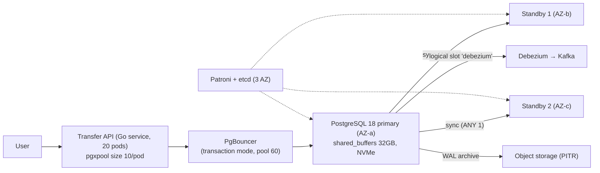
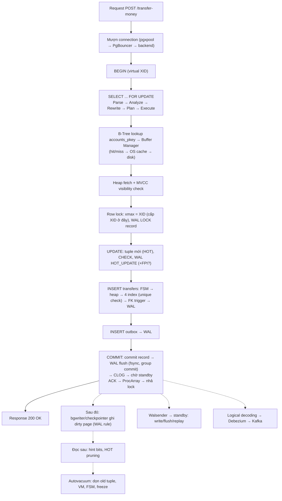
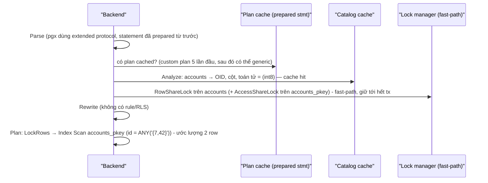
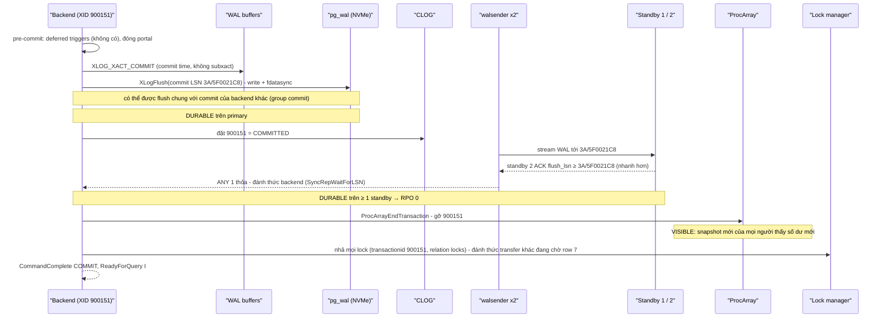
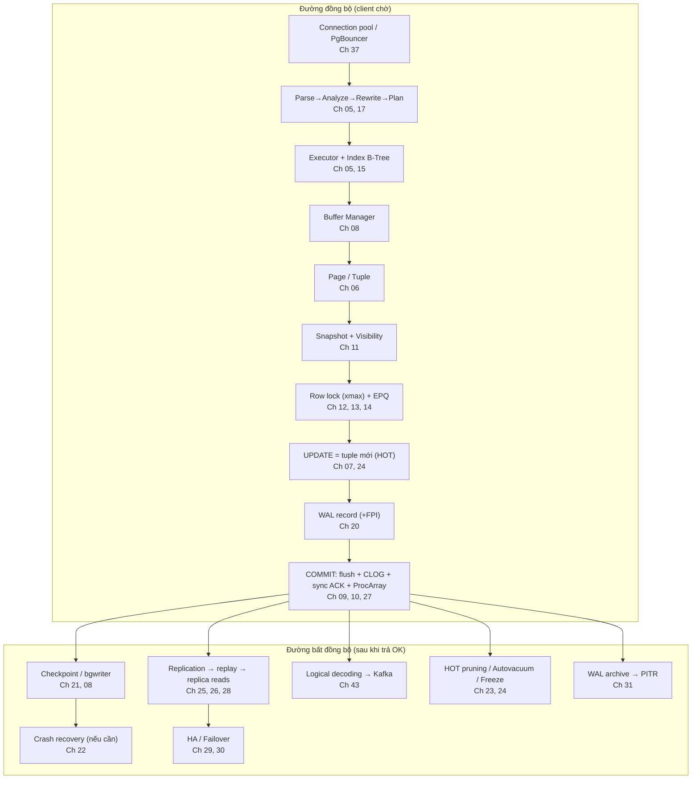

# PART 46 — END-TO-END DATABASE STORY

> **Trước:** [45 — Interview Handbook](45-interview-handbook.md) · **Về:** [README — Knowledge Map](README.md)
> **Độ ưu tiên:** Cao nhất cho việc **kết nối** mọi khái niệm. Mỗi bước dưới đây trỏ về chương giải thích chi tiết.

Câu chuyện: người dùng gọi **`POST /transfer-money`** chuyển 100.000đ từ tài khoản **A (id 7)** sang tài khoản **B (id 42)**. Ta lần theo request từ application xuống tới từng byte trên disk, sang replica, sang Kafka, và tới lúc VACUUM dọn dẹp — hàng phút sau.

---

## Mục lục

1. [Bối cảnh hệ thống](#1-bối-cảnh-hệ-thống)
2. [Toàn cảnh flow](#2-toàn-cảnh-flow)
3. [Bước 1 — Request tới, mượn connection](#bước-1--request-tới-mượn-connection)
4. [Bước 2 — BEGIN](#bước-2--begin)
5. [Bước 3 — SELECT ... FOR UPDATE: từ SQL text tới row lock](#bước-3--select--for-update)
6. [Bước 4 — UPDATE balance: tuple mới, HOT, WAL](#bước-4--update-balance)
7. [Bước 5 — INSERT ledger/transfer + outbox: FSM, index, unique, FK](#bước-5--insert-ledger-và-outbox)
8. [Bước 6 — COMMIT: WAL flush, sync replica, CLOG, visibility](#bước-6--commit)
9. [Bước 7 — Response trả về application](#bước-7--response)
10. [Bước 8 — Dirty page được flush sau (bgwriter, checkpoint)](#bước-8--dirty-page-được-flush-sau)
11. [Bước 9 — WAL stream sang replica, replay](#bước-9--wal-stream-sang-replica)
12. [Bước 10 — CDC: outbox tới Kafka](#bước-10--cdc-outbox-tới-kafka)
13. [Bước 11 — Những lần đọc sau: hint bits, HOT pruning](#bước-11--những-lần-đọc-sau)
14. [Bước 12 — Autovacuum dọn old tuple, freeze](#bước-12--autovacuum)
15. [Điều gì xảy ra nếu... (tại mỗi bước)](#điều-gì-xảy-ra-nếu)
16. [Bản đồ khái niệm của câu chuyện](#bản-đồ-khái-niệm-của-câu-chuyện)
17. [Key Takeaways](#key-takeaways)

---

## 1. Bối cảnh hệ thống



**Cách đọc diagram:** Transfer API ghi vào primary qua PgBouncer. Primary replicate đồng bộ (quorum ANY 1) tới hai standby ở hai AZ khác, có một logical replication slot cho Debezium (CDC outbox), và archive WAL cho PITR. Patroni + etcd quản lý HA.

**Schema liên quan (rút gọn):**

```sql
CREATE TABLE accounts (
  id bigint PRIMARY KEY,
  balance bigint NOT NULL CHECK (balance >= 0),
  version int NOT NULL DEFAULT 0,
  updated_at timestamptz NOT NULL DEFAULT now()
) WITH (fillfactor = 80);                               -- chừa chỗ cho HOT update

CREATE TABLE transfers (
  id uuid PRIMARY KEY DEFAULT uuidv7(),                 -- PG 18
  idempotency_key text NOT NULL UNIQUE,
  from_account bigint NOT NULL REFERENCES accounts(id),
  to_account bigint NOT NULL REFERENCES accounts(id),
  amount bigint NOT NULL CHECK (amount > 0),
  created_at timestamptz NOT NULL DEFAULT now()
);
CREATE INDEX ON transfers (from_account, created_at);
CREATE INDEX ON transfers (to_account, created_at);

CREATE TABLE outbox (id bigint GENERATED ALWAYS AS IDENTITY PRIMARY KEY,
                     topic text NOT NULL, payload jsonb NOT NULL, created_at timestamptz DEFAULT now());
```

Chú ý: **không** index `accounts.updated_at` và `balance` → UPDATE số dư có thể **HOT** ([Ch 24](24-hot-update.md)).

**Transaction mà application chạy:**

```sql
BEGIN;
SELECT id, balance FROM accounts WHERE id IN (7, 42) ORDER BY id FOR UPDATE;   -- khóa theo thứ tự id
UPDATE accounts SET balance = balance - 100000, version = version + 1, updated_at = now() WHERE id = 7;
UPDATE accounts SET balance = balance + 100000, version = version + 1, updated_at = now() WHERE id = 42;
INSERT INTO transfers (idempotency_key, from_account, to_account, amount) VALUES ($key, 7, 42, 100000);
INSERT INTO outbox (topic, payload) VALUES ('transfer.completed', $json);
COMMIT;
```

---

## 2. Toàn cảnh flow



**Cách đọc diagram:** Đường liền là **đường đồng bộ** (client chờ). Đường đứt là những việc diễn ra **sau khi** client đã nhận OK — nhưng mỗi việc đều là hệ quả trực tiếp của những gì transaction đã làm.

---

## Bước 1 — Request tới, mượn connection

1. Go handler gọi `pool.Begin(ctx)`. **pgxpool** đưa một connection có sẵn tới PgBouncer (không mở TCP mới — [Ch 37](37-connection-management.md)).
2. PgBouncer ở **transaction mode**: client connection chưa được gán **server connection** cho tới khi có câu lệnh đầu tiên của transaction. Nếu cả 60 server connection đều bận, client **chờ trong hàng đợi của PgBouncer** (`cl_waiting`) — PostgreSQL được bảo vệ khỏi quá tải.
3. Server connection = một **backend process** đã fork từ trước, đã xác thực, catalog cache đã ấm ([Ch 04 §5](04-postgresql-architecture.md#5-backend-process-và-vòng-đời-một-connection)).

**Chi phí:** micro giây (không fork, không auth). Nếu không có pool: fork + SCRAM + catalog → vài–hàng chục ms.

---

## Bước 2 — BEGIN

- Backend nhận `BEGIN` → `StartTransaction`: cấp **virtual transaction ID** (vd `12/88031`). **Chưa có XID thật** (XID cấp lười khi ghi — [Ch 09 §4.2](09-transaction.md#42-lifecycle-bên-trong-góc-nhìn-server)), **chưa có snapshot** (RC chụp mỗi câu lệnh).
- Trả `ReadyForQuery` với trạng thái `T` (trong transaction) — PgBouncer biết server connection này đang bận cho client này tới khi thấy trạng thái `I`.

---

## Bước 3 — SELECT ... FOR UPDATE

### 3.1 Từ text tới plan



**Cách đọc diagram:**
- **Analyze** lấy lock **RowShareLock** trên `accounts` (mode của `SELECT FOR UPDATE`) — xung đột chỉ với EXCLUSIVE/ACCESS EXCLUSIVE; qua **fast-path** trong PGPROC nên không đụng lock table chung ([Ch 13 §9](13-locking.md#9-fast-path-locking)). Lock giữ tới cuối transaction — một `ALTER TABLE accounts` lúc này sẽ phải chờ ([Ch 13 §8](13-locking.md#8-concept-blocking-và-wait-queue)).
- **Planner** dùng thống kê: `id` là PK unique, `IN (7, 42)` → 2 row → **Index Scan** trên `accounts_pkey` với ScalarArrayOp (PG 17+ xử lý hiệu quả nhiều giá trị trong một lần duyệt), node **LockRows** phía trên, và `ORDER BY id` được thỏa bởi thứ tự index (không cần Sort) ([Ch 17](17-query-planner.md)).

### 3.2 Executor: đọc index và heap

1. **ExecutorStart**: kiểm tra quyền; **chụp snapshot** (Read Committed → snapshot mới cho câu này): duyệt ProcArray, ví dụ `xmin=900100, xmax=900150, xip=[900120, 900133]` ([Ch 11 §6](11-mvcc.md#6-internals-2--snapshot)).
2. **B-Tree descend** trên `accounts_pkey`: metapage → root → internal → leaf. Mỗi page: `ReadBuffer` → tính **BufferTag** → tra **buffer mapping hash** (partition LWLock) → **hit** (page nóng, usage_count tăng) → pin + share content lock → binary search → nhả lock ([Ch 08 §4](08-memory-buffer-cache.md#4-đọc-một-page-hit-miss-eviction), [Ch 15 §3.3](15-index-internals.md#33-lookup)).
   - Nếu **miss**: clock sweep chọn victim (nếu victim dirty → flush WAL tới pd_lsn rồi ghi page), `pread` block từ file `base/16384/<relfilenode>` — có thể trúng **OS page cache** (µs) hoặc tới **NVMe** (~100µs); verify **checksum**.
3. Leaf trả TID `(310, 4)` cho id 7 (có thể có nhiều TID nếu có version cũ chưa dọn — phải thử lần lượt).
4. **Heap fetch**: `ReadBuffer(accounts, block 310)` → line pointer 4 → có thể là **LP_REDIRECT** (HOT chain từ các lần update trước) → đi theo chain tới tuple hiện hành.
5. **Visibility check** (`HeapTupleSatisfiesMVCC`): `xmin = 899000` → hint bit `XMIN_COMMITTED` đã có → không cần tra CLOG; xmin < snapshot.xmin → visible; `xmax = 0` → chưa bị xóa → **VISIBLE** ([Ch 11 §7](11-mvcc.md#7-internals-3--visibility-rules)).
6. Cùng quy trình cho id 42.

### 3.3 LockRows: khóa row

1. `heap_lock_tuple` trên tuple của id 7: lấy **exclusive content lock** trên buffer.
2. Kiểm tra `xmax` hiện tại:
   - Nếu có transaction khác đang giữ lock/đang update row 7 (ví dụ một transfer khác từ A) → nhả buffer lock, lấy **tuple lock** (xếp hàng), **chờ trên transactionid** của người kia (`wait_event = transactionid`). Khi người kia commit → ở RC, **EvalPlanQual** lấy version mới nhất của row 7 và đánh giá lại ([Ch 13 §6.2](13-locking.md#62-chờ-row-lock-diễn-ra-thế-nào), [Ch 12 §6.2](12-isolation-level.md#62-internals--evalplanqual-epq)).
3. Row lock cần ghi XID vào `xmax` → transaction **được cấp XID thật ngay bây giờ**: `GetNewTransactionId` → XID **900151**; ghi XID vào PGPROC (xuất hiện trong ProcArray); lấy **ExclusiveLock trên transactionid 900151** (để người khác có thể chờ mình).
4. Đặt `xmax = 900151` + cờ `HEAP_XMAX_LOCK_ONLY | HEAP_XMAX_EXCL_LOCK` (FOR UPDATE); **MarkBufferDirty**; WAL record `XLOG_HEAP_LOCK` → nhận LSN → `PageSetLSN`. Khóa row **là một thao tác ghi**.
5. Lặp lại cho id 42. Vì khóa theo **thứ tự id** (7 rồi 42), hai transfer đồng thời A→B và B→A không thể deadlock ([Ch 14 §6.1](14-deadlock.md#61-thứ-tự-cập-nhật-ngược-nhau-kinh-điển)).
6. Trả 2 row về application (DataRow messages).

---

## Bước 4 — UPDATE balance

`UPDATE accounts SET balance = balance - 100000, ... WHERE id = 7;`

1. Snapshot mới (RC), Index Scan tìm row 7 → tuple hiện hành có `xmax = 900151` (**chính mình** đang khóa) → được phép update.
2. **Tính giá trị mới** trên version hiện hành: `balance - 100000`. **CHECK (balance >= 0)** được đánh giá trên tuple mới — nếu âm → ERROR → transaction aborted (rollback O(1)) ([Ch 01 §7.4](01-relational-database.md#74-check)).
3. `heap_update` ([Ch 07 §4.3](07-read-write-behavior.md#43-step-by-step-hàm-heap_update)):
   - Cột thay đổi: `balance`, `version`, `updated_at` — **không cột nào được index** → điều kiện 1 của HOT thỏa.
   - Page 310 còn chỗ (fillfactor 80 chừa 20%; hoặc pruning giải phóng chỗ từ các version cũ) → **HOT update**.
   - Tuple cũ: `xmax = 900151` (giờ là xmax "thật", không lock-only), cờ `HEAP_HOT_UPDATED`, `t_ctid → (310, 9)`.
   - Tuple mới tại `(310, 9)`: `xmin = 900151`, `xmax = 0`, cờ `HEAP_ONLY_TUPLE`, `t_cid` = command id hiện tại.
   - **Không index nào bị chạm.**
   - Xóa bit **all-visible** của page 310 trong VM (nếu đang đặt) — WAL-logged.
4. **WAL:** `XLOG_HEAP_HOT_UPDATE` (với prefix/suffix compression vì cùng page). Nếu đây là **lần đầu page 310 bị sửa kể từ checkpoint gần nhất** — không phải trường hợp này, vì bước 3 (LOCK) đã sửa page này sau checkpoint và đã mang **FPI** — nên record nhỏ ([Ch 20 §10](20-wal.md#10-internals-6--full-page-writes)).
5. Tương tự cho id 42 (page khác → có thể có FPI cho page đó ở bước lock).

Lúc này trên page 310 có: version cũ (xmax=900151) — vẫn **visible với mọi transaction khác** (900151 chưa commit), và version mới — chỉ visible với chính transaction này. Một transaction khác đọc số dư A lúc này thấy **số dư cũ**, không chờ ([Ch 11](11-mvcc.md)).

---

## Bước 5 — INSERT ledger và outbox

`INSERT INTO transfers (...)`:

1. **Default**: `uuidv7()` → UUID sắp theo thời gian (insert gần cuối B-Tree PK — locality tốt, [Ch 01 §6.4](01-relational-database.md#64-surrogate-key-bigint-identity-vs-uuid)); `now()` = thời điểm **bắt đầu transaction**.
2. **CHECK** amount > 0.
3. **Chọn page heap**: page đích đang cache của backend → FSM → (nếu cần) mở rộng relation ([Ch 06 §7](06-storage-internals.md#7-concept-free-space-map-fsm)).
4. **heap_insert**: tuple `xmin = 900151`; WAL `XLOG_HEAP_INSERT` (có thể FPI nếu page mới bị chạm lần đầu sau checkpoint).
5. **Index inserts (4 index):**
   - `transfers_pkey` (UUIDv7) — chèn gần mép phải.
   - `transfers_idempotency_key_key` (**unique**): `_bt_check_unique` — nếu có entry cùng key của transaction **đang chạy** khác (client retry song song!) → **chờ** transaction đó; nếu nó commit → lỗi `duplicate key` → application trả kết quả của transfer đã có (idempotency) ([Ch 01 §7.3](01-relational-database.md#73-unique)).
   - `(from_account, created_at)`, `(to_account, created_at)`.
   - Mỗi insert: descend B-Tree, có thể split page, WAL record.
6. **FK check** (AFTER trigger, cuối câu lệnh): `SELECT 1 FROM accounts WHERE id = 7 FOR KEY SHARE` — row đã bị chính transaction này khóa FOR UPDATE/đã update → tương thích (cùng transaction) ([Ch 01 §8.3](01-relational-database.md#83-how--postgresql-kiểm-tra-fk-thế-nào)).

`INSERT INTO outbox (...)`: heap insert + PK index (identity tăng dần) + WAL. Outbox là cách phát sự kiện **nguyên tử** cùng thay đổi số dư ([Ch 43 §10](43-data-engineer-perspective.md#10-transactional-outbox)).

---

## Bước 6 — COMMIT



**Cách đọc diagram (và tại sao theo thứ tự này — [Ch 09 §7](09-transaction.md#7-commit-từ-bên-trong)):**
1. **Commit record + flush WAL** = **durability point**. Chỉ commit record (vài chục byte) cộng các record trước đó chưa flush; một `fdatasync` có thể phục vụ nhiều commit đồng thời.
2. **CLOG** đặt trước **ProcArray** để không có khoảnh khắc "không đang chạy nhưng chưa committed".
3. **Chờ standby** (sync replication, `ANY 1`): standby nhanh hơn trong hai AZ xác nhận đã **flush** WAL → RPO 0 cho failover ([Ch 27](27-sync-async-replication.md)). Trong lúc chờ, transaction đã durable cục bộ nhưng **chưa visible**.
4. **Gỡ khỏi ProcArray** = **visibility point**.
5. **Nhả lock** → transfer khác đang chờ trên transactionid 900151 thức dậy, EPQ trên version mới của row 7.

Lưu ý: **không data page nào được ghi ra disk** trong toàn bộ quá trình commit.

---

## Bước 7 — Response

- PgBouncer thấy `ReadyForQuery 'I'` → trả **server connection** về pool cho client khác.
- pgx trả kết quả cho handler → handler trả `200 OK` kèm transfer id.
- Tổng latency phía DB điển hình: vài ms (các page nóng trong cache; fsync NVMe ~ tens of µs; RTT tới standby khác AZ ~1ms là phần lớn nhất).

---

## Bước 8 — Dirty page được flush sau

Các page đã dirty: heap page của accounts (310, và page của id 42), heap page của transfers/outbox, các index leaf page, VM page.

- Chúng nằm trong **shared_buffers** với cờ `BM_DIRTY`, `pd_lsn` = LSN record cuối sửa chúng.
- **Background writer** có thể ghi một số page trước khi chúng bị evict ([Ch 08 §8](08-memory-buffer-cache.md#8-concept-dirty-page--ai-ghi-khi-nào)).
- **Checkpointer** ở checkpoint kế tiếp sẽ ghi mọi page dirty (trải đều theo `checkpoint_completion_target`), rồi `fsync` ([Ch 21](21-checkpoint.md)).
- Trước mỗi lần ghi page: **WAL rule** — WAL tới `pd_lsn` phải đã flush (đã đúng vì commit đã flush).
- Sau checkpoint đó, lần **đầu tiên** page 310 bị sửa lại sẽ mang **FPI** vào WAL.
- Nếu server **crash trước khi** page được ghi: recovery replay WAL từ redo point → áp lại lock, HOT update, inserts, commit → trạng thái y hệt ([Ch 22](22-crash-recovery.md)).

---

## Bước 9 — WAL stream sang replica

1. **Walsender** (một cho mỗi standby) đã gửi WAL tới commit LSN (đó là điều kiện để sync ACK).
2. **Walreceiver** trên standby: write → flush vào `pg_wal` của standby → báo `write_lsn/flush_lsn`.
3. **Startup process** replay: HEAP_LOCK, HOT_UPDATE (áp lên page 310 của standby, dùng pd_lsn để idempotent), INSERT, index insert, COMMIT (cập nhật CLOG standby, KnownAssignedXids) ([Ch 25 §3](25-replication.md#3-concept-physical-streaming-replication)).
4. Sau replay, query trên standby (hot standby) thấy số dư mới. Trước đó, một request đọc số dư từ standby sẽ thấy **số dư cũ** — **read-after-write** problem nếu API đọc lại từ replica ngay ([Ch 26 §7](26-primary-replica.md#7-read-after-write-problem)). Ở đây `synchronous_commit = on` chỉ đảm bảo flush, **không** đảm bảo replay.
5. **Replay lag** đo bằng `pg_stat_replication.replay_lag`; nếu standby đang chạy report dài, replay có thể bị **recovery conflict** chặn tới 30s ([Ch 28](28-replication-lag.md)).
6. **WAL archive**: khi segment chứa các record này đầy, archiver copy nó lên object storage → có thể PITR tới đúng thời điểm trước/sau transfer ([Ch 31](31-backup-pitr.md)).

---

## Bước 10 — CDC: outbox tới Kafka

1. Walsender của logical slot `debezium` đọc WAL, **reorder buffer** gom thay đổi của XID 900151; khi gặp **commit record** → phát toàn bộ transaction theo thứ tự commit ([Ch 25 §8](25-replication.md#8-concept-logical-decoding)).
2. Publication chỉ gồm `outbox` → pgoutput gửi event INSERT của row outbox (và bỏ qua thay đổi trên accounts/transfers không nằm trong publication).
3. Debezium (Outbox Event Router) → topic `transfer.completed`, key = transfer id.
4. Debezium xác nhận LSN → slot tiến `confirmed_flush_lsn` → primary được giải phóng WAL cũ.
5. Consumer (notification service) nhận event (**at-least-once**) → xử lý idempotent (dedup theo event id) → gửi thông báo cho người dùng ([Ch 43](43-data-engineer-perspective.md)).

Nếu Debezium chết: slot giữ WAL → disk primary tăng → cảnh báo retained WAL / `max_slot_wal_keep_size` ([Ch 40 Scenario 9](40-production-behavior.md#scenario-9--disk-gần-full)).

---

## Bước 11 — Những lần đọc sau

- Transaction đầu tiên đọc row 7 sau commit: tuple mới có `xmin = 900151`, chưa có hint bit → `TransactionIdIsInProgress` (không) → CLOG: committed → **đặt hint bit `XMIN_COMMITTED`** → page dirty (với data checksums bật mặc định ở PG 18, việc này có thể cần FPI nếu là lần sửa đầu của page sau checkpoint) ([Ch 06 §5.3](06-storage-internals.md#53-internals--hint-bits-tại-sao-select-có-thể-ghi-disk)).
- Tuple cũ: xmax = 900151 committed → khi mọi snapshot cũ hơn 900151 kết thúc (vượt **xmin horizon**) → tuple cũ trở thành **dead**.
- Khi page 310 gần đầy và có dead tuple có thể prune, một backend truy cập page sẽ chạy **HOT pruning** (nếu lấy được cleanup lock): xóa storage tuple cũ, root line pointer thành **LP_REDIRECT** → tuple mới; heap-only tuple chết → LP_UNUSED ngay — **không cần VACUUM, không chạm index** ([Ch 24 §6](24-hot-update.md#6-page-pruning)).
- Index `accounts_pkey` vẫn trỏ root line pointer → không cần thay đổi.

---

## Bước 12 — Autovacuum

- Stats: `n_tup_upd` và `n_tup_hot_upd` của accounts tăng; `n_dead_tup` tăng (dead tuple chưa prune). Khi `n_dead_tup > 50 + 0.2 × reltuples` (hoặc ngưỡng per-table đã giảm) → **autovacuum worker** vacuum `accounts` ([Ch 23 §9](23-vacuum.md#9-autovacuum)).
- Vacuum: bỏ qua page all-visible; prune page 310 (nếu chưa), thu LP_DEAD, (bypass index vacuum nếu quá ít), đặt lại **all-visible** trong VM (index-only scan trên accounts nhanh trở lại), cập nhật FSM.
- **Freeze**: khi tuple mới của A đủ cũ (tuổi XID > `vacuum_freeze_min_age`, hoặc eager freeze PG 18) → đặt `HEAP_XMIN_FROZEN` → tuple không còn phụ thuộc XID 900151 → an toàn trước wraparound; page all-frozen → aggressive vacuum sau này bỏ qua ([Ch 23 §10](23-vacuum.md#10-freeze-và-transaction-id-wraparound)).
- `transfers` và `outbox` là append-only → autovacuum theo **insert threshold** (PG 13+) đặt VM và freeze; outbox có thể được xóa định kỳ/partition + drop.
- Nếu có **long-running transaction** (report mở từ trước 900151) → tuple cũ của A **không được dọn** ("dead but not yet removable") → mọi update tiếp theo trên A tích lũy version → bloat ([Ch 40 Scenario 14](40-production-behavior.md#scenario-14--long-running-transaction)).

---

## Điều gì xảy ra nếu...

| Thời điểm | Sự kiện | Hệ quả | Chương |
|---|---|---|---|
| Bước 3 | Transfer khác từ A đang chạy | Chờ transactionid; sau đó EPQ trên version mới; nếu số dư không đủ → CHECK lỗi | [12](12-isolation-level.md), [13](13-locking.md) |
| Bước 3 | Code khác khóa B trước rồi A | Deadlock sau 1s, một bên nhận 40P01 → retry | [14](14-deadlock.md) |
| Bước 3 | Tài khoản "nóng" (merchant nhận hàng nghìn transfer/s) | Row lock tuần tự hóa → throughput giới hạn; cần sub-account/batch | [41 §2](41-database-system-design.md#2-banking-system-core-ledger) |
| Bước 4 | Số dư âm | CHECK lỗi → transaction aborted → ROLLBACK O(1), tuple đã ghi thành dead | [09 §8](09-transaction.md#8-rollback-từ-bên-trong) |
| Bước 5 | Client retry song song cùng idempotency key | Unique index chờ tx kia; nó commit → duplicate key → trả kết quả cũ | [01 §7.3](01-relational-database.md#73-unique) |
| Bước 6 | Crash **trước** khi commit record flush | Recovery: không có commit record → XID aborted; không tiền nào bị trừ | [22](22-crash-recovery.md) |
| Bước 6 | Crash **sau** flush, **trước** khi client nhận OK | Transaction **đã commit**; client thấy lỗi → retry với cùng key → nhận kết quả cũ (không chuyển hai lần) | [30 §6](30-failover.md#6-application-reconnect-và-ambiguous-commit) |
| Bước 6 | Cả hai standby không phản hồi | Commit **treo** ở SyncRepWait; Patroni có thể đổi cấu hình sync (hoặc giữ strict) | [27 §8](27-sync-async-replication.md#8-what-happens-if) |
| Bước 6 | Primary chết ngay sau commit | Failover sang standby đã ACK → transfer tồn tại (RPO 0); client retry an toàn nhờ idempotency | [30](30-failover.md) |
| Bước 8 | Mất điện trước checkpoint | Page chưa ghi; recovery replay WAL → đầy đủ | [22](22-crash-recovery.md) |
| Bước 9 | Standby lag 10s, API đọc số dư từ standby | Người dùng thấy số dư cũ → cần sticky primary/LSN token | [26 §7](26-primary-replica.md#7-read-after-write-problem) |
| Bước 10 | Debezium chết cả đêm | WAL tích lũy trên primary; notification trễ; khi chạy lại gửi tiếp (có thể trùng) | [43 §6](43-data-engineer-perspective.md#6-replication-slot-trong-cdc) |
| Bước 12 | Report dài 6 giờ trên primary | Dead tuple của accounts không dọn → bloat, HOT giảm (page đầy) | [11 §13](11-mvcc.md#13-what-happens-if) |
| Bất kỳ | Ai đó `DELETE FROM transfers` nhầm | Replica nhân bản ngay; khôi phục bằng PITR tới trước thời điểm đó | [31](31-backup-pitr.md) |

---

## Bản đồ khái niệm của câu chuyện



**Cách đọc diagram:** Nửa trên là mọi thứ xảy ra trong vài mili giây client chờ; nửa dưới là mọi thứ xảy ra sau đó — nhưng tất cả đều bắt nguồn từ hai cơ chế: **MVCC** (tạo version mới, dead tuple → vacuum) và **WAL** (durability → checkpoint/recovery, replication/HA, CDC, PITR). Hiểu hai cơ chế này là hiểu PostgreSQL như một hệ thống.

---

## Key Takeaways

1. Một transfer đơn giản chạm vào **gần như mọi subsystem**: pool, parser/planner/executor, B-Tree, buffer manager, page/tuple, snapshot, row lock, HOT, WAL, CLOG, ProcArray, sync replication, checkpoint, replay, logical decoding, archive, vacuum.
2. **COMMIT không ghi data page** — chỉ WAL flush (+ ACK standby nếu sync). Data page được ghi sau; crash thì WAL redo.
3. **Row lock là ghi** (xmax + WAL) và là lúc XID được cấp.
4. **UPDATE tạo version mới**; thiết kế đúng (không index cột hay đổi, fillfactor) biến nó thành **HOT** — không chạm index, dọn bằng pruning.
5. **Visibility** được quyết định bởi snapshot + CLOG + hint bits; **durability point** ≠ **visibility point**.
6. Mọi thứ "sau commit" (replica, CDC, PITR, vacuum) đều đọc cùng **WAL** hoặc xử lý hệ quả của **MVCC**.
7. Tính đúng đắn nghiệp vụ dưới lỗi cần: **constraint** (CHECK, UNIQUE idempotency), **thứ tự khóa**, **sync replication**, **idempotent retry**, **outbox**, **PITR**.

---

## Nguồn tham khảo

Toàn bộ các chương 00–45 của handbook; PostgreSQL Documentation: https://www.postgresql.org/docs/current/
