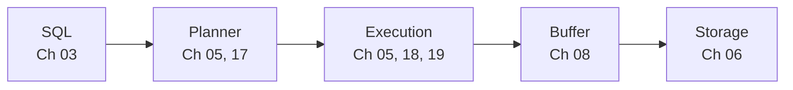
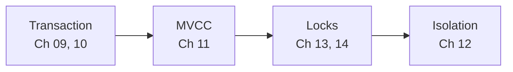
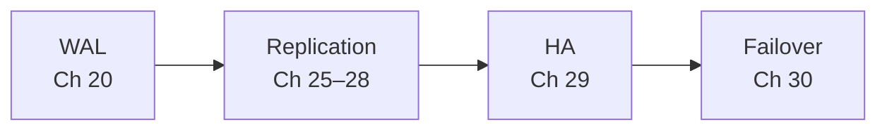
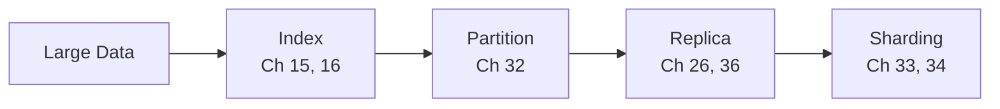
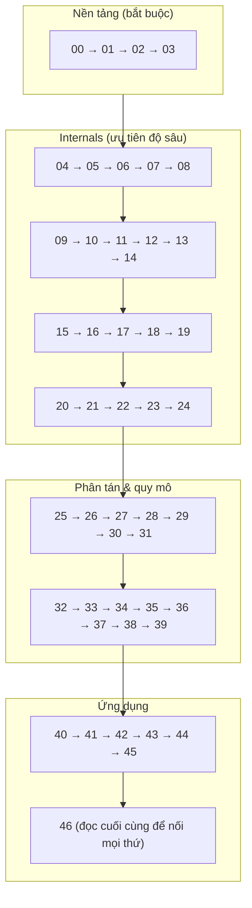

# PostgreSQL / Database Engineering Handbook — Database Knowledge Map

Bộ tài liệu lý thuyết chuyên sâu về database, tập trung vào **PostgreSQL**: từ mental model, SQL, storage, buffer, transaction, MVCC, lock, index, planner, WAL, checkpoint, recovery, VACUUM, replication, HA, partitioning, sharding, distributed database tới production troubleshooting và system design. Dành cho Backend Engineer và Data Engineer từ Middle tiến tới Senior.

- **Phiên bản tham chiếu:** PostgreSQL 18 (bản stable tại thời điểm viết). Các thay đổi theo version được ghi rõ (ví dụ "PG 13+", "PG 17"). Một số tính năng của **PG 19 (đang beta tại thời điểm viết)** được nhắc tới và đánh dấu rõ — hãy kiểm tra lại khi PG 19 chính thức phát hành.
- **Phạm vi:** lý thuyết + internals + kiến trúc + hành vi production. Không có hướng dẫn cài đặt, lab, hay code ứng dụng; SQL chỉ dùng để minh họa.
- **Ngôn ngữ:** tiếng Việt, giữ nguyên thuật ngữ kỹ thuật tiếng Anh để dễ đối chiếu với documentation.

---

## 1. Mental model tổng thể

```mermaid
flowchart LR
    APP["Application"] --> CONN["Connection<br/>(pool, process)"]
    CONN --> SQL["SQL"]
    SQL --> PARSER["Parser"]
    PARSER --> PLANNER["Planner"]
    PLANNER --> EXEC["Executor"]
    EXEC --> IDX["Index"]
    IDX --> BUF["Buffer"]
    BUF --> PAGE["Page"]
    PAGE --> TUPLE["Tuple"]
    TUPLE --> TX["Transaction"]
    TX --> MVCC["MVCC"]
    MVCC --> LOCKS["Locks"]
    LOCKS --> WAL["WAL"]
    WAL --> DISK["Disk"]
    DISK --> VAC["Vacuum"]
    VAC --> REPL["Replication"]
    REPL --> HA["HA"]
    HA --> SCALE["Scaling"]
```

**Cách đọc diagram:** Đây là chuỗi mà một câu SQL và dữ liệu của nó đi qua, đồng thời là thứ tự gợi ý để xây mental model. Mỗi mũi tên là một **ranh giới trách nhiệm** giữa hai subsystem — hầu hết sự cố production nằm ở một mũi tên cụ thể (ví dụ Planner → Executor: estimate sai; MVCC → Vacuum: horizon bị giữ; WAL → Replication: slot bị bỏ rơi).

---

## 2. Năm chuỗi khái niệm cốt lõi

### 2.1 Đọc dữ liệu: SQL → Planner → Execution → Buffer → Storage

SQL khai báo *cái gì*; planner chọn *cách nào* dựa trên statistics và cost model; executor kéo tuple theo mô hình Volcano; buffer manager tìm page trong shared buffers hoặc đọc qua OS; storage là page 8KB trong file relation. **Chậm ở đâu** → xem [Ch 18](18-explain-analyze.md).

### 2.2 Đồng thời: Transaction → MVCC → Locks → Isolation

Transaction gắn mọi thay đổi với XID; MVCC cho mỗi transaction một snapshot và giữ nhiều version; lock tuần tự hóa writer–writer và bảo vệ cấu trúc; isolation level quyết định anomaly nào được phép (RC, RR = SI, Serializable = SSI).

### 2.3 Bền vững: Write → WAL → Commit → Checkpoint → Recovery

Mọi thay đổi được log trước; commit = WAL flush (không ghi data page); data page ghi lười; checkpoint giới hạn phần WAL phải replay; crash recovery = redo từ redo point. Không cần undo nhờ MVCC.

### 2.4 Sẵn sàng: WAL → Replication → HA → Failover

Replication vật lý = WAL được gửi và replay liên tục; logical replication = WAL được giải mã. HA thêm failure detection, bầu leader qua quorum, fencing, routing. Failover = promote (timeline mới), rewind primary cũ, xử lý ambiguous commit.

### 2.5 Quy mô: Large Data → Index → Partition → Replica → Sharding

Mỗi bậc giải quyết một loại vấn đề và tăng độ phức tạp: index giảm số row phải đọc; partition quản lý dữ liệu lớn trong một server; replica scale đọc; sharding scale ghi và dung lượng qua nhiều server.

### 2.6 Chuỗi nhân quả phải thuộc

| Chuỗi | Ý nghĩa |
|---|---|
| **UPDATE → MVCC → dead tuple → VACUUM → bloat → disk → query performance** | Vì sao UPDATE đắt và VACUUM tồn tại ([07](07-read-write-behavior.md), [11](11-mvcc.md), [23](23-vacuum.md)) |
| **COMMIT → WAL → fsync → durability → replication → replica lag** | Vì sao commit nhanh mà vẫn bền, và vì sao replica trễ ([09](09-transaction.md), [20](20-wal.md), [28](28-replication-lag.md)) |
| **Query → Planner → Statistics → Cardinality Estimate → Join Algorithm → work_mem → Disk Spill → Latency** | Vì sao query đột nhiên chậm ([17](17-query-planner.md), [18](18-explain-analyze.md), [19](19-join-algorithms.md)) |
| **Long transaction → xmin horizon → vacuum không dọn → bloat + wraparound risk** | Kẻ thù thầm lặng của PostgreSQL ([11](11-mvcc.md), [23](23-vacuum.md), [40](40-production-behavior.md)) |
| **Replication slot bị bỏ rơi → WAL tích lũy → disk full → PANIC** | Sự cố disk phổ biến nhất ([25](25-replication.md), [43](43-data-engineer-perspective.md)) |
| **Partition mất quorum → split brain → dữ liệu phân kỳ** | Vì sao HA cần consensus + fencing ([29](29-high-availability.md), [30](30-failover.md)) |

---

## 3. Mục lục đầy đủ

| # | Chương | Nội dung chính |
|---|---|---|
| 00 | [Database Mental Model](00-database-mental-model.md) | DB/DBMS/engine, Application → Disk, OLTP/OLAP, row vs column, NoSQL, loại database |
| 01 | [Relational Database Fundamentals](01-relational-database.md) | Relation/tuple/page, catalog, keys, constraints, FK internals, NULL |
| 02 | [Data Modeling](02-data-modeling.md) | ER, cardinality, normalization (1NF–BCNF), anomaly, denormalization |
| 03 | [SQL Complete Theory](03-sql.md) | Logical processing order, JOIN logic/physical, aggregation, subquery, CTE, window, set ops, DML/UPSERT/MERGE, DDL |
| 04 | [PostgreSQL Architecture](04-postgresql-architecture.md) | Postmaster, backend, background processes, shared/local memory, crash reset |
| 05 | [Query Lifecycle](05-query-lifecycle.md) | Parser → Analyzer → Rewriter → Planner → Executor → AM → Buffer; plan cache; JIT |
| 06 | [Storage Internals](06-storage-internals.md) | PGDATA, fork, segment, page layout, tuple header, hint bits, TOAST, FSM, VM |
| 07 | [Read / Write Behavior](07-read-write-behavior.md) | SELECT/INSERT/UPDATE/DELETE ở mức page, tuple lifecycle, write amplification |
| 08 | [Buffer Cache & Memory](08-memory-buffer-cache.md) | Buffer manager, pin/lock, clock sweep, ring buffer, dirty page, OS cache, AIO |
| 09 | [Transaction](09-transaction.md) | XID, CLOG, commit/abort internals, command ID, subtransaction, 2PC |
| 10 | [ACID](10-acid.md) | Từng chữ cái ↔ cơ chế PostgreSQL; cấu hình làm yếu ACID |
| 11 | [MVCC](11-mvcc.md) | Tuple version, snapshot, visibility rules, xmin horizon, so sánh InnoDB |
| 12 | [Isolation Level](12-isolation-level.md) | Anomaly, RC + EvalPlanQual, RR = SI, Serializable = SSI |
| 13 | [Locking](13-locking.md) | Table/row lock modes, row lock internals, wait queue, fast-path, advisory |
| 14 | [Deadlock](14-deadlock.md) | Wait-for graph, detection, nạn nhân, prevention, debugging |
| 15 | [Index Internals](15-index-internals.md) | B-Tree sâu, Hash, GiST, SP-GiST, GIN, BRIN, scan types, CIC |
| 16 | [Composite Index](16-composite-index.md) | Leftmost prefix, boundary keys, skip scan (PG 18), ORDER BY |
| 17 | [Query Planner & Optimizer](17-query-planner.md) | Statistics, selectivity, cardinality, cost model, join search, parallel |
| 18 | [EXPLAIN / EXPLAIN ANALYZE](18-explain-analyze.md) | Đọc plan, estimate vs actual, Buffers, spill, quy trình phân tích |
| 19 | [Join Algorithms](19-join-algorithms.md) | Nested Loop, Hash Join, Merge Join, semi/anti |
| 20 | [WAL](20-wal.md) | WAL rule, record, LSN, buffers, segment, flush, FPI, wal_level, timeline |
| 21 | [Checkpoint](21-checkpoint.md) | Redo point, trigger, spreading, spike, restartpoint |
| 22 | [Crash Recovery](22-crash-recovery.md) | Kịch bản UPDATE 1 triệu row + mất điện, redo step-by-step |
| 23 | [VACUUM](23-vacuum.md) | Các pha, autovacuum, freeze, wraparound, bloat, horizon |
| 24 | [HOT Update](24-hot-update.md) | HOT chain, pruning, điều kiện, fillfactor |
| 25 | [Replication](25-replication.md) | Streaming, hot standby, slot, logical decoding, logical replication |
| 26 | [Primary–Replica](26-primary-replica.md) | Write/read path, routing, read-after-write, monotonic reads |
| 27 | [Sync vs Async Replication](27-sync-async-replication.md) | synchronous_commit levels, quorum, RPO/RTO |
| 28 | [Replication Lag](28-replication-lag.md) | Pipeline, loại lag, nguyên nhân, chẩn đoán |
| 29 | [High Availability](29-high-availability.md) | Failure detection, quorum, split brain, fencing, routing, tools |
| 30 | [Failover](30-failover.md) | Promotion, timeline, ambiguous commit, pg_rewind, switchover |
| 31 | [Backup & PITR](31-backup-pitr.md) | pg_dump, base backup, WAL archive, PITR, incremental (PG 17) |
| 32 | [Partitioning](32-partitioning.md) | Range/list/hash, pruning, partition-wise, local index, maintenance |
| 33 | [Sharding](33-sharding.md) | Shard key, router, strategies, hot shard, cross-shard, 2PC, resharding, Citus |
| 34 | [Partitioning vs Sharding](34-partitioning-vs-sharding.md) | So sánh chi tiết, kết hợp |
| 35 | [Database Cluster](35-database-cluster.md) | Năm nghĩa của "cluster" |
| 36 | [Scaling](36-scaling.md) | Scaling ladder, vertical, cache, MV, CQRS, scale ghi |
| 37 | [Connection Management](37-connection-management.md) | max_connections, pooling modes, pool sizing, connection storm |
| 38 | [Consistency](38-consistency.md) | Linearizability, session guarantees, CAP chính xác, PACELC |
| 39 | [Distributed Database Fundamentals](39-distributed-database.md) | Partial failure, consensus, 2PC, saga, clocks, distributed SQL |
| 40 | [Production Behavior](40-production-behavior.md) | 17 scenario: symptom → cause → mechanism → diagnosis → fix |
| 41 | [Database System Design](41-database-system-design.md) | Payment, banking, e-commerce, social, logging, analytics, notification |
| 42 | [Backend Engineer Database Design](42-backend-database-design.md) | Khi nào PostgreSQL/Redis/replica/partition/shard/MongoDB/ClickHouse/CDC |
| 43 | [Data Engineer Perspective](43-data-engineer-perspective.md) | Incremental load, CDC, snapshot + CDC, slot, schema evolution |
| 44 | [Common Myths](44-common-myths.md) | 35 hiểu lầm và cơ chế đúng |
| 45 | [Interview Handbook](45-interview-handbook.md) | Junior → Staff, short/deep/follow-up |
| 46 | [End-to-End Database Story](46-end-to-end-database-story.md) | POST /transfer-money xuyên suốt mọi subsystem |

---

## 4. Lộ trình đọc gợi ý

**Cách đọc diagram:** Thứ tự mặc định từ trên xuống. Các lộ trình tắt:

| Mục tiêu | Lộ trình |
|---|---|
| **Backend Engineer (Middle → Senior)** | 00, 03, 04, 05, 07, 09, 11, 12, 13, 14, 15, 16, 17, 18, 20, 23, 24, 26, 37, 40, 41, 42, 46 |
| **Data Engineer** | 00, 03, 06, 07, 11, 17, 18, 20, 23, 25, 28, 32, 38, 43, 46 |
| **Chuẩn bị phỏng vấn gấp (1 tuần)** | 11, 12, 13, 15, 17, 20, 22, 23, 25, 26, 29, 32, 33, 44, 45, 46 |
| **Người trực production / SRE** | 04, 08, 13, 20, 21, 23, 25, 28, 29, 30, 31, 37, 40 |

---

## 5. Cấu trúc mỗi chương

Các concept lớn được trình bày theo khung:

1. **WHAT** — nó là gì
2. **WHY** — tại sao cần, nếu không có thì sao
3. **HOW** — hoạt động từng bước
4. **INTERNALS** — PostgreSQL hiện thực bằng cấu trúc gì
5. **EXAMPLE**
6. **WHAT HAPPENS IF...** — edge case, failure
7. **PERFORMANCE IMPACT**
8. **PRODUCTION BEHAVIOR**
9. **TRADE-OFF**
10. **WHEN TO USE / WHEN NOT TO USE**
11. **COMMON MISUNDERSTANDINGS**
12. **INTERVIEW QUESTIONS**
13. **KEY TAKEAWAYS**

Mọi diagram Mermaid đều có đoạn **"Cách đọc diagram"** ngay sau. Cuối mỗi chương có **Nguồn tham khảo** (ưu tiên PostgreSQL Documentation, source-code README, paper).

---

## 6. Nguồn tham khảo chính

- PostgreSQL Documentation (bản hiện hành): https://www.postgresql.org/docs/current/
- PostgreSQL Release Notes (theo version): https://www.postgresql.org/docs/release/
- PostgreSQL source code README (backend/access/transam, heap, nbtree, optimizer, executor, storage/lmgr, storage/buffer, replication).
- PostgreSQL Wiki: https://wiki.postgresql.org/
- Hironobu Suzuki, *The Internals of PostgreSQL*: https://www.interdb.jp/pg/
- Martin Kleppmann, *Designing Data-Intensive Applications*.
- Các paper kinh điển: Codd (1970), ARIES (1992), Berenson et al. (1995), Lehman & Yao (1981), Cahill et al. (2008), Ports & Grittner (2012), Raft (2014), Gilbert & Lynch (2002).
