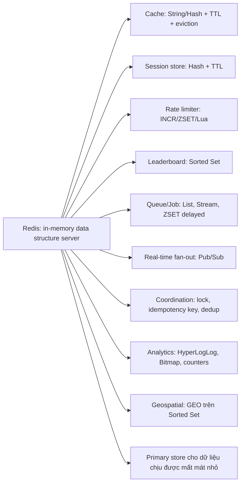
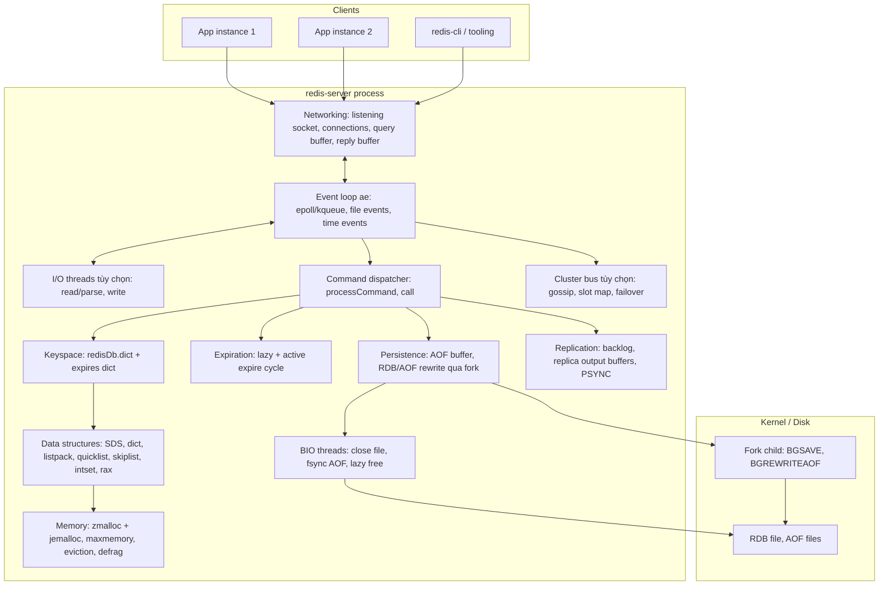
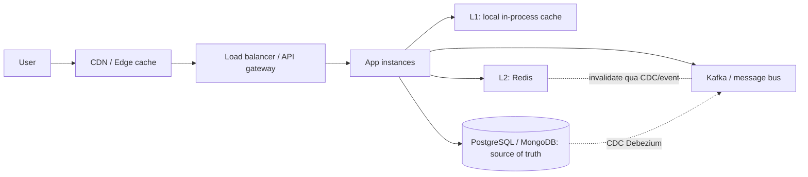

# PART 0 — REDIS MENTAL MODEL

> **Tiếp:** [01 — Redis Architecture](01-redis-architecture.md)
> **Độ ưu tiên:** Cao nhất. Mọi chương sau đều dựa trên mô hình tư duy ở đây. Nếu hiểu sai "Redis là gì", bạn sẽ dùng sai Redis ở mọi tầng: chọn sai data structure, đặt sai kỳ vọng về durability, thiết kế sai failover.

---

## Mục lục

1. [Simple mental model](#1-simple-mental-model)
2. [WHAT — Redis thực chất là gì](#2-what--redis-thực-chất-là-gì)
3. [Redis dưới 8 góc nhìn: key-value, NoSQL, in-memory DB, cache, broker, data structure server, distributed system](#3-redis-dưới-8-góc-nhìn)
4. [WHY — Tại sao Redis tồn tại](#4-why--tại-sao-redis-tồn-tại)
5. [HOW — Mô hình vận hành cốt lõi trong 5 câu](#5-how--mô-hình-vận-hành-cốt-lõi)
6. [INTERNALS — Bản đồ các subsystem](#6-internals--bản-đồ-các-subsystem)
7. [DATA FLOW — Redis nằm ở đâu trong kiến trúc backend](#7-data-flow--redis-nằm-ở-đâu-trong-kiến-trúc-backend)
8. [Redis khác PostgreSQL, MongoDB, Memcached, Kafka, local cache thế nào](#8-redis-khác-các-hệ-thống-khác-thế-nào)
9. [Lịch sử version và hệ sinh thái (Redis, Valkey, license)](#9-lịch-sử-version-và-hệ-sinh-thái)
10. [WHAT HAPPENS IF — hiểu sai mental model](#10-what-happens-if--hiểu-sai-mental-model)
11. [PERFORMANCE IMPACT & PRODUCTION BEHAVIOR](#11-performance-impact--production-behavior)
12. [TRADE-OFF](#12-trade-off)
13. [WHEN TO USE / WHEN NOT TO USE](#13-when-to-use--when-not-to-use)
14. [COMMON MISUNDERSTANDINGS](#14-common-misunderstandings)
15. [INTERVIEW QUESTIONS](#15-interview-questions)
16. [KEY TAKEAWAYS](#16-key-takeaways)

---

## 1. Simple mental model

Hãy tưởng tượng Redis là **một người thủ kho cực kỳ nhanh, làm việc một mình, đứng trong một nhà kho nằm hoàn toàn trên bàn làm việc (RAM)**:

- Kho không chứa "bảng" hay "document". Kho chứa **các cấu trúc dữ liệu có tên**: một cái danh sách (List), một cái túi không trùng (Set), một bảng xếp hạng (Sorted Set), một cuốn sổ nhỏ (Hash), một chuỗi byte (String), một cuốn nhật ký chỉ ghi thêm (Stream)...
- Khách hàng (client) xếp hàng gửi **lệnh** ("thêm 10 điểm cho user 42 vào bảng xếp hạng"). Người thủ kho làm **từng lệnh một, trọn vẹn**, rồi làm lệnh tiếp theo. Vì chỉ có một người thao tác trên kho, không bao giờ có chuyện hai người cùng sửa một món đồ → không cần khóa.
- Mỗi lệnh thường chỉ mất **vài trăm nanosecond đến vài microsecond** vì mọi thứ đã nằm sẵn trên bàn. Nhưng nếu ai đó gửi lệnh "đếm lại toàn bộ 10 triệu món trong kho" thì **tất cả khách còn lại phải đứng chờ**.
- Thỉnh thoảng người thủ kho **chụp ảnh toàn bộ kho** (RDB snapshot) hoặc **ghi nhật ký mọi thay đổi** (AOF) để nếu mất điện còn dựng lại được. Việc chụp ảnh được giao cho một "bản sao" của người thủ kho (fork child) để người chính không phải dừng tay.
- Có thể có **các kho phụ** (replica) nhận bản sao thay đổi — nhưng thay đổi được gửi đi **sau khi** đã trả lời khách (asynchronous), nên kho phụ có thể chậm hơn một chút.
- Khi một kho không đủ chỗ hoặc một người không làm kịp, ta **chia hàng hóa ra nhiều kho** theo quy tắc cố định (Redis Cluster, 16384 hash slot).

Ba ý cần khắc sâu:

1. **Redis là một data structure server**: bạn không gửi "query", bạn gửi **thao tác trên một cấu trúc dữ liệu cụ thể**, với độ phức tạp thuật toán được công bố rõ ràng.
2. **Một luồng thực thi lệnh**: mọi lệnh tuần tự hóa qua một main thread → atomic từng lệnh, không lock, nhưng một lệnh chậm chặn tất cả.
3. **RAM là nơi dữ liệu sống, disk là nơi dữ liệu được sao lưu**: persistence và replication là cơ chế bảo vệ, không phải nơi phục vụ đọc/ghi.

---

## 2. WHAT — Redis thực chất là gì

**Redis (REmote DIctionary Server)** là một **in-memory data structure server**: một process server nhận kết nối TCP (hoặc Unix socket), nói giao thức RESP, và thực thi các lệnh thao tác trên các **cấu trúc dữ liệu nằm trong RAM của chính process đó**, được tổ chức thành một **keyspace** (một hash table khổng lồ: key → object).

Định nghĩa đó có 5 thành phần, mỗi thành phần mang hệ quả kỹ thuật:

| Thành phần | Ý nghĩa | Hệ quả |
|---|---|---|
| **In-memory** | Working set (toàn bộ dataset) nằm trong RAM | Dataset bị giới hạn bởi RAM; latency thấp; chi phí/GB cao hơn disk nhiều lần |
| **Data structure** | Value không phải blob mà là List, Set, ZSet, Hash, Stream... | Có thể thao tác một phần value (ZINCRBY, HSET) mà không đọc–sửa–ghi cả object |
| **Server** | Một process độc lập, client nói chuyện qua network | Mỗi thao tác tốn ít nhất 1 network round-trip (RTT) → RTT thường là chi phí lớn nhất |
| **Keyspace** | Mọi thứ được đánh địa chỉ bằng key (binary-safe string) | Không có secondary index tự động, không có query planner, không có JOIN |
| **Single command-execution thread** | Lệnh được thực thi tuần tự | Mỗi lệnh atomic; không cần lock; nhưng CPU-bound trên một core cho phần execute |

Redis được Salvatore Sanfilippo (antirez) viết năm 2009 để giải quyết bài toán real-time analytics cho một startup (LLOOGG) — ông cần một thứ nhanh hơn MySQL để lưu danh sách page view gần nhất. Ý tưởng then chốt: **thay vì dùng database lưu "row" rồi tự xử lý cấu trúc trong application, hãy đưa chính cấu trúc dữ liệu (list, set) lên server, và cho phép thao tác trực tiếp lên chúng qua network.**

---

## 3. Redis dưới 8 góc nhìn

Redis thường bị gán nhiều nhãn. Mỗi nhãn **đúng một phần** và **sai ở chỗ nó bỏ qua**.

### 3.1 Key-value store?

**Đúng về giao diện ở mức cao nhất**: mọi dữ liệu được truy cập qua key. `GET user:1`, `DEL session:abc`.

**Sai nếu hiểu là "value = blob"**. Trong Memcached, value là một mảng byte mờ đục (opaque); server không biết bên trong có gì. Trong Redis, value có **type** và **encoding**, và server biết cách thao tác bên trong nó:

```
ZADD leaderboard 1500 "alice"     # thao tác trên cấu trúc skip list + hash table
ZREVRANGE leaderboard 0 9         # server tự trả top 10, không cần client tải toàn bộ
```

Nếu Redis chỉ là KV blob, để cập nhật điểm alice bạn phải GET cả bảng xếp hạng (có thể vài MB), deserialize, sửa, serialize, SET lại — và race condition với người khác đang sửa cùng lúc.

### 3.2 NoSQL?

Đúng theo nghĩa "không dùng SQL, không có schema quan hệ". Nhưng nhãn này **quá rộng**: MongoDB, Cassandra, Neo4j, Kafka (theo một số người) đều là "NoSQL" nhưng thiết kế hoàn toàn khác nhau. Nói "Redis là NoSQL" không cho bạn biết gì về durability, consistency, hay access pattern.

### 3.3 In-memory database?

Đúng: **dataset chính nằm trong RAM**, mọi thao tác đọc/ghi phục vụ từ RAM.

Nhưng "in-memory" **không** có nghĩa "không dùng disk":
- **RDB** snapshot ghi toàn bộ dataset ra disk định kỳ ([Chương 34](34-rdb.md)).
- **AOF** ghi log mọi lệnh ghi ra disk ([Chương 36](36-aof.md)).
- Replication full sync có thể ghi RDB ra disk trước khi gửi ([Chương 39](39-replication.md)).
- Khi restart, Redis **đọc lại** dataset từ disk vào RAM ([Chương 38](38-startup-recovery.md)).

Điều đúng là: **disk không nằm trên đường đọc**. Không có "buffer pool miss → đọc page từ disk" như PostgreSQL. Nếu dữ liệu không nằm trong RAM, với Redis nó **không tồn tại**.

(Ghi chú lịch sử: Redis từng có "Virtual Memory" 2.0–2.4 và "diskstore" thử nghiệm để swap value ra disk; cả hai đều bị bỏ vì làm hỏng đặc tính latency. Một số sản phẩm thương mại như Redis Flex/Redis on Flash của Redis Inc. dùng SSD làm tầng mở rộng — đó là sản phẩm riêng, không phải Redis Open Source mặc định.)

### 3.4 Cache?

Đây là use case phổ biến nhất (có lẽ >50% triển khai). Redis rất phù hợp làm cache vì: có TTL per-key, có eviction policy khi đầy memory (LRU/LFU xấp xỉ), latency thấp.

Nhưng **"Redis chỉ là cache" là sai**:
- Redis có persistence (RDB/AOF) và replication — nhiều hệ thống dùng Redis làm **primary store** cho dữ liệu mà mất một ít cũng chấp nhận được (session, rate limit counter, leaderboard, feature flags).
- Redis có Streams với consumer group — một message queue có persistence.
- Tuy nhiên Redis **không** có durability mạnh như PostgreSQL (fsync mỗi commit + synchronous replication). Đặt Redis làm source of truth cho dữ liệu tài chính mà không có cơ chế bù trừ là sai lầm ([Chương 59](59-redis-vs-database.md)).

### 3.5 Message broker?

Redis có **ba** cơ chế messaging, hành vi rất khác nhau:

| Cơ chế | Bản chất | Delivery | Offline consumer |
|---|---|---|---|
| **Pub/Sub** | Fan-out tức thời, không lưu | At-most-once | Mất message |
| **List** (LPUSH/BRPOP) | Queue đơn giản | At-most-once (hoặc at-least-once với LMOVE pattern) | Message nằm chờ trong list |
| **Streams** | Append-only log + consumer group + PEL | At-least-once (với XACK) | Đọc tiếp từ ID cuối |

So với Kafka, Redis Streams bị giới hạn bởi RAM, một stream key nằm trên **một** shard, replication async ([Chương 60](60-redis-vs-kafka.md)).

### 3.6 Data structure server?

**Đây là nhãn chính xác nhất.** Tên gọi chính thức từ antirez. Nó nói lên:
- Đơn vị thao tác là **cấu trúc dữ liệu** + **thuật toán có độ phức tạp đã công bố** (mỗi lệnh trong docs có dòng "Time complexity").
- Server chịu trách nhiệm **tính toán gần dữ liệu** (ZRANGE, SINTER, PFCOUNT...) thay vì client tải dữ liệu về.
- Hệ quả: **Big-O trong Redis là tham số vận hành**, không chỉ là lý thuyết — vì một lệnh O(N) với N = 10 triệu sẽ chặn toàn bộ server ([Chương 55](55-command-complexity.md)).

### 3.7 Distributed system?

Một Redis instance đơn lẻ **không** phải distributed system. Nhưng ngay khi bạn thêm:
- **Replica** → bạn có bài toán replication lag, stale read, mất dữ liệu khi failover.
- **Sentinel** → bạn có failure detection, quorum, leader election, split brain.
- **Cluster** → bạn có sharding, gossip, slot ownership, redirect, resharding, partition tolerance.
- **Nhiều client dùng Redis làm lock** → bạn có bài toán timing, clock, pause, fencing.

Redis HA/Cluster chọn **Availability + Performance** hơn **Consistency** (async replication, không có consensus trên đường ghi). Hiểu điều này là chìa khóa để không mất dữ liệu một cách bất ngờ ([Chương 49](49-consistency-model.md)).

### 3.8 Tổng hợp: Redis đóng những vai trò nào?



**Cách đọc diagram:** Mỗi nhánh là một vai trò, kèm cấu trúc dữ liệu chính được dùng. Điểm chung của tất cả: **dữ liệu nhỏ đến vừa, truy cập rất thường xuyên, cần latency thấp, và thao tác có thể biểu diễn bằng primitive của một cấu trúc dữ liệu**. Điểm chung của những gì **không** nằm trong diagram: truy vấn ad-hoc, JOIN, dữ liệu lớn hơn RAM, yêu cầu durability tuyệt đối.

---

## 4. WHY — Tại sao Redis tồn tại

### 4.1 Khoảng trống giữa database và application memory

Trước Redis, một backend thường có hai lựa chọn:

1. **Relational database (MySQL/PostgreSQL):** durable, query linh hoạt, nhưng mỗi thao tác đi qua parser, planner, buffer pool, WAL, lock manager, MVCC → **hàng trăm microsecond đến vài millisecond**, và throughput ghi bị giới hạn bởi fsync/lock.
2. **Memory của chính process application:** nhanh nhất (nanosecond), nhưng **không chia sẻ được** giữa nhiều instance application, mất khi restart, và mỗi instance có bản riêng (inconsistent).
3. **Memcached:** chia sẻ được, nhanh, nhưng chỉ có blob + không persistence + không replication.

Redis lấp khoảng trống: **shared, cực nhanh, có cấu trúc, có persistence tùy chọn, có replication**.

### 4.2 Tại sao "đưa cấu trúc dữ liệu lên server" lại quan trọng

Ví dụ: đếm số user unique truy cập trong ngày.

- **Không có Redis:** mỗi request `INSERT INTO visits(user_id, day)` rồi `SELECT COUNT(DISTINCT user_id)` — tốn index, tốn disk, query chậm dần.
- **Redis Set:** `SADD visits:2026-09-30 user_42` — O(1), `SCARD` — O(1). Bộ nhớ ~ vài chục byte/user.
- **Redis HyperLogLog:** `PFADD` — O(1), cố định **12 KB** cho hàng tỷ user, sai số ~0.81%.

Cùng một bài toán, Redis cho phép bạn **chọn cấu trúc dữ liệu theo trade-off chính xác/bộ nhớ** mà không phải viết server riêng.

### 4.3 Tại sao không phải "database nhanh hơn"

Redis nhanh không phải vì nó là "PostgreSQL tối ưu hơn". Nó nhanh vì nó **từ bỏ** những thứ tốn kém:

| Từ bỏ | Được gì | Mất gì |
|---|---|---|
| Disk trên read path | Không có I/O chờ | Dataset ≤ RAM |
| Query language + planner | Không parse/plan phức tạp | Không có ad-hoc query |
| Multi-threaded execution + lock | Không lock contention, code đơn giản | Một lệnh chậm chặn tất cả |
| fsync mỗi write (mặc định) | Ghi cực nhanh | Có thể mất ~1 giây dữ liệu (AOF everysec) hoặc nhiều hơn (RDB) |
| Synchronous replication/consensus | Ghi không chờ replica | Mất dữ liệu đã ack khi failover |
| Transaction có rollback, isolation level | Mô hình đơn giản | Không có rollback |

---

## 5. HOW — Mô hình vận hành cốt lõi

Toàn bộ Redis có thể tóm trong 5 câu. Mỗi câu tương ứng một nhóm chương:

1. **Một event loop dùng I/O multiplexing (epoll/kqueue) nhận kết nối và đọc request từ hàng nghìn socket** mà không cần một thread cho mỗi connection. → [Chương 1–5](01-redis-architecture.md)
2. **Main thread parse RESP, tra lệnh trong command table, tra key trong keyspace dict, thực thi thao tác trên cấu trúc dữ liệu, và ghi reply vào buffer.** Từng lệnh một, trọn vẹn. → [Chương 6–19](06-redis-object-model.md)
3. **Memory được quản lý bởi jemalloc; key có TTL được xóa lười (khi truy cập) và chủ động (sampling định kỳ); khi đạt `maxmemory`, key bị evict theo policy.** → [Chương 20–23](20-ttl-expiration.md)
4. **Mỗi lệnh ghi được (tùy cấu hình) append vào AOF buffer và gửi vào replication stream; định kỳ, một child process được fork để ghi snapshot RDB hoặc rewrite AOF, dựa trên Copy-on-Write của kernel.** → [Chương 33–40](33-persistence-overview.md)
5. **HA dùng Sentinel (monitor + failover cho một primary) hoặc Cluster (sharding 16384 slot + failover tích hợp); cả hai dựa trên async replication nên có thể mất ghi đã được ack.** → [Chương 41–49](41-sentinel.md)

---

## 6. INTERNALS — Bản đồ các subsystem



**Cách đọc diagram (từ trên xuống):**
1. **Clients** mở connection TCP tới redis-server. Thường mỗi app instance có một connection pool (hoặc một vài multiplexed connection).
2. **Networking + Event loop**: kernel báo "socket nào có dữ liệu" qua epoll/kqueue; event loop gọi handler đọc bytes vào query buffer của client đó. Nếu bật I/O threads, việc đọc/parse/ghi socket có thể được chia cho các thread phụ.
3. **Command dispatcher**: parse RESP thành argv, tìm lệnh trong command table, kiểm tra ACL, memory (có cần evict không), cluster slot, rồi gọi hàm thực thi.
4. **Keyspace → Data structures → Memory**: lệnh tra key trong dict, lấy object, thao tác trên encoding cụ thể, cấp phát/giải phóng qua jemalloc.
5. **Expiration**: trước khi dùng key, kiểm tra TTL (lazy). Định kỳ, cron sampling key có TTL để xóa (active).
6. **Persistence + Replication**: lệnh ghi được "propagate": append vào AOF buffer, vào replication backlog, vào output buffer của từng replica.
7. **Fork child** ghi RDB/rewrite AOF; **BIO threads** làm việc chậm (fsync, close file, free object lớn) để main thread không bị chặn.
8. **Cluster bus**: nếu chạy Cluster, một port riêng trao đổi gossip nhị phân giữa các node.

---

## 7. DATA FLOW — Redis nằm ở đâu trong kiến trúc backend

### 7.1 Vị trí điển hình



**Cách đọc diagram:**
1. Request đi qua CDN (cache nội dung tĩnh/HTTP), load balancer, tới app.
2. App kiểm tra **L1 local cache** (nanosecond, không chia sẻ giữa các instance).
3. Miss → **Redis (L2)**: shared giữa mọi instance, ~100–500 µs gồm network.
4. Miss → **database** (source of truth): ms-level.
5. Thay đổi trong DB được đẩy qua CDC/message bus để invalidate Redis/L1.

Redis ở đây là **tầng chia sẻ trạng thái nhanh** giữa các instance stateless của application: cache, session, rate limit, lock, counters.

### 7.2 Các vị trí khác

- **Redis như primary store** cho dữ liệu tạm/ephemeral: session, OTP, cart tạm, presence.
- **Redis như coordination layer**: lock, idempotency key, dedup, leader lease.
- **Redis như buffer ghi**: gom counter (view count) trong Redis rồi flush định kỳ về DB (write-behind).
- **Redis như backend cho queue**: Sidekiq, BullMQ, Celery (broker), Resque dùng List/ZSET/Stream.

---

## 8. Redis khác các hệ thống khác thế nào

### 8.1 Redis vs PostgreSQL

| Chiều | Redis | PostgreSQL |
|---|---|---|
| Nơi dữ liệu sống | RAM (disk là backup) | Disk (RAM là cache: shared_buffers + OS page cache) |
| Dataset tối đa | ≤ RAM (trên mỗi shard) | Nhiều TB trên disk |
| Mô hình dữ liệu | Cấu trúc dữ liệu theo key | Relational: table, row, constraint |
| Truy vấn | Lệnh cụ thể trên key, không query planner | SQL, JOIN, aggregate, index đa dạng |
| Execution | Một thread thực thi lệnh | Một process/backend mỗi connection, song song |
| Concurrency control | Tuần tự hóa tự nhiên | MVCC + lock |
| Transaction | MULTI/EXEC: isolation (không xen kẽ), không rollback | ACID đầy đủ, rollback, isolation levels |
| Durability | Tùy chọn: RDB (phút), AOF everysec (~1s), always (chậm) | WAL + fsync mỗi commit (mặc định) |
| Replication | Async (WAIT chỉ giảm rủi ro) | Async hoặc synchronous (synchronous_commit) |
| Latency điển hình | ~0.1–0.5 ms (chủ yếu RTT) | ~1–10 ms cho OLTP đơn giản |
| Throughput / instance | ~100k–1M+ ops/s | ~10k–100k tps tùy workload |

Chi tiết cơ chế PostgreSQL đã nằm trong bộ tài liệu [PostgreSQL](../../postgreSQL/docs/00-database-mental-model.md) — so sánh sâu ở [Chương 59](59-redis-vs-database.md).

### 8.2 Redis vs MongoDB

MongoDB là **document database trên disk** (WiredTiger: B-tree, cache, journal), có secondary index, aggregation pipeline, replica set với **majority write concern** (đồng thuận Raft-like) và sharding theo shard key. Redis không có secondary index, không có query trên nội dung value, và replication không đồng thuận. MongoDB phù hợp làm source of truth cho document; Redis phù hợp làm tầng nóng phía trước.

### 8.3 Redis vs Memcached

| Chiều | Redis | Memcached |
|---|---|---|
| Value | Nhiều data type có cấu trúc | Blob (≤ 1MB mặc định) |
| Threading | Một thread execute (+ I/O threads) | Multi-threaded thật sự, scale theo core |
| Memory | jemalloc, object per key | Slab allocator cố định theo size class |
| Persistence | RDB/AOF | Không |
| Replication/HA | Replica, Sentinel, Cluster | Không (client-side sharding) |
| Eviction | Nhiều policy, LRU/LFU xấp xỉ | LRU (segmented) theo slab class |
| Atomic phức tạp | Lua, MULTI, lệnh cấu trúc | CAS, incr/decr |

Memcached vẫn là lựa chọn hợp lý khi: chỉ cần cache blob thuần túy, rất lớn, muốn scale dọc theo số core trên một máy, không cần persistence. Redis thắng khi cần cấu trúc dữ liệu, persistence, replication.

### 8.4 Redis vs Kafka

Kafka là **distributed commit log trên disk**: partition, retention theo thời gian/dung lượng (ngày, tuần), consumer tự quản lý offset, replay tùy ý, replication theo ISR với `acks=all`. Redis Streams giống Kafka về ý tưởng log + consumer group, nhưng: nằm trong RAM, một stream = một key = một shard, retention bằng trimming, async replication. Kafka cho event backbone/durable pipeline; Redis Streams cho queue nhẹ, latency thấp, lượng dữ liệu vừa RAM ([Chương 60](60-redis-vs-kafka.md)).

### 8.5 Redis vs Local in-memory cache (Caffeine, Guava, map trong process)

| Chiều | Local cache | Redis |
|---|---|---|
| Latency | ~50–100 ns (không network) | ~100–500 µs (network RTT) |
| Chia sẻ giữa instance | Không | Có |
| Consistency giữa instance | Mỗi instance một bản, dễ lệch | Một bản chung |
| Dung lượng | Giới hạn bởi heap của app, ảnh hưởng GC | RAM riêng, không ảnh hưởng GC app |
| Mất khi restart app | Có | Không |
| Invalidation | Khó (phải broadcast) | Một chỗ |

Thực tế production thường **kết hợp cả hai** (near cache): local cache TTL ngắn cho hot key, Redis cho shared ([Chương 24](24-cache-fundamentals.md), [Chương 27](27-hot-key.md)).

---

## 9. Lịch sử version và hệ sinh thái

Hành vi Redis thay đổi đáng kể qua các version. Tài liệu này ghi rõ version khi hành vi khác nhau.

| Version | Năm | Thay đổi quan trọng cho chương sau |
|---|---|---|
| 2.6 | 2012 | Lua scripting, độ phân giải TTL ms |
| 2.8 | 2013 | PSYNC (partial resync), SCAN, Sentinel v2 |
| 3.0 | 2015 | **Redis Cluster**, LRU xấp xỉ cải tiến (eviction pool) |
| 3.2 | 2016 | quicklist, GEO, BITFIELD, protected mode |
| 4.0 | 2017 | **LFU**, lazyfree (UNLINK, FLUSHALL ASYNC), PSYNC2, modules, RDB-preamble AOF, active defrag, MEMORY command |
| 5.0 | 2018 | **Streams**, ZPOPMIN/MAX, script effects replication mặc định, redis-cli --cluster |
| 6.0 | 2020 | **ACL**, **TLS**, **RESP3**, **threaded I/O**, client-side caching (CLIENT TRACKING) |
| 6.2 | 2021 | GETDEL, GETEX, ZRANGE hợp nhất, XAUTOCLAIM, lazyfree-lazy-user-flush |
| 7.0 | 2022 | **Functions**, **Multi-part AOF**, **sharded Pub/Sub**, listpack thay ziplist hoàn toàn, shared replication buffer, ACL selectors, EXPIRE NX/XX/GT/LT, bỏ verbatim script replication |
| 7.2 | 2023 | listpack cho small set/list, WAITAOF |
| 7.4 | 2024 | **Hash field expiration** (HEXPIRE...), license chuyển sang RSALv2/SSPLv1 |
| 8.0 | 2025 | Hợp nhất module (JSON, TimeSeries, probabilistic, Query Engine) vào bản Open Source, **Vector Set** (beta), **I/O threading mới**, **RDB channel replication**, HGETEX/HSETEX/HGETDEL, thêm lựa chọn license **AGPLv3** |
| 8.2 | 2025 | XDELEX/XACKDEL, BITOP DIFF/DIFF1/ANDOR/ONE, CLUSTER SLOT-STATS, cách lưu key mới tiết kiệm memory |
| 8.4 | 2025 | **Atomic slot migration** (CLUSTER MIGRATION), DELEX/DIGEST, SET với IFEQ (compare-and-set), MSETEX, XREADGROUP CLAIM |

**Valkey**: năm 2024, khi Redis đổi license sang source-available, Linux Foundation cùng AWS, Google, Oracle... fork Redis 7.2.4 thành **Valkey** (BSD). Valkey 8.x/9.x có cải tiến riêng (async I/O threads, hashtable mới, atomic slot migration, multi-database trong cluster ở 9.0). Hầu hết kiến thức trong handbook này áp dụng cho cả hai vì chung lõi thiết kế; khi khác biệt đáng kể sẽ được ghi chú.

---

## 10. WHAT HAPPENS IF — hiểu sai mental model

### 10.1 Nghĩ "Redis là database nhanh" → lưu dữ liệu quan trọng không có bản gốc

Kịch bản: lưu số dư ví điện tử chỉ trong Redis với RDB mặc định. Server crash lúc 10:04, snapshot cuối lúc 10:00 → **mất 4 phút giao dịch**. Nếu có AOF everysec → mất tối đa ~1–2 giây. Nếu failover sang replica → mất phần chưa replicate. Không có cách nào "lấy lại" vì không có bản gốc.

### 10.2 Nghĩ "Redis là KV" → lưu mọi thứ thành JSON blob

Hệ quả: mỗi cập nhật một field phải GET + parse + sửa + SET toàn bộ → race condition (lost update), băng thông lớn, big key. Dùng Hash hoặc tách key sẽ giải quyết ([Chương 10](10-hash.md)).

### 10.3 Nghĩ "Redis nhanh nên lệnh nào cũng nhanh"

`KEYS *` trên 50 triệu key, `HGETALL` trên hash 2 triệu field, `DEL` một set 10 triệu phần tử, `LRANGE 0 -1` trên list 5 triệu phần tử → **mỗi lệnh chặn server hàng trăm ms đến vài giây**, mọi client khác timeout, Sentinel có thể tưởng primary chết và failover.

### 10.4 Nghĩ "có replica là không mất dữ liệu"

Replication là async: primary trả OK cho client **trước khi** gửi cho replica. Primary chết ngay sau đó → replica được promote **không có** ghi đó ([Chương 40](40-async-replication.md)).

### 10.5 Nghĩ "Redis Cluster như database phân tán"

Multi-key operation chỉ chạy được khi các key nằm cùng slot; không có cross-shard transaction; không có strong consistency. Thiết kế key không dùng hash tag → rất nhiều lệnh MGET/Lua lỗi CROSSSLOT khi chuyển sang Cluster.

---

## 11. PERFORMANCE IMPACT & PRODUCTION BEHAVIOR

- **Latency end-to-end** của một GET nhỏ trong cùng datacenter: ~100–300 µs, trong đó **thời gian Redis thực thi thường < 5 µs**. Phần lớn là network + syscall + client library. Hệ quả: tối ưu Redis thường là **giảm số round-trip** (pipeline, MGET, Lua), không phải tối ưu server.
- **Throughput** một instance: ~100k–200k ops/s với request nhỏ không pipeline (bị giới hạn bởi chi phí syscall/network per request), có thể lên 1M+ ops/s với pipelining hoặc I/O threads — con số phụ thuộc mạnh vào CPU, NIC, payload ([Chương 54](54-performance-model.md)).
- **Tail latency (p99/p999)** là chỉ số quan trọng nhất trong production, vì mọi request chia sẻ một thread: một lệnh chậm, một lần fork, một lần fsync chậm, một lần evict hàng loạt → **tất cả** request trong khoảng đó đều chậm.
- **Memory là tài nguyên khan hiếm nhất**: vượt maxmemory → OOM error hoặc eviction; vượt RAM vật lý → swap → latency tăng hàng nghìn lần hoặc OOM killer giết process.

Trong production, Redis "khỏe" khi: CPU main thread < ~70%, memory < ~70–80% maxmemory (chừa chỗ cho fork COW, buffer), không có lệnh O(N) lớn, không có big key, hit ratio ổn định, replication lag gần 0.

---

## 12. TRADE-OFF

| Được | Mất |
|---|---|
| Latency sub-millisecond | Dữ liệu ≤ RAM, chi phí/GB cao |
| Atomic từng lệnh không cần lock | Một lệnh chậm chặn toàn bộ |
| Cấu trúc dữ liệu phong phú | Không có query ad-hoc, không có secondary index tổng quát |
| Persistence tùy chọn, linh hoạt | Durability yếu hơn RDBMS |
| Replication/Cluster đơn giản, nhanh | Không strong consistency, có thể mất ghi đã ack |
| Vận hành một process đơn giản | Scale CPU dọc bị giới hạn bởi một thread execute |

---

## 13. WHEN TO USE / WHEN NOT TO USE

### WHEN TO USE

- Dữ liệu **nóng**, truy cập với tần suất rất cao, cần latency < 1 ms.
- Thao tác biểu diễn được bằng **primitive của cấu trúc dữ liệu**: counter, set membership, ranking, queue, TTL.
- Trạng thái chia sẻ giữa nhiều instance stateless: session, rate limit, lock (có hiểu biết giới hạn), idempotency.
- Dữ liệu **có thể tái tạo** từ nguồn khác (cache) hoặc **chịu được mất mát nhỏ** (counter, presence).

### WHEN NOT TO USE

- Source of truth cho dữ liệu **không được phép mất** (ledger tài chính, đơn hàng) mà không có cơ chế ghi bền song song.
- Dataset **lớn hơn nhiều so với RAM** khả thi về chi phí, truy cập thưa (cold data).
- Cần **query linh hoạt**, JOIN, aggregate ad-hoc, reporting.
- Cần **strong consistency / linearizability** trong môi trường có failover.
- Event log cần **retention dài ngày, replay lớn** → Kafka.

---

## 14. COMMON MISUNDERSTANDINGS

| Hiểu sai | Thực tế |
|---|---|
| "Redis chỉ là cache" | Redis là data structure server; có persistence, replication, stream; dùng làm primary store cho dữ liệu phù hợp |
| "Redis không dùng disk" | RDB, AOF, full sync, restart đều dùng disk; chỉ read path không dùng disk |
| "Redis single-threaded hoàn toàn" | Execute lệnh trên main thread; có BIO threads, I/O threads, fork child, jemalloc background thread ([Chương 4](04-threading-model.md)) |
| "Redis luôn nhanh" | Nhanh khi lệnh rẻ và key nhỏ; lệnh O(N) lớn, big key, fork, swap làm Redis rất chậm |
| "Redis là NoSQL nên giống MongoDB" | Mô hình dữ liệu, durability, consistency, index hoàn toàn khác |
| "Thêm replica thì an toàn dữ liệu" | Replication async; replica giúp availability và read scale, không đảm bảo không mất dữ liệu |
| "Redis Cluster = distributed database mạnh" | Sharding + failover; không có cross-slot transaction, không strong consistency |

---

## 15. INTERVIEW QUESTIONS

1. **Redis là gì? Nếu chỉ được dùng một cụm từ, bạn chọn cụm nào và vì sao?**
   → "In-memory data structure server". Giải thích: value có type, thao tác server-side với complexity công bố; không phải blob KV.
2. **Redis có dùng disk không? Khi nào?**
   → Persistence (RDB/AOF), full sync replication, restart load. Không dùng trên read path.
3. **Khi nào chọn Memcached thay vì Redis?**
   → Cache blob thuần, muốn multi-thread execution scale theo core, không cần persistence/replication/data structure.
4. **Khi nào không nên dùng Redis làm primary database?**
   → Dữ liệu không được mất, dataset lớn hơn RAM, cần query linh hoạt, cần strong consistency.
5. **Tại sao Redis đặt độ phức tạp thuật toán trong docs của mỗi lệnh?**
   → Vì execute tuần tự trên một thread: complexity của một lệnh quyết định thời gian chặn toàn server.
6. **Redis Streams có thay Kafka được không?**
   → Cho queue nhẹ, dữ liệu vừa RAM, latency thấp: được. Cho event backbone retention dài, partition lớn, replay, durability mạnh: không.
7. **(Senior) Redis nằm ở đâu trong CAP?**
   → Không có câu trả lời một chữ. Single node: linearizable cho chính nó. Có replica + failover: ưu tiên availability, có thể mất ghi đã ack; Cluster minority partition ngừng nhận ghi sau node timeout — hệ thống "best effort consistency" ([Chương 49](49-consistency-model.md)).

---

## 16. KEY TAKEAWAYS

- Redis là **in-memory data structure server**: keyspace là một hash table, value là cấu trúc dữ liệu có type/encoding, lệnh có complexity công bố.
- **Một main thread thực thi lệnh** → atomic từng lệnh, không lock; đổi lại, **mọi lệnh chậm là sự cố của toàn server**.
- **RAM là nơi dữ liệu sống; disk là backup**. Durability là tùy chọn và có mức độ.
- **Replication async, HA ưu tiên availability** → hiểu rõ cửa sổ mất dữ liệu.
- Redis phù hợp với dữ liệu **nóng, nhỏ, có thể tái tạo hoặc chịu mất nhỏ**, thao tác biểu diễn được bằng cấu trúc dữ liệu.
- Đọc tiếp: [PART 1 — Redis Architecture](01-redis-architecture.md) để thấy các subsystem trên ghép lại thế nào trong một process.
