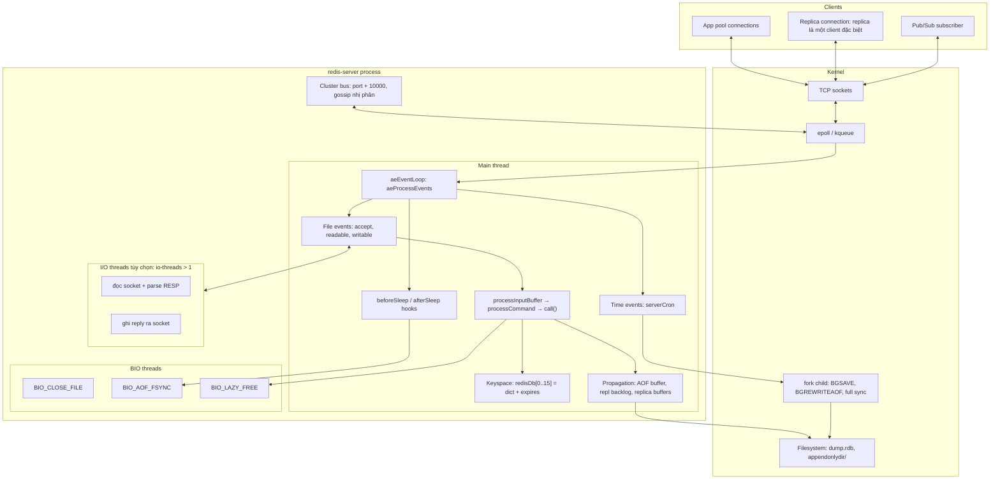
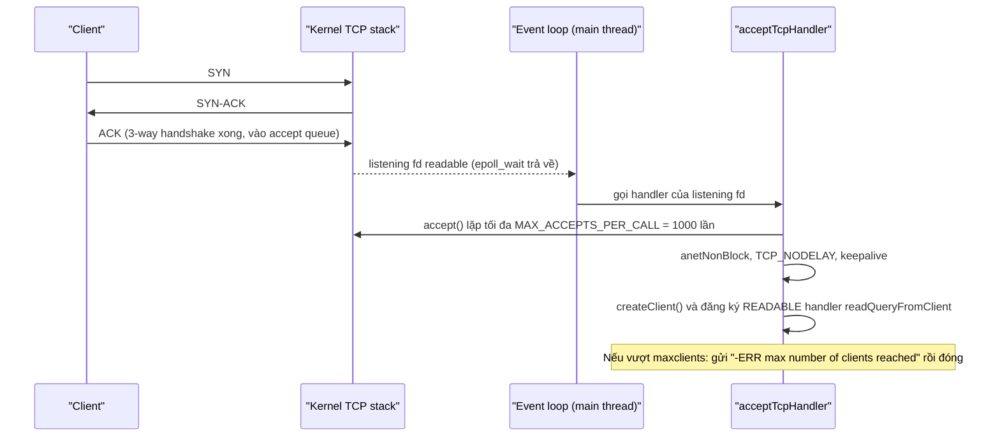
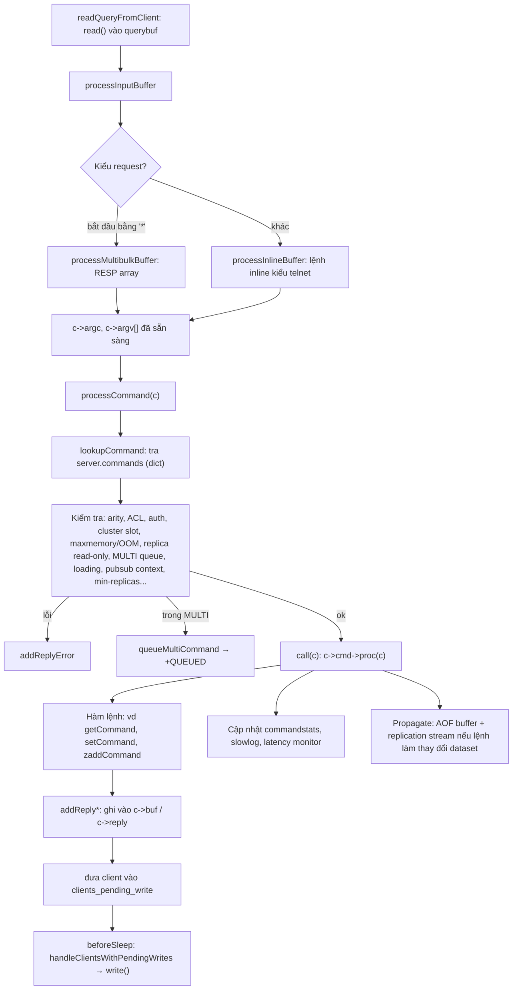
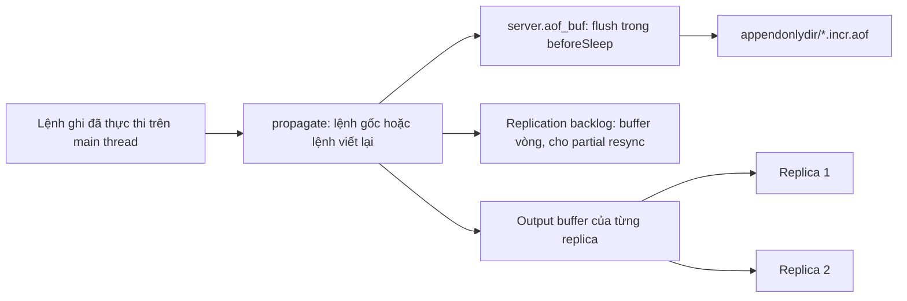
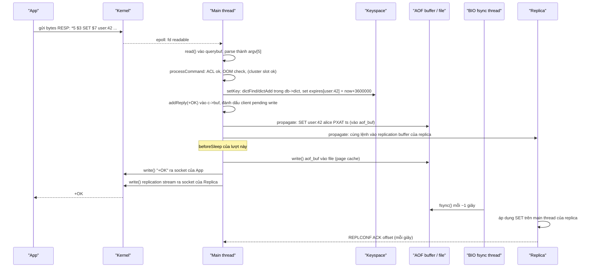

# PART 1 — REDIS ARCHITECTURE

> **Trước:** [00 — Redis Mental Model](00-redis-mental-model.md) · **Tiếp:** [02 — Why Redis Is Fast](02-why-redis-is-fast.md)
> **Độ ưu tiên:** Cao nhất. Đây là "bản đồ" của cả handbook. Mọi chương internals sau chỉ là phóng to một ô trong bản đồ này.

---

## Mục lục

1. [Simple mental model](#1-simple-mental-model)
2. [WHAT — Architecture tổng thể](#2-what--architecture-tổng-thể)
3. [WHY — Tại sao kiến trúc lại như vậy](#3-why--tại-sao-kiến-trúc-lại-như-vậy)
4. [HOW — Vòng đời process redis-server từ khởi động đến phục vụ](#4-how--vòng-đời-process-redis-server)
5. [INTERNALS 1 — Các cấu trúc trung tâm: `redisServer`, `client`, `redisDb`](#5-internals-1--các-cấu-trúc-trung-tâm)
6. [INTERNALS 2 — Networking và connection](#6-internals-2--networking-và-connection)
7. [INTERNALS 3 — Event loop: file event và time event](#7-internals-3--event-loop-file-event-và-time-event)
8. [INTERNALS 4 — `serverCron` và `beforeSleep`: những việc "nền" chạy trên main thread](#8-internals-4--servercron-và-beforesleep)
9. [INTERNALS 5 — Command processing pipeline](#9-internals-5--command-processing-pipeline)
10. [INTERNALS 6 — Các thread và process khác](#10-internals-6--các-thread-và-process-khác)
11. [INTERNALS 7 — Persistence, Replication, Cluster ghép vào đâu](#11-internals-7--persistence-replication-cluster-ghép-vào-đâu)
12. [DATA FLOW — Một lệnh SET đi qua toàn bộ kiến trúc](#12-data-flow--một-lệnh-set-đi-qua-toàn-bộ-kiến-trúc)
13. [WHAT HAPPENS IF](#13-what-happens-if)
14. [PERFORMANCE IMPACT](#14-performance-impact)
15. [PRODUCTION BEHAVIOR](#15-production-behavior)
16. [TRADE-OFF](#16-trade-off)
17. [COMMON MISUNDERSTANDINGS](#17-common-misunderstandings)
18. [INTERVIEW QUESTIONS](#18-interview-questions)
19. [KEY TAKEAWAYS](#19-key-takeaways)

---

## 1. Simple mental model

Redis giống một **quầy giao dịch ngân hàng có một giao dịch viên duy nhất (main thread)** nhưng được trang bị:

- **Một hệ thống chuông báo (epoll/kqueue)**: thay vì đi hỏi từng khách "anh có cần gì không?", giao dịch viên chỉ nhìn bảng đèn — đèn nào sáng thì khách đó đã sẵn sàng.
- **Một đồng hồ báo thức (time event)**: cứ mỗi 100 ms (mặc định `hz 10`) nhắc giao dịch viên làm việc định kỳ — dọn khách hết hạn (expire), kiểm tra backup, thống kê.
- **Nhân viên phụ (BIO threads)**: làm việc chậm và không cần đúng thứ tự — hủy giấy tờ lớn (lazy free), cất sổ vào két (fsync), đóng file.
- **Nhân viên phụ đọc/ghi thư (I/O threads, tùy chọn)**: bóc phong bì và dán phong bì hộ, nhưng **nội dung giao dịch vẫn do giao dịch viên chính xử lý**.
- **Người chụp ảnh sổ sách (fork child)**: được "nhân bản" từ giao dịch viên tại một thời điểm để chụp toàn bộ sổ mà giao dịch viên không phải dừng.
- **Đường dây nóng đến các chi nhánh (replication)** và **mạng nội bộ giữa các quầy (cluster bus)**.

---

## 2. WHAT — Architecture tổng thể



**Cách đọc diagram:**
1. **Clients** gồm cả app bình thường, **replica** (với primary, replica cũng là một client đặc biệt nhận replication stream) và subscriber Pub/Sub.
2. **Kernel** quản lý socket; Redis hỏi kernel "socket nào sẵn sàng?" qua **epoll** (Linux) hoặc **kqueue** (macOS/BSD).
3. **Main thread** chạy vòng lặp `aeProcessEvents`: xử lý file event (accept connection mới, đọc request, ghi reply), time event (`serverCron`), và các hook `beforeSleep`/`afterSleep`.
4. Request được parse thành lệnh, đi qua `processCommand` (kiểm tra) và `call()` (thực thi) — **toàn bộ trên main thread**.
5. Lệnh ghi được **propagate**: vào AOF buffer, replication backlog, và output buffer của từng replica.
6. **I/O threads** (nếu bật) chỉ lo bước đọc/parse/ghi socket; **BIO threads** lo việc chậm; **fork child** lo snapshot.
7. **Cluster bus** là một listening port riêng với giao thức nhị phân, cũng được xử lý trong event loop của main thread.

---

## 3. WHY — Tại sao kiến trúc lại như vậy

### 3.1 Vấn đề cần giải: hàng nghìn connection, mỗi lệnh chỉ vài microsecond

Workload Redis điển hình: **10.000 connection**, mỗi connection gửi lệnh nhỏ, mỗi lệnh thực thi **1–5 µs**. Thời gian thực thi quá nhỏ so với:
- chi phí **tạo/chuyển thread** (context switch ~1–5 µs),
- chi phí **lock** (uncontended mutex ~20–50 ns, contended có thể µs),
- chi phí **cache miss** khi dữ liệu nhảy giữa các core.

Nếu dùng mô hình "một thread mỗi connection" (như Apache prefork hay PostgreSQL một process mỗi connection), 10.000 thread sẽ tốn bộ nhớ stack (MB mỗi thread), scheduler overhead, và mọi cấu trúc dữ liệu chung phải có lock → thời gian quản lý lớn hơn thời gian làm việc thực.

### 3.2 Lời giải: Reactor pattern

Redis dùng **Reactor pattern**: một thread duy nhất chờ sự kiện trên nhiều file descriptor bằng I/O multiplexing, và **dispatch** từng sự kiện tới handler tương ứng. Handler phải **ngắn và không bao giờ block** (non-blocking socket). Cùng mô hình với Nginx (mỗi worker), Node.js, Netty (mỗi event loop).

Redis dùng thư viện event loop tự viết tên **`ae`** (A simple Event library, `ae.c`) với các backend: `ae_epoll.c`, `ae_kqueue.c`, `ae_evport.c` (Solaris), `ae_select.c` (fallback).

### 3.3 Tại sao không đa luồng cho phần thực thi

antirez giải thích nhiều lần: với Redis, **CPU hiếm khi là nút thắt; memory và network mới là**. Một core có thể thực thi hàng trăm nghìn đến hơn một triệu lệnh đơn giản mỗi giây. Đa luồng phần execute sẽ:
- buộc mọi data structure (dict, skiplist, quicklist...) phải thread-safe → lock hoặc lock-free phức tạp,
- phá vỡ đặc tính "mỗi lệnh atomic tự nhiên" mà MULTI/EXEC, Lua, WATCH dựa vào,
- làm code phức tạp và khó debug hơn nhiều.

Muốn dùng nhiều core → **chạy nhiều instance / Redis Cluster** (scale-out theo shard) thay vì đa luồng một instance. Chi tiết ở [Chương 4](04-threading-model.md).

### 3.4 Tại sao dùng fork cho snapshot

Để chụp một snapshot **nhất quán tại một thời điểm** của dataset đang bị ghi liên tục, cần hoặc: dừng ghi (chặn server), hoặc có MVCC, hoặc **để kernel làm hộ bằng Copy-on-Write** qua `fork()`. Redis chọn fork: child process nhìn thấy memory của parent "đông cứng" tại thời điểm fork, parent tiếp tục phục vụ, kernel chỉ copy page nào bị parent sửa ([Chương 35](35-copy-on-write.md)).

---

## 4. HOW — Vòng đời process redis-server

Hàm `main()` trong `server.c` (đơn giản hóa):

```text
main()
 ├─ initServerConfig()        # giá trị mặc định cho mọi config
 ├─ loadServerConfig()        # đọc redis.conf + tham số dòng lệnh
 ├─ initServer()
 │    ├─ aeCreateEventLoop(maxclients + CONFIG_FDSET_INCR)
 │    ├─ listenToPort()       # bind + listen TCP (và TLS, unix socket)
 │    ├─ tạo server.db[0..databases-1]: mỗi db có dict keys + dict expires
 │    ├─ aeCreateTimeEvent(serverCron, period 1ms rồi tự trả về 1000/hz)
 │    ├─ createSocketAcceptHandler()  # file event READABLE trên listening fd
 │    └─ aeSetBeforeSleepProc(beforeSleep), aeSetAfterSleepProc(afterSleep)
 ├─ InitServerLast()
 │    ├─ bioInit()            # khởi tạo BIO threads
 │    ├─ initThreadedIO()     # khởi tạo I/O threads nếu io-threads > 1
 │    └─ set_jemalloc_bg_thread()
 ├─ loadDataFromDisk()        # AOF nếu appendonly yes, ngược lại RDB
 └─ aeMain(server.el)         # while(!stop) aeProcessEvents(...)
```

**Giải thích từng bước:**

1. **Config**: mọi tham số (maxmemory, hz, io-threads, appendonly...) được nạp. Nhiều tham số đổi được lúc chạy bằng `CONFIG SET`.
2. **Event loop được tạo với kích thước = maxclients + dự phòng**: mảng `events[]` được index trực tiếp bằng số file descriptor — tra O(1) handler của fd. Đây là lý do `maxclients` ảnh hưởng tới memory khởi tạo và bị giới hạn bởi `ulimit -n`.
3. **Listening socket** được đăng ký một file event READABLE với handler `acceptTcpHandler`: khi có kết nối mới, kernel đánh dấu listening fd readable.
4. **Keyspace** được tạo: mặc định 16 database logic, mỗi cái là một cặp dict.
5. **serverCron** được đăng ký làm time event chạy lặp, tần suất `hz` lần/giây (mặc định 10; tối đa 500).
6. **Background threads** khởi tạo.
7. **Load dữ liệu** từ disk — trong lúc này server **đã** có thể accept connection nhưng trả lỗi `-LOADING` cho hầu hết lệnh ([Chương 38](38-startup-recovery.md)).
8. **`aeMain`** — vòng lặp vô tận cho đến khi SHUTDOWN.

---

## 5. INTERNALS 1 — Các cấu trúc trung tâm

### 5.1 `struct redisServer server` — trạng thái toàn cục

Một biến global duy nhất chứa **mọi thứ**: event loop, danh sách client, mảng database, config, thống kê, trạng thái persistence (`child_pid`, `aof_buf`, `dirty` — số thay đổi từ lần save cuối), trạng thái replication (`master`, `slaves`, `repl_backlog`, `master_repl_offset`, `replid`), cluster state, command table (`server.commands`)...

Vì chỉ main thread đọc/ghi phần lớn các field này, **không cần lock**. Các field được thread khác chạm vào (ví dụ counter của lazy free, trạng thái fsync) dùng biến atomic.

### 5.2 `struct client` — trạng thái của một connection

Mỗi connection có một `client` (định nghĩa trong `server.h`), các field quan trọng:

| Field | Ý nghĩa | Liên quan chương |
|---|---|---|
| `conn` | connection abstraction (socket, TLS, unix) | 6 |
| `db` | database hiện tại (SELECT) | 19 |
| `querybuf` | SDS chứa bytes đọc từ socket chưa xử lý | 3, 5 |
| `argc`, `argv` | lệnh đã parse (mảng robj) | 5, 6 |
| `cmd`, `lastcmd` | con trỏ tới struct lệnh trong command table | 9 |
| `buf[]` + `bufpos` | reply buffer tĩnh (16 KB) | 3 |
| `reply` (list) | danh sách block reply khi vượt buf tĩnh | 3, 28 |
| `reply_bytes` | tổng bytes reply đang chờ gửi | 51 |
| `flags` | CLIENT_MULTI, CLIENT_BLOCKED, CLIENT_SLAVE, CLIENT_PUBSUB, CLIENT_DIRTY_CAS... | 30, 18 |
| `mstate` | hàng đợi lệnh trong MULTI | 30 |
| `bstate` | trạng thái blocking (BLPOP, XREAD BLOCK...) | 11, 17 |
| `user` | ACL user | 50 |
| `resp` | 2 hoặc 3 | 5 |

**Hệ quả vận hành**: mỗi client tốn memory cố định (~vài KB–20 KB tùy version) + querybuf + reply buffers. 50.000 connection nhàn rỗi có thể tốn hàng trăm MB. Output buffer của client đọc chậm có thể phình tới hàng GB nếu không có `client-output-buffer-limit` ([Chương 53](53-production-failure-scenarios.md)).

### 5.3 `redisDb` — một database logic

```c
typedef struct redisDb {
    dict *dict;          /* keyspace: key (sds) → value (robj*) */
    dict *expires;       /* key → thời điểm hết hạn (ms, unix time) */
    dict *blocking_keys; /* key → danh sách client đang BLPOP trên key đó */
    dict *ready_keys;    /* key có dữ liệu mới cho client đang block */
    dict *watched_keys;  /* key → danh sách client WATCH key đó */
    int id;
    long long avg_ttl;
    unsigned long expires_cursor; /* con trỏ cho active expire */
    ...
} redisDb;
```

Từ các bản Redis 7.x mới, `dict`/`expires` được bọc trong abstraction **`kvstore`** — ở cluster mode, keyspace được chia thành **một dict cho mỗi hash slot** (16384 dict nhỏ), giúp đếm key theo slot, lấy key theo slot để migrate, và resize từng dict nhỏ thay vì một dict khổng lồ. Ý tưởng mô hình vẫn như trên: **tra key = tra hash table** ([Chương 19](19-keyspace.md)).

---

## 6. INTERNALS 2 — Networking và connection

### 6.1 Accept kết nối



**Cách đọc diagram:**
1. TCP handshake do **kernel** hoàn tất; connection đã sẵn sàng nằm trong **accept queue** (kích thước giới hạn bởi `tcp-backlog` 511 mặc định và `net.core.somaxconn`).
2. Kernel báo listening socket readable → epoll trả về → event loop gọi handler accept.
3. Handler gọi `accept()` **nhiều lần trong một lượt** (tối đa 1000) để vét hàng đợi, giảm số vòng lặp.
4. Socket mới được đặt **non-blocking** (bắt buộc cho reactor), bật **TCP_NODELAY** (tắt Nagle để gửi reply nhỏ ngay), và keepalive (`tcp-keepalive 300` giây).
5. Tạo struct `client`, đăng ký handler đọc. Từ đây, mỗi khi socket có dữ liệu, `readQueryFromClient` được gọi.

**Nếu accept queue đầy** (ví dụ connection storm khi app restart hàng loạt và main thread đang bận): kernel drop SYN hoặc reset tùy cấu hình → client thấy timeout khi connect. Metric `rejected_connections` chỉ đếm trường hợp vượt `maxclients`, không đếm drop ở kernel.

### 6.2 Connection abstraction

Từ Redis 6 (hoàn thiện ở 7.0), Redis có lớp `connection` (`connection.h`, `socket.c`, `tls.c`, `unix.c`) với vtable `ConnectionType`: `read`, `write`, `set_read_handler`... Nhờ vậy cùng logic xử lý client chạy trên TCP thuần, TLS, hay Unix socket. TLS thêm chi phí mã hóa/giải mã **trên thread làm I/O** (main thread hoặc I/O thread) — một nguyên nhân khiến TLS làm giảm throughput đáng kể nếu không bật I/O threads.

### 6.3 Buffer đọc và buffer ghi

- **Query buffer** (`c->querybuf`): đọc tối đa `PROTO_IOBUF_LEN` = 16 KB mỗi lần `read()` (lớn hơn khi đang đọc một bulk string lớn). Giới hạn `client-query-buffer-limit` (mặc định 1 GB) — vượt thì đóng connection.
- **Reply buffer**: ghi vào `c->buf` tĩnh 16 KB trước; hết chỗ thì cấp phát block vào list `c->reply`. Giới hạn bởi `client-output-buffer-limit` theo lớp client (normal/replica/pubsub).

---

## 7. INTERNALS 3 — Event loop: file event và time event

Chi tiết đầy đủ ở [Chương 3](03-event-loop.md). Ở đây chỉ nắm cấu trúc:

```c
typedef struct aeEventLoop {
    int maxfd;
    int setsize;              /* số fd tối đa theo dõi */
    long long timeEventNextId;
    aeFileEvent *events;      /* mảng index theo fd: mask + rfileProc + wfileProc */
    aeFiredEvent *fired;      /* fd đã sẵn sàng sau lần poll */
    aeTimeEvent *timeEventHead;
    int stop;
    void *apidata;            /* dữ liệu của backend: epoll fd, kqueue fd... */
    aeBeforeSleepProc *beforesleep;
    aeBeforeSleepProc *aftersleep;
    int flags;
} aeEventLoop;
```

- **File event**: gắn với một fd và một mask (`AE_READABLE`, `AE_WRITABLE`, cờ `AE_BARRIER`). Handler được gọi khi kernel báo fd sẵn sàng.
- **Time event**: một danh sách liên kết các timer (thực tế chủ yếu có `serverCron`, và vài timer của module). Mỗi lượt, event loop tính **timeout cho epoll_wait = thời gian tới timer gần nhất** để không ngủ quá giờ.

Một lượt `aeProcessEvents`:

```text
1. Tính timeout = thời gian tới time event gần nhất (hoặc 0 nếu có việc pending)
2. beforeSleep()                     # việc phải làm trước khi ngủ
3. numevents = aeApiPoll(timeout)    # epoll_wait / kevent — CHỖ DUY NHẤT main thread "ngủ"
4. afterSleep()
5. for mỗi fd fired: gọi rfileProc và/hoặc wfileProc (thứ tự đọc trước, ghi sau, trừ AE_BARRIER)
6. processTimeEvents()               # chạy serverCron nếu đến giờ
```

---

## 8. INTERNALS 4 — `serverCron` và `beforeSleep`

Đây là nơi rất nhiều hành vi production xuất phát. Cả hai **chạy trên main thread** — nghĩa là nếu chúng làm việc nặng, lệnh của client phải chờ.

### 8.1 `serverCron` — chạy `hz` lần mỗi giây

| Việc | Hàm / cơ chế | Chương |
|---|---|---|
| Cập nhật clock cache (`server.unixtime`, `mstime`), LRU clock | `updateCachedTime`, `server.lruclock` | 20, 23 |
| Thống kê ops/sec, network | `trackInstantaneousMetric` | 51 |
| Xử lý client: timeout idle (`timeout`), co query buffer, đo memory client | `clientsCron` | 51 |
| Active expire (slow cycle), incremental rehash, resize dict | `databasesCron` → `activeExpireCycle`, `incrementallyRehash`, `tryResizeHashTables` | 8, 20 |
| Active defrag (nếu bật) | `activeDefragCycle` | 22 |
| Kiểm tra child process (BGSAVE/AOF rewrite xong chưa) | `checkChildrenDone` | 34, 37 |
| Trigger BGSAVE theo `save` point, trigger AOF rewrite theo tăng trưởng | trong `serverCron` | 34, 37 |
| Retry flush AOF bị trì hoãn | `flushAppendOnlyFile` | 36 |
| Replication cron (1 lần/giây): ping replica, timeout, reconnect | `replicationCron` | 39 |
| Cluster cron (10 lần/giây): gossip ping, failure detection | `clusterCron` | 43 |
| Đóng client được đánh dấu close async | `freeClientsInAsyncFreeQueue` | — |
| Evict client khi vượt `maxmemory-clients` (7.0) | `evictClients` | 21 |

`hz` cao (ví dụ 100) → expire chính xác hơn, client timeout nhanh hơn, nhưng tốn CPU khi idle. `dynamic-hz yes` (mặc định từ 5.0) tự tăng hz khi số client lớn để `clientsCron` xử lý đủ client mỗi giây.

### 8.2 `beforeSleep` — chạy mỗi lượt event loop, trước khi ngủ

| Việc | Tại sao ở đây |
|---|---|
| Xử lý client vừa được unblock (BLPOP có dữ liệu) | Phản hồi ngay trong lượt này |
| Active expire **fast cycle** | Nhanh, ngắn (≤ 1 ms), bổ sung cho slow cycle |
| Gửi `REPLCONF GETACK` nếu có client đang `WAIT` | Hỏi replica offset |
| **Flush AOF buffer** (`flushAppendOnlyFile`) | Ghi AOF **trước khi** gửi reply → reply chỉ đến client khi lệnh đã vào file (write, chưa chắc fsync) |
| **Gửi reply** cho các client có pending write (`handleClientsWithPendingWrites`) | Thử `write()` trực tiếp, chỉ đăng ký WRITABLE handler nếu không ghi hết |
| Đóng client async, xử lý tracking invalidation, module hooks | — |

Thứ tự "flush AOF trước, gửi reply sau" là **thiết kế có chủ ý**: với `appendfsync always`, fsync xảy ra trước khi client nhận OK → khi client thấy OK, dữ liệu đã trên disk. Với `everysec`, dữ liệu đã được `write()` vào page cache của kernel (sống sót nếu Redis crash, nhưng chưa chắc sống nếu **máy** crash).

---

## 9. INTERNALS 5 — Command processing pipeline



**Cách đọc diagram (từng bước):**
1. **Đọc**: bytes từ socket vào `querybuf`. Một lần đọc có thể chứa **nhiều lệnh** (pipelining) hoặc **một phần** lệnh (lệnh lớn, TCP phân mảnh).
2. **Parse**: `processInputBuffer` lặp: chừng nào querybuf còn chứa lệnh hoàn chỉnh thì parse một lệnh và thực thi, rồi lặp tiếp. Lệnh chưa đủ bytes → chờ lần đọc sau. Chi tiết parse RESP ở [Chương 5](05-resp-protocol.md).
3. **`processCommand`** là "trạm kiểm soát": lệnh có tồn tại không, đúng số tham số không, user có quyền không, key có thuộc slot của node này không (cluster), memory có vượt `maxmemory` không (nếu có thì **evict ngay tại đây** trước khi chạy lệnh có thể tăng memory — [Chương 23](23-maxmemory-eviction.md)), có đang trong MULTI không (xếp hàng thay vì chạy)...
4. **`call()`** gọi hàm C của lệnh, đo thời gian thực thi (cho SLOWLOG, `commandstats`, latency monitor), và nếu lệnh làm "dirty" dataset thì **propagate** sang AOF và replica.
5. **Reply** được ghi vào buffer của client, **chưa** ghi ra socket ngay. Client được đưa vào danh sách chờ ghi.
6. **`beforeSleep`** ghi reply của tất cả client đang chờ trong một lượt, gom nhiều reply vào ít syscall hơn.

---

## 10. INTERNALS 6 — Các thread và process khác

| Thành phần | Có từ | Làm gì | Chạm vào dataset không? |
|---|---|---|---|
| **Main thread** | luôn luôn | Event loop, execute mọi lệnh, cron, propagate | Có — là chủ sở hữu duy nhất |
| **BIO_CLOSE_FILE** | 2.6 | `close()` file lớn (close file đã unlink có thể mất lâu vì kernel phải giải phóng block) | Không |
| **BIO_AOF_FSYNC** | 2.6 | `fsync()` AOF mỗi giây với `everysec` | Không |
| **BIO_LAZY_FREE** | 4.0 | Giải phóng object lớn sau UNLINK/FLUSHALL ASYNC/evict/expire lazy | Có, nhưng chỉ object **đã được gỡ khỏi keyspace** → không ai khác thấy nó nữa |
| **I/O threads** | 6.0; viết lại ở 8.0 | Đọc socket + parse, ghi socket | Không thực thi lệnh |
| **jemalloc background thread** | 6.0 (`jemalloc-bg-thread yes`) | Purge dirty page trả về OS | Không |
| **Fork child** | luôn luôn | Ghi RDB (BGSAVE, full sync) hoặc AOF base (rewrite) | Đọc bản đông cứng (COW) |
| **Module threads** | 4.0 | Module có thể tạo thread, phải lấy GIL (`RedisModule_ThreadSafeContextLock`) để chạm dataset | Qua GIL |

Chi tiết ở [Chương 4](04-threading-model.md).

---

## 11. INTERNALS 7 — Persistence, Replication, Cluster ghép vào đâu

### 11.1 Propagation: điểm hội tụ

Mọi thay đổi dataset đi qua **một cửa**: sau khi `call()` thực thi lệnh ghi thành công, Redis gọi cơ chế propagate (`alsoPropagate` → `propagatePendingCommands`), gửi **cùng một chuỗi lệnh** tới:



**Cách đọc diagram:** Lệnh có thể được **viết lại** trước khi propagate để đảm bảo tính tất định: `EXPIRE k 10` → `PEXPIREAT k <timestamp tuyệt đối>`; `SPOP s` → `SREM s <phần tử thực sự bị pop>`; `INCRBYFLOAT` → `SET` giá trị cuối; key hết hạn → `DEL`/`UNLINK`. Nhờ vậy AOF và replica **tái hiện đúng kết quả**, không phụ thuộc thời điểm hay random. Từ Redis 7.0, Redis dùng buffer replication **chia sẻ** giữa backlog và các replica (đếm tham chiếu) để không nhân bản dữ liệu N lần.

### 11.2 Replication

Replica là một client đặc biệt: sau handshake `PSYNC`, primary gửi RDB (full sync) hoặc phần backlog thiếu (partial), rồi **stream liên tục** lệnh ghi. Replica áp dụng lệnh như một client "fake master" trên main thread của chính nó ([Chương 39](39-replication.md)).

### 11.3 Cluster

Khi `cluster-enabled yes`:
- Node mở thêm **cluster bus port** (mặc định port + 10000, cấu hình `cluster-port` từ 7.0).
- `processCommand` gọi `getNodeByQuery` để kiểm tra slot của key: không phải của mình → trả `-MOVED`/`-ASK`.
- `clusterCron` chạy 10 lần/giây: gửi PING/PONG gossip, phát hiện node lỗi, điều phối failover ([Chương 43](43-redis-cluster.md)).

---

## 12. DATA FLOW — Một lệnh SET đi qua toàn bộ kiến trúc

`SET user:42 "alice" EX 3600` trên một primary có AOF everysec và 1 replica:



**Cách đọc diagram:**
1. App gửi lệnh; kernel báo socket readable.
2. Main thread đọc, parse, kiểm tra, **thực thi** (cập nhật `dict` và `expires`), rồi ghi `+OK` vào buffer.
3. Lệnh được propagate — lưu ý `EX 3600` được viết lại thành thời điểm tuyệt đối để replica/AOF không kéo dài TTL.
4. Trong `beforeSleep`: **AOF được write trước**, rồi reply được gửi. Replication stream được ghi khi socket replica writable (thường cùng lượt).
5. **Client nhận OK trước khi**: dữ liệu được fsync (tối đa ~1 s sau), và trước khi replica chắc chắn nhận được. Đây chính là **cửa sổ mất dữ liệu** được phân tích ở [Chương 40](40-async-replication.md).

---

## 13. WHAT HAPPENS IF

### 13.1 Main thread bị chặn 2 giây (lệnh O(N), Lua dài, swap)

- Không accept connection mới (accept queue đầy dần).
- Không đọc request, không gửi reply → client timeout.
- `serverCron` không chạy → không expire, không replication ping, không cluster ping.
- Nếu bị chặn lâu hơn `cluster-node-timeout` hoặc `down-after-milliseconds` → **node bị coi là chết**, failover xảy ra dù process vẫn sống → **split brain tạm thời** khi nó "tỉnh lại".

### 13.2 BIO fsync thread bị chậm (disk chậm)

Với `everysec`, nếu fsync trước chưa xong sau 2 giây, main thread **sẽ block trên `write()`** AOF (vì kernel khóa inode trong lúc fsync trên một số filesystem) → latency spike. Log: "Asynchronous AOF fsync is taking too long (disk is busy?)" ([Chương 36](36-aof.md)).

### 13.3 Fork trên instance 50 GB

`fork()` phải copy **page table** (~100 MB với page 4 KB) → main thread đứng hình hàng chục đến hàng trăm ms (`latest_fork_usec`). Sau đó mỗi page bị ghi sẽ bị copy → RSS tăng ([Chương 35](35-copy-on-write.md)).

### 13.4 Client đọc chậm (subscriber, MONITOR, replica chậm)

Reply dồn trong output buffer của client đó trên memory của Redis. Vượt `client-output-buffer-limit` → client bị ngắt. Không có limit (normal client mặc định 0 0 0) → memory Redis phình, có thể gây eviction hàng loạt hoặc OOM.

---

## 14. PERFORMANCE IMPACT

- **Mỗi request có chi phí cố định** (read syscall, parse, write syscall, epoll) lớn hơn nhiều so với chi phí thực thi lệnh O(1). Vì vậy: **batching/pipelining** tăng throughput gấp 5–10 lần ([Chương 29](29-pipelining.md)).
- **Mọi việc trên main thread cộng dồn**: thực thi lệnh + expire + rehash + defrag + eviction + propagate + (nếu không bật I/O threads) toàn bộ I/O mạng/TLS. Khi `used_cpu_sys_main_thread + used_cpu_user_main_thread` tiến gần 1 core → Redis bão hòa, dù máy có 32 core.
- **Kiến trúc một-thread cho phép dự đoán**: latency của một lệnh ≈ thời gian chờ các lệnh xếp trước + thời gian thực thi của nó. Không có lock wait, không có deadlock.

---

## 15. PRODUCTION BEHAVIOR

- Biểu đồ CPU host thấp (ví dụ 8% trên máy 16 core) **không** có nghĩa Redis nhàn: một core ở 100% chỉ là ~6% của 16 core. Luôn nhìn **CPU của main thread**.
- Latency spike định kỳ đều đặn (mỗi X phút) → thường là **BGSAVE fork** hoặc **AOF rewrite**. Spike ngẫu nhiên → lệnh chậm, big key, eviction, expire hàng loạt.
- Sau restart, instance lớn có thể mất vài phút ở trạng thái `LOADING` → health check phải phân biệt "process sống" và "sẵn sàng phục vụ".

---

## 16. TRADE-OFF

| Quyết định kiến trúc | Được | Mất |
|---|---|---|
| Reactor một thread | Không lock, atomic tự nhiên, code đơn giản, latency dự đoán được | Không tận dụng nhiều core cho execute; một lệnh chậm chặn tất cả |
| Việc nền (expire, rehash, defrag) chạy trên main thread theo lát cắt thời gian | Không cần đồng bộ | Tốn CPU của thread quý nhất; phải giới hạn thời gian mỗi lát |
| Fork + COW cho snapshot | Snapshot nhất quán không dừng server | Fork latency, memory tăng tới 2x khi ghi nhiều |
| Propagate sau execute, trước reply | Đơn giản, thứ tự xác định | Replication async → có cửa sổ mất dữ liệu |
| BIO/I/O threads cho việc không chạm dataset | Giảm tải main thread mà giữ mô hình đơn giản | Phức tạp hơn một chút; không tăng tốc phần execute |

---

## 17. COMMON MISUNDERSTANDINGS

| Hiểu sai | Thực tế |
|---|---|
| "Redis tạo một thread cho mỗi connection" | Một event loop phục vụ mọi connection qua epoll/kqueue |
| "Reply được gửi ngay khi lệnh chạy xong" | Reply vào buffer; được ghi ra socket trong `beforeSleep` của cùng lượt (hoặc qua WRITABLE handler nếu socket đầy) |
| "Expire và rehash chạy ở background thread" | Chạy trên main thread, theo lát cắt thời gian trong `serverCron`/`beforeSleep` |
| "Replica nhận dữ liệu trước khi client nhận OK" | Không đảm bảo; client có thể nhận OK trước |
| "BGSAVE không ảnh hưởng latency" | Fork chặn main thread; COW tăng memory và page fault |
| "`hz` cao hơn luôn tốt hơn" | Tốn CPU hơn khi idle; chỉ tăng khi có lý do (nhiều key hết hạn, nhiều client) |

---

## 18. INTERVIEW QUESTIONS

1. **Mô tả kiến trúc của một Redis server.**
   → Reactor một thread (ae + epoll/kqueue), file event cho socket, time event cho serverCron, pipeline processCommand/call, propagate sang AOF và replica, BIO threads, fork child cho snapshot, I/O threads tùy chọn.
2. **`serverCron` làm gì? Nếu nó không chạy thì sao?**
   → Expire slow cycle, rehash, resize, client timeout, kiểm tra child, trigger save/rewrite, replication/cluster cron. Nếu không chạy (main thread bị chặn): key hết hạn không bị xóa chủ động, replica/cluster không nhận ping → có thể failover nhầm.
3. **Tại sao AOF được flush trong `beforeSleep` trước khi gửi reply?**
   → Để với `appendfsync always`, client chỉ nhận OK khi dữ liệu đã fsync; với `everysec`, ít nhất đã `write()` vào kernel.
4. **Một lệnh ghi được propagate như thế nào? Tại sao EXPIRE bị viết lại?**
   → Qua `alsoPropagate` tới AOF buffer, backlog, replica buffers. Viết lại thành PEXPIREAT/PXAT để replay không phụ thuộc thời điểm replay.
5. **(Senior) Tại sao một lệnh chạy 20 giây có thể gây failover dù process không chết?**
   → Main thread không trả lời PING của Sentinel/cluster; vượt `down-after-milliseconds`/`cluster-node-timeout` → bị đánh dấu down → promote replica. Khi lệnh xong, node cũ vẫn tưởng mình là primary cho tới khi bị reconfigure → có thể mất ghi.

---

## 19. KEY TAKEAWAYS

- Redis = **một event loop** (ae) trên epoll/kqueue + **một main thread** thực thi mọi lệnh + các thread/process phụ cho việc không chạm dataset đang sống.
- Pipeline xử lý: **read → parse → processCommand (kiểm tra, evict) → call (execute) → propagate (AOF, replica) → buffer reply → beforeSleep (flush AOF, write reply)**.
- `serverCron` và `beforeSleep` chứa rất nhiều "việc nền" — **nhưng vẫn trên main thread**, chiếm thời gian của cùng thread phục vụ client.
- Propagation là điểm hội tụ của persistence và replication; lệnh được viết lại để tái hiện tất định.
- Hiểu kiến trúc này giải thích được gần như mọi hiện tượng production: latency spike, failover nhầm, memory phình, mất dữ liệu khi failover.
