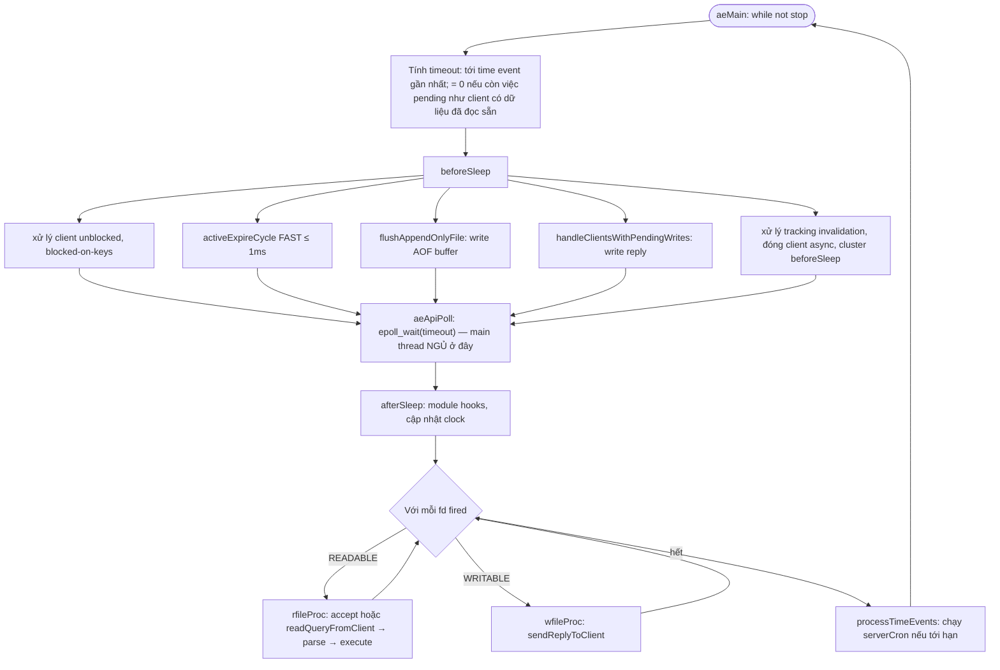
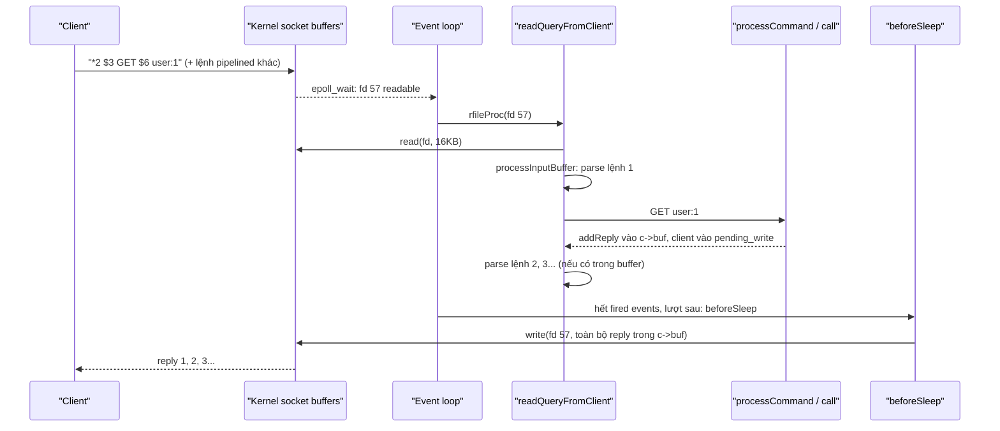
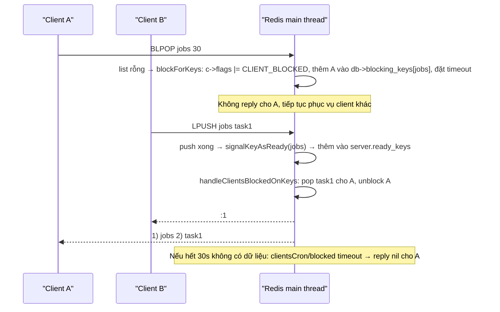

# PART 3 — EVENT LOOP

> **Trước:** [02 — Why Redis Is Fast](02-why-redis-is-fast.md) · **Tiếp:** [04 — Threading Model](04-threading-model.md)
> **Độ ưu tiên:** Cao nhất. Event loop là "trái tim" của Redis. Hiểu nó là hiểu vì sao Redis nhanh, vì sao một lệnh chậm làm sập cả hệ thống, và vì sao latency spike có hình dạng như ta thấy trong production.

---

## Mục lục

1. [Simple mental model](#1-simple-mental-model)
2. [WHAT — Event-driven architecture](#2-what--event-driven-architecture)
3. [WHY — Tại sao không dùng thread-per-connection](#3-why--tại-sao-không-dùng-thread-per-connection)
4. [Nền tảng OS: file descriptor, socket, blocking vs non-blocking](#4-nền-tảng-os-file-descriptor-socket-blocking-vs-non-blocking)
5. [I/O multiplexing: select, poll, epoll, kqueue](#5-io-multiplexing-select-poll-epoll-kqueue)
6. [INTERNALS 1 — Thư viện `ae`](#6-internals-1--thư-viện-ae)
7. [INTERNALS 2 — Một vòng event loop chi tiết](#7-internals-2--một-vòng-event-loop-chi-tiết)
8. [INTERNALS 3 — accept → read → parse → execute → write](#8-internals-3--accept--read--parse--execute--write)
9. [INTERNALS 4 — Công bằng giữa các client](#9-internals-4--công-bằng-giữa-các-client)
10. [INTERNALS 5 — Time event và serverCron](#10-internals-5--time-event-và-servercron)
11. [INTERNALS 6 — Blocking command không block event loop](#11-internals-6--blocking-command-không-block-event-loop)
12. [Head-of-Line Blocking](#12-head-of-line-blocking)
13. [WHAT HAPPENS IF — Một lệnh chạy 500 ms](#13-what-happens-if--một-lệnh-chạy-500-ms)
14. [PERFORMANCE IMPACT](#14-performance-impact)
15. [PRODUCTION BEHAVIOR](#15-production-behavior)
16. [TRADE-OFF](#16-trade-off)
17. [WHEN TO USE / WHEN NOT TO USE (mô hình event loop)](#17-when-to-use--when-not-to-use)
18. [COMMON MISUNDERSTANDINGS](#18-common-misunderstandings)
19. [INTERVIEW QUESTIONS](#19-interview-questions)
20. [KEY TAKEAWAYS](#20-key-takeaways)

---

## 1. Simple mental model

Một **đầu bếp duy nhất** trong nhà hàng có 10.000 bàn:

- Đầu bếp **không đứng chờ** ở bàn nào. Anh ta nhìn **bảng đèn** (epoll): bàn nào bấm chuông thì đèn sáng.
- Mỗi lượt: nhìn bảng đèn → với mỗi bàn đèn sáng, nhận order (read), đọc hiểu (parse), nấu (execute), đặt món lên khay chờ mang ra (reply buffer).
- Trước khi quay lại nhìn bảng đèn, anh ta **mang tất cả khay ra một lượt** (beforeSleep: write reply) và **ghi sổ nhật ký** (flush AOF).
- Cứ mỗi 100 ms, chuông hẹn giờ (serverCron) nhắc anh ta làm việc lặt vặt: dọn đồ quá hạn, kiểm tra kho.
- Mọi món ăn thường nấu trong vài giây — nhưng nếu có bàn gọi món "hầm 3 tiếng" mà đầu bếp **đứng canh nồi**, cả nhà hàng dừng lại.

---

## 2. WHAT — Event-driven architecture

**Event-driven architecture (reactor pattern)**: chương trình không chạy theo luồng tuần tự "làm A rồi chờ B", mà là một vòng lặp:

```text
while (true) {
    events = wait_for_events()      // chờ kernel báo có gì sẵn sàng
    for (e in events) dispatch(e)   // gọi handler tương ứng
    run_timers_if_due()
}
```

Ba điều kiện để mô hình này hoạt động:
1. **Mọi I/O phải non-blocking**: handler không bao giờ được "ngồi chờ" socket/disk.
2. **Mọi handler phải ngắn**: vì trong lúc handler chạy, không event nào khác được xử lý.
3. **Có cơ chế hỏi kernel hiệu quả** "trong N nghìn fd, cái nào sẵn sàng?" → I/O multiplexing.

Redis thỏa (1) và (3) một cách triệt để. Điều kiện (2) **phụ thuộc vào bạn**: Redis tin rằng lệnh bạn gửi là ngắn. Nếu bạn gửi `KEYS *`, điều kiện (2) bị phá vỡ.

---

## 3. WHY — Tại sao không dùng thread-per-connection

| Tiêu chí | Thread-per-connection | Event loop (Redis) |
|---|---|---|
| Memory mỗi connection | Stack 1–8 MB (virtual) + kernel struct | Vài KB (`struct client` + buffer) |
| 10.000 connection | 10.000 thread, scheduler overhead lớn | 1 thread, epoll với 10.000 fd |
| Chia sẻ dữ liệu | Cần lock trên mọi cấu trúc | Không cần lock |
| Context switch | Mỗi khi thread block/unblock | Gần như không (chỉ khi epoll_wait ngủ) |
| Chi phí khi mỗi request chỉ 1 µs work | Overhead ≫ work | Overhead nhỏ, gom được nhiều request một lượt |
| Lệnh chậm | Chỉ chặn thread của nó (nhưng giữ lock thì chặn người khác) | Chặn toàn bộ |

Với workload "nhiều connection, mỗi request cực nhỏ, dữ liệu chia sẻ", event loop tối ưu hơn hẳn. Đây là "C10K problem" nổi tiếng mà Nginx, Node.js, Redis đều giải bằng event loop.

---

## 4. Nền tảng OS: file descriptor, socket, blocking vs non-blocking

### 4.1 File descriptor

Trong Unix, **file descriptor (fd)** là một số nguyên nhỏ mà kernel cấp cho process để đại diện một tài nguyên I/O mở: file, socket, pipe, eventfd... Redis có:
- fd của **listening socket** (port 6379, và cluster bus port),
- một fd cho **mỗi client connection**,
- fd của file AOF, RDB tạm, pipe giao tiếp với child process, eventfd/pipe cho I/O threads...

Giới hạn số fd: `ulimit -n`. Redis khi khởi động tính `maxclients + 32` (dự phòng) và cố nâng limit; nếu không được thì **giảm maxclients** và in warning.

### 4.2 Socket và buffer của kernel

Mỗi TCP socket có **receive buffer** và **send buffer** trong kernel:
- Client gửi dữ liệu → nằm trong receive buffer của socket phía Redis cho tới khi Redis gọi `read()`.
- Redis gọi `write()` → dữ liệu được copy vào send buffer của kernel → kernel lo gửi qua mạng, retransmit... `write()` trả về ngay khi đã copy xong vào kernel, **không** chờ client nhận.

### 4.3 Blocking vs non-blocking

- **Blocking socket**: `read()` khi receive buffer rỗng → thread **ngủ** cho tới khi có dữ liệu. `write()` khi send buffer đầy → thread ngủ.
- **Non-blocking socket** (`O_NONBLOCK`): `read()` khi rỗng → trả về `-1` với `errno = EAGAIN` **ngay lập tức**. `write()` khi đầy → ghi được bao nhiêu trả về bấy nhiêu (partial write) hoặc `EAGAIN`.

Redis đặt **mọi** client socket ở non-blocking (`anetNonBlock`). Vì vậy main thread không bao giờ ngủ trên một socket cụ thể — nó chỉ ngủ ở **một chỗ duy nhất**: `epoll_wait`/`kevent`.

---

## 5. I/O multiplexing: select, poll, epoll, kqueue

I/O multiplexing = một syscall hỏi kernel: "trong tập fd này, cái nào đọc/ghi được mà không block?"

### 5.1 `select`

```c
int select(int nfds, fd_set *readfds, fd_set *writefds, fd_set *exceptfds, struct timeval *timeout);
```
- `fd_set` là bitmap cố định `FD_SETSIZE` = 1024 bit → **tối đa fd số 1023**.
- Mỗi lần gọi phải **copy toàn bộ bitmap** vào kernel và kernel **quét tuyến tính** mọi fd → O(N) với N = fd lớn nhất.
- Kết quả ghi đè lên bitmap → phải tạo lại mỗi lần, và user-space lại phải quét O(N) tìm bit nào bật.
Redis có `ae_select.c` chỉ làm fallback.

### 5.2 `poll`

Bỏ giới hạn 1024 (dùng mảng `struct pollfd`), nhưng vẫn **O(N) mỗi lần gọi** (copy + quét).

### 5.3 `epoll` (Linux)

```c
int epfd = epoll_create(1024);
epoll_ctl(epfd, EPOLL_CTL_ADD, fd, &ev);   // đăng ký MỘT LẦN
int n = epoll_wait(epfd, events, maxevents, timeout_ms);  // chỉ trả về fd sẵn sàng
```
- **Tập fd quan tâm nằm trong kernel** (cây đỏ-đen trong `eventpoll`), đăng ký/hủy một lần qua `epoll_ctl`, không copy lại mỗi lần chờ.
- Khi một socket có dữ liệu, kernel (qua callback trên wait queue của socket) **đưa fd vào ready list**. `epoll_wait` chỉ cần copy ready list ra user-space.
- Chi phí mỗi lần chờ: **O(số fd sẵn sàng)**, không phụ thuộc tổng số fd.
- Hai chế độ: **level-triggered** (mặc định — còn dữ liệu thì còn báo) và **edge-triggered** (`EPOLLET` — chỉ báo khi trạng thái chuyển). **Redis dùng level-triggered**: nếu một lượt chỉ đọc 16 KB mà socket còn dữ liệu, lượt sau epoll vẫn báo readable → không bao giờ "quên" dữ liệu. Đơn giản và an toàn hơn edge-triggered (vốn đòi hỏi đọc tới EAGAIN).

### 5.4 `kqueue` (macOS, FreeBSD)

Tương đương epoll: `kqueue()` tạo queue, `kevent()` vừa đăng ký (changelist) vừa chờ (eventlist). Redis dùng filter `EVFILT_READ`/`EVFILT_WRITE`. Hiệu năng cùng bậc với epoll.

### 5.5 Bảng so sánh

| | select | poll | epoll | kqueue |
|---|---|---|---|---|
| Giới hạn fd | 1024 | Không | Không | Không |
| Đăng ký | Mỗi lần gọi | Mỗi lần gọi | Một lần (`epoll_ctl`) | Một lần (`kevent`) |
| Chi phí chờ | O(N) | O(N) | O(ready) | O(ready) |
| Redis backend | `ae_select.c` (fallback) | — | `ae_epoll.c` | `ae_kqueue.c` |

Redis chọn backend lúc compile theo thứ tự ưu tiên: evport → epoll → kqueue → select.

---

## 6. INTERNALS 1 — Thư viện `ae`

`ae.c` (~500 dòng) là event loop tự viết, cố ý không dùng libevent/libuv để giữ đơn giản và không phụ thuộc.

### 6.1 Đăng ký file event

```c
int aeCreateFileEvent(aeEventLoop *eventLoop, int fd, int mask,
                      aeFileProc *proc, void *clientData);
void aeDeleteFileEvent(aeEventLoop *eventLoop, int fd, int mask);
```

- `eventLoop->events[fd]` lưu `mask` và hai con trỏ hàm `rfileProc`, `wfileProc`. Tra handler theo fd là **truy cập mảng O(1)**.
- `aeApiAddEvent` (epoll backend) gọi `epoll_ctl(ADD hoặc MOD)` với mask gộp.

### 6.2 Các handler chính trong Redis

| fd | Mask | Handler | File |
|---|---|---|---|
| Listening TCP socket | READABLE | `acceptTcpHandler` | `socket.c` |
| Listening TLS | READABLE | `acceptTLSHandler` | `tls.c` |
| Client socket | READABLE | `readQueryFromClient` (qua connection callback) | `networking.c` |
| Client socket khi còn reply chưa gửi hết | WRITABLE | `sendReplyToClient` | `networking.c` |
| Socket tới master (trên replica) | READABLE | `readSyncBulkPayload`, rồi `readQueryFromClient` | `replication.c` |
| Cluster bus listening / links | READABLE/WRITABLE | `clusterAcceptHandler`, `clusterReadHandler`, `clusterWriteHandler` | `cluster_legacy.c` |
| Pipe từ child process | READABLE | nhận thông tin COW/progress | `childinfo.c` |

### 6.3 `AE_BARRIER`

Mặc định, trong một lượt, nếu fd vừa readable vừa writable, Redis gọi **read trước, write sau** (để có thể trả lời ngay lệnh vừa đọc). Cờ `AE_BARRIER` **đảo ngược**: không bao giờ gọi write trong cùng lượt sau read. Redis dùng barrier khi `appendfsync always`: reply chỉ được gửi **sau khi `beforeSleep` đã fsync AOF**, tránh việc client nhận OK cho lệnh chưa được fsync.

---

## 7. INTERNALS 2 — Một vòng event loop chi tiết



**Cách đọc diagram (từng bước):**
1. **Tính timeout**: nếu serverCron hẹn chạy sau 37 ms nữa thì `epoll_wait` chỉ được ngủ tối đa 37 ms. Nếu còn việc chưa xong (ví dụ client còn lệnh trong querybuf chưa xử lý), timeout = 0 để không ngủ.
2. **`beforeSleep`** chạy trước khi ngủ — đây là nơi **reply thực sự được gửi đi** và **AOF thực sự được ghi**. Lệnh thực thi trong lượt N sẽ được trả lời ở `beforeSleep` của lượt N+1 (tức là ngay trước lần ngủ kế tiếp — thực tế chỉ cách nhau vài µs).
3. **`aeApiPoll`**: điểm duy nhất main thread nhường CPU. Khi bận, `epoll_wait` trả về ngay với nhiều fd; khi rảnh, nó ngủ tới timeout.
4. **Xử lý file event**: với mỗi fd sẵn sàng, gọi handler. Toàn bộ việc parse + execute lệnh xảy ra **bên trong** handler đọc.
5. **Time events**: nếu tới hạn thì chạy `serverCron`. Nếu một lượt xử lý file event mất 300 ms, serverCron **bị trễ** 300 ms — timer trong Redis là "best effort", không có ưu tiên ngắt.

---

## 8. INTERNALS 3 — accept → read → parse → execute → write

### 8.1 Read

`readQueryFromClient(conn)`:
1. Xác định độ dài đọc: mặc định `PROTO_IOBUF_LEN` = **16 KB**. Nếu đang đọc dở một bulk argument lớn (≥ 32 KB, `PROTO_MBULK_BIG_ARG`), đọc **đúng phần còn thiếu** để querybuf chứa trọn argument → Redis có thể dùng luôn buffer làm SDS của argument (tránh copy value lớn).
2. `connRead()` → `read()`.
   - Trả về > 0: nối vào `c->querybuf`.
   - Trả về 0: client đóng kết nối → giải phóng client.
   - `EAGAIN`: không có gì (hiếm với level-triggered) → return.
3. Cập nhật `c->lastinteraction` (dùng cho idle timeout), thống kê `stat_net_input_bytes`.
4. Kiểm tra `client-query-buffer-limit` → vượt thì đóng client (chống client gửi rác vô hạn).
5. Gọi `processInputBuffer(c)`.

### 8.2 Parse

`processInputBuffer` lặp trên querybuf:
- Byte đầu `*` → **multibulk** (RESP array, dạng client chuẩn gửi): đọc `*<argc>\r\n`, rồi từng `$<len>\r\n<bytes>\r\n`. Tạo `c->argv[i]` (robj string).
- Khác → **inline** (kiểu gõ tay qua telnet: `SET a b\r\n`), tách theo khoảng trắng.
- Nếu querybuf chưa đủ một lệnh hoàn chỉnh → dừng, chờ lần đọc sau. Trạng thái parse dở (`c->multibulklen`, `c->bulklen`) được lưu trong client.
- Đủ lệnh → `processCommandAndResetClient(c)` → `processCommand(c)` → reset `argv` → lặp tiếp nếu querybuf còn dữ liệu (pipelining).

### 8.3 Execute

`processCommand` → kiểm tra → `call(c)` → `c->cmd->proc(c)`. Xem [Chương 1 §9](01-redis-architecture.md#9-internals-5--command-processing-pipeline).

### 8.4 Write

- `addReply*()` ghi vào `c->buf` (16 KB tĩnh) rồi `c->reply` (list block động). Nếu client chưa nằm trong `server.clients_pending_write`, nó được thêm vào (`putClientInPendingWriteQueue`).
- Trong `beforeSleep`, `handleClientsWithPendingWrites()`:
  - Với mỗi client, gọi `writeToClient()` **trực tiếp** (không qua epoll) — tối ưu quan trọng: phần lớn reply nhỏ được gửi xong ngay, không cần đăng ký WRITABLE, tiết kiệm 2 syscall `epoll_ctl`.
  - Nếu còn dữ liệu (send buffer kernel đầy) → đăng ký WRITABLE handler `sendReplyToClient`; khi socket writable trở lại, epoll báo và Redis gửi tiếp; gửi xong thì hủy WRITABLE.
- `writeToClient` dùng `writev()` để gửi nhiều block một syscall (các bản mới).



**Cách đọc diagram:** Một lần read có thể chứa nhiều lệnh (pipeline); tất cả được thực thi liên tiếp trong cùng handler; reply của chúng được gom lại và gửi bằng một (vài) lần `write` trong `beforeSleep`. Đây là cơ chế cho phép pipelining đạt throughput cao.

---

## 9. INTERNALS 4 — Công bằng giữa các client

Event loop một thread phải tránh để một client "độc chiếm":

| Cơ chế | Giới hạn |
|---|---|
| Đọc mỗi lượt | Tối đa ~16 KB/lần đọc cho mỗi client (lớn hơn chỉ khi đọc bulk lớn) → một client pipeline 1 MB được xử lý dần qua nhiều lượt, xen với client khác |
| Ghi mỗi lượt | `NET_MAX_WRITES_PER_EVENT` = 64 KB mỗi client mỗi lần (trừ replica, hoặc khi memory vượt maxmemory — lúc đó ưu tiên xả buffer) |
| Accept mỗi lượt | Tối đa 1000 connection |
| Active expire fast | ≤ 1 ms |
| Active expire slow | ≤ 25% thời gian của chu kỳ cron |
| Incremental rehash trong cron | 1 ms mỗi DB |
| Active defrag | Theo % CPU cấu hình |

Nhưng **không có giới hạn cho thời gian thực thi của một lệnh đơn lẻ**. Lệnh không thể bị preempt giữa chừng (trừ Lua/Function sau `busy-reply-threshold` — khi đó Redis chỉ xử lý giới hạn: trả `-BUSY` cho client khác, chấp nhận `SCRIPT KILL`/`FUNCTION KILL`/`SHUTDOWN NOSAVE`).

---

## 10. INTERNALS 5 — Time event và serverCron

- Time event lưu trong **danh sách liên kết** (không phải heap) vì số lượng rất ít (thực tế 1–vài cái).
- `processTimeEvents()` duyệt danh sách, gọi event tới hạn; giá trị trả về của handler là **ms tới lần chạy kế** (`serverCron` trả `1000/server.hz`), hoặc `AE_NOMORE` để hủy.
- Nếu phát hiện đồng hồ hệ thống bị lùi (clock skew), các bản cũ ép mọi timer chạy ngay; bản mới dùng monotonic clock (`getMonotonicUs`) cho event loop để tránh vấn đề này.
- `serverCron` dùng macro `run_with_period(ms)` để chạy các việc có chu kỳ khác nhau trong cùng một cron (ví dụ replicationCron mỗi 1000 ms, clusterCron mỗi 100 ms).

Vì timer chạy **sau** file event trong cùng lượt: nếu một lệnh chạy 500 ms, serverCron trễ 500 ms. Mọi "định kỳ" trong Redis là **ít nhất** chu kỳ đó, không phải chính xác.

---

## 11. INTERNALS 6 — Blocking command không block event loop

`BLPOP queue 30` "block" **client**, không block **server**:



**Cách đọc diagram:** Client A chỉ là một struct được đánh dấu "đang chờ key jobs" và đặt vào bảng tra `blocking_keys`. Main thread không chờ gì cả. Khi có lệnh ghi vào `jobs`, Redis kiểm tra ready keys **ngay sau lệnh ghi** (và trong beforeSleep) và phục vụ client đang chờ theo thứ tự FIFO. Timeout được kiểm tra bằng một radix tree sắp xếp theo thời điểm timeout (`clientsTimeoutTable`, các bản mới) hoặc trong cron.

Lưu ý: blocking command **trong MULTI hoặc Lua** không block — chúng hành xử như phiên bản non-blocking (trả nil ngay nếu rỗng).

---

## 12. Head-of-Line Blocking

### 12.1 WHAT

**Head-of-line (HOL) blocking**: một việc ở đầu hàng đợi chậm làm mọi việc phía sau phải chờ, dù bản thân chúng rất nhanh.

Trong Redis có **hai cấp**:

1. **Cấp server (toàn cục)**: một lệnh chậm của bất kỳ client nào chặn **mọi client**, vì chỉ có một thread thực thi.
2. **Cấp connection**: trên cùng một connection, reply phải trả **đúng thứ tự** lệnh gửi (RESP không có request ID). Nếu lệnh 1 chậm, reply của lệnh 2 (dù nhanh) cũng phải chờ. Client dùng multiplexing một connection cho nhiều request (như StackExchange.Redis, Lettuce) chịu ảnh hưởng này rõ rệt: một `HGETALL` lớn làm chậm mọi request khác của app trên connection đó.

### 12.2 Minh họa

```text
Thời gian (ms)  0        1        2   ...   500      501
Main thread     [GET a][GET b][KEYS *  .......... ][GET c][SET d]...
Client 1: GET a     → trả lời ở ~0.01 ms
Client 2: GET b     → ~0.02 ms
Client 3: KEYS *    → 500 ms
Client 4: GET c (đến lúc t=2 ms) → phải chờ tới t=500 → latency ~498 ms
Client 5: SET d (đến lúc t=100)  → latency ~401 ms
... hàng nghìn request tới trong 500 ms đó đều bị trễ
```

---

## 13. WHAT HAPPENS IF — Một lệnh chạy 500 ms

Giả sử primary nhận 50.000 ops/s, và một job chạy `SMEMBERS` trên set 5 triệu phần tử (hoặc `DEL` một hash 5 triệu field, hoặc Lua quét nhiều key) mất 500 ms.

### 13.1 Trong 500 ms đó

| Thành phần | Chuyện gì xảy ra |
|---|---|
| ~25.000 request mới | Nằm trong receive buffer kernel, không được đọc |
| Client | p99/p999 latency nhảy lên ≥ 500 ms; client có timeout 200 ms → **timeout và retry** |
| Retry | Tạo thêm request → khi Redis hết bận, gặp **bão request** (thundering herd) |
| Connection pool phía app | Connection bị giữ lâu → pool cạn → request mới trong app phải chờ pool → latency app tăng dây chuyền |
| Accept queue | Connection mới không được accept; nếu app mở connection mới do timeout → hàng đợi đầy |
| serverCron | Trễ 500 ms: không active expire, không client timeout, không replication ping |
| Replica | Không nhận stream; sau đó nhận một đợt lớn |
| Sentinel (down-after 30 s mặc định) / Cluster (node-timeout 15 s) | 500 ms chưa đủ để failover. Nhưng nếu lệnh chạy **> ngưỡng** (ví dụ `DEL` big key 20 s, `KEYS` trên 200M key) → **failover nhầm** |
| Memory | Reply của lệnh 500 ms (5 triệu phần tử) có thể vài trăm MB trong output buffer của client đó |
| Monitoring | SLOWLOG ghi nhận (nếu > 10 ms); LATENCY ghi event `command` |

### 13.2 Sau 500 ms

- Redis xử lý dồn dập backlog; latency tiếp tục cao thêm một khoảng do hàng đợi.
- Nếu lệnh chậm lặp lại (job chạy mỗi giây) → Redis ở trạng thái **quá tải vĩnh viễn**.

### 13.3 Cách phát hiện và xử lý

- `SLOWLOG GET 20`: thấy lệnh + tham số + client.
- `LATENCY LATEST` / `LATENCY DOCTOR`: event `command` hoặc `fast-command`.
- `INFO commandstats`: `usec_per_call` cao của một lệnh.
- Fix: thay bằng lệnh tăng dần (`SSCAN`, `HSCAN`, `ZSCAN`, `SCAN`), `UNLINK` thay `DEL`, chia big key, chuyển tính toán nặng sang replica chuyên cho batch (nhưng lưu ý replica cũng single-thread — batch trên replica làm chậm replication apply), hoặc thiết kế lại.
- Dùng ACL để **cấm** các lệnh nguy hiểm (`KEYS`, `FLUSHALL`, `DEBUG`...) cho user ứng dụng ([Chương 50](50-security.md)).

---

## 14. PERFORMANCE IMPACT

- **Latency của mỗi request ≈ Σ service time của các lệnh đứng trước nó trong lượt + service time của nó + thời gian ngủ còn lại/đánh thức**. Khi tải thấp, gần như chỉ là service time; khi tải cao, hàng đợi chiếm ưu thế.
- **Batching tự nhiên dưới tải**: tải càng cao, mỗi `epoll_wait` trả về càng nhiều fd, mỗi `beforeSleep` ghi reply cho càng nhiều client → overhead per-request giảm. Đây là lý do throughput Redis tăng tốt khi số client tăng (tới khi main thread bão hòa).
- **Số connection**: epoll làm chi phí chờ không phụ thuộc số connection, nhưng mỗi connection vẫn tốn memory và mỗi client active tốn thêm syscall. Tăng connection từ 50 lên 5.000 **không** tăng throughput nếu main thread đã bão hòa — chỉ tăng latency (hàng đợi dài hơn).

---

## 15. PRODUCTION BEHAVIOR

- **Latency spike đồng loạt trên mọi lệnh** (kể cả PING) = main thread bị chặn. Spike chỉ ở một lệnh = lệnh đó đắt.
- **`instantaneous_ops_per_sec` giảm mạnh trong khi CPU main thread 100%** = đang chạy lệnh đắt hoặc việc nền (expire hàng loạt, eviction, defrag).
- **Client báo "connection timeout" dù Redis sống** = accept queue đầy do main thread bận, hoặc `maxclients`.
- **Watchdog**: `CONFIG SET watchdog-period 500` (chỉ để debug, có overhead) in stack trace nếu event loop bị chặn > 500 ms — cách tìm chính xác đoạn code gây chặn.

---

## 16. TRADE-OFF

| Được | Mất |
|---|---|
| Không lock, không context switch, cache ấm | Một handler chậm chặn tất cả |
| Chi phí chờ O(ready fd) | Execute dùng một core |
| Batching tự nhiên dưới tải | HOL blocking cấp server và cấp connection |
| Code đơn giản, dễ suy luận thứ tự | Timer không chính xác khi bận |
| Level-triggered đơn giản, an toàn | Có thể nhận thông báo "readable" nhiều lần (chi phí nhỏ) |

---

## 17. WHEN TO USE / WHEN NOT TO USE

Mô hình event loop một thread của Redis **phù hợp** khi:
- Mỗi request có service time rất nhỏ và đồng đều.
- Số connection lớn, dữ liệu chia sẻ, cần atomicity.

**Không phù hợp** (và bạn phải thiết kế né) khi:
- Có thao tác nặng, thời gian không đoán trước (analytics, full scan, sort lớn) → làm ở hệ thống khác, hoặc chia nhỏ bằng SCAN.
- Cần song song hóa tính toán trên cùng dataset → không làm được trong một instance; phải shard.

---

## 18. COMMON MISUNDERSTANDINGS

| Hiểu sai | Thực tế |
|---|---|
| "BLPOP block Redis" | Chỉ block client đó; server tiếp tục phục vụ |
| "Redis dùng edge-triggered epoll để nhanh hơn" | Dùng level-triggered; đơn giản, an toàn |
| "Reply được gửi ngay sau khi lệnh chạy" | Reply được gom và gửi trong `beforeSleep` |
| "serverCron chạy chính xác mỗi 100 ms" | Chạy khi event loop rảnh tới; trễ nếu có lệnh chậm |
| "Nhiều connection hơn = nhiều song song hơn" | Execute vẫn tuần tự; nhiều connection chỉ giúp lấp RTT tới điểm bão hòa |
| "Lệnh O(N) chỉ chậm cho client gửi nó" | Chậm cho **mọi client** |

---

## 19. INTERVIEW QUESTIONS

1. **How does Redis event loop work?**
   → `ae` library; đăng ký file event cho listening socket và client socket; mỗi lượt: beforeSleep (flush AOF, gửi reply, expire nhanh) → epoll_wait với timeout tới timer gần nhất → xử lý fd sẵn sàng (accept/read-parse-execute/write) → chạy time event (serverCron).
2. **Tại sao epoll tốt hơn select cho Redis?**
   → select giới hạn 1024 fd, O(N) mỗi lần gọi với copy bitmap; epoll đăng ký một lần, chờ O(ready).
3. **Redis dùng level-triggered hay edge-triggered? Vì sao?**
   → Level-triggered; đọc giới hạn 16 KB mỗi lượt, dữ liệu còn lại vẫn được báo ở lượt sau; không cần đọc tới EAGAIN.
4. **Nếu một lệnh chạy 500 ms thì chuyện gì xảy ra?**
   → Toàn bộ client chờ; timeout/retry storm; pool cạn; cron trễ; nếu kéo dài hơn ngưỡng failover → failover nhầm. Trình bày cách phát hiện (SLOWLOG, LATENCY) và fix (SCAN, UNLINK, chia key).
5. **BLPOP có block event loop không?**
   → Không; client được đánh dấu blocked và đặt trong `blocking_keys`; khi có push, `handleClientsBlockedOnKeys` phục vụ.
6. **(Senior) Head-of-line blocking xảy ra ở những cấp nào trong Redis và client library?**
   → Cấp server (một thread) và cấp connection (reply theo thứ tự). Client multiplex một connection bị ảnh hưởng bởi một reply lớn; giải pháp: connection riêng cho lệnh nặng, tránh reply lớn, chia nhỏ.
7. **(Senior) Tại sao Redis gửi reply trong beforeSleep thay vì đăng ký WRITABLE ngay?**
   → Tiết kiệm syscall epoll_ctl, gom reply của nhiều lệnh; đảm bảo AOF được flush trước khi reply (thứ tự durability).

---

## 20. KEY TAKEAWAYS

- Event loop = **một thread, non-blocking socket, epoll/kqueue, handler ngắn**. Main thread chỉ ngủ ở `epoll_wait`.
- Mỗi lượt: **beforeSleep (flush AOF → gửi reply) → poll → xử lý fd (read → parse → execute) → timer (serverCron)**.
- epoll: đăng ký một lần, chi phí chờ theo số fd sẵn sàng; Redis dùng level-triggered.
- Redis có cơ chế công bằng cho I/O (16 KB đọc, 64 KB ghi mỗi lượt), **nhưng không preempt một lệnh đang chạy**.
- **Head-of-line blocking** là hệ quả tất yếu: lệnh O(N) lớn, big key, Lua dài → sự cố toàn server, có thể kéo theo failover nhầm.
