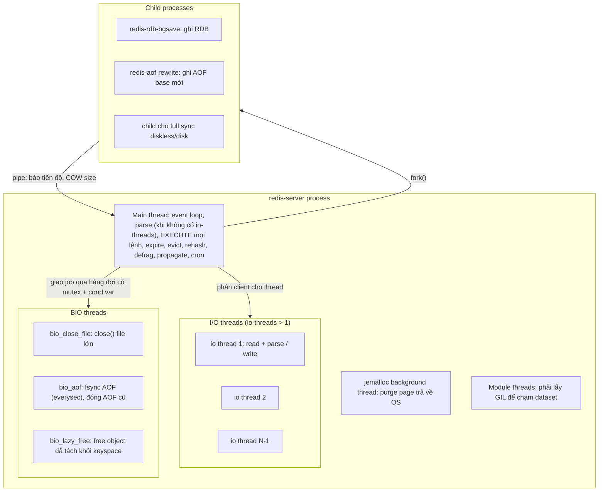
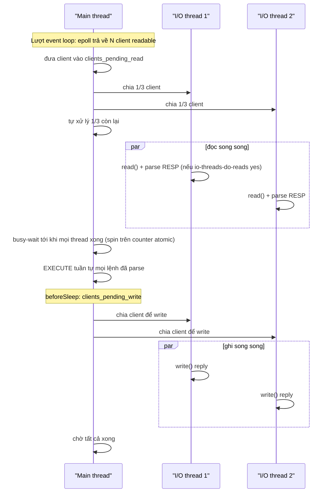
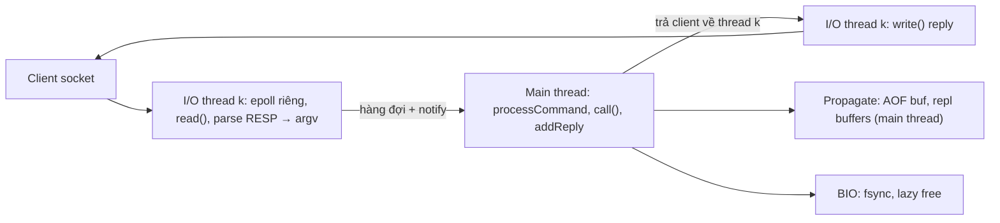

# PART 4 — THREADING MODEL

> **Trước:** [03 — Event Loop](03-event-loop.md) · **Tiếp:** [05 — RESP Protocol](05-resp-protocol.md)
> **Độ ưu tiên:** Rất cao. "Is Redis single-threaded?" là câu hỏi bẫy kinh điển. Câu trả lời đúng là **"lệnh được thực thi trên một thread; nhưng Redis là một process đa luồng và đôi khi đa process"** — kèm theo khả năng liệt kê chính xác thread nào làm gì, và vì sao ranh giới được vạch ở đó.

---

## Mục lục

1. [Simple mental model](#1-simple-mental-model)
2. [WHAT — "Redis is single-threaded" nghĩa chính xác là gì](#2-what--redis-is-single-threaded-nghĩa-chính-xác-là-gì)
3. [WHY — Tại sao Redis chọn design này](#3-why--tại-sao-redis-chọn-design-này)
4. [Bản đồ đầy đủ các thread và process](#4-bản-đồ-đầy-đủ-các-thread-và-process)
5. [Command execution — main thread](#5-command-execution--main-thread)
6. [Background I/O — BIO threads](#6-background-io--bio-threads)
7. [Lazy freeing](#7-lazy-freeing)
8. [Threaded I/O (Redis 6.0) và I/O threading mới (Redis 8.0)](#8-threaded-io)
9. [Persistence — fork child process](#9-persistence--fork-child-process)
10. [Các thread khác: jemalloc, modules](#10-các-thread-khác-jemalloc-modules)
11. [DATA FLOW — Một request với io-threads bật](#11-data-flow--một-request-với-io-threads-bật)
12. [WHAT HAPPENS IF](#12-what-happens-if)
13. [PERFORMANCE IMPACT](#13-performance-impact)
14. [PRODUCTION BEHAVIOR](#14-production-behavior)
15. [TRADE-OFF — Ưu / nhược](#15-trade-off--ưu--nhược)
16. [WHEN TO USE / WHEN NOT TO USE io-threads](#16-when-to-use--when-not-to-use-io-threads)
17. [COMMON MISUNDERSTANDINGS](#17-common-misunderstandings)
18. [INTERVIEW QUESTIONS](#18-interview-questions)
19. [KEY TAKEAWAYS](#19-key-takeaways)

---

## 1. Simple mental model

Một **phòng mổ** có một **bác sĩ phẫu thuật chính** (main thread) — chỉ bác sĩ này được chạm vào bệnh nhân (dataset). Xung quanh có:
- **Y tá đón tiếp** (I/O threads): tiếp nhận bệnh nhân, đọc hồ sơ, chuẩn bị giấy tờ; sau ca mổ, viết biên bản và gửi cho gia đình. Họ **không cầm dao**.
- **Nhân viên dọn dẹp** (BIO lazy free): mang bỏ những thứ đã cắt ra khỏi bệnh nhân — những thứ này **không còn thuộc bệnh nhân**, nên dọn song song an toàn.
- **Nhân viên lưu trữ** (BIO fsync, close file): cất hồ sơ vào két.
- **Nhiếp ảnh gia nhân bản** (fork child): một "bản sao tức thời" của cả phòng mổ được tạo ra để chụp ảnh mà không làm phiền bác sĩ chính.

Quy tắc bất biến: **chỉ một người thao tác trên bệnh nhân đang sống**. Mọi phân chia thread trong Redis đều tôn trọng quy tắc này.

---

## 2. WHAT — "Redis is single-threaded" nghĩa chính xác là gì

Câu chính xác:

> **Redis thực thi mọi lệnh truy cập keyspace trên một thread duy nhất (main thread). Các việc không chạm vào dataset đang sống — I/O mạng (tùy chọn), fsync, đóng file, giải phóng object đã tách khỏi keyspace, và ghi snapshot — có thể chạy trên thread hoặc process khác.**

Kiểm tra thực tế trên Linux:

```text
$ ps -T -p $(pidof redis-server)
  PID  SPID TTY      TIME CMD
 1234  1234 ?    01:23:45 redis-server       ← main thread
 1234  1235 ?    00:00:02 bio_close_file
 1234  1236 ?    00:00:15 bio_aof
 1234  1237 ?    00:00:08 bio_lazy_free
 1234  1238 ?    00:00:01 jemalloc_bg_thd
 1234  1239 ?    00:10:00 io_thd_1          ← nếu io-threads > 1
 ...
```

(Tên thread chính xác khác nhau theo version.) Và khi BGSAVE chạy, `ps` sẽ thấy thêm **một process** `redis-rdb-bgsave` (con của redis-server).

---

## 3. WHY — Tại sao Redis chọn design này

### 3.1 Lập luận gốc của antirez

1. **CPU hiếm khi là nút thắt** của Redis. Nút thắt thường là memory (dung lượng) và network (băng thông, syscall). Một core thực thi hàng trăm nghìn lệnh/s.
2. **Đa luồng phần execute đòi hỏi đồng bộ hóa** trên mọi cấu trúc: dict, skiplist, quicklist, expire dict, LRU clock, client list, replication buffer... Chi phí lock trên lệnh 1 µs là không chấp nhận được, lock-free thì cực kỳ phức tạp.
3. **Atomicity miễn phí**: toàn bộ ngữ nghĩa của MULTI/EXEC, Lua, WATCH, các lệnh read-modify-write (INCR, LPUSH, ZINCRBY) dựa vào việc không có gì xen giữa.
4. **Scale bằng nhiều instance**: muốn dùng 16 core → chạy 16 shard (Redis Cluster) — scale **tuyến tính** hơn so với đa luồng một instance (không có contention chung).

### 3.2 Tại sao sau đó lại thêm thread

Theo thời gian, xuất hiện các việc **chậm nhưng không cần chạm dataset đang sống**, làm main thread đứng hình vô ích:

| Vấn đề | Khi nào nhận ra | Lời giải |
|---|---|---|
| `close()` file AOF cũ sau rewrite mất hàng trăm ms (kernel giải phóng block) | 2.x | BIO close file |
| `fsync()` mỗi giây chặn main thread | 2.x | BIO AOF fsync |
| `DEL` key 10 triệu phần tử mất vài giây | 4.0 | Lazy free (UNLINK) |
| Với request nhỏ, `read()`/`write()` syscall + TLS chiếm phần lớn CPU main thread | 6.0 | Threaded I/O |

Nguyên tắc chung: **tách ra những gì tốn thời gian nhưng có thể làm mà không cần lock với dataset**.

---

## 4. Bản đồ đầy đủ các thread và process



**Cách đọc diagram:**
1. **Main thread** là nơi duy nhất thực thi lệnh và sửa keyspace.
2. **I/O threads** chỉ đọc/parse và ghi socket; không bao giờ tra hay sửa key.
3. **BIO threads** nhận job qua hàng đợi (mỗi loại một hàng đợi, bảo vệ bằng mutex + condition variable). Job là "đóng fd này", "fsync fd này", "free object này".
4. **jemalloc background thread** thuộc allocator, trả memory rảnh về OS.
5. **Module threads** (nếu module tạo) phải lấy **GIL** của Redis trước khi chạm dataset — tức là tuần tự với main thread.
6. **Child process** được tạo bằng `fork()`, có bản sao memory (COW) của dataset tại thời điểm fork, ghi ra file; báo tiến độ qua pipe.

---

## 5. Command execution — main thread

Những việc **luôn** chạy trên main thread (quan trọng để suy luận latency):

- Thực thi **mọi lệnh** (kể cả lệnh đọc).
- Lua script, Functions, MULTI/EXEC.
- Tra/sửa keyspace, expires dict.
- **Active expire** (xóa key hết hạn — phần gỡ khỏi dict; phần free có thể lazy).
- **Eviction** (chọn và gỡ key).
- **Incremental rehash**, resize dict.
- **Active defrag**.
- **Propagate** sang AOF buffer, replication buffers.
- `write()` AOF buffer vào file (với mọi mode), và `fsync()` nếu `appendfsync always`.
- `fork()` (bản thân syscall fork chặn main thread).
- Load RDB/AOF khi khởi động; load RDB trên replica khi full sync (trừ tùy chọn diskless load nâng cao vẫn trên main thread nhưng xen kẽ xử lý event).
- Cluster bus: xử lý gossip.
- Nếu **không** bật io-threads: toàn bộ read/parse/write socket, TLS encrypt/decrypt.

---

## 6. Background I/O — BIO threads

`bio.c` tạo một số thread cố định, mỗi thread phục vụ một (hoặc vài) loại job:

| Job | Mô tả | Tại sao chậm |
|---|---|---|
| `BIO_CLOSE_FILE` | `close(fd)` | Nếu fd là file cuối cùng tham chiếu tới inode đã bị unlink (AOF cũ sau rewrite, RDB tạm), `close` khiến kernel **giải phóng toàn bộ block của file** — file 20 GB có thể mất hàng trăm ms |
| `BIO_AOF_FSYNC` | `fsync(aof_fd)` mỗi giây (`everysec`) | fsync phải chờ thiết bị flush, có thể hàng chục–hàng trăm ms, thậm chí giây khi disk bận |
| `BIO_CLOSE_AOF` (7.0+) | fsync + close file AOF cũ khi chuyển sang file incr mới | Kết hợp hai lý do trên |
| `BIO_LAZY_FREE` | Giải phóng object | Object lớn = hàng triệu `free()` |

Cơ chế: main thread gọi `bioCreate*Job()` → đẩy job vào list của loại đó dưới mutex → signal condition variable → BIO thread thức dậy, lấy job, thực hiện, lặp lại. Main thread có thể hỏi số job pending (`bioPendingJobsOfType`) — ví dụ để biết fsync trước đó đã xong chưa.

---

## 7. Lazy freeing

### 7.1 WHAT

Tách thao tác xóa thành hai phần:
1. **Unlink** (main thread, O(1)): gỡ key khỏi dict `db->dict` và `db->expires`. Từ giây phút này, key **không còn tồn tại** với mọi client.
2. **Free** (BIO thread, O(N)): đi qua mọi phần tử của object và giải phóng memory.

### 7.2 Tại sao an toàn không cần lock

Sau bước unlink, **không còn ai tham chiếu** tới object (không nằm trong keyspace, không client nào giữ con trỏ tới nó — Redis đảm bảo điều này, ví dụ object dùng chung thì không lazy free). BIO thread thao tác trên memory mà main thread không bao giờ chạm lại. Chỉ allocator (jemalloc) là dùng chung — và jemalloc tự thread-safe (thread cache + arena lock).

### 7.3 Khi nào Redis thực sự lazy free

Không phải mọi object: `lazyfreeGetFreeEffort()` ước lượng "công sức" free (số phần tử của collection, số node quicklist...). Chỉ khi effort > `LAZYFREE_THRESHOLD` (64) mới đẩy sang BIO; object nhỏ free ngay tại chỗ (đẩy sang thread còn tốn hơn free trực tiếp).

### 7.4 Các cấu hình

| Lệnh / config | Ngữ cảnh |
|---|---|
| `UNLINK key` (4.0) | Xóa do user, lazy |
| `FLUSHALL ASYNC`, `FLUSHDB ASYNC` (4.0) | Flush lazy (tạo dict mới, free dict cũ ở BIO) |
| `lazyfree-lazy-user-del` (6.0) | Làm `DEL` hành xử như `UNLINK` |
| `lazyfree-lazy-user-flush` (6.2) | FLUSH* mặc định ASYNC |
| `lazyfree-lazy-eviction` | Free object bị evict ở background |
| `lazyfree-lazy-expire` | Free key hết hạn ở background |
| `lazyfree-lazy-server-del` | Xóa ngầm do server: `SET` ghi đè giá trị cũ lớn, `RENAME` ghi đè... |
| `replica-lazy-flush` | Replica flush dataset cũ khi full sync ở background |

Mặc định của các option này **khác nhau theo version/distribution** (các bản mới có xu hướng bật nhiều hơn) — luôn kiểm tra bằng `CONFIG GET lazyfree*`.

### 7.5 Lưu ý

- Memory được trả **chậm hơn**: sau `UNLINK` một key 5 GB, `used_memory` giảm dần. Theo dõi `lazyfree_pending_objects` trong `INFO memory`.
- Nếu hệ thống liên tục tạo và unlink big key nhanh hơn BIO kịp free → memory phình.
- Lazy free **không** giải quyết chi phí **tạo** big key hay **đọc** big key.

---

## 8. Threaded I/O

### 8.1 Redis 6.0: `io-threads`

**Vấn đề**: với lệnh nhỏ, phần lớn CPU main thread đi vào `read()`/`write()` syscall, copy buffer, parse RESP, và TLS. Execute chỉ chiếm phần nhỏ.

**Thiết kế 6.x/7.x** (mô hình "fan-out / fan-in" đồng bộ):



**Cách đọc diagram:** Main thread **phân phát** client cho I/O thread, rồi **chờ** (spin) cho tới khi tất cả đọc/parse xong, sau đó **tự thực thi** mọi lệnh tuần tự, rồi lại phân phát việc ghi. Tại mỗi thời điểm, hoặc tất cả thread đang làm I/O, hoặc chỉ main thread đang execute — **không bao giờ song song execute và I/O trên cùng dữ liệu**. Vì thế không cần lock. `io-threads-do-reads` (mặc định no) mới bật việc đọc qua thread; ghi luôn dùng thread khi `io-threads > 1`. Nhược điểm: main thread spin-wait tốn CPU; khi tải thấp Redis tự tắt tạm threaded I/O.

### 8.2 Redis 8.0: I/O threading mới

Redis 8.0 viết lại cơ chế: **mỗi client được gán cố định cho một I/O thread**; I/O thread có event loop riêng, tự đọc và parse query, rồi **thông báo cho main thread** (qua hàng đợi/eventfd) khi client có lệnh sẵn sàng; main thread thực thi và tạo reply; I/O thread ghi reply ra socket. Theo release notes, thiết kế mới luôn dùng thread cho cả đọc và ghi (không còn `io-threads-do-reads`), bật bằng `io-threads` (mặc định 1 = tắt), và đo được tăng throughput **37%–112%** với 8 thread tùy lệnh. Valkey 8.0 cũng có một thiết kế async I/O threads riêng với mục tiêu tương tự.

Điểm bất biến ở mọi version: **I/O threads không bao giờ execute lệnh**.

### 8.3 Cấu hình khuyến nghị (tham khảo docs)

- Chỉ bật khi máy có ≥ 4 core và Redis thực sự bị nghẽn CPU ở phần I/O (nhiều client, TLS, throughput rất cao).
- Để lại core cho main thread, fork child, BIO, OS: ví dụ máy 8 core → `io-threads 4`–`6`.
- Không đặt io-threads lớn hơn số core thực.

---

## 9. Persistence — fork child process

- `BGSAVE`, `BGREWRITEAOF`, full sync replication → `fork()`.
- Child có **không gian địa chỉ riêng** chia sẻ page vật lý với parent qua **Copy-on-Write**. Child chỉ đọc dataset "đông cứng" và ghi file; parent tiếp tục sửa dataset — page nào bị parent sửa sẽ được kernel copy riêng.
- Tại một thời điểm Redis chỉ cho **một** child loại này (`hasActiveChildProcess()`): nếu đang BGSAVE mà cần AOF rewrite, rewrite sẽ được lên lịch sau.
- Chi phí: `fork()` chặn main thread (copy page table), COW làm tăng RSS và gây page fault trên parent ([Chương 35](35-copy-on-write.md)).
- Khi có child đang chạy, Redis **hạn chế resize dict** (tránh ghi hàng loạt page → COW) và **không cập nhật LRU** trên lookup trong một số trường hợp — những chi tiết nhỏ cho thấy thiết kế luôn tính tới COW.

---

## 10. Các thread khác: jemalloc, modules

- **jemalloc background thread** (`jemalloc-bg-thread yes`, 6.0+): purge dirty page (memory đã free nhưng vẫn giữ) trả về OS theo decay time, thay vì để main thread làm khi gọi malloc/free.
- **Module threads**: module (RediSearch, RedisJSON trước khi hợp nhất, RedisGears...) có thể tạo thread riêng. Để chạm keyspace, thread phải lấy **GIL** (`RedisModule_ThreadSafeContextLock`) — main thread nhả GIL khi ngủ trong `epoll_wait`. Query Engine (RediSearch) trong Redis 8 có thread pool riêng cho query — một ngoại lệ đáng chú ý của mô hình "tất cả execute trên main thread".

---

## 11. DATA FLOW — Một request với io-threads bật (Redis 8 model)



**Cách đọc diagram:** Phần "đắt về syscall" (read/write/TLS/parse) nằm trên I/O thread; phần "chạm dữ liệu" (execute, propagate) nằm trên main thread. Hàng đợi giữa hai bên là điểm đồng bộ duy nhất. Thiết kế này tăng throughput tổng, nhưng **không** giảm service time của một lệnh đắt, và **không** giải quyết HOL blocking do lệnh chậm.

---

## 12. WHAT HAPPENS IF

### 12.1 Bật io-threads trên máy 2 core

I/O threads, main thread, BIO, OS tranh nhau 2 core → context switch, main thread bị tước CPU → **chậm hơn** không bật.

### 12.2 UNLINK hàng loạt big key liên tục

BIO lazy free không kịp: `lazyfree_pending_objects` tăng, memory không giảm, có thể chạm maxmemory → eviction/OOM. Lazy free chuyển chi phí đi chứ không xóa bỏ nó.

### 12.3 fsync mất 5 giây (disk hỏng/nghẽn)

BIO fsync thread kẹt. Sau 2 giây, main thread (với everysec) chọn: hoãn write (tối đa 2 s) rồi ghi dù fsync chưa xong — `write()` có thể bị kernel chặn → main thread đứng. Stat `aof_delayed_fsync` tăng ([Chương 36](36-aof.md)).

### 12.4 Module thread giữ GIL lâu

Main thread không lấy lại được GIL → toàn bộ server đứng — giống lệnh chậm.

---

## 13. PERFORMANCE IMPACT

| Thành phần | CPU tiêu thụ ở đâu | Tác động latency |
|---|---|---|
| Execute | Main thread | Trực tiếp, cộng dồn |
| I/O không threaded | Main thread | Trực tiếp; thường 50–80% CPU main thread với lệnh nhỏ |
| I/O threaded | I/O threads | Giảm tải main thread; thêm chút latency đồng bộ |
| Lazy free | BIO | Không chặn; memory giảm chậm |
| fsync everysec | BIO | Gián tiếp khi disk chậm |
| Fork | Main thread (syscall) + child | Spike khi fork; COW page fault trên main thread |

Đo: `INFO cpu` có `used_cpu_sys_main_thread`, `used_cpu_user_main_thread` (6.2+) — so với `used_cpu_sys/user` tổng để biết phần nào nằm ngoài main thread. `INFO stats` có `io_threaded_reads_processed`, `io_threaded_writes_processed`.

---

## 14. PRODUCTION BEHAVIOR

- **CPU process 250% nhưng Redis vẫn "single-threaded"**: I/O threads + fork child + BIO có thể dùng nhiều core. Cảnh báo phải dựa trên CPU main thread.
- **Latency không giảm sau khi bật io-threads**: nút thắt nằm ở execute (lệnh đắt) hoặc network, không phải syscall.
- **Memory "không giảm" sau xóa hàng loạt**: lazy free đang xử lý, hoặc fragmentation ([Chương 22](22-memory-fragmentation.md)).

---

## 15. TRADE-OFF — Ưu / nhược

### Ưu điểm của mô hình execute một thread

- Không lock → service time nhỏ và ổn định.
- Atomic tự nhiên cho mọi lệnh, MULTI, Lua.
- Code đơn giản → ít bug concurrency, dễ tối ưu cấu trúc dữ liệu.
- Thứ tự thực thi xác định → replication/AOF tái hiện chính xác.

### Nhược điểm

- Throughput execute giới hạn bởi một core.
- Một lệnh chậm = sự cố toàn cục (HOL blocking).
- Máy nhiều core bị lãng phí nếu chỉ chạy một instance → phải chạy nhiều instance/cluster (thêm độ phức tạp vận hành).
- Các việc nền (expire, evict, defrag, rehash) cạnh tranh với lệnh client trên cùng thread.

---

## 16. WHEN TO USE / WHEN NOT TO USE io-threads

**Dùng khi:**
- CPU main thread gần bão hòa, và profiling cho thấy phần lớn nằm ở syscall/network/TLS.
- Nhiều client đồng thời, payload vừa/lớn, throughput rất cao.
- Máy có đủ core rảnh.

**Không dùng khi:**
- Máy ít core, hoặc chia sẻ với workload khác.
- Nút thắt là lệnh đắt (O(N), Lua) — io-threads không giúp.
- Tải thấp — không có lợi, thêm phức tạp.

---

## 17. COMMON MISUNDERSTANDINGS

| Hiểu sai | Thực tế |
|---|---|
| "Redis hoàn toàn single-threaded" | Execute trên một thread; có BIO, I/O threads, jemalloc thread, fork child |
| "Redis 6 là multi-threaded nên lệnh chạy song song" | I/O threads chỉ read/parse/write; execute vẫn tuần tự |
| "io-threads làm Redis nhanh hơn trong mọi trường hợp" | Chỉ khi I/O là nút thắt và có core rảnh |
| "UNLINK làm việc xóa miễn phí" | Chuyển chi phí free sang BIO; memory giảm chậm; unlink vẫn O(1) trên main thread |
| "BGSAVE chạy trong một thread nền" | Chạy trong **child process** (fork), không phải thread |
| "Vì single-thread nên Redis không có race condition" | Không có race **bên trong** một lệnh; giữa các lệnh của các client khác nhau vẫn có race (GET rồi SET) → cần MULTI/WATCH/Lua |

---

## 18. INTERVIEW QUESTIONS

1. **Is Redis really single-threaded?**
   → Execute lệnh: một thread. Ngoài ra: BIO (close file, fsync, lazy free), I/O threads (6.0+, viết lại ở 8.0), jemalloc background thread, fork child cho RDB/AOF rewrite, module threads (qua GIL).
2. **Tại sao Redis không đa luồng phần execute?**
   → CPU hiếm là nút thắt; lock trên lệnh µs quá đắt; atomicity miễn phí; scale ngang bằng sharding.
3. **I/O threads trong Redis 6 hoạt động thế nào? Có race condition không?**
   → Main thread phân phát client, I/O thread read/parse hoặc write, main thread chờ tất cả xong rồi mới execute; hai pha không chồng lấn → không race.
4. **UNLINK khác DEL thế nào? Tại sao UNLINK an toàn?**
   → UNLINK gỡ key khỏi keyspace O(1) rồi free ở BIO nếu object lớn; an toàn vì object không còn được tham chiếu.
5. **(Senior) Máy 32 core, Redis CPU main thread 100%, bạn làm gì?**
   → Xác định CPU vào đâu (commandstats, perf): nếu syscall/TLS → io-threads; nếu execute → giảm lệnh đắt, pipeline, tách workload, Redis Cluster nhiều shard trên cùng/khác máy (chú ý NUMA, memory cho fork).
6. **(Senior) Tại sao Redis tránh resize dict khi có child process?**
   → Resize/rehash ghi hàng loạt memory → COW copy nhiều page → RSS tăng mạnh trong lúc BGSAVE.

---

## 19. KEY TAKEAWAYS

- **Single-threaded = single command-execution thread**, không phải single-threaded process.
- Ranh giới: **chỉ main thread chạm dataset đang sống**. Thread khác làm việc không cần lock với dataset: I/O socket, fsync, close, free object đã tách, purge memory; fork child làm snapshot trên bản COW.
- Lazy free chuyển chi phí giải phóng đi, không xóa nó; memory giảm chậm.
- I/O threads tăng throughput khi syscall/TLS là nút thắt; không giúp lệnh đắt và không loại bỏ HOL blocking.
- Scale CPU cho execute = **nhiều instance/shard**.
