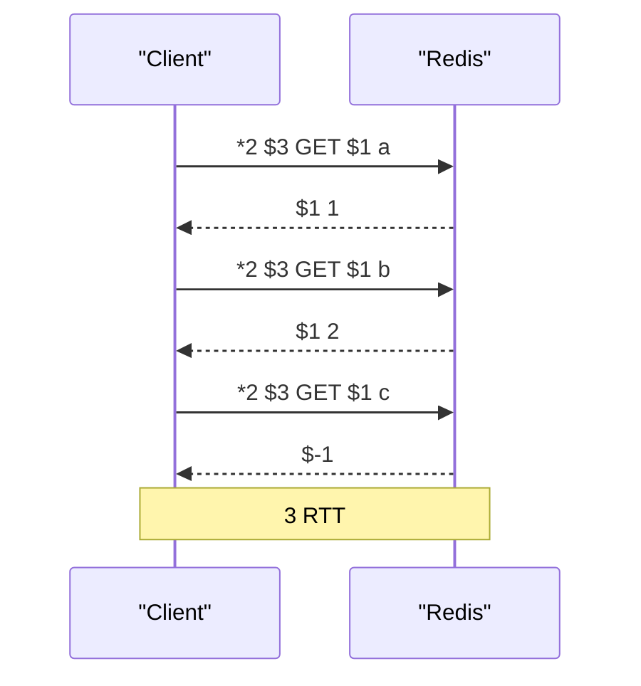
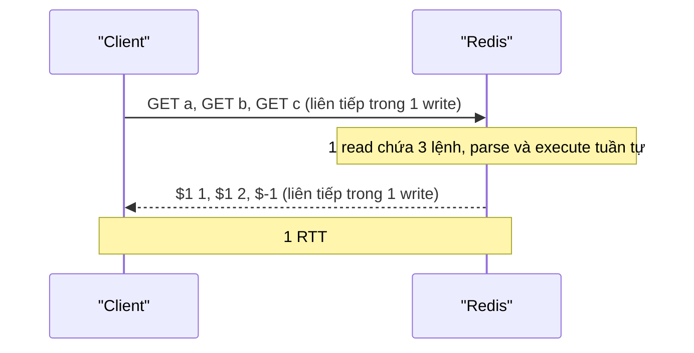

# PART 5 — RESP PROTOCOL

> **Trước:** [04 — Threading Model](04-threading-model.md) · **Tiếp:** [06 — Redis Object Model](06-redis-object-model.md)
> **Độ ưu tiên:** Trung bình–cao. Ít khi phải viết parser RESP, nhưng hiểu RESP giải thích được pipelining, vì sao reply lớn tốn memory, vì sao client-side caching cần RESP3, và cách đọc traffic khi debug.

---

## Mục lục

1. [Simple mental model](#1-simple-mental-model)
2. [WHAT — RESP là gì](#2-what--resp-là-gì)
3. [WHY — Tại sao Redis tự thiết kế protocol](#3-why--tại-sao-redis-tự-thiết-kế-protocol)
4. [HOW — RESP2: 5 kiểu dữ liệu](#4-how--resp2-5-kiểu-dữ-liệu)
5. [HOW — RESP3: các kiểu mới](#5-how--resp3-các-kiểu-mới)
6. [INTERNALS — Server parse request thế nào](#6-internals--server-parse-request-thế-nào)
7. [DATA FLOW — Request/response flow và pipelining](#7-data-flow--requestresponse-flow-và-pipelining)
8. [Push message, Pub/Sub và client-side caching](#8-push-message-pubsub-và-client-side-caching)
9. [EXAMPLE — Đọc byte thật trên dây](#9-example--đọc-byte-thật-trên-dây)
10. [WHAT HAPPENS IF](#10-what-happens-if)
11. [PERFORMANCE IMPACT](#11-performance-impact)
12. [PRODUCTION BEHAVIOR](#12-production-behavior)
13. [TRADE-OFF](#13-trade-off)
14. [COMMON MISUNDERSTANDINGS](#14-common-misunderstandings)
15. [INTERVIEW QUESTIONS](#15-interview-questions)
16. [KEY TAKEAWAYS](#16-key-takeaways)

---

## 1. Simple mental model

RESP giống **một phong bì có ghi sẵn "bên trong có bao nhiêu tờ, mỗi tờ dài bao nhiêu chữ"**. Người nhận không phải đọc từng chữ để tìm chỗ kết thúc — cứ đếm đúng số chữ ghi trên nhãn là biết lá thư hết ở đâu. Nhãn viết bằng chữ thường (text) nên người cũng đọc được, nhưng nội dung bên trong có thể là bất cứ thứ gì (binary-safe).

---

## 2. WHAT — RESP là gì

**RESP (REdis Serialization Protocol)** là giao thức tầng ứng dụng mà client và server Redis dùng trên TCP (hoặc Unix socket, TLS). Các phiên bản:
- **RESP1** (rất cũ, Redis < 1.2), không còn dùng.
- **RESP2** — từ Redis 1.2, là chuẩn mặc định cho tới nay.
- **RESP3** — từ Redis 6.0, bật theo từng connection bằng `HELLO 3`.

Đặc điểm:
- **Request** luôn là **array of bulk strings**: `[tên lệnh, arg1, arg2...]`.
- **Reply** có thể là bất kỳ kiểu nào.
- Mỗi phần tử bắt đầu bằng **một byte chỉ kiểu**, kết thúc bằng `\r\n` (CRLF).
- Kiểu có payload tùy ý (bulk string) có **tiền tố độ dài** → binary-safe.
- **Request-response đồng bộ theo thứ tự** trên mỗi connection (trừ push message trong RESP3 và chế độ Pub/Sub).

---

## 3. WHY — Tại sao Redis tự thiết kế protocol

antirez đặt ba mục tiêu: **dễ implement**, **parse nhanh**, **người đọc được**.

| Lựa chọn thay thế | Vấn đề |
|---|---|
| Text thuần phân tách bằng khoảng trắng/newline (kiểu Memcached text) | Không binary-safe; phải quét tìm delimiter; escape phức tạp |
| JSON | Parse chậm, không binary-safe (phải base64), tốn byte |
| Binary thuần (Protobuf, custom) | Khó debug bằng telnet/tcpdump; mọi client phải có thư viện |
| HTTP | Header nặng, overhead lớn cho lệnh 10 byte |

RESP là điểm giữa: header dạng text ngắn (`$5\r\n`) nên dễ đọc và parse bằng vài dòng code, payload có độ dài nên an toàn với binary và không cần quét.

---

## 4. HOW — RESP2: 5 kiểu dữ liệu

| Byte đầu | Kiểu | Ví dụ | Dùng cho |
|---|---|---|---|
| `+` | **Simple String** | `+OK\r\n` | Trạng thái ngắn, không chứa CR/LF |
| `-` | **Error** | `-ERR unknown command\r\n`, `-WRONGTYPE Operation against a key holding the wrong kind of value\r\n` | Lỗi; từ đầu tiên là "error code" (ERR, WRONGTYPE, MOVED, ASK, BUSY, OOM, LOADING, NOSCRIPT, READONLY, CROSSSLOT, TRYAGAIN, EXECABORT, NOAUTH, NOPERM...) |
| `:` | **Integer** | `:1000\r\n` | INCR, LLEN, EXISTS, DEL... (số nguyên 64-bit có dấu) |
| `$` | **Bulk String** | `$5\r\nhello\r\n` | Chuỗi nhị phân tùy ý, tối đa 512 MB mặc định (`proto-max-bulk-len`) |
| `*` | **Array** | `*2\r\n$3\r\nfoo\r\n$3\r\nbar\r\n` | Danh sách phần tử, có thể lồng nhau và trộn kiểu |

**Null trong RESP2** (không có kiểu riêng):
- **Null bulk string**: `$-1\r\n` — GET key không tồn tại.
- **Null array**: `*-1\r\n` — ví dụ BLPOP timeout, EXEC bị hủy do WATCH.

Chuỗi rỗng khác null: `$0\r\n\r\n` là chuỗi rỗng hợp lệ.

### 4.1 Error code có ý nghĩa vận hành

Client library dựa vào error prefix để quyết định hành vi:
- `MOVED`/`ASK` → redirect (cluster, [Chương 45](45-cluster-routing.md)).
- `LOADING` → server đang load dataset, retry sau.
- `BUSY` → script chạy quá lâu.
- `READONLY` → đang nói với replica (thường do failover, client chưa cập nhật primary).
- `OOM` → vượt maxmemory với policy noeviction.
- `TRYAGAIN` → multi-key trong slot đang migrate.
- `CLUSTERDOWN` → cluster không phục vụ.

---

## 5. HOW — RESP3: các kiểu mới

RESP3 bổ sung kiểu để reply **mang ngữ nghĩa** (client không phải đoán mảng này là map hay list):

| Byte | Kiểu | Ví dụ | Ghi chú |
|---|---|---|---|
| `_` | **Null** | `_\r\n` | Một kiểu null duy nhất thay cho `$-1`/`*-1` |
| `#` | **Boolean** | `#t\r\n`, `#f\r\n` | |
| `,` | **Double** | `,3.14\r\n`, `,inf\r\n`, `,nan\r\n` | ZSCORE trả double thật thay vì bulk string |
| `(` | **Big number** | `(3492890328409238509324850943850943825024385\r\n` | Số nguyên lớn tùy ý |
| `!` | **Bulk error** | `!21\r\nSYNTAX invalid syntax\r\n` | Error dài/binary |
| `=` | **Verbatim string** | `=15\r\ntxt:Some string\r\n` | Có định dạng (txt/mkd), cho hiển thị |
| `%` | **Map** | `%2\r\n+first\r\n:1\r\n+second\r\n:2\r\n` | HGETALL, CONFIG GET, XINFO trả map |
| `~` | **Set** | `~3\r\n...` | SMEMBERS trả set |
| `\|` | **Attribute** | metadata kèm reply, client có thể bỏ qua | |
| `>` | **Push** | `>3\r\n$7\r\nmessage\r\n...` | Dữ liệu server chủ động đẩy: Pub/Sub, invalidation |

Ngoài ra RESP3 hỗ trợ **streamed string/aggregate** với độ dài không biết trước (`$?`, `*?` kết thúc bằng `.`), ít dùng.

### 5.1 `HELLO`

```
HELLO 3 AUTH username password SETNAME myapp
```
- Chuyển connection sang RESP3, xác thực, đặt tên client — **một round-trip** thay vì ba.
- Trả về map thông tin server (version, mode standalone/cluster/sentinel, role, modules).
- Không có `HELLO` → connection mặc định RESP2 (tương thích ngược hoàn toàn).

---

## 6. INTERNALS — Server parse request thế nào

### 6.1 Multibulk parsing (`processMultibulkBuffer`)

Với request `*3\r\n$3\r\nSET\r\n$3\r\nkey\r\n$5\r\nvalue\r\n`:

```text
Trạng thái client: multibulklen = 0, bulklen = -1

1. Thấy '*' → tìm '\r\n' → đọc số 3 → multibulklen = 3, cấp phát argv[3]
2. Vòng lặp khi multibulklen > 0:
   a. bulklen == -1: kỳ vọng '$' → đọc số 3 → bulklen = 3
   b. Còn đủ bulklen + 2 byte trong querybuf?
      - Có: tạo robj string từ 3 byte "SET", argv[0] = obj, bỏ qua \r\n, bulklen = -1, multibulklen--
      - Không: return (chờ read tiếp), trạng thái được giữ nguyên trong client
3. multibulklen == 0 → lệnh hoàn chỉnh → processCommand
```

Chi tiết quan trọng:
- **Không cần quét payload**: biết `bulklen` rồi thì nhảy thẳng `bulklen` byte. Chỉ quét tìm `\r\n` trong **header ngắn**.
- **Tối ưu big argument**: khi `bulklen ≥ 32 KB`, Redis đảm bảo querybuf chứa **đúng** argument đó và dùng **chính SDS querybuf** làm object của argument (không copy), rồi tạo querybuf mới. Với `SET key <10MB value>`, tránh được một lần memcpy 10 MB.
- **Giới hạn bảo vệ**:
  - Bulk > `proto-max-bulk-len` (512 MB) → lỗi protocol, đóng connection.
  - Multibulk length quá lớn → lỗi.
  - Client **chưa xác thực** (khi server yêu cầu auth) bị giới hạn chặt hơn về độ dài multibulk/bulk ở các bản mới — chống kẻ tấn công chưa auth gửi request khổng lồ làm tốn memory.
  - `client-query-buffer-limit` (1 GB mặc định).

### 6.2 Inline commands

Nếu byte đầu không phải `*`, Redis coi là **inline**: `PING\r\n`, `SET a b\r\n`. Tách theo khoảng trắng, hỗ trợ quote. Có để người dùng gõ tay bằng telnet/nc. Client library không dùng.

Một tác dụng phụ an ninh: vì chấp nhận inline, Redis có thể nhận "lệnh" từ các protocol khác gửi nhầm (ví dụ HTTP request `POST / HTTP/1.1` → Redis cố parse `POST` như lệnh). Redis có cơ chế phát hiện `POST` và `Host:` để đóng connection ngay (chống cross-protocol scripting từ trình duyệt).

### 6.3 Xây reply

Hàm `addReply*` (networking.c) ghi header + payload vào `c->buf`:
- `addReplyBulk(c, obj)` → `$<len>\r\n<data>\r\n`
- `addReplyLongLong(c, n)` → `:<n>\r\n` (số nhỏ dùng header chia sẻ sẵn)
- `addReplyArrayLen(c, n)` → `*<n>\r\n` (RESP2) hoặc tương ứng RESP3
- `addReplyMapLen(c, n)` → `*<2n>` với RESP2, `%<n>` với RESP3 — **cùng code lệnh, khác wire format theo `c->resp`**.
- Khi chưa biết trước số phần tử (ví dụ ZRANGEBYSCORE với filter), dùng `addReplyDeferredLen` → chèn header sau khi đếm xong.

Redis dùng **shared object** cho reply phổ biến (`shared.ok`, `shared.crlf`, `shared.czero`, `shared.cone`, `shared.nullbulk`...) → không cấp phát lại.

---

## 7. DATA FLOW — Request/response flow và pipelining

### 7.1 Không pipeline



### 7.2 Pipeline



**Cách đọc diagram:** RESP **không có request ID**. Pipelining hoạt động được là nhờ một bảo đảm đơn giản: **trên mỗi connection, reply được trả đúng thứ tự request**. Client giữ một hàng đợi FIFO các request đang chờ; mỗi reply đến thì khớp với request đầu hàng đợi. Vì length prefix, client cũng biết chính xác reply này kết thúc ở đâu để bắt đầu parse reply tiếp theo.

Hệ quả:
- Không thể "trả reply lệnh nhanh trước": HOL blocking cấp connection ([Chương 3](03-event-loop.md#12-head-of-line-blocking)).
- Một client library có thể multiplex nhiều thread ứng dụng lên một connection (auto-pipelining) chỉ bằng hàng đợi FIFO.

Chi tiết pipelining ở [Chương 29](29-pipelining.md).

---

## 8. Push message, Pub/Sub và client-side caching

### 8.1 RESP2: connection "chuyển chế độ"

Trong RESP2, sau `SUBSCRIBE`, connection chuyển sang **chế độ Pub/Sub**: server đẩy message bất kỳ lúc nào dưới dạng array `["message", channel, payload]`, và client chỉ được gửi các lệnh (P|S)SUBSCRIBE, (P|S)UNSUBSCRIBE, PING, RESET, QUIT. Lý do: nếu cho phép GET giữa chừng, client không phân biệt được array nhận về là reply của GET hay message được đẩy.

### 8.2 RESP3: kiểu Push `>`

RESP3 tách bạch: push message có byte đầu `>`, reply thường có kiểu khác → client phân biệt được, nên **một connection vừa subscribe vừa chạy lệnh thường**.

### 8.3 Client-side caching (Redis 6.0, `CLIENT TRACKING`)

- Client bật tracking; server ghi nhớ key mà client đã đọc (default mode, lưu trong **tracking table** — radix tree key → tập client ID) hoặc theo prefix (BCAST mode).
- Khi key bị sửa/xóa/hết hạn/evict, server gửi **invalidation message** cho client liên quan.
- RESP3: invalidation đi qua push message trên cùng connection. RESP2: phải dùng connection thứ hai subscribe kênh `__redis__:invalidate` và `CLIENT TRACKING on REDIRECT <client-id>`.
- Tracking table giới hạn bởi `tracking-table-max-keys`; vượt thì server chủ động invalidate key cũ (client phải bỏ cache của key đó) — đảm bảo memory server có giới hạn.

Đây là nền tảng cho near cache nhất quán hơn ([Chương 24](24-cache-fundamentals.md), [Chương 27](27-hot-key.md)).

---

## 9. EXAMPLE — Đọc byte thật trên dây

`HSET user:1 name alice age 30` gửi:
```
*6\r\n
$4\r\nHSET\r\n
$6\r\nuser:1\r\n
$4\r\nname\r\n
$5\r\nalice\r\n
$3\r\nage\r\n
$2\r\n30\r\n
```
Reply: `:2\r\n` (2 field mới).

`HGETALL user:1`:
- RESP2: `*4\r\n$4\r\nname\r\n$5\r\nalice\r\n$3\r\nage\r\n$2\r\n30\r\n` (mảng phẳng, client tự ghép cặp)
- RESP3: `%2\r\n$4\r\nname\r\n$5\r\nalice\r\n$3\r\nage\r\n$2\r\n30\r\n` (map)

`ZSCORE lb alice`:
- RESP2: `$4\r\n1500\r\n` (bulk string, client tự parse số)
- RESP3: `,1500\r\n` (double)

Cluster redirect: `-MOVED 12539 10.0.0.12:6379\r\n`.

Overhead: GET key 6 byte → request 24 byte, reply value 5 byte → 11 byte. Với value nhỏ, **header RESP có thể lớn hơn payload** — không đáng kể về CPU nhưng đáng kể về số packet, nên gom (pipeline) hiệu quả.

---

## 10. WHAT HAPPENS IF

### 10.1 Client gửi `$1000000000\r\n` rồi chỉ gửi vài byte

Server chờ đủ byte; querybuf giữ dữ liệu dở. `client-query-buffer-limit` và `proto-max-bulk-len` giới hạn thiệt hại; `timeout` (idle) có thể đóng client treo. Với client chưa auth, giới hạn chặt hơn.

### 10.2 Client library bị lệch hàng đợi reply (bug, timeout xử lý sai)

Nếu client timeout một request nhưng **không đóng connection**, reply muộn của request đó sẽ được khớp nhầm với request **tiếp theo** → app nhận dữ liệu của key khác. Đây là bug kinh điển ở client tự viết hoặc cấu hình sai. Quy tắc: **timeout trên một connection RESP ⇒ phải hủy connection đó**.

### 10.3 Reply khổng lồ

`LRANGE big 0 -1` với 10 triệu phần tử: server xây toàn bộ reply trong memory (hàng trăm MB) trước khi gửi hết — memory phình, `client-output-buffer-limit` normal mặc định không giới hạn → rủi ro OOM.

---

## 11. PERFORMANCE IMPACT

- Parse RESP rất rẻ (vài chục–vài trăm ns mỗi lệnh nhỏ) — hiếm khi là nút thắt.
- Chi phí thật nằm ở **syscall** và **copy memory** cho payload lớn.
- RESP3 không nhanh hơn RESP2 về server; lợi ích nằm ở ngữ nghĩa và push.
- Header per-element: reply mảng 1 triệu phần tử nhỏ tốn đáng kể byte header (`$N\r\n...\r\n`) — một lý do reply lớn tốn băng thông hơn tưởng.

---

## 12. PRODUCTION BEHAVIOR

- Khi debug: `redis-cli MONITOR` (tốn kém, chỉ dùng ngắn), `tcpdump -A port 6379` đọc được RESP trực tiếp (nếu không TLS).
- Nhận diện nhanh loại lỗi qua error prefix trong log client: `MOVED` tăng đột biến = topology cluster thay đổi; `LOADING` = node vừa restart; `READONLY` = client đang ghi vào replica sau failover (DNS/endpoint chưa cập nhật).
- Chuyển sang RESP3 cần client library hỗ trợ; một số library dùng RESP3 mặc định để có push/client-side caching.

---

## 13. TRADE-OFF

| Quyết định | Được | Mất |
|---|---|---|
| Text header + length prefix | Dễ đọc, dễ implement, binary-safe, parse không quét | Kém gọn hơn binary protocol |
| Không có request ID | Protocol cực đơn giản | HOL blocking theo connection; timeout phải đóng connection |
| Request luôn là array of bulk strings | Parser server đơn giản, một đường | Số nguyên cũng gửi dạng chuỗi |
| RESP3 opt-in | Tương thích ngược | Hai hệ kiểu song song, client phải hỗ trợ |

---

## 14. COMMON MISUNDERSTANDINGS

| Hiểu sai | Thực tế |
|---|---|
| "RESP là text nên không binary-safe" | Bulk string có length prefix → binary-safe hoàn toàn |
| "Pipelining là tính năng đặc biệt của server" | Chỉ là client gửi nhiều request không chờ; server luôn xử lý và trả theo thứ tự |
| "RESP3 nhanh hơn RESP2" | Không đáng kể; khác biệt là kiểu dữ liệu và push |
| "Timeout một lệnh thì có thể dùng tiếp connection" | Phải đóng connection, nếu không sẽ lệch reply |

---

## 15. INTERVIEW QUESTIONS

1. **RESP có những kiểu dữ liệu nào?** → RESP2: simple string, error, integer, bulk string, array (+ null bulk/array). RESP3: null, boolean, double, big number, bulk error, verbatim, map, set, attribute, push.
2. **Tại sao RESP binary-safe dù là text?** → Bulk string có length prefix, không dựa delimiter trong payload.
3. **Pipelining liên quan RESP thế nào?** → RESP không có request ID; reply trả theo thứ tự trên connection → client gửi nhiều request, khớp reply theo FIFO.
4. **Tại sao RESP2 không cho chạy GET trên connection đã SUBSCRIBE?** → Không phân biệt được push message với reply; RESP3 giải quyết bằng kiểu `>`.
5. **(Senior) Một bug làm app đọc nhầm value của key khác — nghi ngờ gì?** → Client timeout request nhưng tái sử dụng connection → reply lệch hàng; hoặc chia sẻ connection không an toàn giữa thread.

---

## 16. KEY TAKEAWAYS

- RESP: **byte kiểu + length prefix + CRLF**; đơn giản, parse nhanh, binary-safe, đọc được bằng mắt.
- Request = array of bulk strings; reply = mọi kiểu. RESP3 thêm kiểu có ngữ nghĩa và **push**.
- **Không có request ID → reply theo thứ tự** → nền tảng của pipelining, đồng thời là nguồn HOL blocking cấp connection.
- Redis tối ưu parse argument lớn (không copy), dùng shared reply object, và có giới hạn bảo vệ (bulk 512 MB, query buffer 1 GB, giới hạn cho client chưa auth).
- RESP3 + CLIENT TRACKING là nền tảng client-side caching.
