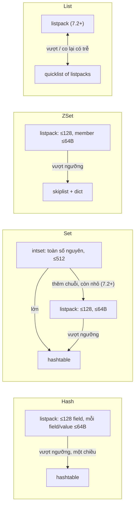
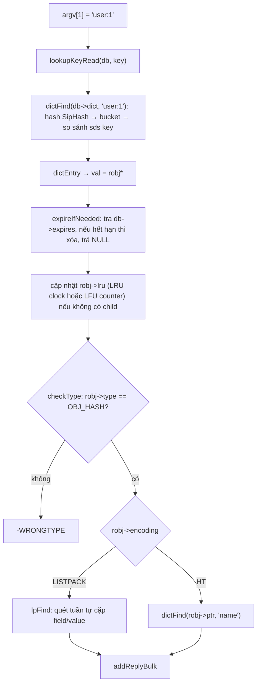

# PART 6 — REDIS OBJECT MODEL

> **Trước:** [05 — RESP Protocol](05-resp-protocol.md) · **Tiếp:** [07 — SDS](07-sds.md)
> **Độ ưu tiên:** Cao. Object model là chìa khóa để hiểu memory usage, eviction (LRU/LFU lưu ở đâu), vì sao một Hash nhỏ tốn ít RAM hơn nhiều so với Hash lớn, và vì sao `OBJECT ENCODING` là công cụ debug quan trọng.

---

## Mục lục

1. [Simple mental model](#1-simple-mental-model)
2. [WHAT — `redisObject` (robj)](#2-what--redisobject-robj)
3. [WHY — Tại sao cần một lớp object bọc ngoài data structure](#3-why--tại-sao-cần-lớp-object)
4. [HOW — Type vs Encoding](#4-how--type-vs-encoding)
5. [INTERNALS 1 — Từng field: type, encoding, lru, refcount, ptr](#5-internals-1--từng-field)
6. [INTERNALS 2 — Bảng chuyển đổi encoding và ngưỡng cấu hình](#6-internals-2--bảng-chuyển-đổi-encoding)
7. [INTERNALS 3 — Shared objects và refcount](#7-internals-3--shared-objects-và-refcount)
8. [DATA FLOW — Từ key tới byte dữ liệu](#8-data-flow--từ-key-tới-byte-dữ-liệu)
9. [EXAMPLE — Quan sát encoding thay đổi](#9-example--quan-sát-encoding-thay-đổi)
10. [WHAT HAPPENS IF](#10-what-happens-if)
11. [PERFORMANCE IMPACT — Chi phí memory của một key](#11-performance-impact--chi-phí-memory-của-một-key)
12. [PRODUCTION BEHAVIOR](#12-production-behavior)
13. [TRADE-OFF](#13-trade-off)
14. [WHEN TO USE / WHEN NOT TO USE (tuning ngưỡng encoding)](#14-when-to-use--when-not-to-use)
15. [COMMON MISUNDERSTANDINGS](#15-common-misunderstandings)
16. [INTERVIEW QUESTIONS](#16-interview-questions)
17. [KEY TAKEAWAYS](#17-key-takeaways)

---

## 1. Simple mental model

Mỗi value trong Redis giống **một chiếc hộp có dán nhãn**:
- Nhãn ghi **loại hàng** (type: String, List, Hash, Set, ZSet, Stream) — đây là thứ người dùng thấy.
- Nhãn ghi **cách đóng gói** (encoding: nén chặt trong một túi — listpack; hay chia ngăn có mục lục — hashtable) — đây là chi tiết nội bộ, Redis tự chọn.
- Nhãn ghi **lần cuối ai mở hộp / hộp được mở bao nhiêu lần** (lru field) — dùng khi kho đầy phải chọn hộp để bỏ.
- Nhãn ghi **bao nhiêu nơi đang tham chiếu hộp** (refcount).
- Bên trong là **con trỏ tới hàng thật** (ptr).

Người dùng chỉ nói "cho tôi phần tử thứ 3 của List này". Redis nhìn nhãn encoding để biết phải mở túi kiểu nào.

---

## 2. WHAT — `redisObject` (robj)

Định nghĩa trong `server.h`:

```c
#define LRU_BITS 24
typedef struct redisObject {
    unsigned type:4;        /* OBJ_STRING, OBJ_LIST, OBJ_SET, OBJ_ZSET, OBJ_HASH, OBJ_MODULE, OBJ_STREAM */
    unsigned encoding:4;    /* OBJ_ENCODING_* */
    unsigned lru:LRU_BITS;  /* LRU: thời điểm truy cập (clock 24-bit)
                               LFU: 16 bit thời gian (phút) + 8 bit counter */
    int refcount;
    void *ptr;              /* trỏ tới data structure thực, hoặc chứa trực tiếp số nguyên */
} robj;
```

Kích thước: 4 + 4 + 24 bit = 32 bit (4 byte) + refcount 4 byte + ptr 8 byte = **16 byte** trên 64-bit.

**Mọi value** trong keyspace là một robj. Key là một SDS (không bọc robj trong dict — dict lưu SDS key trực tiếp). Các argument của lệnh (`c->argv[i]`) cũng là robj string.

---

## 3. WHY — Tại sao cần lớp object

Nếu dict lưu trực tiếp con trỏ tới data structure, Redis sẽ mất:

1. **Kiểm tra type**: `LPUSH` lên key đang là Hash phải báo `WRONGTYPE`. Cần biết type mà không đoán.
2. **Đa hình encoding**: cùng type Hash nhưng có thể là listpack hoặc hashtable; code lệnh `HGET` phải biết đang làm việc với cái nào để dispatch.
3. **Metadata cho eviction**: LRU/LFU phải lưu **per-key**; đặt 24 bit vào header object là rẻ nhất.
4. **Chia sẻ object**: số nguyên nhỏ, reply phổ biến dùng chung một object nhờ refcount.
5. **Tối ưu lưu trữ tại chỗ**: với encoding `int`, số nguyên nằm luôn trong trường `ptr` (không cần cấp phát thêm).

---

## 4. HOW — Type vs Encoding

- **Type** = **giao diện logic** mà lệnh thấy: tập lệnh nào hợp lệ, ngữ nghĩa ra sao. `TYPE key` trả về type.
- **Encoding** = **cách biểu diễn vật lý** trong memory. `OBJECT ENCODING key` trả về encoding.

| Type | Encoding có thể có | Lệnh `OBJECT ENCODING` trả |
|---|---|---|
| String | `OBJ_ENCODING_INT`, `EMBSTR`, `RAW` | `int`, `embstr`, `raw` |
| List | `LISTPACK` (7.2+), `QUICKLIST`; lịch sử: `ZIPLIST`, `LINKEDLIST` | `listpack`, `quicklist` |
| Set | `INTSET`, `LISTPACK` (7.2+), `HT` | `intset`, `listpack`, `hashtable` |
| Hash | `LISTPACK` (7.0+; trước là `ZIPLIST`), `LISTPACK_EX` (7.4+, khi có field TTL), `HT` | `listpack`, `listpackex`, `hashtable` |
| Sorted Set | `LISTPACK` (7.0+; trước là `ZIPLIST`), `SKIPLIST` | `listpack`, `skiplist` |
| Stream | `STREAM` (rax + listpack) | `stream` |

Nguyên tắc chung:
- **Nhỏ → compact encoding**: một khối memory liên tục, không pointer, thao tác O(N) nhưng N nhỏ, rất tiết kiệm RAM, thân thiện CPU cache.
- **Vượt ngưỡng → full encoding**: cấu trúc có index, O(1)/O(log N), tốn RAM hơn nhiều.
- Chuyển đổi xảy ra **tự động, trong suốt**, ngay trong lệnh làm vượt ngưỡng.

---

## 5. INTERNALS 1 — Từng field

### 5.1 `type` (4 bit)

Được kiểm tra ở đầu mỗi lệnh theo type, qua `checkType(c, o, OBJ_HASH)` → nếu sai trả `-WRONGTYPE Operation against a key holding the wrong kind of value`. Một key chỉ có **một** type tại một thời điểm; `SET` ghi đè bất kể type cũ; các lệnh như `LPUSH` thì không ghi đè type khác.

### 5.2 `encoding` (4 bit)

Code lệnh dispatch theo encoding. Ví dụ `hashTypeGetValue()`:
```c
if (o->encoding == OBJ_ENCODING_LISTPACK) { ... quét listpack tìm field ... }
else if (o->encoding == OBJ_ENCODING_HT) { ... dictFind(o->ptr, field) ... }
```
Các module `t_*.c` (t_string.c, t_hash.c, t_list.c, t_set.c, t_zset.c, t_stream.c) đóng gói logic "type" trên nhiều encoding.

### 5.3 `lru` (24 bit)

Phụ thuộc `maxmemory-policy`:

**Chế độ LRU** (policy `*-lru` hoặc không phải LFU):
- Lưu **LRU clock** tại lần truy cập cuối: `server.lruclock` là thời gian Unix (giây) cắt còn 24 bit (độ phân giải `LRU_CLOCK_RESOLUTION` = 1000 ms).
- 24 bit giây → vòng lại sau 2^24 s ≈ **194 ngày**. Hàm `estimateObjectIdleTime` xử lý trường hợp wrap.
- `OBJECT IDLETIME key` → số giây kể từ lần truy cập cuối.

**Chế độ LFU** (policy `*-lfu`, Redis 4.0+):
```
      16 bit                8 bit
+----------------+----------------------+
| Last decr time | LOG_C (counter 0-255)|
|   (phút)       |                      |
+----------------+----------------------+
```
- **LDT**: thời điểm (phút, 16 bit) counter được giảm lần cuối.
- **LOG_C**: counter **logarithmic** (Morris counter): tăng với xác suất giảm dần, nên 8 bit biểu diễn được tới hàng triệu lượt truy cập.
- `OBJECT FREQ key` → counter. Chi tiết thuật toán ở [Chương 23](23-maxmemory-eviction.md).

Việc cập nhật `lru` xảy ra trong `lookupKey` mỗi lần key được truy cập — **trừ khi** có child process (BGSAVE) đang chạy (tránh ghi vào page → COW), hoặc lệnh dùng cờ không "touch" (như `OBJECT`, `TYPE` trong một số version, `TOUCH` thì ngược lại chủ động touch).

### 5.4 `refcount`

- Đếm số tham chiếu; `incrRefCount`/`decrRefCount`. Về 0 → free theo type/encoding (`freeStringObject`, `freeListObject`...).
- Giá trị đặc biệt `OBJ_SHARED_REFCOUNT` (INT_MAX): object dùng chung vĩnh viễn, không bao giờ free; `OBJ_STATIC_REFCOUNT`: object trên stack.
- Trong Redis hiện đại, refcount > 1 chủ yếu ở shared integers và argument được tái sử dụng làm value (ví dụ `SET k v` có thể lấy luôn robj `argv[2]` làm value, tăng refcount thay vì copy).

### 5.5 `ptr`

- Trỏ tới SDS (string raw/embstr), `quicklist*`, `dict*`, `zset*` (chứa dict + skiplist), `intset*`, listpack (`unsigned char*`), `stream*`.
- Với encoding `INT`: **`ptr` chính là giá trị số** (ép kiểu `long`) — không cấp phát gì thêm.

---

## 6. INTERNALS 2 — Bảng chuyển đổi encoding

Ngưỡng mặc định (Redis 7.x; tên cũ `*-ziplist-*` vẫn được chấp nhận như alias):

| Type | Compact → Full khi | Config (mặc định) |
|---|---|---|
| String | `int` → `raw` khi không còn là số nguyên biểu diễn được (APPEND, SETRANGE...); `embstr` → `raw` khi bị sửa hoặc > 44 byte | Cố định: 44 byte (`OBJ_ENCODING_EMBSTR_SIZE_LIMIT`) |
| Hash | Số field > 128 **hoặc** một field/value > 64 byte | `hash-max-listpack-entries 128`, `hash-max-listpack-value 64` |
| List | Listpack vượt kích thước một node | `list-max-listpack-size -2` (8 KB/node), `list-compress-depth 0` |
| Set | intset → listpack/hashtable khi có phần tử không phải số nguyên hoặc > 512 phần tử; listpack → hashtable khi > 128 phần tử hoặc phần tử > 64 byte | `set-max-intset-entries 512`, `set-max-listpack-entries 128`, `set-max-listpack-value 64` (7.2+) |
| Sorted Set | > 128 phần tử **hoặc** member > 64 byte | `zset-max-listpack-entries 128`, `zset-max-listpack-value 64` |
| Stream | (luôn `stream`) node listpack giới hạn | `stream-node-max-bytes 4096`, `stream-node-max-entries 100` |

**Chiều ngược lại**: nói chung **không tự động chuyển về** compact khi object nhỏ lại (Hash 200 field xóa còn 10 field vẫn là hashtable) — tránh "dao động" chuyển qua lại tốn CPU. Ngoại lệ đáng chú ý: List từ Redis 7.2 có thể chuyển quicklist → listpack khi co lại đủ nhỏ (có vùng trễ để tránh dao động). Sau restart, khi load từ RDB, object được tạo lại với encoding phù hợp kích thước hiện tại → **restart có thể giảm memory**.



**Cách đọc diagram:** Mũi tên một chiều là chuyển đổi không đảo ngược tự động. Chuyển đổi xảy ra **bên trong lệnh ghi** làm object vượt ngưỡng: Redis tạo cấu trúc mới, chép toàn bộ phần tử sang, giải phóng cấu trúc cũ — chi phí O(N) nhưng N lúc đó chỉ ~128–512 nên rất nhỏ.

---

## 7. INTERNALS 3 — Shared objects và refcount

### 7.1 Shared integers

Khi server khởi động, Redis tạo sẵn `shared.integers[0..9999]` (`OBJ_SHARED_INTEGERS` = 10000). Khi `SET counter 42`, value có thể trỏ tới object dùng chung thay vì tạo mới → 10 triệu key có value nhỏ tiết kiệm 16 byte × 10 triệu = 160 MB.

**Nhưng**: shared object **tắt** khi `maxmemory` được đặt với policy LRU/LFU. Lý do: LRU/LFU lưu trong header object; nếu nhiều key dùng chung một object, thông tin truy cập của chúng bị trộn lẫn → eviction sai. Đây là ví dụ đẹp về tương tác giữa các subsystem.

### 7.2 Shared reply objects

`shared.ok`, `shared.err`, `shared.nullbulk`, `shared.czero`, `shared.cone`, header `*<n>\r\n` và `$<n>\r\n` cho n nhỏ... → reply phổ biến không cấp phát.

### 7.3 Refcount trong thực tế

Redis ưu tiên **không chia sẻ** object value giữa các key (mỗi key sở hữu value riêng) để: lazy free an toàn (object không được tham chiếu nơi khác), sửa tại chỗ (in-place) không ảnh hưởng key khác, và tính memory per-key chính xác.

---

## 8. DATA FLOW — Từ key tới byte dữ liệu

`HGET user:1 name`:



**Cách đọc diagram (từng bước):**
1. Tra keyspace: một lần hash + đi theo chain trong bucket.
2. Lấy robj từ dictEntry.
3. **Kiểm tra hết hạn** trước khi dùng — passive expiration ([Chương 20](20-ttl-expiration.md)).
4. Cập nhật metadata truy cập cho eviction.
5. Kiểm tra type.
6. Dispatch theo encoding: listpack quét tuần tự (N ≤ 128, nhanh nhờ locality), hashtable tra O(1).
7. Ghi reply.

Mỗi mũi tên ở bước 1–2–6 thường là một **pointer dereference** → một cache miss tiềm năng. Đây là lý do các bản mới (Redis 8.2 với cách lưu key mới, Valkey 8 với việc embed key vào object) cố gắng **gộp** dictEntry, key và robj vào ít vùng memory hơn.

---

## 9. EXAMPLE — Quan sát encoding thay đổi

```
> SET n 12345
> OBJECT ENCODING n            → "int"
> APPEND n "abc"
> OBJECT ENCODING n            → "raw"      (APPEND chuyển sang raw)

> SET s "hello"
> OBJECT ENCODING s            → "embstr"
> SET s2 <chuỗi 45 byte>
> OBJECT ENCODING s2           → "raw"

> HSET h f1 v1
> OBJECT ENCODING h            → "listpack"
> HSET h bigfield <value 65 byte>
> OBJECT ENCODING h            → "hashtable"
> HDEL h bigfield
> OBJECT ENCODING h            → "hashtable"  (không quay lại)

> SADD s 1 2 3
> OBJECT ENCODING s            → "intset"
> SADD s abc
> OBJECT ENCODING s            → "listpack"   (7.2+; bản cũ: "hashtable")

> ZADD z 1 a
> OBJECT ENCODING z            → "listpack"
```

---

## 10. WHAT HAPPENS IF

### 10.1 Tăng `hash-max-listpack-entries` lên 10.000 để tiết kiệm RAM

Hash 10.000 field ở dạng listpack: mỗi `HGET`/`HSET` là **quét tuần tự O(N)** trên vài trăm KB, và mỗi lần chèn/xóa phải `memmove`/`realloc` cả khối → CPU tăng mạnh, latency tăng. Tiết kiệm RAM đổi bằng CPU của main thread — thread quý nhất. Thường chỉ nâng vừa phải (vài trăm) và phải benchmark.

### 10.2 Một field lớn duy nhất làm cả Hash chuyển sang hashtable

Hash 20 field nhỏ + 1 field 100 byte → toàn bộ hash thành hashtable, tốn RAM gấp nhiều lần. Pattern "lưu description dài chung với các field nhỏ" có thể làm memory tăng bất ngờ.

### 10.3 Đặt maxmemory LRU sau khi đã có dữ liệu

Shared integers ngừng được dùng cho **giá trị mới**; value cũ vẫn trỏ object chia sẻ cho tới khi bị ghi lại. Không gây lỗi, chỉ thay đổi memory profile.

---

## 11. PERFORMANCE IMPACT — Chi phí memory của một key

Ước lượng key `user:12345` (10 byte) → value String "alice" (5 byte), có TTL, jemalloc:

| Thành phần | Kích thước xấp xỉ |
|---|---|
| Con trỏ bucket trong bảng hash keyspace (chia theo load factor) | ~8 byte |
| `dictEntry` (key ptr, val ptr, next ptr) | 24 byte |
| SDS key (header sdshdr8 3 byte + 10 + 1 null) → size class 16 | 16 byte |
| robj + embstr SDS (một allocation) → size class | ~32 byte |
| Entry trong `expires` dict (dictEntry + bucket) | ~32 byte |
| **Tổng** | **~100+ byte cho 15 byte dữ liệu** |

Hệ quả thiết kế:
- **Hàng trăm triệu key nhỏ** → overhead chiếm phần lớn RAM. Kỹ thuật "gom vào Hash nhỏ" (bucket hashing — ví dụ `user:12345` → `HSET user:bucket:123 45 alice`) tận dụng encoding listpack để giảm memory nhiều lần (được Instagram mô tả trong bài blog nổi tiếng về lưu 300 triệu mapping).
- Nhưng gom quá mức → mất TTL per-item (Redis 7.4+ có hash field TTL giúp phần này), khó phân tán trong cluster.

Dùng `MEMORY USAGE key` để đo chính xác (bao gồm overhead), `MEMORY STATS` cho tổng quan.

---

## 12. PRODUCTION BEHAVIOR

- Memory tăng đột ngột sau một deploy dù số key không đổi → kiểm tra `OBJECT ENCODING` trên mẫu key: có thể thay đổi dữ liệu làm object vượt ngưỡng listpack.
- Restart/failover sang replica mới full sync có thể làm **memory giảm** (object được tạo lại với encoding compact, fragmentation được xóa).
- `redis-cli --memkeys` và `--bigkeys` dùng SCAN + `MEMORY USAGE`/đếm phần tử để tìm key tốn RAM.

---

## 13. TRADE-OFF

| Quyết định | Được | Mất |
|---|---|---|
| Header 16 byte mỗi value | Type check, đa encoding, metadata eviction | 16 byte/key overhead |
| LRU/LFU 24 bit | Không cần cấu trúc eviction riêng | Độ phân giải thấp (giây/phút), LRU xấp xỉ |
| Compact encoding cho object nhỏ | Tiết kiệm RAM 5–10x | O(N) thao tác; chuyển đổi một chiều |
| Không chia sẻ value giữa key | Lazy free an toàn, sửa tại chỗ | Không dedup |

---

## 14. WHEN TO USE / WHEN NOT TO USE

**Tuning ngưỡng encoding khi:**
- Dataset gồm rất nhiều object nhỏ-vừa (Hash 150–500 field) và RAM là ràng buộc chính; benchmark cho thấy CPU chấp nhận được.

**Không tuning khi:**
- Object thường xuyên lớn (nghìn phần tử) — nâng ngưỡng chỉ làm chậm.
- Latency p99 là ưu tiên hàng đầu.

---

## 15. COMMON MISUNDERSTANDINGS

| Hiểu sai | Thực tế |
|---|---|
| "Hash luôn là hash table" | Nhỏ thì là listpack (mảng tuần tự) |
| "TYPE và OBJECT ENCODING giống nhau" | Type là logic, encoding là vật lý |
| "Xóa bớt phần tử thì object quay về compact" | Thường không (trừ List 7.2+); cần ghi lại key hoặc restart |
| "Key 10 byte value 5 byte tốn 15 byte" | ~100 byte do dictEntry, SDS header, robj, expires, size class allocator |
| "LRU của Redis lưu trong một linked list như LRU cache giáo khoa" | Chỉ là 24 bit timestamp trong object; eviction dùng sampling |

---

## 16. INTERVIEW QUESTIONS

1. **redisObject gồm những gì?** → type (4 bit), encoding (4 bit), lru (24 bit: LRU clock hoặc LFU ldt+counter), refcount, ptr; 16 byte.
2. **Type khác encoding thế nào? Cho ví dụ.** → Hash có thể là listpack hoặc hashtable; ZSet là listpack hoặc skiplist+dict.
3. **Khi nào Hash chuyển từ listpack sang hashtable? Có chuyển ngược không?** → > 128 field hoặc giá trị > 64 byte; không tự chuyển ngược.
4. **Tại sao shared integers bị tắt khi dùng LRU/LFU?** → Metadata truy cập nằm trong header object; chia sẻ làm trộn thông tin truy cập.
5. **(Senior) Có 500 triệu key nhỏ tốn 60 GB RAM. Giảm thế nào?** → Đo overhead per key; bucket hashing vào Hash nhỏ (listpack); rút ngắn key name; bỏ TTL không cần; cân nhắc encoding số; đánh đổi TTL per-item/khả năng phân tán.

---

## 17. KEY TAKEAWAYS

- Mọi value là một **robj 16 byte**: type, encoding, lru/lfu, refcount, ptr.
- **Type là giao diện, encoding là hiện thực**; Redis tự chọn compact encoding cho object nhỏ và chuyển sang full encoding khi vượt ngưỡng (thường một chiều).
- Metadata eviction (LRU clock/LFU counter) sống trong header object → eviction không cần cấu trúc phụ, nhưng chỉ xấp xỉ.
- Overhead mỗi key ~50–100 byte → với key nhỏ, overhead lớn hơn dữ liệu; gom vào Hash compact là kỹ thuật tiết kiệm RAM quan trọng.
- `OBJECT ENCODING`, `MEMORY USAGE`, `OBJECT FREQ/IDLETIME` là công cụ quan sát trực tiếp object model.
