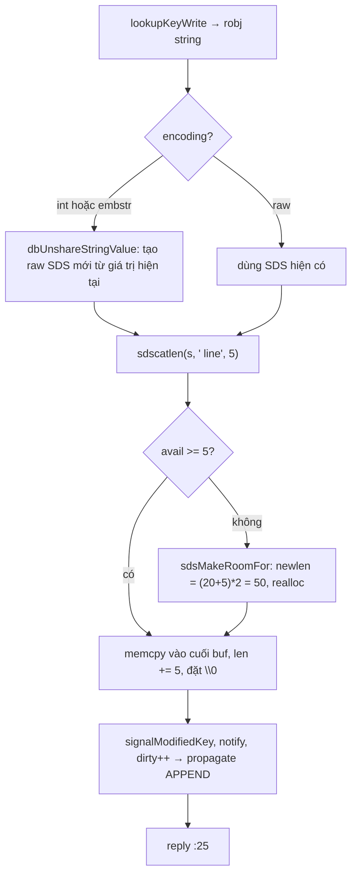

# PART 7 — SDS (SIMPLE DYNAMIC STRING)

> **Trước:** [06 — Redis Object Model](06-redis-object-model.md) · **Tiếp:** [08 — Dictionary / Hash Table Internals](08-dict-hash-table.md)
> **Độ ưu tiên:** Trung bình–cao. SDS là viên gạch cơ bản nhất: mọi key, mọi String value, query buffer, AOF buffer đều là SDS. Hiểu SDS giải thích vì sao `STRLEN` là O(1), vì sao APPEND nhanh, và vì sao string có thể chiếm gấp đôi RAM so với nội dung.

---

## Mục lục

1. [Simple mental model](#1-simple-mental-model)
2. [WHAT — SDS là gì](#2-what--sds-là-gì)
3. [WHY — Vấn đề của C string](#3-why--vấn-đề-của-c-string)
4. [HOW — Cấu trúc header và con trỏ](#4-how--cấu-trúc-header-và-con-trỏ)
5. [INTERNALS 1 — Năm loại header](#5-internals-1--năm-loại-header)
6. [INTERNALS 2 — Resizing và preallocation](#6-internals-2--resizing-và-preallocation)
7. [INTERNALS 3 — Lazy free space và trimming](#7-internals-3--lazy-free-space-và-trimming)
8. [INTERNALS 4 — Tương tác với allocator](#8-internals-4--tương-tác-với-allocator)
9. [DATA FLOW — APPEND trên một SDS](#9-data-flow--append-trên-một-sds)
10. [EXAMPLE](#10-example)
11. [WHAT HAPPENS IF](#11-what-happens-if)
12. [PERFORMANCE IMPACT](#12-performance-impact)
13. [PRODUCTION BEHAVIOR](#13-production-behavior)
14. [TRADE-OFF](#14-trade-off)
15. [WHEN TO USE / WHEN NOT TO USE](#15-when-to-use--when-not-to-use)
16. [COMMON MISUNDERSTANDINGS](#16-common-misunderstandings)
17. [INTERVIEW QUESTIONS](#17-interview-questions)
18. [KEY TAKEAWAYS](#18-key-takeaways)

---

## 1. Simple mental model

Một **cuốn sổ tay có trang bìa ghi "đã viết X trang / sổ có tổng Y trang"**:
- Muốn biết đã viết bao nhiêu → nhìn bìa (O(1)), không phải lật đếm.
- Muốn viết thêm → xem còn trang trống không; nếu hết, đổi sang sổ dày gấp đôi (preallocation) để lần sau không phải đổi sổ ngay.
- Trang nào cũng có thể chứa bất cứ ký hiệu gì, kể cả "ký tự kết thúc" — vì độ dài ghi ở bìa, không dựa vào ký tự đặc biệt.
- Và để tương thích với người quen đọc "sổ kiểu cũ", luôn có một dấu chấm hết ở cuối nội dung.

---

## 2. WHAT — SDS là gì

**SDS (Simple Dynamic String)** là thư viện chuỗi động của Redis (`sds.c`, `sds.h`, cũng được phát hành độc lập). Một SDS là:
- một **header** chứa độ dài đã dùng (`len`), dung lượng đã cấp phát (`alloc`), và loại header (`flags`),
- ngay sau là **buffer dữ liệu** (`buf[]`),
- kết thúc bằng một byte `\0` (không tính trong `len`).

Kiểu `sds` trong C chỉ là `typedef char *sds;` — **con trỏ trỏ vào `buf`**, không phải vào header.

---

## 3. WHY — Vấn đề của C string

C string là mảng `char` kết thúc bằng `\0`. Với Redis, có 5 vấn đề:

| Vấn đề C string | Hệ quả cho Redis | SDS giải quyết |
|---|---|---|
| `strlen` là **O(N)** — quét tới `\0` | `STRLEN` trên value 100 MB quét 100 MB | `len` trong header → O(1) |
| **Không binary-safe**: `\0` trong dữ liệu bị hiểu là kết thúc | Không lưu được ảnh, protobuf, số nhị phân, dữ liệu nén | Dùng `len`, không dựa `\0` |
| **Buffer overflow**: `strcat` không kiểm tra dung lượng | Lỗ hổng bảo mật, crash | Mọi hàm nối kiểm tra và mở rộng tự động |
| **Mỗi lần nối phải realloc** chính xác | APPEND N lần = N lần realloc + copy → O(N²) | Preallocation → amortized O(1) mỗi byte |
| Không biết dung lượng thực | Không tái sử dụng buffer | `alloc` cho phép giữ buffer và dùng lại |

Và SDS **vẫn giữ tương thích C**: vì `sds` trỏ vào `buf` và luôn có `\0` cuối, có thể truyền SDS vào `printf("%s")`, `strcmp` (với chuỗi không chứa `\0`) khi cần.

---

## 4. HOW — Cấu trúc header và con trỏ

```text
        header (kích thước tùy loại)            buf
  +--------+---------+-------+-----------------------------------+----+-------------+
  |  len   |  alloc  | flags |  h  e  l  l  o                    | \0 | (free space)|
  +--------+---------+-------+-----------------------------------+----+-------------+
                              ^
                              sds s  (con trỏ trả cho người dùng)

  s[-1]  = flags  → 3 bit thấp cho biết loại header (5, 8, 16, 32, 64)
  len    = 5
  alloc  = dung lượng buf không tính header và \0
  avail  = alloc - len
```

Từ con trỏ `s`:
1. Đọc `s[-1]` (flags) → biết loại header.
2. Lùi đúng kích thước header → truy cập `len`, `alloc`.

Nhờ đặt header **ngay trước** buffer, SDS chỉ cần **một lần cấp phát** cho cả header và dữ liệu, và con trỏ dùng được như `char*`.

---

## 5. INTERNALS 1 — Năm loại header

```c
struct __attribute__ ((__packed__)) sdshdr5  { unsigned char flags; /* 3 bit type, 5 bit len */ char buf[]; };
struct __attribute__ ((__packed__)) sdshdr8  { uint8_t  len; uint8_t  alloc; unsigned char flags; char buf[]; };
struct __attribute__ ((__packed__)) sdshdr16 { uint16_t len; uint16_t alloc; unsigned char flags; char buf[]; };
struct __attribute__ ((__packed__)) sdshdr32 { uint32_t len; uint32_t alloc; unsigned char flags; char buf[]; };
struct __attribute__ ((__packed__)) sdshdr64 { uint64_t len; uint64_t alloc; unsigned char flags; char buf[]; };
```

| Loại | Độ dài tối đa | Header | Ghi chú |
|---|---|---|---|
| `sdshdr5` | < 32 byte | 1 byte | Không có `alloc` → không theo dõi free space; dùng cho chuỗi ngắn **không** dự định nối thêm (ví dụ key) |
| `sdshdr8` | < 256 | 3 byte | Phổ biến nhất |
| `sdshdr16` | < 64 KB | 5 byte | |
| `sdshdr32` | < 4 GB | 9 byte | |
| `sdshdr64` | lớn hơn | 17 byte | |

**Tại sao nhiều loại header?** Trước Redis 3.2, SDS có một header duy nhất (`int len; int free;` = 8 byte). Với hàng trăm triệu key ngắn, 8 byte/key là lãng phí đáng kể. Header theo kích thước giảm overhead xuống 1–3 byte cho chuỗi ngắn.

**`__attribute__((packed))`**: bỏ padding để `flags` luôn nằm ngay trước `buf` — điều kiện để `s[-1]` luôn là flags với mọi loại header.

---

## 6. INTERNALS 2 — Resizing và preallocation

`sdsMakeRoomFor(s, addlen)` được gọi trước mọi thao tác nối:

```text
if avail >= addlen: return s                 # đủ chỗ, không làm gì
newlen = len + addlen
if greedy:                                   # mặc định cho APPEND, nối buffer
    if newlen < SDS_MAX_PREALLOC (1 MB): newlen *= 2
    else:                                newlen += 1 MB
type = sdsReqType(newlen)                    # có thể phải "lên đời" header
if type == old type:
    realloc(header, hdrlen + newlen + 1)     # allocator có thể mở rộng tại chỗ
else:
    malloc header mới, memcpy dữ liệu, free cũ
alloc = usable size thực tế từ allocator     # tận dụng phần dư của size class
```

Hệ quả:
- **< 1 MB: gấp đôi** → số lần realloc khi APPEND liên tục là O(log N); tổng chi phí copy amortized O(N).
- **≥ 1 MB: cộng thêm 1 MB** → tránh lãng phí gấp đôi với chuỗi rất lớn (chuỗi 400 MB mà gấp đôi thành 800 MB là thảm họa); đổi lại, realloc thường hơn.
- Từ Redis 7.0 có biến thể **non-greedy** (`sdsMakeRoomForNonGreedy`) cho các chỗ biết chính xác cần bao nhiêu (ví dụ đọc bulk có length biết trước) → không cấp dư.

---

## 7. INTERNALS 3 — Lazy free space và trimming

- **Rút ngắn không trả memory ngay**: `sdsrange`, `sdstrim`, `sdsclear` chỉ giảm `len`; `alloc` giữ nguyên để tái sử dụng (ví dụ query buffer được clear rồi dùng lại mỗi lệnh).
- **Trả memory khi cần**: `sdsRemoveFreeSpace()` / `sdsResize()` thu nhỏ `alloc` về đúng `len`. Redis gọi ở những chỗ có lợi:
  - `clientsCron` co **query buffer** của client đang idle hoặc buffer quá lớn so với peak gần đây.
  - Khi một argument (có thể được tạo từ querybuf với dung lượng dư) trở thành value lưu trong keyspace, Redis cắt phần dư nếu lãng phí đáng kể (`trimStringObjectIfNeeded`) — tránh lưu vĩnh viễn một value 10 byte trong buffer 16 KB.

---

## 8. INTERNALS 4 — Tương tác với allocator

- jemalloc cấp phát theo **size class** (8, 16, 32, 48, 64, 80, 96, 112, 128, 160, 192, 224, 256, 320, ...). Yêu cầu 50 byte → nhận 64 byte.
- SDS (các bản mới) hỏi allocator kích thước **usable** thực tế và đặt `alloc` bằng nó → phần dư của size class không bị phí, APPEND nhỏ tiếp theo có thể không cần realloc.
- **embstr**: robj (16 byte) + sdshdr8 (3) + dữ liệu ≤ 44 + `\0` (1) = **64 byte** — vừa khít size class 64 của jemalloc, **một** allocation, thường **một cache line**. Đây là lý do con số "44" trong Redis. (Trước 3.2 là 39 do header SDS cũ 8 byte.)

```text
embstr (một allocation 64 byte):
+-----------------------+----------------+------------------------------+----+
| robj (16B)            | sdshdr8 (3B)   | data (≤44B)                  | \0 |
| type|enc|lru|ref|ptr ─┼──────────────► |                              |    |
+-----------------------+----------------+------------------------------+----+

raw (hai allocation):
+-----------------------+          +---------+----------------------------+----+-----+
| robj (16B)  ptr ──────┼────────► | sdshdrX | data                       | \0 |free |
+-----------------------+          +---------+----------------------------+----+-----+
```

---

## 9. DATA FLOW — APPEND trên một SDS

`APPEND log:1 " line"` (5 byte) với value hiện tại dài 20 byte:



**Cách đọc diagram:** embstr là **read-only** (dữ liệu nằm chung allocation với robj, không mở rộng tại chỗ được) → sửa đổi luôn chuyển thành raw. Sau khi thành raw, APPEND tiếp theo thường **không cần realloc** nhờ free space. Kết quả: APPEND lặp lại có chi phí amortized O(độ dài phần thêm).

---

## 10. EXAMPLE

Xây một chuỗi log bằng 1000 lần APPEND 100 byte:

| Sau lần APPEND | len | alloc (xấp xỉ) | realloc? |
|---|---|---|---|
| 1 | 100 | 200 | có (tạo raw) |
| 2 | 200 | 200 | không |
| 3 | 300 | 600 | có |
| 7 | 700 | 1200 | có |
| ... | ... | ... | ~log₂ lần |
| 1000 | 100.000 | ~130.000–200.000 | tổng ~11 lần realloc |

Với C string naive: 1000 lần realloc, tổng copy ~50 MB. Với SDS: ~11 lần, tổng copy ~200 KB.

Nhưng chú ý: kết quả cuối có thể có `alloc` gần **gấp đôi** `len` → value 100 KB chiếm tới ~200 KB RAM.

---

## 11. WHAT HAPPENS IF

### 11.1 Dùng APPEND để xây value lớn (log, timeline)

Mỗi key có thể lãng phí tới ~50% RAM do preallocation (với chuỗi < 1 MB). 1 triệu key như vậy → hàng GB lãng phí. `MEMORY USAGE` sẽ phản ánh con số này. Giải pháp: dùng List/Stream cho dữ liệu dạng append, hoặc chấp nhận.

### 11.2 SETRANGE với offset lớn

`SETRANGE k 536870000 x` → Redis phải cấp phát chuỗi ~512 MB (điền `\0`) **ngay trên main thread** → chặn server, có thể OOM. Tương tự `SETBIT` với offset lớn ([Chương 14](14-bitmap-bitfield.md)).

### 11.3 Chuỗi vượt 512 MB

Bị từ chối (`proto-max-bulk-len` giới hạn độ dài bulk trong request; `SETRANGE`/`APPEND` kiểm tra `checkStringLength`). Có thể nâng config nhưng là dấu hiệu thiết kế sai.

---

## 12. PERFORMANCE IMPACT

- **O(1)**: `STRLEN`, lấy độ dài cho reply header (`$<len>`), so sánh độ dài trước khi so sánh nội dung.
- **Amortized O(k)** cho APPEND k byte.
- **Memory**: header 1–17 byte + tối đa ~100% free space (với chuỗi < 1 MB tạo bằng append) + làm tròn size class.
- **CPU cache**: embstr gom robj và dữ liệu → giảm một cache miss cho GET chuỗi ngắn.

---

## 13. PRODUCTION BEHAVIOR

- `MEMORY USAGE key` của một string "100 byte" trả 120–200 byte là bình thường (header, robj, dictEntry, size class, key).
- Query buffer phình (client gửi lệnh lớn) được co lại trong `clientsCron`; theo dõi `client_recent_max_input_buffer` trong `INFO clients` và cột `qbuf` trong `CLIENT LIST`.
- Một lý do memory giảm sau restart: string được load lại với `alloc == len` (không còn free space từ APPEND).

---

## 14. TRADE-OFF

| Quyết định | Được | Mất |
|---|---|---|
| Lưu `len` | O(1) length, binary-safe | Thêm 1–17 byte header |
| Preallocation gấp đôi (< 1 MB) | APPEND amortized O(1) | Lãng phí tới ~50% RAM |
| +1 MB cho chuỗi lớn | Tránh lãng phí khổng lồ | Realloc thường hơn với chuỗi lớn tăng dần |
| Lazy free space | Tái sử dụng buffer (query buffer) | Memory không trả ngay |
| Nhiều loại header | Overhead nhỏ cho chuỗi ngắn | Code phức tạp hơn; đổi loại header khi lớn lên phải copy |
| Con trỏ vào `buf` | Tương thích C string | Phải dùng `s[-1]` để tìm header (cần packed struct) |

---

## 15. WHEN TO USE / WHEN NOT TO USE

(Góc nhìn người dùng Redis: hành vi String dựa trên SDS.)

**Phù hợp:** value nhị phân bất kỳ (JSON, protobuf, ảnh nhỏ), counter, token; APPEND thỉnh thoảng.

**Không phù hợp:** dùng một String làm log tăng liên tục (dùng List/Stream), value cực lớn hàng trăm MB (big key, [Chương 28](28-big-key.md)), cập nhật từng phần nhỏ của JSON lớn (dùng Hash hoặc JSON type trong Redis 8).

---

## 16. COMMON MISUNDERSTANDINGS

| Hiểu sai | Thực tế |
|---|---|
| "Redis lưu string như C string" | Lưu SDS: có len/alloc, binary-safe |
| "Chuỗi 44 byte và 45 byte tốn RAM gần như nhau" | 44 → embstr một allocation 64 B; 45 → raw hai allocation |
| "STRLEN là O(N)" | O(1) |
| "APPEND luôn realloc" | Chỉ khi hết free space; free space được cấp dư |
| "Value 100 KB tốn 100 KB RAM" | Có thể tới ~200 KB nếu tạo bằng APPEND |

---

## 17. INTERVIEW QUESTIONS

1. **SDS là gì? Khác C string thế nào?** → Header (len, alloc, flags) + buf + `\0`; O(1) length, binary-safe, không overflow, preallocation, tương thích C.
2. **Tại sao Redis không dùng raw C string?** → strlen O(N), không binary-safe, overflow, realloc mỗi lần nối.
3. **Chiến lược preallocation của SDS?** → < 1 MB: gấp đôi; ≥ 1 MB: +1 MB.
4. **Tại sao con số 44 byte quan trọng?** → robj 16 + sdshdr8 3 + 44 + 1 = 64 = size class jemalloc → embstr một allocation.
5. **(Senior) Memory tăng nhanh hơn dữ liệu thực khi dùng APPEND cho timeline — giải thích và xử lý.** → Preallocation để lại free space tới ~50%; chuyển sang List/Stream hoặc giới hạn độ dài, hoặc ghi lại value (SET) để cắt free space.

---

## 18. KEY TAKEAWAYS

- SDS = **header (len, alloc, flags) + buf + `\0`**, con trỏ trỏ vào buf → vừa an toàn vừa tương thích C.
- **O(1) length, binary-safe, chống overflow, APPEND amortized O(1)** nhờ preallocation (gấp đôi < 1 MB, +1 MB sau đó).
- Nhiều loại header (5/8/16/32/64) để giảm overhead cho chuỗi ngắn.
- **embstr ≤ 44 byte** gom robj + SDS trong một allocation 64 byte.
- Cái giá: free space có thể làm string chiếm gần gấp đôi RAM; memory không trả ngay khi rút ngắn.
