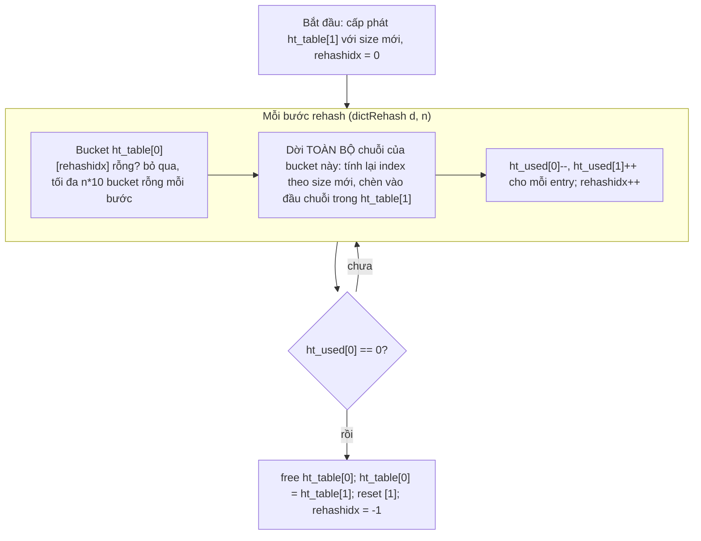
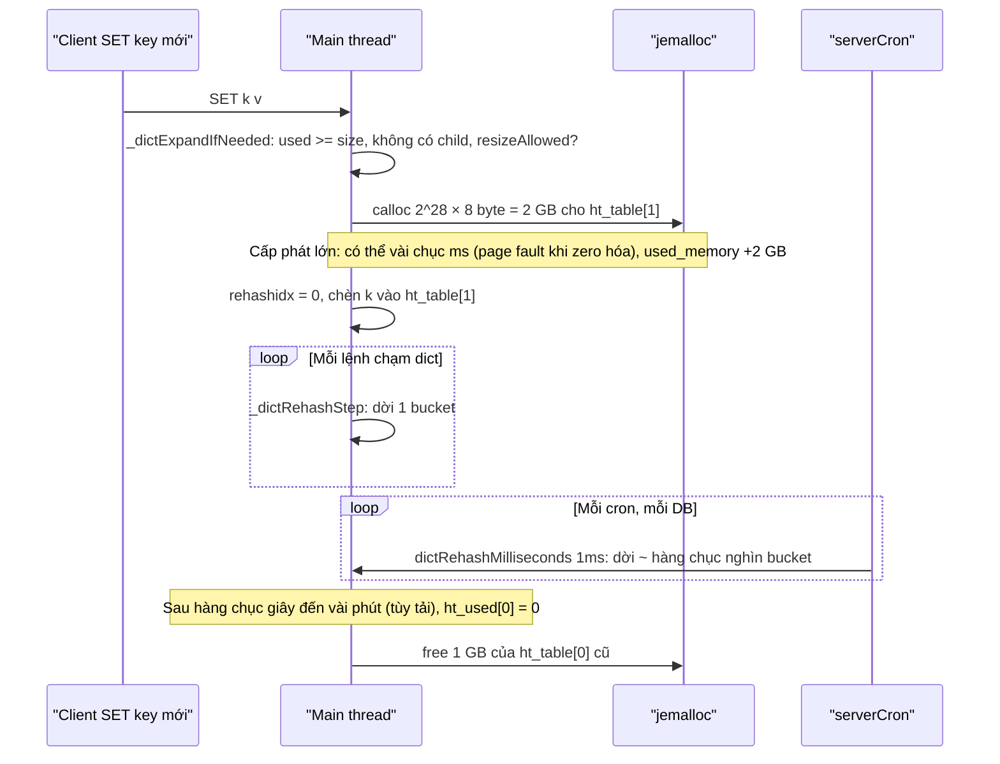

# PART 8 — DICTIONARY / HASH TABLE INTERNALS

> **Trước:** [07 — SDS](07-sds.md) · **Tiếp:** [09 — Redis String](09-string.md)
> **Độ ưu tiên:** Cao nhất trong nhóm data structure. `dict` là cấu trúc được dùng nhiều nhất trong Redis: **toàn bộ keyspace**, expires, Hash/Set lớn, phần dict của Sorted Set, command table, Pub/Sub channels... Hiểu dict là hiểu vì sao lookup O(1), vì sao Redis không "đứng hình" khi resize, và vì sao memory có thể nhảy vọt hàng GB đột ngột.

---

## Mục lục

1. [Simple mental model](#1-simple-mental-model)
2. [WHAT — Redis dict là gì](#2-what--redis-dict-là-gì)
3. [WHY — Tại sao Redis cần hash table riêng](#3-why--tại-sao-redis-cần-hash-table-riêng)
4. [HOW — Hash table cơ bản: bucket, hash function, collision, chaining](#4-how--hash-table-cơ-bản)
5. [INTERNALS 1 — Cấu trúc `dict` và `dictEntry`](#5-internals-1--cấu-trúc-dict-và-dictentry)
6. [INTERNALS 2 — Hash function: SipHash và hash flooding](#6-internals-2--hash-function-siphash)
7. [INTERNALS 3 — Load factor, expand, shrink](#7-internals-3--load-factor-expand-shrink)
8. [INTERNALS 4 — Incremental rehash](#8-internals-4--incremental-rehash)
9. [INTERNALS 5 — Lookup, insert, delete trong lúc rehash](#9-internals-5--lookup-insert-delete-trong-lúc-rehash)
10. [INTERNALS 6 — Iterator và dictScan](#10-internals-6--iterator-và-dictscan)
11. [DATA FLOW — Một lần resize keyspace 100 triệu key](#11-data-flow--một-lần-resize-keyspace-100-triệu-key)
12. [WHAT HAPPENS IF — Rehash toàn bộ một lần](#12-what-happens-if)
13. [PERFORMANCE IMPACT](#13-performance-impact)
14. [PRODUCTION BEHAVIOR](#14-production-behavior)
15. [TRADE-OFF](#15-trade-off)
16. [WHEN TO USE / WHEN NOT TO USE](#16-when-to-use--when-not-to-use)
17. [COMMON MISUNDERSTANDINGS](#17-common-misunderstandings)
18. [INTERVIEW QUESTIONS](#18-interview-questions)
19. [KEY TAKEAWAYS](#19-key-takeaways)

---

## 1. Simple mental model

Một **tủ hồ sơ có N ngăn kéo** (bucket). Muốn cất hồ sơ "user:42", ta tính một con số từ tên (hash) rồi lấy phần dư theo số ngăn → biết ngăn nào. Nhiều hồ sơ rơi vào cùng ngăn thì **xâu chúng thành chuỗi** (chaining).

Khi tủ quá đầy (mỗi ngăn trung bình ≥ 1 hồ sơ), ta mua **tủ mới gấp đôi**. Nhưng không dừng văn phòng để chuyển hết một lúc — mà **mỗi lần có người đến lấy/cất hồ sơ, ta tiện tay chuyển một ngăn** từ tủ cũ sang tủ mới (incremental rehash). Trong thời gian chuyển, tìm hồ sơ phải xem **cả hai tủ**. Khi tủ cũ rỗng thì vứt đi.

---

## 2. WHAT — Redis dict là gì

`dict` (`dict.c`, `dict.h`) là **hash table với separate chaining**, có **hai bảng** để phục vụ **incremental rehash**, và một `dictType` cho phép tùy biến hàm hash, so sánh key, hủy key/value.

Nơi dict được dùng:

| Nơi | Key | Value |
|---|---|---|
| Keyspace `db->dict` | SDS key | robj* |
| `db->expires` | SDS key (chung con trỏ với keyspace) | int64 thời điểm hết hạn (ms) |
| Hash encoding `hashtable` | SDS field | SDS value |
| Set encoding `hashtable` | SDS member | NULL |
| Sorted Set (encoding skiplist) | SDS member | con trỏ tới score trong node skiplist |
| Command table | tên lệnh (case-insensitive) | `redisCommand*` |
| Pub/Sub | channel | tập client |
| `blocking_keys`, `watched_keys` | key | list client |
| Cluster | node ID | `clusterNode*` |

---

## 3. WHY — Tại sao Redis cần hash table riêng

Yêu cầu đặc thù của Redis:
1. **Không bao giờ dừng lâu**: keyspace có thể có hàng trăm triệu key. Hash table giáo khoa khi đầy sẽ **rehash toàn bộ** một lần → dừng vài giây. Không chấp nhận được với server một thread.
2. **Duyệt được khi đang thay đổi**: SCAN phải duyệt keyspace qua nhiều lệnh, trong khi key được thêm/xóa và bảng có thể resize.
3. **Chống tấn công**: key do người dùng bên ngoài kiểm soát (ví dụ tên session) → hash function phải chống **hash flooding**.
4. **Lấy phần tử ngẫu nhiên hiệu quả**: RANDOMKEY, SPOP, SRANDMEMBER, và **sampling cho eviction/expire** (`dictGetSomeKeys`, `dictGetFairRandomKey`).
5. **Kiểm soát memory**: tránh cấp phát bảng khổng lồ khi gần maxmemory, tránh resize khi có fork child.

Không thư viện có sẵn nào đáp ứng đủ → Redis tự viết.

---

## 4. HOW — Hash table cơ bản

### 4.1 Bucket và index

- Bảng là mảng `size` con trỏ (bucket), `size` luôn là **lũy thừa của 2**.
- `index = hash(key) & (size - 1)` — phép AND thay cho phép chia lấy dư (nhanh hơn), đúng vì size là lũy thừa của 2 (`sizemask = size - 1`).

### 4.2 Collision và chaining

Hai key khác nhau cho cùng index → **collision**. Redis dùng **separate chaining**: mỗi bucket là danh sách liên kết đơn các `dictEntry`. Phần tử mới được chèn vào **đầu** chuỗi (O(1), và phần tử vừa thêm thường được truy cập sớm).

```text
ht_table[0]  (size = 8, sizemask = 7)
 [0] → NULL
 [1] → {k="user:7", v=robj} → {k="cart:9", v=robj} → NULL     ← collision, chaining
 [2] → NULL
 [3] → {k="user:42", v=robj} → NULL
 [4] → NULL
 [5] → {k="session:ab", v=robj} → NULL
 [6] → NULL
 [7] → {k="lb", v=robj} → NULL
```

### 4.3 Load factor

`load factor = used / size`. Chuỗi trung bình dài bằng load factor. Giữ load factor ≈ 1 → lookup trung bình O(1) với ~1–2 phép so sánh key.

---

## 5. INTERNALS 1 — Cấu trúc `dict` và `dictEntry`

Redis 7.x (đơn giản hóa):

```c
typedef struct dictEntry {
    void *key;
    union { void *val; uint64_t u64; int64_t s64; double d; } v;
    struct dictEntry *next;          /* chaining */
} dictEntry;                          /* 24 byte */

struct dict {
    dictType *type;
    dictEntry **ht_table[2];          /* hai bảng: [0] đang dùng, [1] đích khi rehash */
    unsigned long ht_used[2];         /* số entry trong mỗi bảng */
    long rehashidx;                   /* -1: không rehash; ≥0: bucket tiếp theo cần dời */
    int16_t pauserehash;              /* >0: tạm dừng rehash (safe iterator, scan) */
    signed char ht_size_exp[2];       /* size = 1 << exp */
    ...
};

typedef struct dictType {
    uint64_t (*hashFunction)(const void *key);
    void *(*keyDup)(dict *d, const void *key);
    int (*keyCompare)(dict *d, const void *key1, const void *key2);
    void (*keyDestructor)(dict *d, void *key);
    void (*valDestructor)(dict *d, void *obj);
    int (*resizeAllowed)(size_t moreMem, double usedRatio);
    ...
} dictType;
```

Ghi chú:
- Union `v` cho phép lưu số trực tiếp (ví dụ `expires` lưu int64 ms, không cần cấp phát).
- Lưu `size_exp` (1 byte) thay vì size (8 byte) — tiết kiệm cho hàng triệu dict nhỏ (mỗi Hash/Set lớn là một dict).
- Các bản mới có tối ưu thêm: entry "không có value" cho Set, key nhúng trong entry... Valkey 8.1 thay hẳn dict bằng hash table **open addressing** với bucket cỡ cache line để giảm memory và cache miss. Nguyên lý incremental rehash vẫn giữ.

---

## 6. INTERNALS 2 — Hash function: SipHash

- Redis dùng **SipHash** (biến thể SipHash-1-2 — ít vòng hơn SipHash-2-4 để nhanh hơn, vẫn đủ chống flooding theo đánh giá của Redis) với **seed 128 bit ngẫu nhiên tạo lúc khởi động**.
- Trước đó (Redis ≤ 3.x) dùng MurmurHash2 — không có seed ngẫu nhiên đủ mạnh.
- Có biến thể **case-insensitive** (`dictGenCaseHashFunction`) cho command table.

### Hash flooding là gì

Nếu hash function cố định và công khai, kẻ tấn công có thể tạo hàng triệu key **cùng bucket** → một chuỗi dài N → mọi lookup O(N) → server tê liệt (tấn công DoS thuật toán, từng xảy ra với PHP/Java/Python năm 2011). Với seed ngẫu nhiên bí mật mỗi process, kẻ tấn công không tính trước được collision.

Hệ quả phụ: **thứ tự duyệt key khác nhau giữa các instance/lần restart** — đừng bao giờ dựa vào thứ tự SCAN/KEYS/HGETALL.

---

## 7. INTERNALS 3 — Load factor, expand, shrink

### 7.1 Expand (mở rộng)

Kiểm tra trước mỗi lần thêm (`_dictExpandIfNeeded`):

```text
if đang rehash: không làm gì
if size == 0: tạo bảng kích thước khởi đầu 4
if used >= size (load factor ≥ 1):
    if resize được phép (không có fork child)            → expand
    else if used / size > dict_force_resize_ratio (~4-5) → expand dù có child
new size = lũy thừa của 2 nhỏ nhất ≥ used + 1
```

**Tại sao tránh resize khi có fork child?** Rehash ghi vào hàng loạt page (bucket array mới, sửa `next` của entry) → kernel phải copy những page đó cho parent (COW) → RSS tăng mạnh đúng lúc BGSAVE. Chấp nhận load factor cao tạm thời (chuỗi dài hơn, chậm hơn chút) để tiết kiệm memory.

**Kiểm soát memory khi expand** (callback `resizeAllowed`): bảng mới cho keyspace 100 triệu key cần cấp phát **một mảng hàng GB**. Nếu cấp phát đó làm vượt `maxmemory`, Redis sẽ phải evict hàng loạt key chỉ để có chỗ cho bảng index. Vì vậy khi gần maxmemory, Redis **hoãn expand** cho tới khi load factor vượt ngưỡng an toàn (~1.618) — đổi một chút tốc độ lấy việc không evict ồ ạt.

### 7.2 Shrink (thu nhỏ)

- Khi fill quá thấp (các bản cũ: < 10% — `HASHTABLE_MIN_FILL`; từ 7.4 đổi sang tỷ lệ 1/8), `serverCron` → `tryResizeHashTables` thu nhỏ keyspace dict; với Hash/Set/ZSet, dict có thể thu nhỏ sau khi xóa phần tử.
- Shrink cũng dùng incremental rehash (bảng [1] nhỏ hơn).
- Không shrink xuống dưới kích thước tối thiểu.

---

## 8. INTERNALS 4 — Incremental rehash

### 8.1 Cơ chế



**Cách đọc diagram:** Rehash được chia theo **đơn vị bucket**. Mỗi bước dời một (hoặc n) bucket, kèm giới hạn số bucket rỗng được "nhảy qua" (`empty_visits = n * 10`) — để một bước không vô tình quét hàng triệu bucket rỗng (điều xảy ra khi bảng rất thưa sau nhiều lần xóa).

### 8.2 Ai thực hiện các bước rehash?

1. **Rehash thụ động theo thao tác**: mỗi `dictFind`, `dictAdd`, `dictDelete`, `dictGetRandomKey`... gọi `_dictRehashStep` → dời **1 bucket** (nếu không bị pause). Chi phí được "trả góp" vào từng lệnh.
2. **Rehash chủ động trong cron**: nếu `activerehashing yes` (mặc định), `databasesCron` gọi `incrementallyRehash` → `dictRehashMilliseconds(d, 1)`: dời 100 bucket mỗi vòng cho tới khi hết **1 ms** — với mỗi DB, mỗi lần cron. Cần thiết vì một dict **ít được truy cập** sẽ không bao giờ rehash xong nếu chỉ dựa vào thao tác → giữ hai bảng mãi, tốn memory.

`activerehashing no` chỉ nên dùng khi yêu cầu latency cực khắt khe (tránh 1 ms rehash mỗi cron), đổi lại memory của hai bảng bị giữ lâu hơn.

### 8.3 Pause rehash

`pauserehash > 0` khi có **safe iterator** hoặc đang `dictScan` với callback có thể xóa phần tử → không dời bucket trong lúc đang duyệt để không làm iterator bỏ sót/lặp.

---

## 9. INTERNALS 5 — Lookup, insert, delete trong lúc rehash

| Thao tác | Khi không rehash | Khi đang rehash |
|---|---|---|
| **Lookup** | Tra `ht_table[0]` | Tra `ht_table[0]`; không thấy → tra `ht_table[1]`. (Tối ưu: bucket có index < rehashidx ở bảng 0 chắc chắn đã rỗng, có thể bỏ qua.) |
| **Insert** | Vào `ht_table[0]` | **Luôn vào `ht_table[1]`** → bảng 0 chỉ giảm, đảm bảo rehash kết thúc |
| **Delete** | Tìm và gỡ ở bảng 0 | Tìm ở cả hai bảng |
| **Random key** | Chọn bucket ngẫu nhiên không rỗng | Chọn trong vùng chưa rehash của bảng 0 và toàn bộ bảng 1 |

Trong lúc rehash, memory có **hai bucket array** cùng lúc (cũ size S và mới size 2S) → tạm thời tốn thêm `2S × 8 byte`. `dictEntry` không bị copy — chỉ **đổi con trỏ** `next` và vị trí bucket → không tốn memory entry, và **con trỏ tới entry vẫn hợp lệ** (quan trọng cho các chỗ giữ `dictEntry*`).

---

## 10. INTERNALS 6 — Iterator và dictScan

### 10.1 Safe vs unsafe iterator

- **Safe iterator**: cho phép gọi `dictDelete` trên phần tử hiện tại khi duyệt; pause rehash trong suốt thời gian duyệt.
- **Unsafe iterator**: chỉ đọc; Redis tính **fingerprint** (hash của các trường size/used/con trỏ bảng) khi bắt đầu và kiểm tra khi kết thúc — nếu dict bị sửa trong lúc duyệt → assert crash (phát hiện bug sớm thay vì hỏng dữ liệu ngầm).

Cả hai dùng **nội bộ trong một lệnh** (ví dụ `HGETALL`, `SMEMBERS`, `KEYS` duyệt toàn bộ trong một lần — chính vì vậy chúng O(N) và chặn server).

### 10.2 `dictScan` — duyệt qua nhiều lệnh (SCAN)

Vấn đề: SCAN trả về một **cursor**; giữa hai lần gọi, bảng có thể **expand, shrink, hoặc đang rehash**. Cursor là số bucket — làm sao không bỏ sót?

Lời giải (thuật toán của Pieter Noordhuis): **tăng cursor theo thứ tự bit đảo ngược (reverse binary iteration)**:

```text
Bảng size 8 (3 bit). Thứ tự duyệt bucket theo reverse-binary increment:
  000 → 100 → 010 → 110 → 001 → 101 → 011 → 111 → (000: xong)
   0     4     2     6     1     5     3     7
```

Tính chất: khi bảng tăng từ 8 lên 16 bucket, bucket `i` của bảng cũ tách thành bucket `i` và `i + 8` của bảng mới (thêm một bit **cao**). Duyệt theo thứ tự đảo bit nghĩa là **tăng bit cao trước** → các bucket "con" của cùng một bucket cha luôn nằm liền nhau trong thứ tự duyệt → cursor cũ vẫn chỉ đúng vị trí trong bảng mới, **không bỏ sót** phần tử đã tồn tại từ đầu. Khi bảng co lại, một số bucket có thể bị duyệt lại → **phần tử có thể bị trả về nhiều lần**. Khi đang rehash, `dictScan` duyệt bucket tương ứng ở **cả bảng nhỏ và các bucket mở rộng của nó ở bảng lớn**.

Từ đó ra bảo đảm của SCAN ([Chương 19](19-keyspace.md)):
- Phần tử tồn tại **suốt** quá trình scan chắc chắn được trả về **ít nhất một lần**.
- Có thể trả về **trùng lặp**.
- Phần tử thêm/xóa trong lúc scan: **có thể có hoặc không**.
- Không cần server lưu trạng thái gì (cursor chứa toàn bộ trạng thái) → client mất cursor cũng không rò rỉ gì phía server.

---

## 11. DATA FLOW — Một lần resize keyspace 100 triệu key

Keyspace có 2^27 = 134.217.728 bucket, `used` vừa chạm 134.217.728:



**Cách đọc diagram:**
1. Lệnh làm vượt load factor kích hoạt expand: **cấp phát bảng mới gấp đôi**. Với 100 triệu key, đây là **2 GB** một lần. `used_memory` nhảy vọt → nếu gần maxmemory có thể kích hoạt **eviction hàng loạt** (vì thế mới có `resizeAllowed`).
2. Từ đó, mỗi thao tác dời một bucket, cron dời thêm 1 ms mỗi chu kỳ.
3. Trong suốt quá trình, tồn tại cả bảng 1 GB cũ và 2 GB mới.
4. Kết thúc: giải phóng bảng cũ.

Không có lần nào main thread bị chặn quá vài ms — nhưng **memory spike** là có thật và cần dự trù.

---

## 12. WHAT HAPPENS IF

### 12.1 Nếu rehash toàn bộ một lần

Dời 100 triệu entry: mỗi entry là vài cache miss (~100–300 ns) → **10–30 giây** main thread đứng hình. Mọi client timeout, Sentinel/Cluster coi node chết → failover. Đây chính là lý do incremental rehash tồn tại.

### 12.2 Nếu BGSAVE chạy lâu và dataset tăng mạnh

Resize bị hoãn → load factor tăng lên 2, 3, 4... → chuỗi dài hơn → lookup chậm hơn (vẫn là hằng số nhỏ). Vượt `dict_force_resize_ratio` thì vẫn resize dù có child.

### 12.3 Xóa 90% key

Bảng thưa (fill < ngưỡng) → cron shrink → incremental rehash sang bảng nhỏ → bucket array lớn được giải phóng. Trước khi shrink xong, `used_memory` vẫn giữ bucket array lớn.

### 12.4 Key do attacker kiểm soát

SipHash seed ngẫu nhiên → không thể tạo collision có chủ đích → vẫn O(1).

---

## 13. PERFORMANCE IMPACT

| Khía cạnh | Chi phí |
|---|---|
| Lookup trung bình | Hash (SipHash trên key, ~20–50 ns cho key ngắn) + 1 bucket + ~1 entry + so sánh key: vài cache miss |
| Insert | Như lookup + cấp phát dictEntry (24 B) + có thể 1 bước rehash |
| Memory mỗi entry | 24 B dictEntry + 8 B bucket/load factor + key/value |
| Trong lúc rehash | Mỗi thao tác thêm 1 bước rehash (~1 bucket); memory bucket array ×1.5 |
| Expand bảng lớn | Một allocation rất lớn → spike memory, có thể page fault khi zero |
| Cron rehash | Tới 1 ms mỗi DB mỗi chu kỳ cron |

---

## 14. PRODUCTION BEHAVIOR

- `used_memory` tăng đột biến theo bậc thang (ví dụ +1 GB, +2 GB) khi số key vượt lũy thừa của 2 → là keyspace expand, không phải leak. Dự trù headroom khi số key gần các mốc 2^n.
- `INFO keyspace`/`DEBUG HTSTATS <db>` (debug) cho biết kích thước bảng, trạng thái rehash, phân bố độ dài chuỗi.
- `MEMORY STATS` có `overhead.hashtable.main`, `overhead.hashtable.expires` — overhead cấu trúc dict.
- Trên instance gần maxmemory, thêm một ít key có thể làm memory "vọt" do expand → eviction bất ngờ (các bản mới đã giảm thiểu bằng resizeAllowed).

---

## 15. TRADE-OFF

| Quyết định | Được | Mất |
|---|---|---|
| Separate chaining | Xóa dễ, entry không di chuyển (con trỏ ổn định), rehash theo bucket đơn giản | Mỗi entry 1 pointer `next`, cache miss khi đi theo chuỗi |
| Hai bảng + incremental rehash | Không bao giờ dừng lâu | Memory hai bảng tạm thời, lookup kiểm tra hai bảng |
| Size lũy thừa 2 | Index bằng AND, dictScan reverse-binary hoạt động | Expand gấp đôi → spike memory lớn |
| SipHash seed ngẫu nhiên | Chống hash flooding | Hash chậm hơn hàm không bảo mật một chút |
| Tránh resize khi có child | Giảm COW | Load factor cao tạm thời |

---

## 16. WHEN TO USE / WHEN NOT TO USE

(Góc nhìn người dùng: khi nào dữ liệu của bạn sẽ nằm trong dict.)

- Keyspace **luôn** là dict → thiết kế số key hợp lý; hàng tỷ key nhỏ = overhead dict khổng lồ.
- Hash/Set/ZSet **lớn** → dict: lookup O(1) nhưng tốn ~50–80 byte overhead/phần tử. Với collection nhỏ, giữ chúng dưới ngưỡng listpack.

---

## 17. COMMON MISUNDERSTANDINGS

| Hiểu sai | Thực tế |
|---|---|
| "Resize hash table làm Redis đứng hình" | Incremental rehash chia nhỏ; chỉ có spike memory khi cấp phát bảng mới |
| "Lookup luôn đúng 1 phép so sánh" | Trung bình ~1–2; trong rehash kiểm tra hai bảng |
| "SCAN không bao giờ trả trùng" | Có thể trùng khi bảng co lại/rehash |
| "Thứ tự KEYS/SCAN ổn định" | Phụ thuộc hash seed ngẫu nhiên và kích thước bảng |
| "Xóa key thì memory của hash table giảm ngay" | Bucket array chỉ giảm khi shrink xong |

---

## 18. INTERVIEW QUESTIONS

1. **Redis dict hoạt động thế nào?** → Separate chaining, size lũy thừa 2, SipHash, hai bảng, load factor ~1, incremental rehash.
2. **Tại sao phải incremental rehash? Nếu rehash một lần thì sao?** → Rehash một lần là O(N) dừng thế giới: 100 triệu key → hàng chục giây, failover. Incremental chia vào từng thao tác + 1 ms mỗi cron.
3. **Trong lúc rehash, insert vào bảng nào? Lookup ra sao?** → Insert vào bảng mới; lookup kiểm tra cả hai.
4. **Tại sao Redis hạn chế resize khi BGSAVE chạy?** → Tránh ghi hàng loạt page gây COW.
5. **SCAN đảm bảo không bỏ sót dù bảng resize như thế nào?** → Reverse binary cursor: tăng bit cao trước, bucket con của cùng bucket cha liền nhau.
6. **(Senior) Memory nhảy +2 GB lúc số key đạt ~134 triệu — giải thích.** → Keyspace expand từ 2^27 lên 2^28 bucket: cấp phát 2 GB bucket array; bảng cũ 1 GB giữ tới khi rehash xong.
7. **(Senior) Tại sao dùng SipHash thay vì hàm hash nhanh hơn?** → Chống hash flooding DoS với key do bên ngoài kiểm soát.

---

## 19. KEY TAKEAWAYS

- Dict = **chaining + size 2^n + SipHash có seed + hai bảng**.
- **Incremental rehash**: mỗi thao tác dời 1 bucket, cron dời thêm 1 ms/DB; insert vào bảng mới; lookup cả hai bảng → không có pause dài.
- Expand/shrink có chính sách: load factor 1, tránh resize khi có fork child (COW), hoãn expand khi gần maxmemory.
- `dictScan` với **reverse binary cursor** là nền tảng cho bảo đảm của SCAN.
- Cái giá: spike memory lớn khi expand keyspace lớn, overhead ~24–32 byte/entry.
