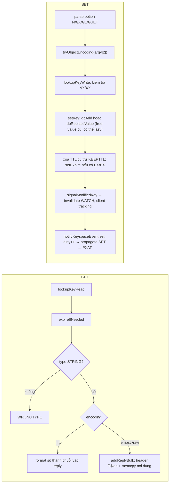

# PART 9 — REDIS STRING

> **Trước:** [08 — Dictionary / Hash Table](08-dict-hash-table.md) · **Tiếp:** [10 — Hash](10-hash.md)
> **Độ ưu tiên:** Cao. String là type được dùng nhiều nhất (cache, counter, lock, token, flag). Nhưng "String" trong Redis thực ra là **byte array nhị phân tối đa 512 MB** có ba cách biểu diễn — và cũng là nguồn gốc của nhiều big key nhất.

---

## Mục lục

1. [Simple mental model](#1-simple-mental-model)
2. [WHAT — Redis String là gì](#2-what--redis-string-là-gì)
3. [WHY — Tại sao một "String" lại cần ba encoding](#3-why--tại-sao-cần-ba-encoding)
4. [HOW — Ba encoding: int, embstr, raw](#4-how--ba-encoding-int-embstr-raw)
5. [INTERNALS 1 — Chọn encoding khi tạo value (`tryObjectEncoding`)](#5-internals-1--chọn-encoding-khi-tạo-value)
6. [INTERNALS 2 — INCR/DECR hoạt động thế nào](#6-internals-2--incrdecr-hoạt-động-thế-nào)
7. [INTERNALS 3 — SET và các option](#7-internals-3--set-và-các-option)
8. [Operations & Complexity](#8-operations--complexity)
9. [DATA FLOW — GET và SET](#9-data-flow--get-và-set)
10. [EXAMPLE — Chọn cách lưu object](#10-example--chọn-cách-lưu-object)
11. [WHAT HAPPENS IF — Big String](#11-what-happens-if--big-string)
12. [PERFORMANCE IMPACT — Memory](#12-performance-impact--memory)
13. [PRODUCTION BEHAVIOR](#13-production-behavior)
14. [TRADE-OFF](#14-trade-off)
15. [WHEN TO USE / WHEN NOT TO USE](#15-when-to-use--when-not-to-use)
16. [COMMON MISUNDERSTANDINGS](#16-common-misunderstandings)
17. [INTERVIEW QUESTIONS](#17-interview-questions)
18. [KEY TAKEAWAYS](#18-key-takeaways)

---

## 1. Simple mental model

String là **một chiếc hộp đựng byte**. Redis không quan tâm bên trong là text, JSON, ảnh hay số — trừ khi nội dung **trông giống số nguyên**, khi đó Redis lưu nó như số thật (gọn hơn và tính toán được: INCR).

---

## 2. WHAT — Redis String là gì

- **Binary-safe byte sequence**, tối đa **512 MB** (`proto-max-bulk-len`).
- Có thể là: text UTF-8, JSON, protobuf/MessagePack, số nguyên, số thực (dạng text), bitmap (thao tác bit), HyperLogLog (định dạng nội bộ).
- Lệnh thuộc nhóm `@string`: GET, SET, MGET, MSET, INCR, APPEND, GETRANGE, SETRANGE, STRLEN, GETDEL, GETEX, LCS... cùng nhóm `@bitmap` hoạt động trên cùng type.

---

## 3. WHY — Tại sao cần ba encoding

Ba loại value String phổ biến có đặc điểm rất khác nhau:

| Loại value | Tần suất | Tối ưu mong muốn |
|---|---|---|
| Số nguyên (counter, ID, timestamp) | Rất cao | Không cấp phát chuỗi; INCR tại chỗ; dùng chung object |
| Chuỗi ngắn (token, flag, tên) | Rất cao | Một allocation, cache-friendly |
| Chuỗi dài/được sửa (JSON, HTML, blob) | Trung bình | Có thể mở rộng (APPEND), SDS đầy đủ |

Một encoding duy nhất không tối ưu được cả ba.

---

## 4. HOW — Ba encoding: int, embstr, raw

```text
int:     robj{type=STRING, enc=INT, ptr=(void*)12345}               ← số nằm trong ptr, không cấp phát thêm
embstr:  [ robj | sdshdr8 | "hello" \0 ]  (một allocation ≤ 64B)    ← chuỗi ≤ 44 byte, read-only
raw:     robj{ptr} ──► [ sdshdrX | "..." \0 | free ]  (hai allocation) ← chuỗi > 44 byte hoặc đã bị sửa
```

| Encoding | Điều kiện | Ưu điểm | Ghi chú |
|---|---|---|---|
| `int` | Value là số nguyên hợp lệ trong `long` (64-bit), biểu diễn chuẩn (không có số 0 đầu, không dấu +, độ dài ≤ 20) | 0 byte thêm; INCR nhanh; số 0–9999 dùng chung object (khi không bật LRU/LFU maxmemory) | `"007"` hay `"1.5"` **không** được encode int |
| `embstr` | Chuỗi ≤ 44 byte | Một malloc, một free, locality tốt | Read-only: mọi sửa đổi → chuyển raw |
| `raw` | Chuỗi > 44 byte, hoặc kết quả của APPEND/SETRANGE | Mở rộng được, preallocation | Hai allocation |

---

## 5. INTERNALS 1 — Chọn encoding khi tạo value

Khi `SET key value`, argument `argv[2]` đã là một robj string (tạo khi parse). `setCommand` gọi `tryObjectEncoding(argv[2])`:

```text
tryObjectEncoding(o):
  if o không phải string raw/embstr hoặc refcount > 1: return o   # không an toàn để đổi
  len = sdslen(o->ptr)
  if len <= 20 và string2l(o->ptr, len, &value) thành công:
      if không bật maxmemory LRU/LFU và 0 <= value < 10000:
          return shared.integers[value]            # dùng chung, free object cũ
      else:
          o->encoding = INT; o->ptr = (void*)value  # chuyển tại chỗ
          return o
  if len <= 44:
      return createEmbeddedStringObject(o->ptr, len)  # chuyển sang embstr nếu đang raw
  trimStringObjectIfNeeded(o)                      # cắt free space thừa (từ querybuf)
  return o
```

Tại sao **thử parse số mỗi lần SET**? Chi phí `string2l` trên ≤ 20 byte chỉ vài ns, còn lợi ích với counter/ID là lớn (tiết kiệm memory, INCR không phải parse).

---

## 6. INTERNALS 2 — INCR/DECR hoạt động thế nào

`INCR counter`:

```text
incrDecrCommand(c, +1):
  o = lookupKeyWrite(db, key)
  if o tồn tại và type != STRING: WRONGTYPE
  getLongLongFromObjectOrReply(o, &value)     # int encoding: đọc thẳng ptr; string: parse, lỗi nếu không phải số
  kiểm tra overflow: value + incr vượt LLONG_MAX/MIN → "-ERR increment or decrement would overflow"
  value += incr
  if o là int-encoded, refcount == 1, và value ngoài vùng shared (hoặc shared bị tắt):
      o->ptr = (void*)value                    # CẬP NHẬT TẠI CHỖ, không cấp phát
  else:
      new = createStringObjectFromLongLongForValue(value)
      dbReplaceValue(db, key, new)             # giữ nguyên TTL
  signalModifiedKey, notify "incrby", server.dirty++
  reply :value
```

Điểm quan trọng:
- **Atomic**: read-modify-write diễn ra trọn vẹn trong một lệnh trên main thread → không lost update, không cần lock. Đây là nền tảng của counter, rate limiter, sequence ID.
- **Giữ nguyên TTL**: INCR không xóa TTL của key (khác SET).
- Key không tồn tại → coi là 0.
- `INCRBYFLOAT` dùng `long double`, lưu kết quả dạng chuỗi; được **propagate thành `SET key <kết quả> KEEPTTL`** để replica/AOF không phụ thuộc sai số dấu phẩy động khác nhau giữa các máy.

---

## 7. INTERNALS 3 — SET và các option

```
SET key value [NX | XX] [GET] [EX s | PX ms | EXAT ts | PXAT ms-ts | KEEPTTL]
```

| Option | Ngữ nghĩa | Version | Dùng cho |
|---|---|---|---|
| `NX` | Chỉ set nếu key **chưa** tồn tại | 2.6.12 | Lock, idempotency, dedup |
| `XX` | Chỉ set nếu key **đã** tồn tại | 2.6.12 | Cập nhật không tạo mới |
| `EX`/`PX` | TTL tương đối (s/ms) | 2.6.12 | Cache, session |
| `EXAT`/`PXAT` | Thời điểm hết hạn tuyệt đối | 6.2 | Hết hạn cuối ngày... |
| `KEEPTTL` | Giữ TTL hiện có | 6.0 | Cập nhật value không đổi hạn |
| `GET` | Trả giá trị cũ (thay GETSET) | 6.2 (kết hợp NX từ 7.0) | Swap atomic |
| `IFEQ` và các điều kiện so sánh | Chỉ set nếu value hiện tại khớp điều kiện (compare-and-set) | 8.4 | Optimistic concurrency không cần Lua |

Hành vi then chốt: **SET không có KEEPTTL sẽ xóa TTL cũ**. Lỗi phổ biến: `SET session:x data` để cập nhật session → session mất TTL → sống mãi → memory leak.

`SET ... NX PX` là **một lệnh atomic** — trước 2.6.12 người ta dùng `SETNX` + `EXPIRE` (hai lệnh) → crash giữa hai lệnh để lại lock không bao giờ hết hạn.

Tất cả dạng TTL được propagate thành **`PXAT` tuyệt đối** để replica/AOF không kéo dài TTL.

---

## 8. Operations & Complexity

| Lệnh | Complexity | Ghi chú |
|---|---|---|
| `GET`, `SET`, `SETNX`, `GETDEL`, `GETEX` | O(1) | Nhưng copy O(độ dài value) vào reply/argument |
| `MGET k1..kN`, `MSET` | O(N) số key | Một round-trip; trong Cluster các key phải cùng slot (client thường tách theo slot) |
| `MSETEX` | O(N) | 8.4: MSET kèm TTL atomic |
| `INCR`, `DECR`, `INCRBY`, `DECRBY`, `INCRBYFLOAT` | O(1) | Atomic |
| `APPEND` | O(1) amortized | Chuyển sang raw |
| `STRLEN` | O(1) | Với int encoding: tính số chữ số |
| `GETRANGE key start end` | O(N) với N = độ dài trả về | |
| `SETRANGE key offset value` | O(1) nếu không mở rộng; O(M) nếu phải mở rộng tới offset | Offset lớn → cấp phát lớn |
| `LCS k1 k2` | O(N×M) | 7.0; nguy hiểm với chuỗi dài |
| `SETBIT/GETBIT` | O(1) | Xem [Chương 14](14-bitmap-bitfield.md) |

---

## 9. DATA FLOW — GET và SET



**Cách đọc diagram:** GET gồm tra keyspace, kiểm tra hết hạn, kiểm tra type, copy nội dung vào reply buffer. SET phức tạp hơn: encode value, kiểm tra điều kiện, thay value (giải phóng value cũ — **nếu value cũ là big key, đây là chỗ có thể chặn**, trừ khi `lazyfree-lazy-server-del`), xử lý TTL, báo hiệu cho WATCH/tracking/keyspace notification, và propagate.

---

## 10. EXAMPLE — Chọn cách lưu object

Lưu profile user `{id: 42, name: "alice", email: "...", age: 30, bio: "..."}`:

| Cách | Lệnh | Ưu | Nhược |
|---|---|---|---|
| JSON trong String | `SET user:42 '{"id":42,...}' EX 3600` | Một lệnh đọc/ghi toàn bộ; TTL per object; dễ cache-aside | Cập nhật một field = đọc–sửa–ghi toàn bộ (race); đọc một field phải tải cả object |
| Hash | `HSET user:42 name alice age 30 ...` | Đọc/sửa từng field atomic; listpack tiết kiệm RAM khi nhỏ | TTL chỉ cho cả key (trước 7.4); value phải là chuỗi phẳng, không lồng |
| Nhiều String key | `SET user:42:name alice`, ... | TTL từng field | Overhead key rất lớn; nhiều round-trip |
| Protobuf/MessagePack nén | `SET user:42 <binary>` | Nhỏ gọn | Không đọc được bằng mắt, cần schema |
| JSON type (Redis 8 / RedisJSON) | `JSON.SET user:42 $ '{...}'` | Sửa field lồng nhau atomic, path query | Tốn RAM hơn String, cần Redis 8 hoặc module |

Quy tắc thực tế: **object cache đọc nguyên khối, ghi ít → String (JSON/protobuf)**; **object có field cập nhật độc lập thường xuyên (counter trong object, trạng thái) → Hash** ([Chương 10](10-hash.md)).

---

## 11. WHAT HAPPENS IF — Big String

Một String 50 MB (ví dụ cache nguyên một trang HTML lớn, JSON danh sách 100.000 sản phẩm):

| Thao tác | Hậu quả |
|---|---|
| `GET` | Copy 50 MB vào reply buffer (memory tạm +50 MB), ghi ra socket nhiều lượt (64 KB/lượt/client cho công bằng); nếu 100 client GET đồng thời → 5 GB output buffer |
| Network | 50 MB × 1.000 req/s = 50 GB/s — không NIC nào chịu nổi; ngay 20 req/s đã là 1 GB/s (8 Gbps) |
| `SET` ghi đè | Free value cũ 50 MB: một allocation lớn, free nhanh (không như collection) nhưng vẫn là munmap |
| Replication | Mỗi SET gửi 50 MB tới mọi replica; replica output buffer phình |
| AOF | Mỗi SET ghi 50 MB vào AOF; AOF phình nhanh → rewrite thường xuyên |
| Cluster migration | `MIGRATE` key 50 MB chặn cả nguồn và đích trong lúc serialize/transfer/restore |
| Client | Deserialize 50 MB JSON tốn CPU/GC phía app |

Quy tắc kinh nghiệm: String > **~10 KB** bắt đầu cần cân nhắc, > **~1 MB** là big key cần xử lý (chia nhỏ, nén, đổi cấu trúc) — [Chương 28](28-big-key.md).

---

## 12. PERFORMANCE IMPACT — Memory

| Value | Encoding | Chi phí value (xấp xỉ, không tính key/dictEntry) |
|---|---|---|
| `"42"` | int (shared) | 0 byte thêm (dùng chung) |
| `"1234567"` | int | 16 byte (robj) |
| `"hello"` | embstr | 32 byte (size class) |
| chuỗi 44 byte | embstr | 64 byte |
| chuỗi 45 byte | raw | 16 (robj) + 64 (SDS size class) = 80 byte |
| chuỗi 1 KB | raw | 16 + ~1 KB |

Mẹo tiết kiệm:
- Lưu số dưới dạng số (không zero-pad).
- Nén value lớn phía client (gzip/lz4/zstd) — đổi CPU client lấy RAM/băng thông Redis.
- Rút gọn JSON key hoặc dùng định dạng nhị phân.

---

## 13. PRODUCTION BEHAVIOR

- Counter bằng INCR là một trong những pattern ổn định nhất của Redis: atomic, O(1), không cấp phát.
- `SET` thiếu `EX` hoặc ghi đè làm mất TTL → `INFO keyspace` cho thấy `expires` giảm dần so với `keys` → memory tăng không kiểm soát.
- MGET 1.000 key trong Cluster → client tách thành nhiều MGET theo slot/node; latency = node chậm nhất.
- Reply lớn từ GET có thể làm `client_recent_max_output_buffer` tăng; theo dõi `omem` trong `CLIENT LIST`.

---

## 14. TRADE-OFF

| Được | Mất |
|---|---|
| Binary-safe, linh hoạt tuyệt đối | Redis không hiểu cấu trúc bên trong → không sửa từng phần (trừ SETRANGE/APPEND) |
| Encoding int/embstr tiết kiệm | Chuyển đổi ngầm (embstr → raw khi sửa) |
| INCR atomic | Chỉ số nguyên 64-bit; float qua INCRBYFLOAT có sai số |
| Tối đa 512 MB | Value lớn là thảm họa vận hành |

---

## 15. WHEN TO USE / WHEN NOT TO USE

**Dùng khi:**
- Cache object đọc/ghi nguyên khối, token, session nhỏ, flag.
- Counter atomic (INCR), sequence, rate limit window.
- Lock/idempotency key (`SET NX PX`).

**Không dùng khi:**
- Object có nhiều field cập nhật độc lập → Hash.
- Dữ liệu dạng danh sách/tập hợp → List/Set/ZSet (tránh JSON array trong String).
- Append log vô hạn → Stream/List.
- Value hàng MB trở lên → chia nhỏ hoặc lưu ở object storage, Redis chỉ giữ pointer/metadata.

---

## 16. COMMON MISUNDERSTANDINGS

| Hiểu sai | Thực tế |
|---|---|
| "String chỉ lưu text" | Binary-safe, lưu bất cứ byte gì |
| "SET giữ TTL cũ" | SET xóa TTL trừ khi có KEEPTTL |
| "INCR trên key có TTL sẽ reset TTL" | INCR giữ nguyên TTL |
| "GET O(1) nên luôn nhanh" | O(1) tra cứu nhưng O(size) copy và truyền |
| "`"007"` được lưu như số" | Không, vì không phải biểu diễn chuẩn |
| "SETNX + EXPIRE là cách làm lock đúng" | Không atomic; dùng `SET NX PX` |

---

## 17. INTERVIEW QUESTIONS

1. **How does Redis store String?** → robj + một trong ba encoding: int (số trong ptr), embstr (≤ 44 B, một allocation), raw (SDS riêng).
2. **Tại sao INCR atomic mà không cần lock?** → Read-modify-write trong một lệnh trên main thread duy nhất.
3. **SET có giữ TTL không?** → Không, trừ KEEPTTL. INCR/APPEND giữ TTL.
4. **JSON trong String hay Hash cho object?** → Theo pattern truy cập: đọc nguyên khối vs cập nhật field độc lập; memory (listpack); TTL; big key.
5. **(Senior) Một key String 20 MB được GET 500 lần/giây — tác động và xử lý?** → 10 GB/s network, output buffer phình, CPU memcpy; xử lý: local cache, chia nhỏ, nén, CDN/object storage, xem lại thiết kế.
6. **(Senior) Tại sao INCRBYFLOAT được propagate thành SET?** → Để replica/AOF không tính lại với sai số float khác nhau → dữ liệu tất định.

---

## 18. KEY TAKEAWAYS

- String = **byte array nhị phân ≤ 512 MB** với ba encoding: **int, embstr (≤ 44 B), raw**.
- INCR/DECR **atomic, O(1), giữ TTL**, có thể cập nhật tại chỗ; là nền tảng counter/rate limit.
- `SET` có NX/XX/EX/PX/EXAT/PXAT/KEEPTTL/GET (+ compare-and-set từ 8.4); **SET xóa TTL cũ** nếu không có KEEPTTL.
- Mọi TTL được propagate dạng **tuyệt đối**.
- Big String là big key: nguy hiểm cho network, memory, replication, AOF, migration.
