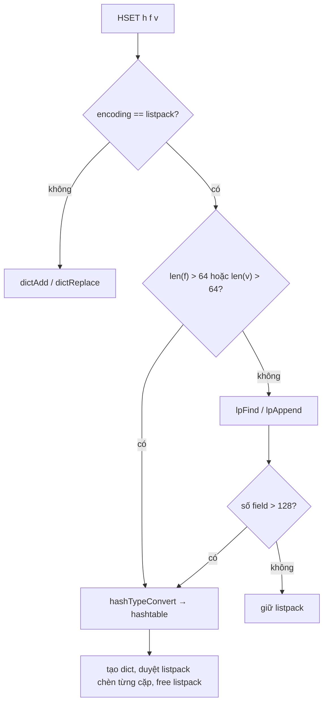
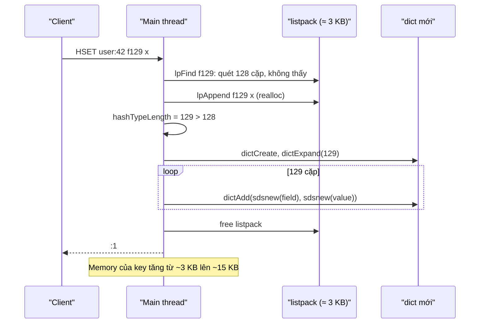

# PART 10 — HASH

> **Trước:** [09 — Redis String](09-string.md) · **Tiếp:** [11 — List](11-list.md)
> **Độ ưu tiên:** Cao. Hash là cách lưu object phổ biến thứ hai, và là nơi giới thiệu **listpack** — encoding compact được dùng lại trong List, Set, Sorted Set, Stream. Chương này đi sâu listpack; các chương sau sẽ tham chiếu lại.

---

## Mục lục

1. [Simple mental model](#1-simple-mental-model)
2. [WHAT — Redis Hash](#2-what--redis-hash)
3. [WHY — Tại sao cần Hash khi đã có String](#3-why--tại-sao-cần-hash)
4. [HOW — Hai encoding: listpack và hashtable](#4-how--hai-encoding)
5. [INTERNALS 1 — Listpack chi tiết](#5-internals-1--listpack-chi-tiết)
6. [INTERNALS 2 — Tại sao listpack thay ziplist: cascade update](#6-internals-2--tại-sao-listpack-thay-ziplist)
7. [INTERNALS 3 — Hash trên listpack và trên hashtable](#7-internals-3--hash-trên-listpack-và-hashtable)
8. [INTERNALS 4 — Khi nào chuyển đổi representation](#8-internals-4--khi-nào-chuyển-đổi)
9. [INTERNALS 5 — Hash field expiration (7.4+)](#9-internals-5--hash-field-expiration-74)
10. [Operations & Complexity](#10-operations--complexity)
11. [DATA FLOW — HSET làm vượt ngưỡng](#11-data-flow--hset-làm-vượt-ngưỡng)
12. [EXAMPLE — Hash vs JSON string](#12-example--hash-vs-json-string)
13. [WHAT HAPPENS IF](#13-what-happens-if)
14. [PERFORMANCE IMPACT](#14-performance-impact)
15. [PRODUCTION BEHAVIOR](#15-production-behavior)
16. [TRADE-OFF](#16-trade-off)
17. [WHEN TO USE / WHEN NOT TO USE — Use cases](#17-when-to-use--when-not-to-use)
18. [COMMON MISUNDERSTANDINGS](#18-common-misunderstandings)
19. [INTERVIEW QUESTIONS](#19-interview-questions)
20. [KEY TAKEAWAYS](#20-key-takeaways)

---

## 1. Simple mental model

Hash là **một phiếu thông tin có nhiều ô** (field → value) dán dưới một mã số (key). Khi phiếu chỉ có vài ô ngắn, Redis viết tất cả **liền một dòng trên một tờ giấy** (listpack) — đọc một ô thì lướt từ đầu dòng. Khi phiếu có quá nhiều ô hoặc có ô quá dài, Redis chuyển sang **một hộp phiếu có mục lục** (hashtable) — tìm ô nào cũng nhảy thẳng tới.

---

## 2. WHAT — Redis Hash

- Một key ánh xạ tới **tập các cặp field → value**, cả hai là binary-safe string.
- Không lồng nhau (value không thể là Hash khác).
- Tối đa 2^32 − 1 field (lý thuyết).
- Lệnh chính: `HSET`, `HGET`, `HMGET`, `HDEL`, `HEXISTS`, `HLEN`, `HGETALL`, `HKEYS`, `HVALS`, `HINCRBY`, `HINCRBYFLOAT`, `HSETNX`, `HSTRLEN`, `HSCAN`, `HRANDFIELD` (6.2), field TTL `HEXPIRE`/`HPEXPIRE`/`HTTL`/`HPERSIST`... (7.4), `HGETEX`/`HSETEX`/`HGETDEL` (8.0).

---

## 3. WHY — Tại sao cần Hash

1. **Thao tác từng field atomic**: `HINCRBY cart:42 sku:9 1` — không cần đọc–sửa–ghi cả object (không race, không tải cả object).
2. **Tiết kiệm memory cho object nhỏ**: hash ≤ 128 field nhỏ lưu bằng listpack chỉ tốn vài byte overhead/field, so với ~80–100 byte/key nếu mỗi field là một String key.
3. **Gom dữ liệu liên quan dưới một key**: một TTL (cho cả hash), một lần DEL, cùng slot trong Cluster.

---

## 4. HOW — Hai encoding

| Encoding | Điều kiện | Cấu trúc | HGET |
|---|---|---|---|
| `listpack` | ≤ `hash-max-listpack-entries` (128) field **và** mọi field/value ≤ `hash-max-listpack-value` (64 byte) | Mảng liên tục: `f1 v1 f2 v2 ...` | Quét tuần tự O(N) |
| `listpackex` (7.4+) | Như trên nhưng có field mang TTL | Bộ ba `field value ttl` | Quét tuần tự |
| `hashtable` | Vượt một trong các ngưỡng | `dict`: field SDS → value SDS | O(1) trung bình |

(Trước Redis 7.0, encoding compact là `ziplist`, config tên `hash-max-ziplist-*` — vẫn được chấp nhận như alias.)

---

## 5. INTERNALS 1 — Listpack chi tiết

**Listpack** (`listpack.c`, thiết kế bởi antirez năm 2017, dùng trong Stream từ 5.0, thay hoàn toàn ziplist từ 7.0) là **một khối byte liên tục** chứa dãy phần tử (string hoặc integer), có thể duyệt **xuôi và ngược**.

### 5.1 Bố cục tổng thể

```text
+-------------+--------------+---------+---------+-----+---------+-----+
| total-bytes | num-elements | entry 1 | entry 2 | ... | entry N | EOF |
|  (uint32)   |  (uint16)    |         |         |     |         | 0xFF|
+-------------+--------------+---------+---------+-----+---------+-----+
     4 byte        2 byte                                         1 byte
```

- `total-bytes`: tổng kích thước → biết ngay vị trí cuối (để duyệt ngược, append).
- `num-elements`: số phần tử; nếu ≥ 65535 thì ghi 65535 nghĩa là "không biết, phải đếm" (O(N)).
- `0xFF`: đánh dấu kết thúc.

### 5.2 Bố cục một entry

```text
+-------------------+----------------+---------------------+
| encoding-type     | element-data   | element-tot-len     |
| (1..5 byte)       | (tùy)          | "backlen" 1..5 byte |
+-------------------+----------------+---------------------+
```

**Encoding-type** (byte đầu quyết định):

| Mẫu bit byte đầu | Kiểu | Kích thước |
|---|---|---|
| `0xxxxxxx` | Số nguyên không dấu 7 bit (0–127) | **1 byte tổng** (số nằm ngay trong byte encoding) |
| `10xxxxxx` | Chuỗi độ dài 6 bit (≤ 63 byte) | 1 byte header + dữ liệu |
| `110xxxxx yyyyyyyy` | Số nguyên có dấu 13 bit | 2 byte |
| `1110xxxx yyyyyyyy` | Chuỗi độ dài 12 bit (≤ 4095) | 2 byte header + dữ liệu |
| `11110000` + 4 byte | Chuỗi độ dài 32 bit | 5 byte header + dữ liệu |
| `11110001` | int16 | 1 + 2 byte |
| `11110010` | int24 | 1 + 3 byte |
| `11110011` | int32 | 1 + 4 byte |
| `11110100` | int64 | 1 + 8 byte |
| `11111111` | EOF | |

Khi chèn một chuỗi trông giống số nguyên (`"12345"`), listpack **lưu như số** với encoding nhỏ nhất vừa → "12345" chỉ tốn 3 byte (int16) + backlen.

**Backlen**: độ dài của (encoding + data) của **chính entry này**, mã hóa biến đổi 1–5 byte, **đọc từ phải sang trái** (mỗi byte 7 bit dữ liệu, bit cao báo còn byte tiếp). Khi duyệt ngược từ cuối, đọc backlen của entry trước → biết nhảy lùi bao nhiêu byte.

### 5.3 Ví dụ: hash `{name: "alice", age: "30"}`

```text
[total=23][num=4]
  [10 000100]"name"[5]        ← chuỗi 4 byte: header 1 + 4 + backlen 1 = 6 byte
  [10 000101]"alice"[6]       ← 7 byte
  [10 000011]"age"[4]         ← 5 byte
  [0 0011110][1]              ← số 30 dạng 7-bit uint: 1 + backlen 1 = 2 byte
[0xFF]
Tổng ≈ 4 + 2 + 6 + 7 + 5 + 2 + 1 = 27 byte (xấp xỉ)
```

So với hashtable: dict struct + bucket array + 2 dictEntry (48 B) + 4 SDS (mỗi cái ≥ 16 B do size class) ≈ **200+ byte**.

### 5.4 Thao tác và chi phí

| Thao tác | Cách làm | Chi phí |
|---|---|---|
| Duyệt xuôi | Đọc encoding → biết kích thước entry → nhảy tới entry sau | O(1) mỗi bước |
| Duyệt ngược | Đọc backlen của entry trước | O(1) mỗi bước |
| Tìm (`lpFind`) | Duyệt xuôi, so sánh; hỗ trợ `skip` để chỉ so sánh field (bỏ qua value) | O(N) |
| Chèn/xóa giữa | `realloc` khối (có thể phải copy), `memmove` phần sau | O(N) byte |
| Append cuối | `realloc` + ghi | O(1) amortized (có thể copy khi realloc dời chỗ) |

Với N ≤ 128 và khối vài KB nằm gọn trong L1/L2 cache, quét tuần tự **nhanh ngang hoặc hơn** hash lookup có nhiều cache miss.

---

## 6. INTERNALS 2 — Tại sao listpack thay ziplist

**Ziplist** (compact encoding cũ, 2.6–6.2) lưu mỗi entry kèm **`prevlen`** = độ dài của entry **trước** nó (1 byte nếu < 254, 5 byte nếu ≥ 254) để duyệt ngược.

**Cascade update**: giả sử có dãy entry đều dài 250–253 byte (prevlen của entry sau đang là 1 byte). Chèn vào đầu một entry dài ≥ 254 byte:
1. Entry 2 phải đổi `prevlen` từ 1 → 5 byte → entry 2 dài thêm 4 byte → giờ ≥ 254.
2. Entry 3 phải đổi `prevlen` → dài thêm → ≥ 254.
3. ... **lan truyền tới cuối**, mỗi bước là một realloc/memmove → worst case O(N²).

Hiếm nhưng có thật, và làm code ziplist phức tạp, nhiều bug lịch sử (một số CVE liên quan tràn số trong ziplist).

**Listpack** lưu **độ dài của chính mình ở cuối** (backlen) thay vì độ dài của entry trước. Thay đổi một entry chỉ ảnh hưởng chính nó → **không bao giờ cascade**. Đổi lại backlen tốn 1 byte/entry nhỏ, ngang ziplist.

Redis 7.0 thay ziplist ở mọi nơi (Hash, ZSet, quicklist node); RDB cũ chứa ziplist được convert sang listpack khi load.

---

## 7. INTERNALS 3 — Hash trên listpack và hashtable

### 7.1 Listpack

- Field và value là **hai entry liên tiếp**: `f1 v1 f2 v2 ...`
- `HGET h f`: `lpFind(lp, f, skip=1)` — so sánh với các entry ở vị trí chẵn (field), bỏ qua value → trả entry kế tiếp.
- `HSET h f v`: tìm f; có → thay entry value (`lpReplace`); không → append `f v` vào cuối.
- `HDEL`: xóa 2 entry liên tiếp.
- Thứ tự field = thứ tự chèn (một tác dụng phụ, **không được đảm bảo** — sẽ mất khi chuyển sang hashtable).

### 7.2 Hashtable

- `dict` với `dictType` hash: key SDS field, value SDS value.
- `HGET`: `dictFind` O(1).
- `HGETALL`: duyệt toàn bộ dict — O(N), thứ tự tùy hash.
- `HSCAN`: dùng `dictScan` với cursor.
- `HRANDFIELD`: `dictGetFairRandomKey`.

---

## 8. INTERNALS 4 — Khi nào chuyển đổi



**Cách đọc diagram:** Kiểm tra độ dài được thực hiện **trước** khi chèn (tránh chèn value lớn vào listpack), kiểm tra số lượng **sau** khi chèn. Chuyển đổi là O(N) với N ≤ 128 → vài µs. Một chiều: xóa bớt field không chuyển về listpack.

Các con đường chuyển đổi khác: `HINCRBYFLOAT` tạo value dài, `HSETNX`, `RESTORE`/load RDB (được tạo đúng encoding theo kích thước khi load).

---

## 9. INTERNALS 5 — Hash field expiration (7.4+)

Trước 7.4, TTL chỉ áp dụng cho **cả key**. Muốn TTL per field phải tách key (tốn overhead) hoặc tự dọn.

Redis 7.4 thêm `HEXPIRE key seconds FIELDS n f1 f2...`, `HPEXPIRE`, `HEXPIREAT`, `HPEXPIREAT`, `HTTL`, `HPTTL`, `HEXPIRETIME`, `HPERSIST`; Redis 8.0 thêm `HGETEX`, `HSETEX` (đọc/ghi kèm đặt TTL field), `HGETDEL`.

Cơ chế (khái quát):
- Encoding listpack chuyển thành **`listpackex`**: mỗi field lưu kèm thời điểm hết hạn, được sắp theo thời điểm hết hạn để dễ tìm field sắp hết hạn.
- Encoding hashtable: field có TTL mang metadata hết hạn; hash có field TTL được đăng ký vào một cấu trúc toàn cục theo DB (sắp theo thời điểm hết hạn sớm nhất) để **active expiration** có thể tìm và xóa field hết hạn mà không quét mọi hash.
- Passive: truy cập field hết hạn → coi như không tồn tại và xóa.
- Khi field hết hạn bị xóa, Redis propagate `HDEL` cho replica/AOF (giống key hết hạn → DEL).

Use case: session hash với từng token có hạn riêng, cart item giữ chỗ có hạn, feature flag tạm thời theo user.

---

## 10. Operations & Complexity

| Lệnh | Complexity | Ghi chú |
|---|---|---|
| `HSET` (N cặp), `HGET`, `HEXISTS`, `HDEL` (N field), `HINCRBY`, `HSTRLEN`, `HSETNX` | O(1) mỗi field (listpack: O(size) nhưng size nhỏ) | |
| `HMGET` | O(N field yêu cầu) | |
| `HLEN` | O(1) | |
| `HGETALL`, `HKEYS`, `HVALS` | **O(N) toàn bộ hash** | Nguy hiểm với hash lớn |
| `HSCAN` | O(1) mỗi lần gọi, O(N) cho toàn bộ | Listpack trả hết một lần bất kể COUNT |
| `HRANDFIELD key count` | O(count) | Count âm: cho phép trùng |
| `HEXPIRE ... FIELDS n` | O(n) | 7.4+ |
| `DEL`/`UNLINK` hash | O(N) free (listpack: O(1) một khối) | Hashtable lớn → lazy free |

---

## 11. DATA FLOW — HSET làm vượt ngưỡng

Hash `user:42` đang có 128 field listpack, nhận `HSET user:42 f129 x`:



**Cách đọc diagram:** Lệnh thứ 129 làm hash chuyển encoding, tốn O(129) thao tác cấp phát — vẫn chỉ vài chục µs. Nhưng memory key tăng nhiều lần. Với hàng triệu hash cùng "vượt ngưỡng" (ví dụ sau một thay đổi schema thêm field), memory tổng có thể tăng gấp 3–5 lần.

---

## 12. EXAMPLE — Hash vs JSON string

Object: user có 10 field, được cập nhật `last_seen` mỗi request và `login_count` mỗi lần đăng nhập.

| Tiêu chí | JSON trong String | Hash |
|---|---|---|
| Cập nhật `last_seen` | GET → parse → sửa → SET toàn bộ (2 RTT, race nếu hai request song song → lost update) hoặc Lua | `HSET user:42 last_seen 1727...` (1 RTT, atomic) |
| Tăng `login_count` | Như trên | `HINCRBY user:42 login_count 1` |
| Đọc toàn bộ | `GET` (1 lệnh) | `HGETALL` (1 lệnh) |
| Đọc 2 field | Phải GET cả object | `HMGET user:42 name email` |
| Memory (10 field nhỏ) | JSON ~200 B + overhead key | listpack ~150 B + overhead key |
| Dữ liệu lồng (address.city) | Được | Không (phải flatten: `address.city`) |
| Kiểu dữ liệu | JSON có number/bool/null | Mọi value là string |
| TTL | Cả object | Cả key; per-field từ 7.4 |
| Cache-aside từ DB | Serialize một lần, đơn giản | Nhiều field, cần HSET nhiều cặp + EXPIRE (pipeline/MULTI) |

Kết luận: **Hash khi có cập nhật từng field hoặc đọc từng phần; String/JSON khi object đọc–ghi nguyên khối và có cấu trúc lồng.**

---

## 13. WHAT HAPPENS IF

### 13.1 Hash 5 triệu field (ví dụ `user_sessions` chứa mọi session)

- `HGETALL` → reply hàng trăm MB, chặn server hàng giây.
- `DEL` → free 10 triệu SDS + 5 triệu dictEntry → vài giây (trừ UNLINK/lazyfree).
- Expand dict của hash → spike memory.
- Cluster: toàn bộ nằm trên một slot/một node → không phân tán được, hot key.
- Replication/AOF rewrite: serialize một object khổng lồ.
→ Chia theo bucket (`sessions:{shard}`), hoặc mỗi session một key.

### 13.2 Một field có value 10 KB trong hash nhỏ

Cả hash chuyển sang hashtable; memory tăng. Tách field lớn sang key riêng.

### 13.3 Dùng HGETALL trong hot path với hash 300 field

Mỗi request O(300) + reply lớn → CPU main thread tăng. Dùng HMGET field cần thiết.

---

## 14. PERFORMANCE IMPACT

| Kịch bản | Listpack | Hashtable |
|---|---|---|
| HGET, N = 10 | Rất nhanh (quét ≤ 20 entry trong 1–2 cache line) | Nhanh (hash + 2–3 cache miss) |
| HGET, N = 500 (nếu nâng ngưỡng) | Chậm dần (quét tới 1000 entry) | Không đổi |
| Memory / field nhỏ | ~2–10 byte overhead | ~50–80 byte overhead |
| HSET chèn giữa | realloc + memmove | dictAdd |

---

## 15. PRODUCTION BEHAVIOR

- Kỹ thuật **bucket hashing** tiết kiệm RAM: thay vì 100 triệu key `user:{id}` → String, dùng `HSET user:{id/1000} {id%1000} value` → 100.000 hash, mỗi hash 1000 field... **nhưng** 1000 > 128 → phải nâng `hash-max-listpack-entries` lên ~1000 hoặc chọn bucket 100. Đây là trade-off CPU/RAM cần benchmark.
- `redis-cli --bigkeys` báo "biggest hash found has N fields" — kiểm tra định kỳ.
- `MEMORY USAGE key SAMPLES 0` cho hash lớn để đo chính xác (mặc định chỉ sample 5 phần tử để ước lượng).

---

## 16. TRADE-OFF

| Được | Mất |
|---|---|
| Update/đọc từng field atomic | Không lồng; value là string |
| Listpack cực tiết kiệm RAM với object nhỏ | O(N) truy cập; chuyển đổi một chiều |
| Một key cho nhiều field (một TTL, một slot) | TTL per-field chỉ từ 7.4; hash lớn không phân tán được |
| HINCRBY atomic cho counter trong object | HGETALL/DEL O(N) nguy hiểm với hash lớn |

---

## 17. WHEN TO USE / WHEN NOT TO USE

**Use cases phù hợp:**
- **Object/entity** với field cập nhật độc lập: user profile, product stock info.
- **Shopping cart**: `HSET cart:{user} {sku} {qty}`, `HINCRBY` để tăng/giảm, `HDEL` để bỏ, `EXPIRE` cho cart bỏ quên.
- **Session**: field là thuộc tính session.
- **Counter theo nhóm**: `HINCRBY stats:2026-09-30 page_views 1`.
- **Feature flag / config**: `HGET flags:{service} new_checkout`.
- **Tiết kiệm RAM cho số lượng lớn mapping nhỏ** (bucket hashing).

**Không phù hợp:**
- Tập field không giới hạn tăng mãi (mọi user vào một hash) → big key.
- Cần query theo value (tìm user có age > 30) → Redis Query Engine hoặc database.
- Object lồng sâu → JSON type hoặc String.
- Cần sort theo field → Sorted Set làm index phụ.

---

## 18. COMMON MISUNDERSTANDINGS

| Hiểu sai | Thực tế |
|---|---|
| "Hash luôn O(1)" | Listpack là quét tuần tự O(N) (N nhỏ) |
| "HGETALL an toàn vì chỉ một key" | O(N) theo số field |
| "Hash giữ thứ tự field" | Chỉ tình cờ ở listpack; không được đảm bảo |
| "Có thể đặt TTL cho field" | Chỉ từ 7.4 (HEXPIRE); trước đó TTL cả key |
| "Ziplist vẫn là encoding hiện tại" | Từ 7.0 là listpack |

---

## 19. INTERVIEW QUESTIONS

1. **How does Redis Hash work?** → listpack (≤128 field, ≤64 B) hoặc dict; chuyển một chiều khi vượt ngưỡng.
2. **Listpack là gì? Khác ziplist thế nào?** → Khối liên tục, mỗi entry có encoding + data + backlen (độ dài chính nó); ziplist lưu prevlen gây cascade update.
3. **Hash vs JSON string — chọn khi nào?** → Theo pattern truy cập, atomic field update, lồng nhau, memory, TTL.
4. **Tại sao listpack nhanh dù O(N)?** → N nhỏ, dữ liệu liên tục trong cache, không pointer chasing.
5. **(Senior) Muốn lưu 500 triệu mapping ID → ID ít RAM nhất — thiết kế?** → Bucket hashing vào Hash listpack (có thể nâng ngưỡng), số nguyên được encode compact, đo CPU; cân nhắc TTL và phân tán cluster.

---

## 20. KEY TAKEAWAYS

- Hash = **listpack khi nhỏ, dict khi lớn**; ngưỡng mặc định 128 field / 64 byte; chuyển một chiều.
- **Listpack**: header (total bytes, count) + entry (encoding | data | backlen) + 0xFF; số được encode compact; duyệt hai chiều; **không cascade update** như ziplist.
- Hash cho phép **cập nhật từng field atomic** và **tiết kiệm RAM** cho object nhỏ.
- HGETALL/DEL trên hash lớn là O(N) — nguồn big key phổ biến.
- 7.4+ có TTL per-field (listpackex, active expiration cho field).
