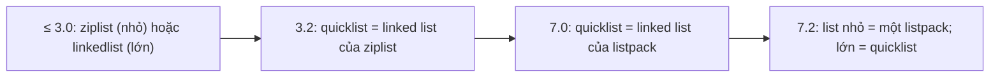
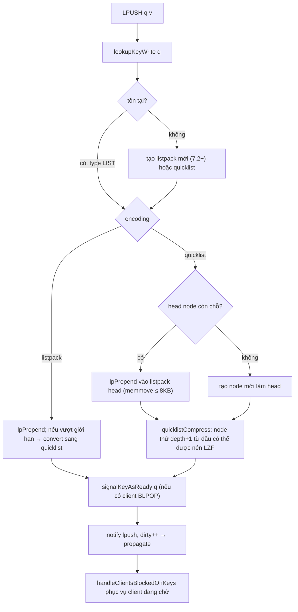

# PART 11 — LIST

> **Trước:** [10 — Hash](10-hash.md) · **Tiếp:** [12 — Set](12-set.md)
> **Độ ưu tiên:** Cao. List là cấu trúc cho queue, timeline, recent items. Lịch sử implementation của nó (linkedlist → ziplist → quicklist → listpack) là một case study tuyệt vời về trade-off memory vs CPU vs cache locality.

---

## Mục lục

1. [Simple mental model](#1-simple-mental-model)
2. [WHAT — Redis List](#2-what--redis-list)
3. [WHY — Tại sao List cần implementation đặc biệt](#3-why--tại-sao-list-cần-implementation-đặc-biệt)
4. [HOW — Evolution của implementation](#4-how--evolution-của-implementation)
5. [INTERNALS 1 — Linked list (lịch sử)](#5-internals-1--linked-list)
6. [INTERNALS 2 — Ziplist (bối cảnh lịch sử)](#6-internals-2--ziplist)
7. [INTERNALS 3 — Quicklist](#7-internals-3--quicklist)
8. [INTERNALS 4 — Listpack cho list nhỏ (7.2+)](#8-internals-4--listpack-cho-list-nhỏ)
9. [INTERNALS 5 — Nén node bằng LZF (list-compress-depth)](#9-internals-5--nén-node-bằng-lzf)
10. [Operations: LPUSH, RPUSH, LPOP, RPOP, LRANGE và complexity](#10-operations-và-complexity)
11. [Blocking operations](#11-blocking-operations)
12. [DATA FLOW — LPUSH vào quicklist](#12-data-flow--lpush-vào-quicklist)
13. [EXAMPLE — Queue và reliable queue](#13-example--queue-và-reliable-queue)
14. [WHAT HAPPENS IF](#14-what-happens-if)
15. [PERFORMANCE IMPACT](#15-performance-impact)
16. [PRODUCTION BEHAVIOR](#16-production-behavior)
17. [TRADE-OFF](#17-trade-off)
18. [WHEN TO USE / WHEN NOT TO USE](#18-when-to-use--when-not-to-use)
19. [COMMON MISUNDERSTANDINGS](#19-common-misunderstandings)
20. [INTERVIEW QUESTIONS](#20-interview-questions)
21. [KEY TAKEAWAYS](#21-key-takeaways)

---

## 1. Simple mental model

List giống **một đoàn tàu nhiều toa, mỗi toa chở một hàng ghế ngồi san sát** (quicklist of listpacks):
- Thêm/bớt hành khách ở **đầu tàu hoặc cuối tàu** rất nhanh.
- Tìm hành khách thứ 5.000 phải đi qua các toa (nhưng nhảy toa nhanh vì biết mỗi toa có bao nhiêu người).
- Các toa ở giữa, ít ai đụng tới, có thể được **đóng gói nén** (LZF) để tiết kiệm chỗ; chỉ toa đầu và cuối để mở.
- Tàu ngắn thì chỉ cần **một toa duy nhất** (listpack).

---

## 2. WHAT — Redis List

- Dãy **có thứ tự** các string, cho phép **trùng lặp**, truy cập theo **index** (0 = đầu, -1 = cuối).
- Tối đa 2^32 − 1 phần tử.
- Tối ưu cho thao tác ở **hai đầu** (deque).
- Lệnh: `LPUSH`, `RPUSH`, `LPOP`, `RPOP`, `LLEN`, `LRANGE`, `LINDEX`, `LSET`, `LINSERT`, `LREM`, `LTRIM`, `LPOS` (6.0.6), `LMOVE` (6.2), `LMPOP` (7.0), và blocking: `BLPOP`, `BRPOP`, `BLMOVE`, `BLMPOP`, `BRPOPLPUSH` (deprecated).

---

## 3. WHY — Tại sao List cần implementation đặc biệt

Hai lựa chọn giáo khoa đều có vấn đề:

| Cấu trúc | Push/pop hai đầu | Index giữa | Memory / phần tử | Cache |
|---|---|---|---|---|
| **Doubly linked list** | O(1) | O(N) | 2 pointer (16 B) + node + robj + SDS ≈ 60–80 B | Tệ: mỗi node một allocation rời rạc |
| **Dynamic array** | Push đầu O(N) (dời toàn bộ) | O(1) | Gần 0 | Tốt |
| **Array liên tục compact (ziplist/listpack)** | Chèn đầu O(N) memmove | O(N) quét | ~2–10 B | Rất tốt, nhưng list lớn → mỗi thao tác memmove cả khối MB |

Quicklist là **lai**: linked list các khối compact nhỏ (~8 KB) → push/pop hai đầu O(1) (chỉ sửa khối đầu/cuối nhỏ), memory gần compact, cache tốt trong mỗi khối.

---

## 4. HOW — Evolution của implementation



**Cách đọc diagram:**
1. **≤ 3.0**: hai encoding tách biệt; vượt `list-max-ziplist-entries` (512) hoặc value > 64 B → chuyển sang linkedlist (mỗi phần tử một node + một robj) → memory tăng vọt.
2. **3.2**: quicklist hợp nhất, luôn dùng một encoding; mỗi node là ziplist giới hạn kích thước; có nén LZF.
3. **7.0**: node đổi sang listpack (loại bỏ cascade update).
4. **7.2**: list nhỏ dùng thẳng một listpack (bỏ overhead struct quicklist + node cho list chỉ vài phần tử — rất nhiều list trong thực tế chỉ có vài phần tử).

---

## 5. INTERNALS 1 — Linked list

`adlist.c`:
```c
typedef struct listNode { struct listNode *prev, *next; void *value; } listNode;  /* 24 B */
typedef struct list { listNode *head, *tail; unsigned long len; ... } list;
```
Mỗi phần tử: listNode (24 B → size class 32) + robj (16 B) + SDS. Một list 1 triệu phần tử 10 byte ≈ 70–80 MB, trong khi dữ liệu chỉ 10 MB. Và mỗi phần tử là một allocation rời rạc → duyệt LRANGE gây cache miss liên tục, fragmentation cao. `adlist` vẫn được dùng nội bộ cho những thứ khác (danh sách client, reply blocks...), không dùng cho List type nữa.

---

## 6. INTERNALS 2 — Ziplist

Ziplist (≤ 6.2) là khối liên tục: `zlbytes | zltail | zllen | entry... | 0xFF`, mỗi entry `prevlen | encoding | data`. Như đã phân tích ở [Chương 10 §6](10-hash.md#6-internals-2--tại-sao-listpack-thay-ziplist): tiết kiệm RAM nhưng có **cascade update** khi `prevlen` đổi kích thước. Listpack thay thế nó từ 7.0.

---

## 7. INTERNALS 3 — Quicklist

### 7.1 Cấu trúc

```c
typedef struct quicklistNode {
    struct quicklistNode *prev, *next;
    unsigned char *entry;          /* listpack, hoặc quicklistLZF nếu đã nén */
    size_t sz;                     /* kích thước listpack (byte) */
    unsigned int count : 16;       /* số phần tử trong node */
    unsigned int encoding : 2;     /* RAW=1 hoặc LZF=2 */
    unsigned int container : 2;    /* PACKED (listpack) hoặc PLAIN (một phần tử lớn) */
    unsigned int recompress : 1;   /* tạm giải nén để đọc, cần nén lại */
    ...
} quicklistNode;

typedef struct quicklist {
    quicklistNode *head, *tail;
    unsigned long count;           /* tổng số phần tử */
    unsigned long len;             /* số node */
    signed int fill : QL_FILL_BITS;       /* list-max-listpack-size */
    unsigned int compress : QL_COMP_BITS; /* list-compress-depth */
    ...
} quicklist;
```

```text
quicklist {count=2300, len=3}
   head                                                      tail
    │                                                          │
    ▼                                                          ▼
 [node: RAW, count=800, sz≈8KB] ⇄ [node: LZF, count=700] ⇄ [node: RAW, count=800]
     listpack: e0 e1 ... e799         (nén)                   listpack: ...
```

### 7.2 `list-max-listpack-size` (tên cũ `list-max-ziplist-size`)

| Giá trị | Ý nghĩa |
|---|---|
| Số dương N | Tối đa N phần tử mỗi node |
| -1 | Tối đa 4 KB mỗi node |
| **-2 (mặc định)** | **Tối đa 8 KB mỗi node** |
| -3 | 16 KB |
| -4 | 32 KB |
| -5 | 64 KB |

Tại sao 8 KB? Đủ lớn để overhead node (~32–48 B) không đáng kể và cache/prefetch tốt; đủ nhỏ để chèn/xóa giữa node (memmove ≤ 8 KB) vẫn rẻ.

### 7.3 Push vào đầu

`quicklistPushHead(ql, value)`:
1. Nếu node head còn chỗ (`_quicklistNodeAllowInsert`: kích thước sau khi chèn ≤ giới hạn fill) → `lpPrepend` vào listpack của head (memmove ≤ 8 KB).
2. Không → tạo node mới với listpack mới chứa value, gắn làm head.
3. `count++`, cập nhật `sz`, xử lý nén cho node vừa rời khỏi vùng "đầu".

### 7.4 Tìm theo index

`quicklistGetIteratorAtIdx(ql, direction, idx)`: đi từ head (idx ≥ 0) hoặc tail (idx < 0), **nhảy cả node** bằng `node->count` cho tới khi tới node chứa idx, rồi `lpSeek` bên trong listpack → **O(số node + kích thước node)** — tốt hơn nhiều so với duyệt từng phần tử của linked list thuần, nhưng vẫn là O(N).

### 7.5 Plain node

Từ 7.0, phần tử rất lớn (vượt ngưỡng nội bộ) được đặt vào **PLAIN node** chứa đúng một phần tử dạng thô, thay vì nhét vào listpack — tránh listpack khổng lồ và các giới hạn kích thước của listpack.

---

## 8. INTERNALS 4 — Listpack cho list nhỏ (7.2+)

- List mới tạo, nhỏ (vừa trong giới hạn một node theo `list-max-listpack-size`) → encoding `listpack` (một khối duy nhất, không có struct quicklist/quicklistNode).
- Lớn hơn → chuyển sang quicklist.
- Khi co lại đủ nhỏ (dưới khoảng một nửa giới hạn — có vùng trễ để tránh chuyển qua lại), quicklist có thể **chuyển về** listpack.
- Lợi ích: hàng triệu list nhỏ (ví dụ "5 thông báo gần nhất" mỗi user) tiết kiệm đáng kể memory.

---

## 9. INTERNALS 5 — Nén node bằng LZF

`list-compress-depth` (mặc định 0 = không nén):

| Giá trị | Node **không** nén |
|---|---|
| 0 | Tất cả (tắt nén) |
| 1 | Node head và tail |
| 2 | 2 node đầu + 2 node cuối |
| N | N node mỗi đầu |

- Node ở giữa được nén bằng **LZF** (nhanh, tỷ lệ nén vừa phải). Node nhỏ hơn `MIN_COMPRESS_BYTES` (48 B) không nén; nếu nén không tiết kiệm đủ thì giữ RAW.
- Hợp lý cho **list dài chỉ truy cập ở hai đầu** (queue, timeline cũ ít đọc): memory giảm đáng kể với dữ liệu text lặp.
- Chi phí: truy cập giữa list (LINDEX, LRANGE vùng giữa, LINSERT) phải **giải nén** node (tạm thời, đánh dấu `recompress`) → CPU tăng.

---

## 10. Operations và complexity

| Lệnh | Complexity | Ghi chú |
|---|---|---|
| `LPUSH`/`RPUSH`/`LPUSHX`/`RPUSHX` | O(1) mỗi phần tử | Push nhiều phần tử một lệnh: O(N) |
| `LPOP`/`RPOP` [count] | O(1) / O(count) | |
| `LLEN` | O(1) | |
| `LINDEX` | O(N) | N = khoảng cách tới đầu gần nhất (theo node) |
| `LSET` | O(N) | |
| `LRANGE key start stop` | O(S + N) | S = offset từ đầu (gần nhất), N = số phần tử trả về |
| `LINSERT` | O(N) | Phải tìm pivot |
| `LREM key count value` | O(N + M) | Quét |
| `LTRIM` | O(N) | N = số phần tử bị xóa |
| `LPOS` | O(N) | |
| `LMOVE`/`RPOPLPUSH` | O(1) | Atomic chuyển giữa hai list |
| `LMPOP` | O(N + M) | N = số key, M = số phần tử pop |
| `BLPOP`/`BRPOP` | O(N) N = số key | O(1) khi có dữ liệu |
| `DEL` | O(N) free | Quicklist: free theo node (nhanh hơn nhiều so với từng phần tử) |

`LRANGE key 0 99` trên list 10 triệu phần tử: rẻ (S = 0, N = 100). `LRANGE key 5000000 5000099`: phải nhảy ~600 node → vẫn nhanh (vài chục µs). `LRANGE key 0 -1`: O(10 triệu) → thảm họa.

---

## 11. Blocking operations

### 11.1 Cơ chế

(Tổng quan event loop ở [Chương 3 §11](03-event-loop.md#11-internals-6--blocking-command-không-block-event-loop).)

- `BLPOP k1 k2 k3 timeout`: kiểm tra các key **theo thứ tự**; key đầu tiên không rỗng → pop ngay, trả `[key, value]`. Nếu tất cả rỗng → block client: đăng ký vào `db->blocking_keys[k]` cho từng key, đặt timeout (0 = vô hạn; từ 6.0 timeout là số thực giây).
- Khi có lệnh ghi làm list không rỗng (LPUSH, RPUSH, LMOVE vào, ... ) → `signalKeyAsReady` → sau lệnh ghi, Redis phục vụ client đang chờ **theo thứ tự FIFO** (client block trước được phục vụ trước).
- **Propagation**: khi client block được phục vụ, Redis propagate lệnh **non-blocking tương đương** (ví dụ `LPOP k`) cho replica/AOF → replica không cần biết về blocking.
- Nếu một lệnh `LPUSH k a b c` và có 2 client đang chờ: mỗi client nhận một phần tử; phần còn lại ở trong list.

### 11.2 Trong MULTI/Lua

Blocking command trong transaction/script **không block**: rỗng thì trả nil ngay (vì không thể dừng giữa transaction).

### 11.3 Blocking trên replica / Cluster

- Có thể BLPOP trên replica? Lệnh ghi (pop) không chạy trên replica read-only → phải chạy trên primary.
- Cluster: các key trong BLPOP phải cùng slot.
- Failover: client đang block trên primary cũ sẽ bị ngắt/timeout → phải reconnect tới primary mới.

---

## 12. DATA FLOW — LPUSH vào quicklist



**Cách đọc diagram:** Push chỉ chạm **một node nhỏ** ở đầu → chi phí gần như hằng số bất kể list dài bao nhiêu. Việc nén chỉ xảy ra với node vừa "trôi" vào vùng giữa. Sau lệnh ghi, client đang block được phục vụ ngay trong cùng lượt event loop.

---

## 13. EXAMPLE — Queue và reliable queue

### 13.1 Queue đơn giản (at-most-once)

```
Producer:  LPUSH jobs {job}
Consumer:  BRPOP jobs 5
```
Consumer pop job rồi crash trước khi xử lý xong → **job mất** (đã rời khỏi Redis).

### 13.2 Reliable queue (at-least-once)

```
Consumer:  BLMOVE jobs processing:{worker} RIGHT LEFT 5   # atomic: pop từ jobs, push vào processing
           ... xử lý ...
           LREM processing:{worker} 1 {job}                # xong thì xóa
Reaper:    định kỳ kiểm tra processing:{worker} của worker chết → đẩy lại vào jobs
```
- Job không bao giờ "biến mất" giữa hai list (LMOVE atomic).
- Worker crash → job nằm trong `processing:{worker}` → reaper khôi phục → **có thể xử lý lặp** (at-least-once) → consumer phải idempotent.
- Vẫn có rủi ro ở tầng Redis: failover async có thể mất LMOVE gần nhất.

Streams với consumer group ([Chương 17](17-streams.md)) làm việc này có hệ thống hơn (PEL, XCLAIM, delivery count).

### 13.3 Capped list (timeline, recent items)

```
LPUSH recent:{user} {item}
LTRIM recent:{user} 0 99      # giữ 100 mục mới nhất
```
Nên gửi hai lệnh trong pipeline/MULTI. LTRIM chỉ xóa phần dư (thường 1 phần tử) → O(1) thực tế.

---

## 14. WHAT HAPPENS IF

### 14.1 Consumer chết, producer tiếp tục

List phình vô hạn → big key, memory tăng → eviction/OOM. Cần giám sát `LLEN`, giới hạn bằng LTRIM hoặc backpressure.

### 14.2 `LRANGE q 0 -1` trên list 5 triệu phần tử

Chặn server hàng trăm ms, reply hàng trăm MB. Dùng phân trang `LRANGE` theo khoảng nhỏ (nhưng lưu ý offset lớn tốn O(S) để nhảy tới).

### 14.3 LREM trên list dài trong hot path

O(N) mỗi lần → CPU cao. Reliable queue với processing list dài cũng gặp vấn đề này — giữ processing list ngắn.

### 14.4 BLPOP timeout 0 và connection bị NAT/firewall cắt ngầm

Client tưởng vẫn chờ, server có thể vẫn giữ client (hoặc đã mất) → consumer "treo". Dùng timeout hữu hạn và vòng lặp, bật TCP keepalive.

---

## 15. PERFORMANCE IMPACT

- Push/pop hai đầu: O(1), vài µs, không phụ thuộc độ dài.
- Memory: gần bằng listpack (~2–10 B overhead/phần tử nhỏ) + ~40 B mỗi node 8 KB.
- Nén LZF giảm memory 2–5x với text lặp, đổi CPU khi truy cập giữa.
- DEL list lớn: free theo node (mỗi node một allocation) → nhanh hơn nhiều so với linked list thuần; list 10 triệu phần tử ≈ vài nghìn node → free nhanh.

---

## 16. PRODUCTION BEHAVIOR

- Queue trên List đơn giản, nhanh, dùng rộng rãi (Sidekiq, Resque, RQ, Celery broker). Nhưng không có ack/retry/redelivery tích hợp → các framework tự xây trên LMOVE/ZSET.
- `blocked_clients` trong `INFO clients` cho biết số consumer đang chờ — tăng bất thường khi producer ngừng.
- Timeline fan-out-on-write (LPUSH vào list của mỗi follower) → hàng triệu list nhỏ → listpack 7.2 tiết kiệm lớn.

---

## 17. TRADE-OFF

| Được | Mất |
|---|---|
| O(1) hai đầu, memory gần compact | Truy cập giữa O(N) |
| Blocking pop cho queue đơn giản | At-most-once mặc định; không có consumer group, ack |
| Nén LZF tiết kiệm RAM | CPU khi truy cập node nén |
| Quicklist node nhỏ → thao tác cục bộ rẻ | Overhead node; tuning fill ảnh hưởng hiệu năng |

---

## 18. WHEN TO USE / WHEN NOT TO USE

**Dùng khi:** queue FIFO/LIFO đơn giản, capped recent list, timeline ngắn, stack, buffer tạm giữa producer/consumer.

**Không dùng khi:**
- Cần truy cập ngẫu nhiên theo index thường xuyên trên list dài.
- Cần membership check (dùng Set) hoặc sort theo score (dùng ZSet).
- Cần nhiều consumer group, replay, ack, redelivery → Streams.
- Cần delayed job theo thời gian → ZSET với score = timestamp.

---

## 19. COMMON MISUNDERSTANDINGS

| Hiểu sai | Thực tế |
|---|---|
| "Redis List là linked list" | Là quicklist (linked list các listpack) hoặc một listpack |
| "LINDEX O(1)" | O(N) |
| "BLPOP block server" | Chỉ block client |
| "Queue bằng BRPOP đảm bảo không mất job" | At-most-once; cần LMOVE + processing list hoặc Streams |
| "LRANGE 0 -1 an toàn với list nhỏ, nên cứ dùng" | List sẽ lớn lên theo thời gian |

---

## 20. INTERVIEW QUESTIONS

1. **Redis List được implement thế nào? Evolution?** → linkedlist/ziplist → quicklist of ziplist (3.2) → quicklist of listpack (7.0) → listpack cho list nhỏ (7.2).
2. **Tại sao quicklist? Không dùng linked list thuần hay array?** → Linked list tốn memory và cache tệ; array chèn đầu O(N); quicklist lai hai thứ.
3. **`list-compress-depth` làm gì?** → Nén LZF các node giữa, giữ N node mỗi đầu không nén.
4. **Làm reliable queue với List?** → BLMOVE sang processing list, LREM khi xong, reaper phục hồi; at-least-once, cần idempotency.
5. **BLPOP được replicate thế nào?** → Propagate như LPOP tương đương khi được phục vụ.
6. **(Senior) Queue tăng lên 50 triệu phần tử vì consumer chậm — tác động và xử lý?** → Memory, big key, persistence/replication; backpressure, scale consumer, LTRIM/drop policy, chuyển sang Streams/Kafka nếu cần retention.

---

## 21. KEY TAKEAWAYS

- List hiện đại = **listpack (nhỏ) hoặc quicklist (linked list các listpack ~8 KB)**, có thể nén LZF node giữa.
- **O(1) ở hai đầu, O(N) ở giữa**; LRANGE O(S+N).
- Blocking pop block **client**, phục vụ FIFO, propagate như lệnh non-blocking.
- Queue bằng List là **at-most-once** trừ khi dùng LMOVE + processing list; Streams tốt hơn cho semantic phức tạp.
- Lịch sử implementation minh họa trade-off memory ↔ CPU ↔ cache locality.
