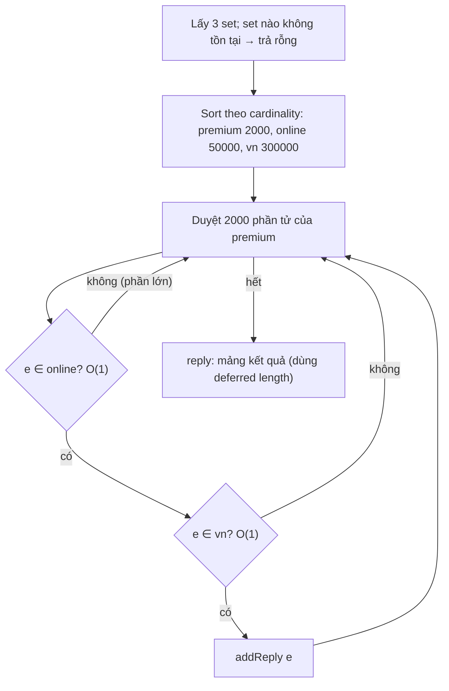

# PART 12 — SET

> **Trước:** [11 — List](11-list.md) · **Tiếp:** [13 — Sorted Set](13-sorted-set.md)
> **Độ ưu tiên:** Trung bình–cao. Set đơn giản về khái niệm, nhưng các phép toán tập hợp (SINTER, SUNION, SDIFF) trên set lớn là một trong những nguồn lệnh O(N) chặn server phổ biến nhất.

---

## Mục lục

1. [Simple mental model](#1-simple-mental-model)
2. [WHAT — Redis Set](#2-what--redis-set)
3. [WHY — Tại sao cần Set trên server](#3-why--tại-sao-cần-set-trên-server)
4. [HOW — Ba encoding: intset, listpack, hashtable](#4-how--ba-encoding)
5. [INTERNALS 1 — Intset chi tiết](#5-internals-1--intset-chi-tiết)
6. [INTERNALS 2 — Listpack cho set nhỏ (7.2+)](#6-internals-2--listpack-cho-set-nhỏ)
7. [INTERNALS 3 — Hash-based set](#7-internals-3--hash-based-set)
8. [INTERNALS 4 — Thuật toán intersection, union, difference](#8-internals-4--thuật-toán-set-operations)
9. [Operations & Complexity](#9-operations--complexity)
10. [DATA FLOW — SINTER ba set](#10-data-flow--sinter-ba-set)
11. [EXAMPLE](#11-example)
12. [WHAT HAPPENS IF — High-cardinality set](#12-what-happens-if--high-cardinality-set)
13. [PERFORMANCE IMPACT](#13-performance-impact)
14. [PRODUCTION BEHAVIOR](#14-production-behavior)
15. [TRADE-OFF](#15-trade-off)
16. [WHEN TO USE / WHEN NOT TO USE](#16-when-to-use--when-not-to-use)
17. [COMMON MISUNDERSTANDINGS](#17-common-misunderstandings)
18. [INTERVIEW QUESTIONS](#18-interview-questions)
19. [KEY TAKEAWAYS](#19-key-takeaways)

---

## 1. Simple mental model

Set là **một túi bi không trùng màu**. Hỏi "túi có bi đỏ không?" trả lời ngay. Muốn biết "những màu có trong cả ba túi" thì phải lấy từng bi trong túi **nhỏ nhất** ra so với hai túi kia. Túi toàn bi đánh số thì Redis xếp chúng **thành hàng theo thứ tự trong một hộp nhỏ** (intset) — tìm bằng chia đôi.

---

## 2. WHAT — Redis Set

- Tập **không thứ tự**, **không trùng lặp** các string.
- Tối đa 2^32 − 1 phần tử.
- Lệnh: `SADD`, `SREM`, `SISMEMBER`, `SMISMEMBER` (6.2), `SCARD`, `SMEMBERS`, `SSCAN`, `SPOP`, `SRANDMEMBER`, `SMOVE`, `SINTER`, `SINTERCARD` (7.0), `SUNION`, `SDIFF`, `SINTERSTORE`, `SUNIONSTORE`, `SDIFFSTORE`.

---

## 3. WHY — Tại sao cần Set trên server

- **Membership O(1) chia sẻ giữa nhiều instance**: "user này đã vote chưa?", "IP này có trong blacklist?".
- **Dedup atomic**: `SADD` trả 1 nếu mới, 0 nếu đã có → một lệnh vừa kiểm tra vừa ghi, không race.
- **Tính toán gần dữ liệu**: "bạn chung" = `SINTER friends:A friends:B` — không cần tải hai tập về app.

---

## 4. HOW — Ba encoding

| Encoding | Điều kiện | Cấu trúc | SISMEMBER |
|---|---|---|---|
| `intset` | Mọi phần tử là số nguyên 64-bit **và** số phần tử ≤ `set-max-intset-entries` (512) | Mảng số nguyên **sắp xếp** | Binary search O(log N) |
| `listpack` (7.2+) | Có phần tử không phải số nguyên, ≤ `set-max-listpack-entries` (128), mỗi phần tử ≤ `set-max-listpack-value` (64 B) | Listpack | Quét O(N) |
| `hashtable` | Vượt các ngưỡng | `dict` với value NULL | O(1) |

Chuyển đổi: intset → listpack (thêm chuỗi, set còn nhỏ) hoặc → hashtable (lớn); listpack → hashtable. Một chiều.

---

## 5. INTERNALS 1 — Intset chi tiết

```c
typedef struct intset {
    uint32_t encoding;   /* INTSET_ENC_INT16 / INT32 / INT64: kích thước mỗi phần tử */
    uint32_t length;     /* số phần tử */
    int8_t contents[];   /* mảng phần tử, sắp xếp tăng dần, little-endian */
} intset;
```

### 5.1 Tìm kiếm

Binary search trên mảng sắp xếp → O(log N). Kiểm tra nhanh trước: nếu value lớn hơn phần tử cuối hoặc nhỏ hơn phần tử đầu → không có (và biết vị trí chèn).

### 5.2 Chèn

1. Nếu value cần encoding lớn hơn hiện tại (ví dụ đang int16, chèn 100000) → **upgrade**.
2. Tìm vị trí bằng binary search; có rồi → không làm gì.
3. `realloc` thêm một slot, `memmove` phần sau lùi một ô, ghi value → **O(N)**.

### 5.3 Upgrade encoding

```text
Trước: encoding=INT16, [1, 5, 300]       → 3 × 2 byte = 6 byte
SADD s 70000   (không vừa int16)
Sau:   encoding=INT32, [1, 5, 300, 70000] → 4 × 4 byte = 16 byte
```
- Cấp phát lại với kích thước mới, **chuyển từ cuối về đầu** (để không ghi đè phần tử chưa chuyển), đặt value mới ở đầu (nếu âm) hoặc cuối (nếu dương) — vì value gây upgrade chắc chắn lớn hơn mọi phần tử (hoặc nhỏ hơn).
- **Không bao giờ downgrade** (kể cả khi xóa 70000).

### 5.4 Tại sao intset tiết kiệm

Set 500 user ID (int32): intset = 8 + 500 × 4 = **2 KB**. Hashtable: 500 × (dictEntry 24 + SDS ~16 + bucket 8) + dict ≈ **25 KB**. Gấp ~12 lần.

---

## 6. INTERNALS 2 — Listpack cho set nhỏ (7.2+)

Trước 7.2, set có dù chỉ một phần tử chuỗi (`SADD tags "redis"`) là hashtable ngay → tag set nhỏ rất tốn RAM. Từ 7.2, set nhỏ không phải số nguyên dùng listpack (mỗi phần tử một entry, không trùng). `SISMEMBER` quét O(N) với N ≤ 128 — nhanh trong thực tế.

---

## 7. INTERNALS 3 — Hash-based set

- `dict` với key = SDS member, value = NULL (các bản mới có tối ưu entry không value để tiết kiệm 8 byte).
- `SADD`/`SREM`/`SISMEMBER`: O(1) trung bình.
- `SMEMBERS`: duyệt toàn bộ dict, O(N).
- `SRANDMEMBER`/`SPOP`: `dictGetFairRandomKey` — lấy mẫu vài bucket rồi chọn, giảm thiên lệch do chuỗi có độ dài khác nhau (random bucket rồi random trong chuỗi sẽ thiên vị phần tử ở chuỗi ngắn).
- `SPOP` không tất định → propagate thành `SREM <phần tử đã pop>` (nhiều phần tử có thể gom thành một hoặc vài SREM/UNLINK).

---

## 8. INTERNALS 4 — Thuật toán set operations

### 8.1 SINTER (intersection)

```text
sinterGenericCommand(sets[1..M]):
  nếu có set không tồn tại → kết quả rỗng ngay
  sort sets theo cardinality tăng dần
  for each phần tử e trong sets[0] (set NHỎ NHẤT):
      for j in 1..M-1:
          if e không thuộc sets[j]: bỏ e, break      # dừng sớm
      if e thuộc mọi set: thêm vào kết quả
```
- Complexity: **O(N × M)** worst case, N = cardinality của set nhỏ nhất, M = số set.
- Tối ưu then chốt: duyệt set **nhỏ nhất** → `SINTER` set 10 phần tử với set 10 triệu phần tử chỉ tốn ~10 lookup.
- Nếu set nhỏ nhất cũng lớn (hai set 5 triệu) → hàng triệu lookup → hàng trăm ms đến giây.

### 8.2 SINTERCARD (7.0)

`SINTERCARD numkeys k1 k2 [LIMIT n]`: chỉ đếm, không xây reply; **LIMIT** dừng khi đạt n → "hai user có ít nhất 3 bạn chung không?" rẻ hơn nhiều so với SINTER đầy đủ.

### 8.3 SUNION

Thêm mọi phần tử của mọi set vào một set tạm (dict) → **O(N)**, N = tổng số phần tử. Tạo set tạm cũng tốn memory O(N).

### 8.4 SDIFF — hai thuật toán

- **Thuật toán 1**: với mỗi phần tử của set đầu, kiểm tra không thuộc các set còn lại → O(N × M), N = size set đầu. Tốt khi set đầu nhỏ.
- **Thuật toán 2**: copy set đầu vào set tạm, rồi xóa mọi phần tử của các set còn lại → O(N) tổng số phần tử. Tốt khi các set sau nhỏ.
- Redis **ước lượng chi phí** cả hai và chọn thuật toán rẻ hơn (với hệ số heuristic ưu tiên thuật toán 1 vì nó không cần tạo set tạm lớn).

### 8.5 Biến thể STORE

`SINTERSTORE dest ...` lưu kết quả vào key `dest` → kết quả được tạo trên server và propagate: Redis propagate **chính lệnh** `SINTERSTORE` (tất định) → replica phải **tính lại** → chi phí CPU lặp lại trên mọi replica.

---

## 9. Operations & Complexity

| Lệnh | Complexity |
|---|---|
| `SADD`, `SREM` (mỗi member), `SISMEMBER`, `SMOVE` | O(1) (intset: O(log N) tìm, O(N) chèn; listpack: O(N)) |
| `SMISMEMBER` | O(N) số member hỏi |
| `SCARD` | O(1) |
| `SMEMBERS` | **O(N)** |
| `SSCAN` | O(1) mỗi lần, O(N) tổng |
| `SPOP` / `SRANDMEMBER` (không count) | O(1) |
| `SPOP count`, `SRANDMEMBER count` | O(count) |
| `SINTER`, `SINTERSTORE` | O(N × M) worst, N = set nhỏ nhất |
| `SINTERCARD` | O(N × M) worst, dừng sớm với LIMIT |
| `SUNION`, `SUNIONSTORE` | O(N) tổng phần tử |
| `SDIFF`, `SDIFFSTORE` | O(N) tổng phần tử (thuật toán chọn động) |

---

## 10. DATA FLOW — SINTER ba set

`SINTER online_users premium_users region:vn` (|online| = 50.000, |premium| = 2.000, |vn| = 300.000):



**Cách đọc diagram:** Tổng số lookup ≤ 2000 × 2 = 4000 — rất rẻ nhờ bắt đầu từ set nhỏ nhất và dừng sớm. Nếu đổi thứ tự dữ liệu (cả ba set đều 5 triệu phần tử) → 5 triệu vòng lặp ngoài → hàng trăm ms.

---

## 11. EXAMPLE

| Use case | Lệnh |
|---|---|
| Dedup event đã xử lý | `SADD processed:2026-09-30 {event_id}` → 1 = mới, xử lý; 0 = trùng, bỏ qua; `EXPIRE` theo ngày |
| Tag của bài viết | `SADD post:42:tags redis database` |
| Bài viết theo tag | `SADD tag:redis 42` → `SINTER tag:redis tag:database` |
| Bạn chung | `SINTER friends:A friends:B` hoặc `SINTERCARD 2 friends:A friends:B LIMIT 10` |
| Online users | `SADD online {user}` + dọn định kỳ (hoặc ZSET với timestamp để tự hết hạn theo score) |
| Lottery | `SPOP participants 3` |
| Blacklist IP | `SISMEMBER blacklist {ip}` |

---

## 12. WHAT HAPPENS IF — High-cardinality set

Set `followers:celebrity` với 50 triệu member:

| Thao tác | Hậu quả |
|---|---|
| Memory | ~50–70 B/member → 3 GB cho một key |
| `SMEMBERS` | Chặn server nhiều giây, reply GB |
| `SINTER followers:celebrity followers:X` | Nếu set X cũng lớn → rất chậm |
| `DEL` | Free 50 triệu SDS + entry → nhiều giây (dùng UNLINK) |
| Cluster | Toàn bộ trên một node, không phân tán; migrate slot chứa key này rất chậm (MIGRATE chặn) |
| Replication full sync | Serialize key khổng lồ |
| `SCARD` | Vẫn O(1) — nhưng nếu chỉ cần đếm thì không cần lưu set |

Giải pháp:
- Chỉ cần **đếm unique**: HyperLogLog (12 KB, sai số 0.81%) — [Chương 15](15-hyperloglog.md).
- Chỉ cần **membership xấp xỉ**: Bloom filter (Redis 8 có sẵn `BF.*`).
- ID là số nguyên dày đặc: **Bitmap** (1 bit/ID) — [Chương 14](14-bitmap-bitfield.md).
- Cần đầy đủ: **shard** set thành nhiều key theo hash(member) % K; membership check đi đúng shard; union/count chạy từng shard.
- Tính toán tập hợp lớn định kỳ: làm ở hệ thống batch (Spark, database), lưu kết quả vào Redis.

---

## 13. PERFORMANCE IMPACT

| Encoding | Memory / phần tử | Lookup |
|---|---|---|
| intset (int16/32/64) | 2 / 4 / 8 byte | O(log N), cực nhanh |
| listpack | ~2–70 byte (theo độ dài) | O(N) với N ≤ 128 |
| hashtable | ~40–70 byte + member | O(1) |

- Intset chèn O(N) memmove: với N ≤ 512 và phần tử 8 byte → ≤ 4 KB memmove, không đáng kể.
- Nâng `set-max-intset-entries` lên vài nghìn tiết kiệm RAM lớn cho set số nguyên, chi phí chèn tăng tuyến tính.

---

## 14. PRODUCTION BEHAVIOR

- `SINTER`/`SUNION` trên set lớn từ API gọi thường xuyên → CPU main thread tăng, SLOWLOG đầy. Cache kết quả hoặc precompute.
- `SMEMBERS` được dùng "vì set nhỏ" lúc đầu, rồi set lớn dần → sự cố sau vài tháng. Dùng SSCAN hoặc giới hạn kích thước bằng thiết kế.
- `*STORE` với set lớn: chi phí nhân với số replica (mỗi replica tính lại) và ghi vào AOF.

---

## 15. TRADE-OFF

| Được | Mất |
|---|---|
| Membership O(1), dedup atomic | ~50+ B/member cho set chuỗi lớn |
| intset cực gọn cho số nguyên | Chèn O(N), không downgrade |
| Set ops server-side | O(N) trên set lớn chặn server |
| SPOP/SRANDMEMBER tiện | Random không tuyệt đối đều; propagate thành SREM |

---

## 16. WHEN TO USE / WHEN NOT TO USE

**Dùng khi:** dedup, membership, tag, quan hệ nhỏ-vừa (bạn bè cá nhân), random sampling, tập ID cần giao/hợp với kích thước kiểm soát được.

**Không dùng khi:**
- Chỉ cần đếm unique trên quy mô lớn → HyperLogLog.
- Cần thứ tự/xếp hạng → Sorted Set.
- Set không giới hạn tăng (followers của celebrity) mà cần phép toán tập hợp thường xuyên.
- Membership xấp xỉ chấp nhận false positive trên tập khổng lồ → Bloom filter.

---

## 17. COMMON MISUNDERSTANDINGS

| Hiểu sai | Thực tế |
|---|---|
| "Set luôn là hash table" | intset / listpack khi nhỏ |
| "SINTER luôn chậm" | Phụ thuộc set **nhỏ nhất**; có thể rất nhanh |
| "SCARD phải đếm" | O(1) |
| "Set giữ thứ tự chèn" | Không; intset thì sắp xếp tăng dần |
| "SRANDMEMBER hoàn toàn đều" | Xấp xỉ; Redis đã cải thiện độ công bằng nhưng không phải uniform tuyệt đối |

---

## 18. INTERVIEW QUESTIONS

1. **Redis Set implement thế nào?** → intset (số nguyên, ≤ 512, sorted array, binary search, upgrade), listpack (7.2+, nhỏ), hashtable (dict value NULL).
2. **Intset upgrade là gì?** → Chèn số vượt kích thước encoding → cấp phát lại với encoding rộng hơn, chuyển phần tử từ cuối; không downgrade.
3. **Complexity của SINTER? Redis tối ưu thế nào?** → O(N×M), N = set nhỏ nhất; sort theo cardinality, dừng sớm.
4. **SDIFF chọn thuật toán thế nào?** → Ước lượng chi phí hai cách (kiểm tra từng phần tử set đầu vs copy rồi xóa), chọn rẻ hơn.
5. **(Senior) Đếm unique visitors mỗi ngày cho 200 triệu user — dùng Set được không?** → Tốn ~10+ GB/ngày; dùng HyperLogLog (12 KB, 0.81%) hoặc bitmap nếu ID dày đặc và cần chính xác.

---

## 19. KEY TAKEAWAYS

- Set = **intset** (số nguyên nhỏ, sorted array) / **listpack** (7.2+, nhỏ) / **hashtable** (dict value NULL).
- `SADD` là dedup atomic; `SISMEMBER` O(1) (hoặc O(log N)/O(N) với encoding compact).
- **SINTER duyệt set nhỏ nhất**; SUNION/SDIFF O(tổng N); SDIFF chọn thuật toán theo chi phí ước lượng.
- High-cardinality set là big key: dùng HyperLogLog, Bloom, Bitmap, hoặc shard.
- `*STORE` được tính lại trên mọi replica.
