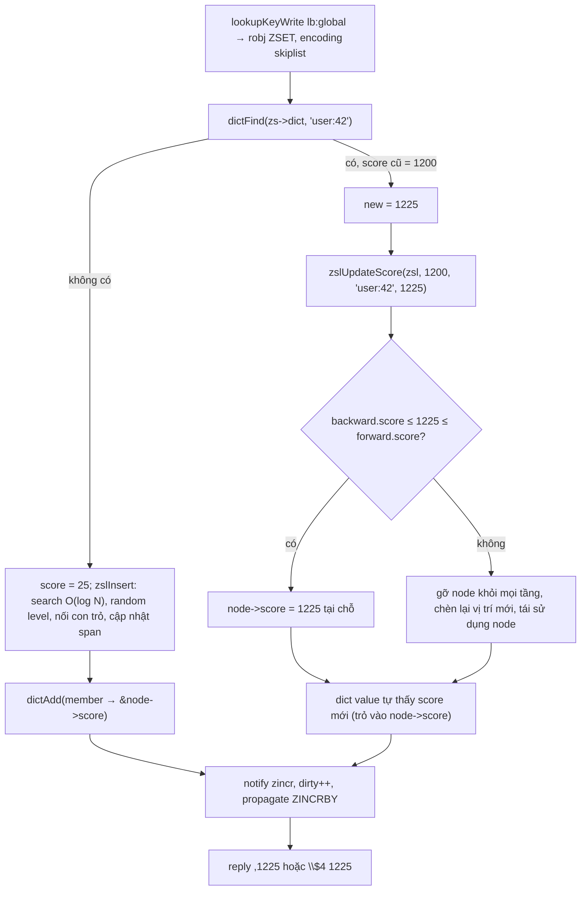
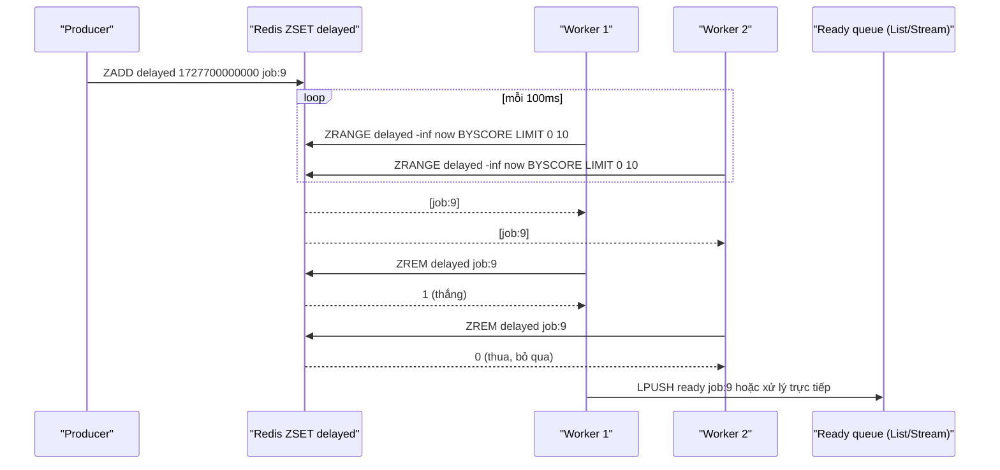

# PART 13 — SORTED SET (ZSET)

> **Trước:** [12 — Set](12-set.md) · **Tiếp:** [14 — Bitmap / Bitfield](14-bitmap-bitfield.md)
> **Độ ưu tiên:** Cao nhất trong nhóm data type. Sorted Set là cấu trúc "đặc trưng" nhất của Redis: không database phổ biến nào khác cung cấp một ordered set với rank O(log N) truy cập qua network với latency µs. Leaderboard, delayed queue, sliding-window rate limiter, time index, GEO đều dựa trên nó. Chương này đi sâu vào skip list tới mức có thể tự implement.

---

## Mục lục

1. [Simple mental model](#1-simple-mental-model)
2. [WHAT — Sorted Set](#2-what--sorted-set)
3. [WHY — Tại sao cần một cấu trúc vừa hash vừa sorted](#3-why--tại-sao-cần-cấu-trúc-vừa-hash-vừa-sorted)
4. [HOW — Hai encoding: listpack và skiplist+dict](#4-how--hai-encoding)
5. [INTERNALS 1 — Skip list: ý tưởng](#5-internals-1--skip-list-ý-tưởng)
6. [INTERNALS 2 — Levels và xác suất](#6-internals-2--levels-và-xác-suất)
7. [INTERNALS 3 — Cấu trúc skip list của Redis (có span)](#7-internals-3--cấu-trúc-skip-list-của-redis)
8. [INTERNALS 4 — Search](#8-internals-4--search)
9. [INTERNALS 5 — Insertion](#9-internals-5--insertion)
10. [INTERNALS 6 — Deletion và update score](#10-internals-6--deletion-và-update-score)
11. [INTERNALS 7 — Rank và range theo index](#11-internals-7--rank-và-range-theo-index)
12. [INTERNALS 8 — Vì sao cần cả dict](#12-internals-8--vì-sao-cần-cả-dict)
13. [INTERNALS 9 — Encoding listpack cho zset nhỏ](#13-internals-9--encoding-listpack)
14. [Tại sao Redis dùng Skip List thay vì balanced tree](#14-tại-sao-redis-dùng-skip-list)
15. [Operations & Complexity](#15-operations--complexity)
16. [DATA FLOW — ZINCRBY trên leaderboard](#16-data-flow--zincrby-trên-leaderboard)
17. [EXAMPLE 1 — Leaderboard](#17-example-1--leaderboard)
18. [EXAMPLE 2 — Delayed queue](#18-example-2--delayed-queue)
19. [EXAMPLE 3 — Scoring systems, time index, lexicographic](#19-example-3--scoring-systems-time-index-lexicographic)
20. [WHAT HAPPENS IF](#20-what-happens-if)
21. [PERFORMANCE IMPACT](#21-performance-impact)
22. [PRODUCTION BEHAVIOR](#22-production-behavior)
23. [TRADE-OFF](#23-trade-off)
24. [WHEN TO USE / WHEN NOT TO USE](#24-when-to-use--when-not-to-use)
25. [COMMON MISUNDERSTANDINGS](#25-common-misunderstandings)
26. [INTERVIEW QUESTIONS](#26-interview-questions)
27. [KEY TAKEAWAYS](#27-key-takeaways)

---

## 1. Simple mental model

Sorted Set giống **một bảng xếp hạng thi đấu treo trên tường, kèm một cuốn danh bạ**:
- **Bảng xếp hạng** (skip list): mọi vận động viên xếp theo điểm. Muốn xem top 10 hay "ai xếp từ 100 đến 120" thì nhìn vào bảng.
- **Danh bạ** (dict): tra tên → điểm hiện tại ngay lập tức, không cần dò bảng.
- Bảng xếp hạng có **các làn tốc hành** ở các tầng cao (levels của skip list): tầng dưới cùng ghé mọi người, tầng trên chỉ ghé một phần tư, tầng trên nữa một phần mười sáu... Tìm vị trí của điểm 8.500 thì đi tầng cao nhất tới gần, rồi xuống tầng thấp hơn — giống tàu tốc hành rồi đổi sang tàu chợ.
- Mỗi làn tốc hành còn ghi **"đoạn này bỏ qua bao nhiêu người"** (span) → cộng dồn trên đường đi là biết ngay thứ hạng.

---

## 2. WHAT — Sorted Set

- Tập **không trùng** các `member` (string), mỗi member có một `score` (double 64-bit IEEE 754).
- Luôn được **sắp xếp theo (score, member)**: score tăng dần; score bằng nhau thì so sánh member theo byte (lexicographic, `memcmp`).
- Truy cập theo: member (score), rank (thứ hạng), khoảng score, khoảng lexicographic (khi score bằng nhau).
- Lệnh: `ZADD` (NX/XX/GT/LT/CH/INCR), `ZINCRBY`, `ZSCORE`, `ZMSCORE`, `ZRANK`/`ZREVRANK` (WITHSCORE từ 7.2), `ZRANGE` (hợp nhất BYSCORE/BYLEX/REV/LIMIT từ 6.2), `ZRANGESTORE`, `ZCOUNT`, `ZLEXCOUNT`, `ZREM`, `ZREMRANGEBYRANK/SCORE/LEX`, `ZPOPMIN/MAX`, `BZPOPMIN/MAX`, `ZMPOP`/`BZMPOP` (7.0), `ZRANDMEMBER`, `ZUNION/ZINTER/ZDIFF` (+STORE), `ZINTERCARD`, `ZSCAN`, `ZCARD`.

---

## 3. WHY — Tại sao cần cấu trúc vừa hash vừa sorted

Leaderboard 10 triệu người chơi cần đồng thời:

| Thao tác | Yêu cầu | Cấu trúc đơn lẻ nào làm được? |
|---|---|---|
| Cập nhật điểm của user X | Tìm X nhanh + dời vị trí | Hash: tìm O(1) nhưng không có thứ tự |
| Điểm của X là bao nhiêu? | O(1) | Hash |
| Top 100 | Duyệt theo thứ tự | Cây/skip list |
| Thứ hạng của X | Rank O(log N) | Cây/skip list **có augmentation** (đếm con) |
| Người có điểm từ 1000 đến 2000 | Range scan | Cây/skip list |

Không cấu trúc đơn lẻ nào tốt ở cả năm. Redis ghép **dict (member → score)** + **skip list có span (thứ tự + rank)**, chia sẻ cùng chuỗi member để không nhân đôi dữ liệu.

Trong SQL, tương đương là `SELECT COUNT(*) FROM scores WHERE score > ?` để tính rank — O(N) hoặc O(log N) với index đặc biệt, và mỗi update ghi B-tree trên disk + WAL. Redis làm trong µs.

---

## 4. HOW — Hai encoding

| Encoding | Điều kiện | Cấu trúc |
|---|---|---|
| `listpack` | ≤ `zset-max-listpack-entries` (128) phần tử **và** mọi member ≤ `zset-max-listpack-value` (64 B) | Listpack: `member1 score1 member2 score2 ...` sắp theo score |
| `skiplist` | Vượt ngưỡng | `zset { dict *dict; zskiplist *zsl; }` |

(Trước 7.0: `ziplist`, config `zset-max-ziplist-*`.) Chuyển một chiều.

---

## 5. INTERNALS 1 — Skip list: ý tưởng

Skip list (William Pugh, 1990) là **linked list sắp xếp có nhiều tầng "làn nhanh"** — một cấu trúc xác suất cho O(log N) kỳ vọng cho search/insert/delete, **không cần rebalancing**.

Bắt đầu từ linked list sắp xếp: tìm phần tử là O(N). Thêm một tầng trên liên kết mỗi phần tử thứ 2 → tìm ~N/2. Thêm tầng liên kết mỗi phần tử thứ 4 → ~N/4... Với log₂N tầng → O(log N) — giống binary search trên linked list.

Vấn đề: giữ cấu trúc "chính xác mỗi phần tử thứ 2^k" khi chèn/xóa phải sắp xếp lại nhiều node. **Ý tưởng then chốt của Pugh**: không cần chính xác — mỗi node **tự tung đồng xu** để quyết định cao bao nhiêu tầng. Về mặt xác suất, phân bố tầng giống cấu trúc lý tưởng → O(log N) kỳ vọng, và chèn/xóa chỉ chạm các node lân cận.

```text
Level 4: HEAD ─────────────────────────────────────────────► 70 ──────────────────────► NULL
Level 3: HEAD ────────────────► 25 ────────────────────────► 70 ──────────────────────► NULL
Level 2: HEAD ────────► 12 ───► 25 ───────────► 50 ────────► 70 ────────────► 91 ─────► NULL
Level 1: HEAD ─► 5 ───► 12 ───► 25 ─► 31 ─────► 50 ─► 62 ──► 70 ─► 77 ─► 85 ─► 91 ─► 99 ► NULL
                  (mỗi số là score; mỗi node có chiều cao ngẫu nhiên)
```

Tìm 77: tầng 4 từ HEAD → 70 (70 < 77) → tiếp NULL, xuống tầng 3 → từ 70 → NULL, xuống 2 → 91 > 77, xuống 1 → 77. Chỉ ghé 4 node thay vì 9.

---

## 6. INTERNALS 2 — Levels và xác suất

Redis: `ZSKIPLIST_MAXLEVEL = 32`, `ZSKIPLIST_P = 0.25`.

```c
int zslRandomLevel(void) {
    int level = 1;
    while ((random() & 0xFFFF) < (ZSKIPLIST_P * 0xFFFF))  /* xác suất 1/4 */
        level += 1;
    return (level < ZSKIPLIST_MAXLEVEL) ? level : ZSKIPLIST_MAXLEVEL;
}
```
(Các bản mới tính bằng một phép random duy nhất cho hiệu quả, cùng phân bố.)

| Level của node | Xác suất |
|---|---|
| ≥ 1 | 1 |
| ≥ 2 | 1/4 |
| ≥ 3 | 1/16 |
| ≥ k | (1/4)^(k−1) |

Hệ quả:
- **Số con trỏ forward trung bình mỗi node** = 1/(1−p) = **1.33** (với p = 0.5 là 2). Chọn p = 1/4 là để **tiết kiệm memory**, đổi lại số bước so sánh mỗi tầng tăng nhẹ.
- **Chiều cao kỳ vọng của cả list** ≈ log₄(N): 1 triệu phần tử → ~10 tầng; 2^64 phần tử mới cần 32 tầng → MAXLEVEL 32 là đủ cho mọi dataset thực tế.
- **Số bước search kỳ vọng** ≈ (1/p) · log_{1/p}(N) = 4 · log₄N ≈ 2 · log₂N — cùng bậc với cây cân bằng.
- Worst case O(N) về lý thuyết (tất cả node level 1) nhưng xác suất cực nhỏ với N lớn.

---

## 7. INTERNALS 3 — Cấu trúc skip list của Redis

```c
typedef struct zskiplistNode {
    sds ele;                              /* member (chia sẻ với dict) */
    double score;
    struct zskiplistNode *backward;       /* chỉ ở level 0: đi lùi cho ZREVRANGE */
    struct zskiplistLevel {
        struct zskiplistNode *forward;
        unsigned long span;               /* số node bị "nhảy qua" khi đi forward ở tầng này */
    } level[];                            /* flexible array: số phần tử = level của node */
} zskiplistNode;

typedef struct zskiplist {
    struct zskiplistNode *header, *tail;  /* header là node giả có đủ 32 level */
    unsigned long length;
    int level;                            /* level cao nhất hiện có */
} zskiplist;

typedef struct zset {
    dict *dict;                           /* member → &node->score */
    zskiplist *zsl;
} zset;
```

Ba mở rộng so với skip list của Pugh:
1. **`span`**: số node giữa node hiện tại và `forward` (tính cả `forward`) ở tầng đó. Cộng dồn span dọc đường đi = **rank**. Đây là "augmented skip list" cho `ZRANK` O(log N).
2. **`backward`**: con trỏ lùi ở tầng 0 → duyệt ngược cho `ZREVRANGE`, `ZREVRANK` mà không cần doubly linked ở mọi tầng.
3. **Score có thể trùng**: sắp theo `(score, ele)`, nên phép so sánh là "score nhỏ hơn, hoặc score bằng và ele nhỏ hơn".

```text
Ví dụ span (rank tính từ 1):
            span=2              span=3
Level 2: HEAD ──────► B(20) ─────────────────────► E(50) ──► NULL
            span=1    span=1     span=1   span=1
Level 1: HEAD ─► A(10) ─► B(20) ─► C(30) ─► D(40) ─► E(50) ─► NULL
Rank của E = đi HEAD →(2)→ B →(3)→ E = 2 + 3 = 5 ✓
```

---

## 8. INTERNALS 4 — Search

Tìm node đầu tiên có `(score, ele) ≥ (s, e)`:

```text
x = zsl->header
rank = 0
for i from zsl->level - 1 down to 0:
    while x.level[i].forward != NULL and
          (x.level[i].forward.score < s or
           (x.level[i].forward.score == s and sdscmp(x.level[i].forward.ele, e) < 0)):
        rank += x.level[i].span
        x = x.level[i].forward
    # không đi tiếp được ở tầng i → xuống tầng i-1
x = x.level[0].forward   # ứng viên
```

Mỗi tầng đi ngang trung bình ~1/p = 4 bước (tối đa), số tầng ~log₄N → O(log N). Mỗi bước là một pointer dereference (có thể là cache miss) — skip list và cây cân bằng giống nhau ở điểm này.

---

## 9. INTERNALS 5 — Insertion

`zslInsert(zsl, score, ele)`:

```text
update[MAXLEVEL]   # node cuối cùng ở mỗi tầng đứng TRƯỚC vị trí chèn
rank[MAXLEVEL]     # rank của update[i]

1. Search như §8, nhưng ở mỗi tầng i ghi lại update[i] = x và rank[i] = rank tích lũy.
2. level = zslRandomLevel()
3. Nếu level > zsl->level:
       với các tầng mới i: rank[i] = 0, update[i] = header, header.level[i].span = zsl->length
       zsl->level = level
4. x = createNode(level, score, ele)
5. for i in 0..level-1:
       x.level[i].forward = update[i].level[i].forward
       update[i].level[i].forward = x
       # span: phần của update[i] bị chia đôi bởi x
       x.level[i].span = update[i].level[i].span - (rank[0] - rank[i])
       update[i].level[i].span = (rank[0] - rank[i]) + 1
6. for i in level..zsl->level-1:
       update[i].level[i].span++      # tầng cao hơn x: đoạn nhảy qua có thêm 1 node
7. x.backward = (update[0] == header) ? NULL : update[0]
   nếu x.level[0].forward: forward.backward = x, else zsl->tail = x
8. zsl->length++
```

Giải thích bước 5: `rank[0] − rank[i]` là số node giữa `update[i]` và `update[0]` (vị trí ngay trước x). Đoạn nhảy cũ của `update[i]` bị x cắt thành hai: từ `update[i]` tới x, và từ x tới forward cũ.

Chi phí: O(log N) search + O(level) cập nhật con trỏ. **Không có rotation, không rebalancing** — khác hẳn red-black tree.

---

## 10. INTERNALS 6 — Deletion và update score

### 10.1 Deletion (`zslDeleteNode`)

```text
Search, ghi update[i] như insert.
x = update[0].level[0].forward (node cần xóa; kiểm tra score và ele khớp)
for i in 0..zsl->level-1:
    if update[i].level[i].forward == x:
        update[i].level[i].span += x.level[i].span - 1
        update[i].level[i].forward = x.level[i].forward
    else:
        update[i].level[i].span -= 1       # tầng cao hơn x: bớt 1 node trong đoạn
cập nhật backward/tail
while zsl->level > 1 and header.level[zsl->level-1].forward == NULL: zsl->level--
zsl->length--
```

### 10.2 Update score (`zslUpdateScore`, Redis 5+)

`ZINCRBY lb 10 alice` hoặc `ZADD lb 1500 alice` (đã tồn tại):
1. Tìm node của alice (search với score **cũ** — lấy từ dict).
2. **Fast path**: nếu score mới vẫn nằm giữa `backward.score` và `forward.score` (vị trí không đổi) → **sửa score tại chỗ**, O(log N) cho search, không đụng con trỏ.
3. Không thì **gỡ node rồi chèn lại**, tái sử dụng chính node (không free/malloc).
4. Dict value trỏ vào `&node->score` → tự động thấy score mới.

Với leaderboard, thay đổi điểm nhỏ thường không làm đổi vị trí so với hàng xóm → fast path rất hữu ích.

---

## 11. INTERNALS 7 — Rank và range theo index

### 11.1 `ZRANK key member`

1. Dict lấy score của member: O(1).
2. `zslGetRank(zsl, score, ele)`: search như §8, cộng span; dừng khi gặp node đúng → rank (1-based, Redis trả 0-based = rank − 1).
3. `ZREVRANK` = `length − rank`.

→ **O(log N)**.

### 11.2 `ZRANGE key start stop` (theo index)

1. `zslGetElementByRank(zsl, start+1)`: đi xuống theo span — ở mỗi tầng, đi tiếp nếu `traversed + span ≤ rank_cần` → O(log N) để tới phần tử đầu.
2. Duyệt `level[0].forward` M phần tử (hoặc `backward` với REV).

→ **O(log N + M)**.

### 11.3 `ZRANGE key min max BYSCORE [LIMIT offset count]`

1. `zslNthInRange`/`zslFirstInRange`: search score ≥ min → O(log N).
2. Duyệt tới khi score > max.
3. **Cẩn thận với LIMIT offset lớn**: bản cũ phải đi tuần tự `offset` bước ở tầng 0 → O(log N + offset + count). Các bản mới tối ưu dùng span để nhảy tới offset trong O(log N). Dù vậy, phân trang sâu vẫn nên dùng "cursor theo score" (min = score cuối trang trước, exclusive `(`).

### 11.4 `ZCOUNT key min max`

Tính rank của phần tử đầu ≥ min và rank của phần tử cuối ≤ max, trừ nhau → **O(log N)**, không duyệt các phần tử ở giữa. Nhờ span.

---

## 12. INTERNALS 8 — Vì sao cần cả dict

| Không có dict | Có dict |
|---|---|
| `ZSCORE lb alice`: không biết score → không search được theo thứ tự → phải duyệt O(N) | O(1) |
| `ZADD lb 1500 alice` (đã có): phải tìm alice để gỡ vị trí cũ → O(N) | O(1) lấy score cũ → search O(log N) |
| `ZREM`: O(N) | O(log N) |
| `ZRANK alice`: O(N) | O(log N) |

Skip list chỉ tìm nhanh **theo score**; dict tìm nhanh **theo member**. Hai cấu trúc cùng trỏ vào **một SDS member** (skip list node sở hữu, dict tham chiếu) và dict value là **con trỏ tới `node->score`** → không lưu score hai lần.

Memory mỗi member (skiplist encoding), xấp xỉ:
- Skip list node: ele (8) + score (8) + backward (8) + level[] (16 × ~1.33 trung bình) ≈ 45 B → size class 48/64.
- Dict entry 24 B + bucket ~8 B.
- SDS member: 3 + len + 1 → làm tròn size class.
→ **~100 byte + độ dài member**. Leaderboard 10 triệu user ID 10 ký tự ≈ 1–1.2 GB.

---

## 13. INTERNALS 9 — Encoding listpack

- Listpack chứa các cặp `member, score` **sắp theo score** (rồi member). Score được lưu dạng số nguyên nếu là số nguyên, ngược lại dạng chuỗi của double.
- Mọi thao tác O(N) quét: ZADD phải tìm member (để xóa bản cũ) rồi tìm vị trí chèn đúng thứ tự; ZRANK đếm vị trí; ZRANGE duyệt.
- Với ≤ 128 phần tử trong khối vài KB → vẫn rất nhanh, tiết kiệm RAM ~5–10x.
- Vượt ngưỡng → `zsetConvert` tạo dict + skip list, chèn từng phần tử.

---

## 14. Tại sao Redis dùng Skip List

antirez trả lời (Hacker News, khi được hỏi vì sao không dùng balanced tree):
1. **Không quá tốn memory** — và tùy chỉnh được: tham số xác suất p quyết định số con trỏ mỗi node; với p = 1/4, trung bình 1.33 con trỏ forward, ít hơn cây nhị phân (2 con trỏ con + thường 1 con trỏ cha + màu/độ cao).
2. **ZRANGE/ZREVRANGE rất phổ biến** — duyệt skip list ở tầng 0 như linked list; cache locality **ít nhất ngang** các balanced tree khác (cả hai đều nhảy pointer).
3. **Đơn giản hơn để implement, debug** — ví dụ nhờ đơn giản, một contributor đã gửi patch thêm span (augmented skip list) để có `ZRANK` O(log N) chỉ với thay đổi nhỏ.

Phân tích thêm:

| Tiêu chí | Skip list | Red-black / AVL tree | B-tree trong memory |
|---|---|---|---|
| Search/insert/delete | O(log N) kỳ vọng | O(log N) worst | O(log N), ít tầng |
| Rebalancing | Không (ngẫu nhiên) | Rotation phức tạp | Split/merge node |
| Range scan | Duyệt linked list tầng 0 | In-order traversal (stack hoặc con trỏ cha) | Duyệt node lá, cache tốt nhất |
| Rank | Span — dễ thêm | Size ở mỗi node — phải cập nhật khi rotation | Đếm trong node |
| Code | ~vài trăm dòng | Phức tạp, nhiều edge case | Phức tạp |
| Memory | Tùy chỉnh bằng p | Cố định | Tốt (fanout lớn) |

B-tree/B+tree trong memory thật ra có locality tốt hơn cho range scan (nhiều key trong một node), và một số hệ thống mới dùng chúng. Nhưng với Redis, sự **đơn giản** và **dễ augment** đã đủ lý do; hiệu năng thực tế tương đương.

---

## 15. Operations & Complexity

| Lệnh | Complexity (skiplist) | Ghi chú |
|---|---|---|
| `ZADD` (mỗi phần tử), `ZINCRBY`, `ZREM` | O(log N) | ZADD M phần tử: O(M log N) |
| `ZSCORE`, `ZMSCORE` | O(1) / O(M) | Qua dict |
| `ZCARD` | O(1) | |
| `ZRANK`, `ZREVRANK` | O(log N) | |
| `ZCOUNT`, `ZLEXCOUNT` | O(log N) | Nhờ span |
| `ZRANGE start stop` (index) | O(log N + M) | M = số phần tử trả về |
| `ZRANGE ... BYSCORE/BYLEX [LIMIT]` | O(log N + M) | Offset lớn: cẩn thận |
| `ZREMRANGEBYRANK/SCORE/LEX` | O(log N + M) | M = số phần tử bị xóa |
| `ZPOPMIN/ZPOPMAX [count]` | O(log N × M) | |
| `BZPOPMIN/MAX`, `BZMPOP` | O(log N) | Block client |
| `ZRANDMEMBER` | O(M) | |
| `ZUNIONSTORE` | O(N) + O(M log M) | N = tổng input, M = kích thước kết quả |
| `ZINTERSTORE` | O(N × K) + O(M log M) | N = set nhỏ nhất, K = số set |
| `ZDIFF` | O(L + (N−K) log N) | |
| `ZSCAN` | O(1)/lần, O(N) tổng | |
| `DEL` | O(N) | Big zset → UNLINK |

---

## 16. DATA FLOW — ZINCRBY trên leaderboard

`ZINCRBY lb:global 25 user:42` với zset 5 triệu phần tử:



**Cách đọc diagram:** Một ZINCRBY trên zset 5 triệu phần tử chỉ tốn ~log₄(5M) ≈ 11 tầng × vài bước ≈ 30–50 phép so sánh — **vài µs**. Đây là lý do một instance Redis phục vụ được leaderboard hàng chục nghìn cập nhật/giây.

---

## 17. EXAMPLE 1 — Leaderboard

| Nhu cầu | Lệnh | Complexity |
|---|---|---|
| Cộng điểm | `ZINCRBY lb 10 user:42` | O(log N) |
| Top 10 | `ZRANGE lb 0 9 REV WITHSCORES` | O(log N + 10) |
| Hạng của tôi | `ZREVRANK lb user:42` (+ `WITHSCORE` 7.2) | O(log N) |
| Người xung quanh tôi | `r = ZREVRANK`; `ZRANGE lb r-5 r+5 REV` | O(log N + 11) |
| Số người trên 1000 điểm | `ZCOUNT lb 1000 +inf` | O(log N) |

### 17.1 Tie-break

Điểm bằng nhau → sắp theo member lexicographic (không công bằng). Muốn "ai đạt trước xếp trên":
- **Composite score**: `score_combined = points × 10^10 + (MAX_TS − timestamp_đạt_điểm)`. Double chính xác tuyệt đối với số nguyên tới **2^53 ≈ 9 × 10^15** → phải đảm bảo tổ hợp không vượt 2^53 (ví dụ points ≤ 10^5 và phần thời gian ≤ 10^10).
- Vượt 2^53 → mất chính xác, thứ tự sai ngầm. Đây là bug kinh điển.

### 17.2 Leaderboard theo thời gian

`lb:daily:2026-09-30`, `lb:weekly:2026-W40` với `EXPIRE`. Tổng hợp: `ZUNIONSTORE lb:weekly 7 lb:daily:... AGGREGATE SUM` — chạy định kỳ, chú ý chi phí O(N) và cả trên replica.

### 17.3 Leaderboard 100 triệu người

~10+ GB trên một key, một node → big key. Chiến lược:
- Shard theo region/server game; top global = merge top-K của từng shard (top 100 của mỗi shard chứa top 100 toàn cục).
- Rank chính xác toàn cục: tổng `ZCOUNT` score > s trên các shard (O(S × log N)).
- Hoặc chấp nhận rank xấp xỉ bằng histogram điểm.

---

## 18. EXAMPLE 2 — Delayed queue

Score = thời điểm cần thực thi (Unix ms).

```
Enqueue:  ZADD delayed {run_at_ms} {job_id}
Poll:     ZRANGE delayed -inf {now} BYSCORE LIMIT 0 100   # job đến hạn
Claim:    ZREM delayed {job_id}   → trả 1 thì worker này "thắng", 0 thì worker khác đã lấy
```



**Cách đọc diagram:** Nhiều worker có thể thấy cùng job; `ZREM` atomic quyết định ai thắng (chỉ một người nhận 1). Nhược điểm: nhiều round-trip, tranh chấp lãng phí. Cải tiến:
- **Lua script** `claim`: trong một lệnh atomic, lấy job đến hạn + ZREM + đẩy sang ready list → không tranh chấp, một round-trip.
- **`ZPOPMIN`** (5.0) hoặc `BZPOPMIN`: pop phần tử score nhỏ nhất — nhưng cần kiểm tra score ≤ now; nếu chưa đến hạn phải `ZADD` lại → Lua gọn hơn.
- Worker crash sau ZREM trước khi xử lý → mất job → kết hợp với processing set/Stream để at-least-once.

Các thư viện job queue (BullMQ, Sidekiq scheduled jobs) dùng đúng mô hình này.

---

## 19. EXAMPLE 3 — Scoring systems, time index, lexicographic

- **Sliding window rate limit**: `ZADD rl:{user} {now} {req_id}`, `ZREMRANGEBYSCORE rl:{user} -inf {now − window}`, `ZCARD` ([Chương 58](58-rate-limiting.md)).
- **Time-based index**: `ZADD posts:by_time {ts} {post_id}` → "bài trong 24h qua" = `ZRANGE ... BYSCORE`.
- **Secondary index numeric**: `ZADD users:by_age {age} {user_id}` → range query theo tuổi (tự duy trì khi update).
- **Priority queue**: score = priority; `ZPOPMIN`.
- **Hot ranking có decay** (Reddit/HN): score = f(votes, time) tính lại khi có vote.
- **Autocomplete lexicographic**: mọi member score 0, `ZRANGE ac "[redi" "[redi\xff" BYLEX LIMIT 0 10` → tìm tiền tố.
- **GEO**: score = geohash 52-bit ([Chương 16](16-geo.md)).

---

## 20. WHAT HAPPENS IF

### 20.1 ZRANGE 0 -1 trên zset 10 triệu phần tử

O(N) → chặn hàng giây, reply hàng trăm MB. Luôn giới hạn range.

### 20.2 ZUNIONSTORE hàng chục zset lớn mỗi phút

O(N) + O(M log M) mỗi lần, lặp lại trên mọi replica (lệnh được propagate nguyên văn), ghi AOF. Chuyển sang cập nhật tăng dần (ZINCRBY vào zset tổng hợp khi có sự kiện).

### 20.3 Score vượt 2^53

`ZADD lb 9007199254740993 x` → lưu thành 9007199254740992. Composite score sai thứ tự ngầm.

### 20.4 NaN

`ZADD`/`ZINCRBY` tạo NaN (ví dụ `+inf` cộng `-inf`) bị từ chối với lỗi — Redis không cho score NaN.

### 20.5 Delayed queue với hàng triệu job cùng một thời điểm

`ZRANGE ... BYSCORE` trả nhanh nhưng xử lý dồn dập; `ZREMRANGEBYSCORE` một lần xóa triệu phần tử → chặn. Giới hạn batch bằng LIMIT.

---

## 21. PERFORMANCE IMPACT

- O(log N) thực tế rất nhỏ: 10 triệu phần tử → ~12 tầng; mỗi thao tác vài µs, bị chi phối bởi cache miss.
- Memory ~100 B/member (skiplist) vs ~10–20 B (listpack).
- Range trả nhiều phần tử: chi phí chủ yếu ở xây reply và network.
- `WITHSCORES` gấp đôi số phần tử reply; RESP2 trả score dạng chuỗi (format double tốn CPU hơn số nguyên).

---

## 22. PRODUCTION BEHAVIOR

- Leaderboard cập nhật cao tần trên **một key** → hot key trên một node/một thread (Cluster không chia được một key). Giới hạn ~vài chục nghìn đến ~100k+ ZINCRBY/s tùy phần cứng; vượt thì batch cập nhật ở app (gom điểm mỗi 100 ms) hoặc shard.
- Delayed queue polling mỗi 10 ms từ 100 worker → 10.000 ZRANGE/s vô ích. Dùng BZPOPMIN hoặc giảm tần suất, hoặc một scheduler duy nhất chuyển job đến hạn sang ready queue.
- `ZREMRANGEBYSCORE` định kỳ để cắt dữ liệu cũ (time index, rate limit) — giữ zset không phình.

---

## 23. TRADE-OFF

| Được | Mất |
|---|---|
| Rank, range, score lookup đều nhanh | ~100 B/member, gấp nhiều lần dữ liệu |
| Không rebalancing, code đơn giản | O(log N) kỳ vọng (không worst-case) |
| Cập nhật score tại chỗ khi không đổi vị trí | Một key không phân tán được trong Cluster |
| Score double linh hoạt | Chính xác số nguyên chỉ tới 2^53 |
| Listpack cho zset nhỏ | O(N) thao tác, chuyển đổi một chiều |

---

## 24. WHEN TO USE / WHEN NOT TO USE

**Dùng khi:** leaderboard/ranking, delayed/priority queue, sliding window, time index, top-K, autocomplete tiền tố, secondary index số trên tập vừa phải.

**Không dùng khi:**
- Chỉ cần membership không thứ tự → Set (rẻ hơn).
- Cần index nhiều chiều, query phức tạp → Query Engine/database.
- Dataset xếp hạng khổng lồ trên một key cần phân tán → shard hoặc hệ thống khác.
- Cần thứ tự tuyệt đối với số nguyên > 2^53.

---

## 25. COMMON MISUNDERSTANDINGS

| Hiểu sai | Thực tế |
|---|---|
| "Sorted Set là balanced tree" | Skip list + dict (hoặc listpack) |
| "ZRANK là O(N)" | O(log N) nhờ span |
| "ZSCORE O(log N)" | O(1) qua dict |
| "Score bằng nhau thì thứ tự chèn" | Theo member lexicographic |
| "Score là số nguyên 64-bit" | Double: chính xác tới 2^53 |
| "Skip list worst case O(log N)" | Kỳ vọng O(log N); worst O(N) với xác suất cực nhỏ |

---

## 26. INTERVIEW QUESTIONS

1. **How does Sorted Set work?** → listpack nhỏ; lớn thì dict (member → score) + skip list (thứ tự, span cho rank), chia sẻ member.
2. **Why Skip List?** → Đơn giản, không rebalancing, memory tùy chỉnh (p = 1/4 → 1.33 con trỏ), range scan như linked list, dễ augment span cho rank; hiệu năng ngang balanced tree.
3. **Skip list insert hoạt động thế nào?** → Search ghi update[]/rank[], random level (p = 1/4, max 32), nối con trỏ, cập nhật span, backward.
4. **ZRANK O(log N) bằng cách nào?** → Cộng span dọc đường search.
5. **Thiết kế leaderboard có tie-break theo thời gian?** → Composite score trong giới hạn 2^53, hoặc key phụ.
6. **Thiết kế delayed queue với ZSET, xử lý nhiều worker?** → Score = run_at; claim atomic bằng ZREM hoặc Lua; at-least-once với processing set.
7. **(Senior) Leaderboard 200 triệu user, cập nhật 200k/s — thiết kế?** → Shard theo hash/region, batch cập nhật, top-K merge, rank = tổng ZCOUNT, hot key mitigation, memory planning (~20+ GB), persistence/replica.

---

## 27. KEY TAKEAWAYS

- ZSET = **dict (member → score, O(1)) + skip list (thứ tự, O(log N))**, chia sẻ member; nhỏ thì listpack.
- Skip list: node có chiều cao ngẫu nhiên (p = 1/4, max 32), **không rebalancing**, **span** cho rank, **backward** cho duyệt ngược.
- Insert/delete/update O(log N); update score có fast path tại chỗ; ZCOUNT O(log N) nhờ span.
- Use case chủ đạo: leaderboard, delayed queue, sliding window, time index.
- Chú ý: ~100 B/member, big key trên một node, độ chính xác 2^53, lệnh range không giới hạn.
