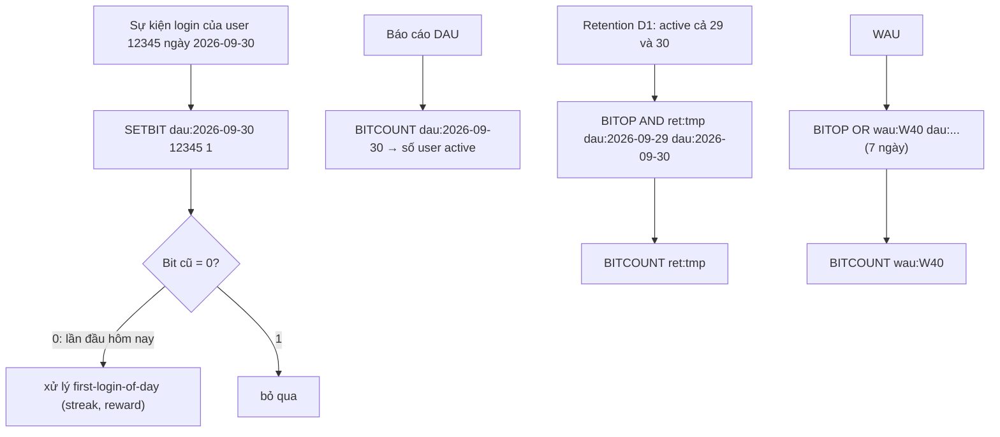

# PART 14 — BITMAP / BITFIELD

> **Trước:** [13 — Sorted Set](13-sorted-set.md) · **Tiếp:** [15 — HyperLogLog](15-hyperloglog.md)
> **Độ ưu tiên:** Trung bình. Bitmap là công cụ tiết kiệm memory mạnh nhất cho dữ liệu boolean trên tập ID dày đặc — nhưng cũng là cái bẫy memory lớn nhất khi ID thưa.

---

## Mục lục

1. [Simple mental model](#1-simple-mental-model)
2. [WHAT — Bitmap và Bitfield](#2-what--bitmap-và-bitfield)
3. [WHY — Tại sao cần thao tác bit trên server](#3-why--tại-sao-cần-thao-tác-bit)
4. [HOW & INTERNALS 1 — Bitmap là String](#4-how--internals-1--bitmap-là-string)
5. [INTERNALS 2 — SETBIT, GETBIT, mở rộng chuỗi](#5-internals-2--setbit-getbit-mở-rộng-chuỗi)
6. [INTERNALS 3 — BITCOUNT, BITPOS, BITOP](#6-internals-3--bitcount-bitpos-bitop)
7. [INTERNALS 4 — BITFIELD](#7-internals-4--bitfield)
8. [DATA FLOW — Đếm DAU và retention](#8-data-flow--đếm-dau-và-retention)
9. [EXAMPLE — Use cases](#9-example--use-cases)
10. [Cardinality counting: Bitmap vs Set vs HyperLogLog](#10-cardinality-counting-bitmap-vs-set-vs-hyperloglog)
11. [WHAT HAPPENS IF](#11-what-happens-if)
12. [PERFORMANCE IMPACT & Memory efficiency](#12-performance-impact--memory-efficiency)
13. [PRODUCTION BEHAVIOR](#13-production-behavior)
14. [TRADE-OFF](#14-trade-off)
15. [WHEN TO USE / WHEN NOT TO USE](#15-when-to-use--when-not-to-use)
16. [COMMON MISUNDERSTANDINGS](#16-common-misunderstandings)
17. [INTERVIEW QUESTIONS](#17-interview-questions)
18. [KEY TAKEAWAYS](#18-key-takeaways)

---

## 1. Simple mental model

Bitmap là **một dãy bóng đèn đánh số 0, 1, 2, ...**. Mỗi user có một bóng tại vị trí = user ID. User hoạt động hôm nay → bật bóng. Muốn biết bao nhiêu người hoạt động → đếm số bóng sáng. Muốn biết ai hoạt động cả hôm qua và hôm nay → chồng hai dãy đèn lên nhau (AND).

Một triệu bóng đèn chỉ tốn **125 KB**. Nhưng nếu có một user ID là 4 tỷ, dãy đèn phải dài 4 tỷ bóng = **512 MB** dù chỉ có một bóng sáng.

---

## 2. WHAT — Bitmap và Bitfield

- **Bitmap** không phải type riêng: là tập lệnh thao tác **từng bit** trên value kiểu **String**. `TYPE` trả `string`.
- **Bitfield** (3.2+): thao tác **số nguyên có độ rộng tùy ý** (1–64 bit có dấu, 1–63 bit không dấu) tại offset bất kỳ trong String — "mảng số nguyên nén".
- Lệnh: `SETBIT`, `GETBIT`, `BITCOUNT`, `BITPOS`, `BITOP` (AND/OR/XOR/NOT; 8.2 thêm DIFF, DIFF1, ANDOR, ONE), `BITFIELD`, `BITFIELD_RO` (6.0).

---

## 3. WHY — Tại sao cần thao tác bit

- **Mật độ thông tin tối đa**: 1 bit/đối tượng. Set lưu user ID tốn ~50–70 byte/user (hashtable) → bitmap nhỏ hơn ~400–500 lần với ID dày đặc.
- **Phép toán tập hợp cực nhanh**: AND/OR trên bitmap là phép toán word-level (64 bit mỗi lệnh CPU, hoặc 256/512 bit với SIMD) → giao/hợp hàng trăm triệu phần tử trong vài chục ms.
- **Atomic**: SETBIT trả giá trị cũ → "lần đầu hôm nay?" trong một lệnh.

---

## 4. HOW & INTERNALS 1 — Bitmap là String

- Value là SDS (encoding `raw`); bit được đánh số từ **bit cao nhất của byte 0**:

```text
byte:     0                 1
bit:   7 6 5 4 3 2 1 0   7 6 5 4 3 2 1 0     (bit trong byte)
offset:0 1 2 3 4 5 6 7   8 9 ...             (offset Redis)
SETBIT k 0 1  → byte0 = 1000 0000 = 0x80
SETBIT k 9 1  → byte1 = 0100 0000 = 0x40
```

- Offset tối đa: 2^32 − 1 (chuỗi tối đa 512 MB).
- Vì là String: có thể `GET` toàn bộ bitmap để xử lý phía client, `SET` để nạp, `APPEND`... và nó chịu mọi đặc tính của String (TTL cả key, replication, persistence).

---

## 5. INTERNALS 2 — SETBIT, GETBIT, mở rộng chuỗi

`SETBIT key offset value`:
1. `byte = offset >> 3`, `bit = 7 − (offset & 7)`.
2. Nếu chuỗi ngắn hơn `byte + 1` → **mở rộng** chuỗi, điền 0 (`sdsgrowzero`). Chi phí O(độ mở rộng).
3. Đọc bit cũ, ghi bit mới, trả bit cũ.
4. Complexity: **O(1)** khi không mở rộng.

`GETBIT`: offset vượt độ dài → trả 0 (không mở rộng).

**Cái bẫy**: `SETBIT newkey 4000000000 1` trên key chưa tồn tại → cấp phát **~500 MB** và zero-fill **trên main thread** → chặn server (hàng trăm ms đến giây), có thể OOM, replica và AOF cũng nhận lệnh này và làm lại. Redis docs cảnh báo điều này.

---

## 6. INTERNALS 3 — BITCOUNT, BITPOS, BITOP

### 6.1 BITCOUNT key [start end [BYTE|BIT]]

- Đếm số bit 1 → O(N) theo số byte xét.
- Implementation: xử lý theo word 64-bit với popcount (bảng tra/`__builtin_popcount`, và tối ưu SIMD AVX2/AVX512/NEON trong Redis 8.4) → hàng GB/giây. Bitmap 12.5 MB (100 triệu user) ≈ vài ms.
- `BIT` option (7.0) cho range theo bit thay vì byte.

### 6.2 BITPOS key bit [start end]

Tìm vị trí bit 0/1 đầu tiên — dùng để cấp phát ID trống (tìm slot free), tìm user đầu tiên... O(N).

### 6.3 BITOP op destkey key1 key2 ...

- AND, OR, XOR, NOT (và từ 8.2: `DIFF` — bit có ở key đầu nhưng không có ở các key khác, `DIFF1`, `ANDOR`, `ONE` — phục vụ các phép toán cohort phức tạp trong một lệnh).
- Kết quả dài bằng chuỗi dài nhất (chuỗi ngắn hơn coi như đệm 0).
- O(N) theo độ dài chuỗi; xử lý theo word 64-bit.
- Lệnh ghi → propagate nguyên văn → replica tính lại.

---

## 7. INTERNALS 4 — BITFIELD

```
BITFIELD key [GET type offset] [SET type offset value] [INCRBY type offset increment] [OVERFLOW WRAP|SAT|FAIL]
type: i<bits> (có dấu, 1–64) | u<bits> (không dấu, 1–63)
offset: số bit, hoặc #N nghĩa là N × độ rộng type
```

Ví dụ: 1 triệu counter 8-bit không dấu (mỗi counter đếm tới 255):
```
BITFIELD counters INCRBY u8 #123456 1     # tăng counter thứ 123456
BITFIELD counters GET u8 #123456
```
Tổng: 1 MB. Dùng Hash 1 triệu field hoặc 1 triệu String key tốn ~80–100 MB.

`OVERFLOW`:
- `WRAP` (mặc định): tràn thì quay vòng (modulo).
- `SAT`: bão hòa ở max/min.
- `FAIL`: không thực hiện, trả nil.

Nhiều thao tác trong một BITFIELD là **atomic** và một round-trip. `BITFIELD_RO` (6.0) chỉ GET, chạy được trên replica read-only.

---

## 8. DATA FLOW — Đếm DAU và retention



**Cách đọc diagram:** Mỗi ngày một bitmap; ghi O(1) mỗi sự kiện; báo cáo dùng BITCOUNT (O(N) nhưng N chỉ là kích thước bitmap ~MB). Retention/cohort bằng BITOP. Tất cả trên dữ liệu vài chục MB thay vì hàng GB nếu dùng Set.

---

## 9. EXAMPLE — Use cases

| Use case | Thiết kế |
|---|---|
| Daily/Monthly active users | Bitmap mỗi ngày, bit = user ID (dense) |
| Check-in/streak theo năm cho mỗi user | `SETBIT checkin:{user}:2026 {day_of_year} 1` → 46 byte/user/năm; `BITCOUNT` số ngày; `BITPOS` tìm ngày đầu vắng |
| Feature flag cho từng user | `SETBIT feature:new_ui {user_id} 1` |
| Online status | `SETBIT online {user_id} 1/0` |
| Bloom filter tự làm | k hàm hash → k SETBIT/GETBIT (Redis 8 có `BF.*` tích hợp, nên dùng) |
| Seat reservation | bit = ghế; BITPOS tìm ghế trống |
| Counter nén | BITFIELD u4/u8 |

---

## 10. Cardinality counting: Bitmap vs Set vs HyperLogLog

Đếm unique user/ngày, 100 triệu user tổng, 10 triệu active/ngày:

| Cấu trúc | Memory/ngày | Chính xác | Membership | Giao/hợp |
|---|---|---|---|---|
| Set (hashtable) | ~600 MB+ | Chính xác | Có | Có (O(N), chậm) |
| **Bitmap** (ID dense 0..100M) | **12.5 MB** (cố định theo ID max) | Chính xác | Có | Có (BITOP, rất nhanh) |
| **HyperLogLog** | **12 KB** | ±0.81% | Không | Chỉ union (PFMERGE) |

- Bitmap thắng khi ID **dày đặc** và cần chính xác/membership/giao.
- HLL thắng khi ID thưa/là chuỗi, chỉ cần đếm xấp xỉ.
- Khi active rất ít so với tổng ID (1.000 active trên 100 triệu) → bitmap vẫn 12.5 MB → Set hoặc HLL rẻ hơn. (Roaring bitmap giải quyết vấn đề thưa, nhưng không có trong core Redis.)

---

## 11. WHAT HAPPENS IF

### 11.1 User ID là số lớn thưa (snowflake 64-bit, hoặc ID bắt đầu từ 10^9)

SETBIT offset 1.000.000.000 → bitmap 125 MB ngay cả với vài user. Offset > 2^32 → lỗi. Giải pháp: ánh xạ ID sang dãy dense (một Hash/sequence ID → index), hoặc chia bitmap thành nhiều key theo khoảng ID (`dau:{date}:{id >> 20}`) để mỗi key chỉ cấp phát vùng có dữ liệu.

### 11.2 BITOP trên bitmap 512 MB

Chặn server hàng trăm ms, và mọi replica tính lại. Chạy trên instance/replica dành cho analytics, hoặc chia nhỏ theo khoảng.

### 11.3 GET toàn bộ bitmap lớn thường xuyên

Big key trên network. Dùng BITCOUNT/GETRANGE theo đoạn.

---

## 12. PERFORMANCE IMPACT & Memory efficiency

- SETBIT/GETBIT: O(1), rất nhanh.
- BITCOUNT/BITOP: O(N byte), throughput hàng GB/s → bitmap vài MB mất vài ms (vẫn là "lệnh chậm" nếu gọi thường xuyên trong hot path).
- Memory = max_offset/8 byte, **không phụ thuộc số bit bật**.
- Bitmap lớn dạng String → một allocation lớn; mở rộng dần gây realloc (SDS preallocation +1 MB mỗi lần với chuỗi > 1 MB).

---

## 13. PRODUCTION BEHAVIOR

- Pattern DAU bằng bitmap rất phổ biến và ổn định khi ID dense.
- Cảnh báo khi thấy `SETBIT` với offset lớn trong SLOWLOG/`commandstats` — dấu hiệu ID thưa.
- Bitmap nằm trên một key → một node trong Cluster; bitmap theo ngày tự phân tán theo key khác nhau.

---

## 14. TRADE-OFF

| Được | Mất |
|---|---|
| 1 bit/đối tượng, chính xác | Memory theo ID lớn nhất, không theo số phần tử |
| AND/OR/XOR cực nhanh | O(N) theo kích thước; replica tính lại BITOP |
| BITFIELD nén counter | Giới hạn độ rộng, xử lý overflow thủ công |
| Là String: tương thích mọi tính năng String | Không có TTL theo bit; big key nếu ID lớn |

---

## 15. WHEN TO USE / WHEN NOT TO USE

**Dùng khi:** boolean trên tập ID số nguyên dày đặc; cohort analysis; counter nhỏ số lượng rất lớn (BITFIELD); check-in theo ngày.

**Không dùng khi:** ID thưa/chuỗi; chỉ cần đếm xấp xỉ (HLL); cần liệt kê phần tử thường xuyên (BITPOS lặp là O(N) mỗi lần).

---

## 16. COMMON MISUNDERSTANDINGS

| Hiểu sai | Thực tế |
|---|---|
| "Bitmap là data type riêng" | Là String |
| "Bitmap memory tỷ lệ số bit bật" | Tỷ lệ offset lớn nhất |
| "SETBIT luôn O(1)" | O(1) nếu không mở rộng; mở rộng lớn là O(N) và chặn |
| "BITCOUNT O(1)" | O(N) theo byte |

---

## 17. INTERVIEW QUESTIONS

1. **Bitmap trong Redis được lưu thế nào?** → String/SDS, bit 0 là bit cao của byte 0, tối đa 2^32 bit.
2. **Đếm DAU 100 triệu user thế nào cho rẻ?** → Bitmap/ngày (12.5 MB) nếu ID dense; HLL (12 KB) nếu xấp xỉ.
3. **Nguy hiểm của SETBIT?** → Offset lớn cấp phát + zero-fill trên main thread; ID thưa lãng phí.
4. **BITFIELD dùng làm gì?** → Mảng số nguyên độ rộng tùy ý, nén counter, atomic nhiều thao tác.
5. **(Senior) Retention D7 cho 50 triệu user mỗi ngày?** → Bitmap/ngày, BITOP AND giữa ngày cohort và ngày D7, chạy trên replica/instance analytics, TTL cho bitmap cũ.

---

## 18. KEY TAKEAWAYS

- Bitmap = **thao tác bit trên String**, 1 bit/đối tượng, memory theo **offset lớn nhất**.
- SETBIT/GETBIT O(1); BITCOUNT/BITOP O(N) nhưng rất nhanh (word/SIMD); BITOP 8.2 thêm DIFF/ANDOR/ONE.
- BITFIELD: mảng số nguyên nén với overflow control.
- Tuyệt vời cho ID dày đặc; thảm họa với ID thưa → ánh xạ ID hoặc dùng HLL/Set.
