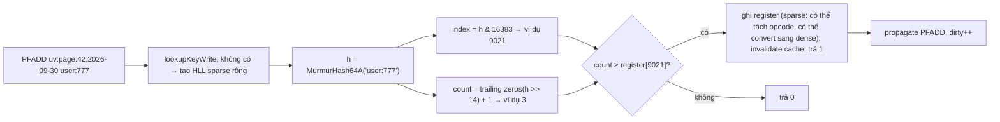

# PART 15 — HYPERLOGLOG

> **Trước:** [14 — Bitmap / Bitfield](14-bitmap-bitfield.md) · **Tiếp:** [16 — GEO](16-geo.md)
> **Độ ưu tiên:** Trung bình. HyperLogLog là ví dụ kinh điển về đánh đổi **độ chính xác lấy memory**: đếm hàng tỷ phần tử unique bằng 12 KB với sai số ~0.81%.

---

## Mục lục

1. [Simple mental model](#1-simple-mental-model)
2. [WHAT — Cardinality estimation](#2-what--cardinality-estimation)
3. [WHY — Tại sao đếm unique chính xác lại đắt](#3-why--tại-sao-đếm-unique-chính-xác-lại-đắt)
4. [HOW — Thuật toán xác suất: từ tung đồng xu tới HyperLogLog](#4-how--thuật-toán-xác-suất)
5. [INTERNALS 1 — Biểu diễn trong Redis: header, dense, sparse](#5-internals-1--biểu-diễn-trong-redis)
6. [INTERNALS 2 — PFADD, PFCOUNT, PFMERGE](#6-internals-2--pfadd-pfcount-pfmerge)
7. [Error rate](#7-error-rate)
8. [DATA FLOW — PFADD một phần tử](#8-data-flow--pfadd-một-phần-tử)
9. [EXAMPLE](#9-example)
10. [WHAT HAPPENS IF](#10-what-happens-if)
11. [PERFORMANCE IMPACT & Memory efficiency](#11-performance-impact--memory-efficiency)
12. [PRODUCTION BEHAVIOR](#12-production-behavior)
13. [TRADE-OFF](#13-trade-off)
14. [WHEN TO USE / WHEN NOT TO USE](#14-when-to-use--when-not-to-use)
15. [COMMON MISUNDERSTANDINGS](#15-common-misunderstandings)
16. [INTERVIEW QUESTIONS](#16-interview-questions)
17. [KEY TAKEAWAYS](#17-key-takeaways)

---

## 1. Simple mental model

Bạn đứng ở cổng sân vận động và muốn ước lượng **có bao nhiêu người khác nhau** đã đi qua, nhưng không được ghi tên ai. Bạn chỉ nhớ **một con số**: "chuỗi dài nhất các lần tung đồng xu ra ngửa liên tiếp mà một người từng tung được" (mỗi người tung theo một cách tất định dựa trên tên họ — cùng người luôn ra cùng kết quả).

- Nếu thấy ai đó tung được 10 lần ngửa liên tiếp — xác suất 1/1024 — thì có lẽ đã có khoảng **1.000 người** đi qua.
- Một người quan sát thì quá may rủi. Nên bạn thuê **16.384 người quan sát**, chia khách theo chữ cái đầu tên hash, mỗi người nhớ con số của nhóm mình, rồi lấy **trung bình điều hòa** → ước lượng rất ổn định.
- Mỗi người quan sát chỉ nhớ một số nhỏ (≤ 63) → 6 bit. 16.384 × 6 bit = **12 KB**, bất kể có 1 nghìn hay 1 tỷ người.

---

## 2. WHAT — Cardinality estimation

- **Cardinality** = số phần tử **khác nhau** trong một multiset.
- **HyperLogLog (HLL)** (Flajolet et al., 2007) là thuật toán **xác suất** ước lượng cardinality với memory cố định rất nhỏ và sai số chuẩn có thể tính trước.
- Redis HLL (2.8.9+): `PFADD`, `PFCOUNT`, `PFMERGE` (tiền tố PF để vinh danh Philippe Flajolet). Mỗi HLL tối đa **12 KB**, sai số chuẩn **0.81%**.
- Là một **String** với định dạng nội bộ (bắt đầu bằng magic `HYLL`).

---

## 3. WHY — Tại sao đếm unique chính xác lại đắt

Đếm chính xác cần **nhớ mọi phần tử đã thấy** (để biết phần tử mới có trùng không):
- Set: O(N) memory, ~50–70 B/phần tử → 1 tỷ phần tử ≈ 60 GB.
- Bitmap: O(max_id) bit, chỉ với ID số dày đặc.
- Sort + unique: O(N) memory và O(N log N) thời gian, không streaming.

Không có cách đếm chính xác với memory nhỏ hơn O(N) trong trường hợp tổng quát. Nếu chấp nhận **sai số nhỏ**, thuật toán xác suất giảm memory xuống **O(log log N)** mỗi register — đó là nguồn gốc tên "LogLog".

---

## 4. HOW — Thuật toán xác suất

### 4.1 Quan sát cơ bản

Hash mỗi phần tử thành một chuỗi bit ngẫu nhiên đều. Với chuỗi bit ngẫu nhiên:
- P(bắt đầu bằng ≥ 1 số 0) = 1/2
- P(bắt đầu bằng ≥ k số 0) = 1/2^k

Nếu sau khi xem nhiều phần tử, **chuỗi số 0 dài nhất quan sát được** là k, thì số phần tử khác nhau khoảng **2^k**. Phần tử trùng lặp cho cùng hash → không ảnh hưởng → **đếm unique tự nhiên**.

### 4.2 Vấn đề phương sai và stochastic averaging

Một ước lượng đơn lẻ dao động cực lớn (một phần tử "may mắn" làm ước lượng gấp đôi). Giải pháp: **chia thành m bucket (register)**:
- Dùng p bit đầu của hash làm **index register** (m = 2^p).
- Phần còn lại của hash dùng để đếm độ dài chuỗi số 0 (+1).
- Mỗi register giữ **max** giá trị thấy được.

### 4.3 Ước lượng bằng trung bình điều hòa

```text
E = α_m · m² / Σ_{j=1..m} 2^(−M[j])
```
- M[j] là giá trị register j.
- **Trung bình điều hòa** (harmonic mean) ít nhạy với outlier lớn hơn trung bình cộng — đây là cải tiến của HyperLogLog so với LogLog.
- α_m là hằng số hiệu chỉnh.
- Với cardinality nhỏ (nhiều register còn 0), dùng **linear counting**: E ≈ m · ln(m / số_register_bằng_0).

Redis hiện dùng **thuật toán ước lượng cải tiến của Otmar Ertl** (2017) thay cho hiệu chỉnh bias bằng bảng thực nghiệm — chính xác hơn ở mọi dải cardinality mà không cần bảng tra.

### 4.4 Tham số của Redis

- Hash: **MurmurHash64A** 64 bit.
- p = **14** → m = 2^14 = **16.384 register**.
- 50 bit còn lại để đếm → giá trị register tối đa ≤ 51, vừa trong **6 bit** (0–63).
- Dense size: 16.384 × 6 bit = **12.288 byte**.

---

## 5. INTERNALS 1 — Biểu diễn trong Redis

### 5.1 Header (16 byte)

```text
+------+-----+---------+---------------------------+
| HYLL | enc | unused  | cached cardinality (8 B)  |
|  4B  | 1B  |   3B    | little-endian, MSB = cờ   |
|      |     |         | "cache không hợp lệ"      |
+------+-----+---------+---------------------------+
```
- `enc`: `HLL_DENSE` hoặc `HLL_SPARSE`.
- **Cached cardinality**: PFCOUNT tính xong lưu vào đây; PFADD làm thay đổi register thì đặt cờ invalid. PFCOUNT lặp lại trên HLL không đổi → O(1).

### 5.2 Dense

16.384 register × 6 bit đóng gói liên tục (register có thể nằm vắt qua hai byte). Tổng 12.304 byte.

### 5.3 Sparse

HLL mới tạo hầu như toàn register = 0 → lãng phí 12 KB cho vài phần tử. Sparse dùng **run-length encoding** với ba opcode:

| Opcode | Bit | Ý nghĩa | Kích thước |
|---|---|---|---|
| `ZERO` | `00xxxxxx` | 1–64 register liên tiếp = 0 | 1 byte |
| `XZERO` | `01xxxxxx yyyyyyyy` | 1–16.384 register liên tiếp = 0 | 2 byte |
| `VAL` | `1vvvvvxx` | 1–4 register liên tiếp có cùng giá trị 1–32 | 1 byte |

Một HLL rỗng = một `XZERO` 16384 → **2 byte** + header. HLL với vài trăm phần tử chỉ vài trăm byte.

Chuyển sang dense khi:
- kích thước sparse vượt `hll-sparse-max-bytes` (mặc định **3000**; tăng giá trị → tiết kiệm RAM hơn nhưng PFADD chậm hơn vì sparse phải tìm và chèn O(N)), hoặc
- một register cần giá trị > 32 (VAL chỉ biểu diễn tới 32).

Chuyển một chiều (dense không quay về sparse).

---

## 6. INTERNALS 2 — PFADD, PFCOUNT, PFMERGE

### 6.1 PFADD key e1 e2 ...

Với mỗi phần tử:
1. `hash = MurmurHash64A(e)`.
2. `index = hash & 16383` (14 bit thấp).
3. `count` = số bit 0 liên tiếp (từ phía thấp) của 50 bit còn lại + 1.
4. Nếu `count > M[index]` → cập nhật, đánh dấu cache invalid, trả 1 ("ước lượng có thể đã thay đổi").
→ **O(1)** mỗi phần tử (sparse: O(kích thước sparse) để tìm và chèn).

### 6.2 PFCOUNT key

- Cache hợp lệ → trả ngay.
- Không → tính histogram giá trị register, áp dụng công thức ước lượng → O(m) = 16.384 bước (vài chục µs), ghi cache.

### 6.3 PFCOUNT key1 key2 ... (nhiều key)

Merge các HLL **tạm thời** (max từng register) vào một mảng register rồi ước lượng → **union cardinality**. O(số key × 16.384), **không có cache** → chậm hơn đáng kể; gọi thường xuyên trên nhiều key là lệnh đắt.

### 6.4 PFMERGE dest k1 k2 ...

`dest[j] = max(k1[j], k2[j], ...)` → HLL của **hợp** các tập. Kết quả tương đương như thể mọi phần tử được PFADD vào một HLL. Dùng để tổng hợp theo thời gian: HLL giờ → ngày → tuần → tháng.

### 6.5 Intersection?

Không có trực tiếp. Có thể ước lượng bằng inclusion–exclusion: |A ∩ B| = |A| + |B| − |A ∪ B|. Nhưng sai số tuyệt đối của mỗi thành phần (~0.81% của tập lớn) có thể **lớn hơn chính giao** → kết quả vô nghĩa khi giao nhỏ so với các tập.

---

## 7. Error rate

- Sai số chuẩn (standard error) = **1.04 / √m** = 1.04 / 128 ≈ **0.81%**.
- Nghĩa là: khoảng 68% số lần ước lượng nằm trong ±0.81%, 95% trong ±1.62%, 99.7% trong ±2.43% so với giá trị thật.
- Với cardinality nhỏ (vài trăm, vài nghìn), sparse + linear counting cho kết quả gần như chính xác.
- Sai số **tương đối**: đếm 1 tỷ → sai lệch điển hình ~8 triệu. Chấp nhận được cho analytics, không chấp nhận cho billing.

Muốn chính xác hơn phải tăng m (Redis cố định m = 16384; không cấu hình).

---

## 8. DATA FLOW — PFADD một phần tử



**Cách đọc diagram:** Mỗi PFADD chỉ chạm **một register** — O(1), không cấp phát thêm với dense. User 777 thêm lần nữa cho cùng hash → cùng register, cùng count → không đổi → HLL tự nhiên bỏ qua trùng lặp.

---

## 9. EXAMPLE

| Nhu cầu | Thiết kế |
|---|---|
| Unique visitors mỗi trang mỗi ngày | `PFADD uv:{page}:{date} {visitor_id}`, `PFCOUNT` |
| Unique visitors tuần | `PFMERGE uv:{page}:W40 uv:{page}:{7 ngày}` hoặc `PFCOUNT` nhiều key |
| Unique search queries/giờ | `PFADD q:{hour} {normalized_query}` |
| Distinct IP gọi API | `PFADD ips:{api}:{date} {ip}` |
| A/B test unique users mỗi variant | HLL mỗi variant |

Memory: 1 triệu trang × 1 HLL/ngày ≈ tối đa 12 GB/ngày nếu mọi HLL dense — nhưng phần lớn trang ít traffic nằm ở sparse (vài trăm byte) → thực tế nhỏ hơn nhiều.

---

## 10. WHAT HAPPENS IF

### 10.1 Cần đếm chính xác (billing, quota)

HLL sai ±0.81% → không dùng. Dùng Set (nhỏ) hoặc bitmap (ID dense) hoặc database.

### 10.2 Cần biết "user X đã được đếm chưa?"

HLL không trả lời được membership. Dùng Set/Bitmap/Bloom filter.

### 10.3 PFCOUNT trên 365 key mỗi request

365 × 16.384 thao tác merge → hàng chục ms mỗi lệnh. Precompute bằng PFMERGE định kỳ.

### 10.4 Client gửi dữ liệu HLL giả (SET key với nội dung HYLL hỏng)

Redis kiểm tra tính hợp lệ khi load/đọc; trong quá khứ có CVE liên quan xử lý HLL sparse bị làm hỏng (ví dụ CVE-2025-32023 được sửa trong 8.2) → hạn chế quyền SET lên key HLL từ client không tin cậy, cập nhật version.

---

## 11. PERFORMANCE IMPACT & Memory efficiency

| Thao tác | Complexity |
|---|---|
| PFADD | O(1) mỗi phần tử (sparse: O(kích thước sparse ≤ 3000 B)) |
| PFCOUNT 1 key | O(1) nếu cache, O(m) nếu không |
| PFCOUNT N key | O(N × m) |
| PFMERGE N key | O(N × m) |

| Cardinality | Set (hashtable) | HLL |
|---|---|---|
| 1.000 | ~60 KB | ~vài trăm byte (sparse) |
| 1 triệu | ~60 MB | 12 KB |
| 1 tỷ | ~60 GB | 12 KB |

---

## 12. PRODUCTION BEHAVIOR

- HLL là String → có thể `GET` để sao lưu/chuyển giữa hệ thống, `SET` để khôi phục, `EXPIRE` theo ngày.
- Cluster: HLL theo ngày/trang tự phân tán theo key. `PFCOUNT`/`PFMERGE` nhiều key cần cùng slot → dùng hash tag `uv:{page42}:2026-09-30`.
- Kết hợp phổ biến: HLL cho số liệu dashboard real-time; hệ thống batch tính chính xác cuối ngày để đối soát.

---

## 13. TRADE-OFF

| Được | Mất |
|---|---|
| 12 KB cố định cho bất kỳ cardinality | Sai số ±0.81% |
| PFADD O(1), streaming | Không membership, không liệt kê, không xóa phần tử |
| Union (PFMERGE) chính xác như HLL gốc | Intersection không đáng tin khi giao nhỏ |
| Sparse cho HLL nhỏ | Sparse → dense tăng memory đột ngột (một chiều) |

---

## 14. WHEN TO USE / WHEN NOT TO USE

**Dùng khi:** đếm unique quy mô lớn cho analytics/dashboard, chấp nhận sai số ~1%, chỉ cần union theo thời gian/nhóm.

**Không dùng khi:** cần chính xác, cần membership, cần xóa phần tử, cần intersection chính xác, cardinality nhỏ (Set đủ rẻ và chính xác).

---

## 15. COMMON MISUNDERSTANDINGS

| Hiểu sai | Thực tế |
|---|---|
| "HLL lưu phần tử" | Chỉ lưu 16.384 register |
| "HLL luôn 12 KB" | Sparse với cardinality nhỏ chỉ vài trăm byte |
| "Sai số 0.81% là tối đa" | Là sai số **chuẩn**; có thể lớn hơn (~2.4% ở 3σ) |
| "PFCOUNT luôn O(1)" | O(1) chỉ khi cache hợp lệ và một key |
| "Có thể tính giao chính xác" | Inclusion–exclusion có sai số lớn |

---

## 16. INTERVIEW QUESTIONS

1. **HyperLogLog hoạt động thế nào (không cần chứng minh)?** → Hash, p bit chọn register, đếm chuỗi 0, lưu max; ước lượng bằng trung bình điều hòa + hiệu chỉnh; nhiều register giảm phương sai.
2. **Tại sao sai số 0.81%?** → 1.04/√16384.
3. **Sparse vs dense trong Redis?** → RLE (ZERO/XZERO/VAL) cho HLL ít phần tử; convert sang dense khi > 3000 B hoặc register > 32.
4. **PFMERGE dùng làm gì? Có intersection không?** → Union bằng max register; intersection chỉ ước lượng qua inclusion–exclusion, không đáng tin.
5. **(Senior) Dashboard unique users theo trang/giờ/ngày/tháng cho 10 triệu trang?** → HLL theo giờ, PFMERGE lên ngày/tháng, TTL, hash tag cho multi-key, batch đối soát chính xác.

---

## 17. KEY TAKEAWAYS

- HLL ước lượng cardinality với **memory cố định ≤ 12 KB** và **sai số chuẩn 0.81%**.
- Redis: MurmurHash64A, **16.384 register × 6 bit**, sparse (RLE) cho HLL nhỏ, cached cardinality trong header.
- PFADD O(1); PFCOUNT O(1) khi cache; PFMERGE = union chính xác.
- Không membership, không xóa, không intersection chính xác → chỉ dùng cho đếm xấp xỉ.
