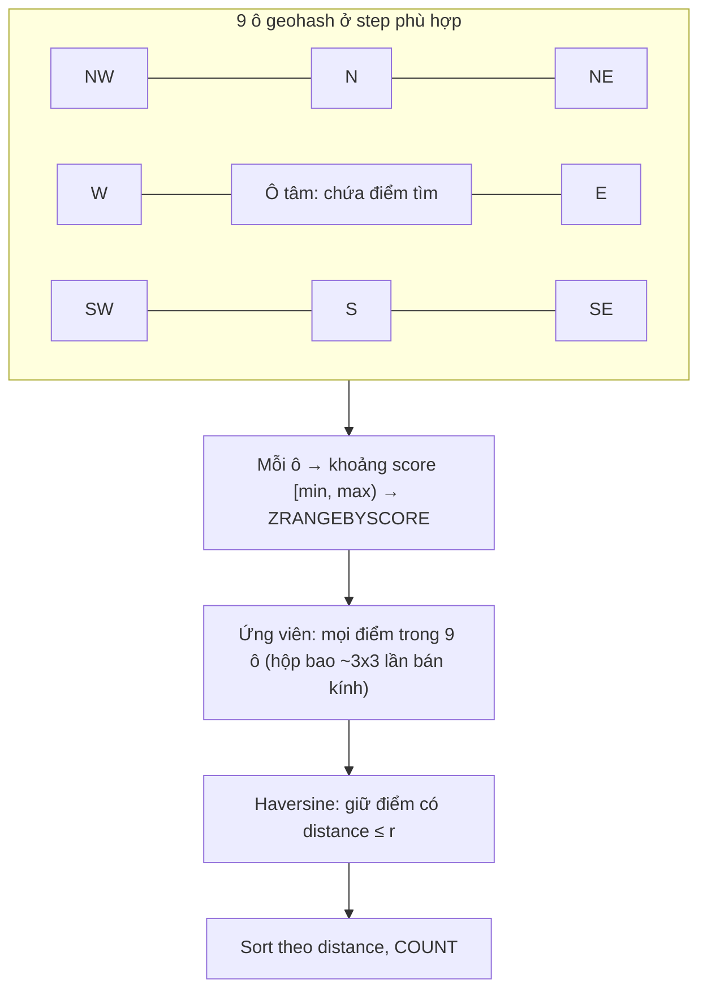
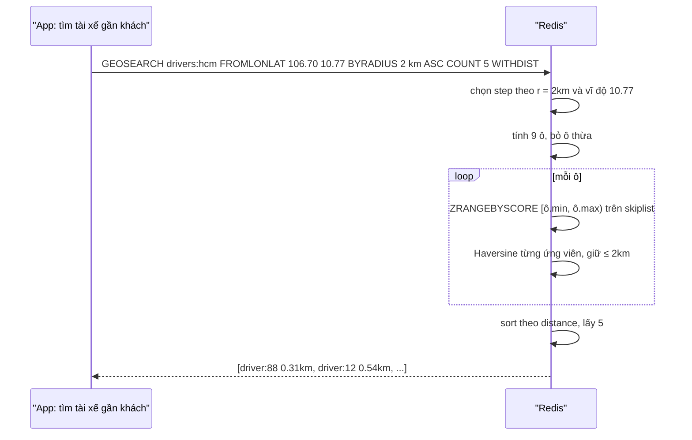

# PART 16 — GEO

> **Trước:** [15 — HyperLogLog](15-hyperloglog.md) · **Tiếp:** [17 — Streams](17-streams.md)
> **Độ ưu tiên:** Trung bình. GEO là minh họa đẹp cho việc **tái sử dụng Sorted Set**: một bài toán 2 chiều (kinh độ, vĩ độ) được biến thành bài toán 1 chiều (score) nhờ geohash.

---

## Mục lục

1. [Simple mental model](#1-simple-mental-model)
2. [WHAT — Redis GEO](#2-what--redis-geo)
3. [WHY — Geospatial indexing khó ở đâu](#3-why--geospatial-indexing-khó-ở-đâu)
4. [HOW — Geohash concept](#4-how--geohash-concept)
5. [INTERNALS 1 — Coordinate encoding 52 bit](#5-internals-1--coordinate-encoding-52-bit)
6. [INTERNALS 2 — Quan hệ với Sorted Set](#6-internals-2--quan-hệ-với-sorted-set)
7. [INTERNALS 3 — Thuật toán tìm theo bán kính / hộp](#7-internals-3--thuật-toán-tìm-theo-bán-kính)
8. [Operations & Complexity](#8-operations--complexity)
9. [DATA FLOW — GEOSEARCH](#9-data-flow--geosearch)
10. [EXAMPLE](#10-example)
11. [WHAT HAPPENS IF](#11-what-happens-if)
12. [PERFORMANCE IMPACT](#12-performance-impact)
13. [PRODUCTION BEHAVIOR](#13-production-behavior)
14. [TRADE-OFF](#14-trade-off)
15. [WHEN TO USE / WHEN NOT TO USE](#15-when-to-use--when-not-to-use)
16. [COMMON MISUNDERSTANDINGS](#16-common-misunderstandings)
17. [INTERVIEW QUESTIONS](#17-interview-questions)
18. [KEY TAKEAWAYS](#18-key-takeaways)

---

## 1. Simple mental model

Chia bản đồ thế giới thành **4 ô**, mỗi ô chia tiếp 4 ô nhỏ, rồi cứ thế 26 lần. Mỗi ô nhỏ nhất có một **mã số** sao cho **các ô gần nhau thường có mã gần nhau**. Mỗi địa điểm được lưu kèm mã ô của nó trong một bảng sắp theo mã (Sorted Set). Tìm "quán cà phê trong bán kính 1 km" = xác định ô chứa tâm và 8 ô xung quanh, lấy mọi địa điểm có mã nằm trong 9 khoảng đó, rồi đo khoảng cách thật để lọc.

---

## 2. WHAT — Redis GEO

- Lệnh (3.2+): `GEOADD`, `GEOPOS`, `GEODIST`, `GEOHASH`, `GEOSEARCH`/`GEOSEARCHSTORE` (6.2; thay thế `GEORADIUS`/`GEORADIUSBYMEMBER` — đã deprecated).
- **Không có type GEO riêng**: dữ liệu là một **Sorted Set** với score = geohash 52 bit. `TYPE` trả `zset`; mọi lệnh ZSET dùng được (ZREM để xóa, ZCARD để đếm, ZRANGE...).
- Hỗ trợ tìm theo **bán kính** (BYRADIUS) và **hình chữ nhật** (BYBOX), từ tọa độ (FROMLONLAT) hoặc từ một member (FROMMEMBER), sắp theo khoảng cách (ASC/DESC), giới hạn (COUNT, ANY).

---

## 3. WHY — Geospatial indexing khó ở đâu

Index một chiều (B-tree, skip list) trả lời tốt "x trong [a, b]". Nhưng "điểm trong bán kính r" là truy vấn **2 chiều**: index theo kinh độ rồi lọc vĩ độ vẫn phải quét một dải rất dài. Giải pháp phổ biến:
- **R-tree** (PostGIS): cây các hình chữ nhật bao — mạnh, phức tạp.
- **Quadtree / geohash / S2 / H3**: ánh xạ 2D → 1D bằng **đường cong lấp đầy không gian** (space-filling curve), giữ tương đối tính gần nhau, rồi dùng index 1D sẵn có.

Redis chọn geohash vì **tái dùng được Sorted Set** (không cần cấu trúc mới, persistence/replication/cluster có sẵn).

---

## 4. HOW — Geohash concept

Geohash (Gustavo Niemeyer, 2008) chia đôi không gian xen kẽ theo kinh độ và vĩ độ:

```text
Bước 1 (kinh độ): [-180, 180] → điểm ở nửa trái (0) hay phải (1)?
Bước 2 (vĩ độ):   [-90, 90]   → nửa dưới (0) hay trên (1)?
Bước 3 (kinh độ): chia đôi nửa đã chọn...
...
Kết quả: chuỗi bit xen kẽ lon/lat = số hiệu ô trên đường cong Z-order (Morton code)
```

Tính chất:
- Mỗi thêm 2 bit, ô nhỏ đi 4 lần.
- **Tiền tố chung dài → cùng ô lớn → gần nhau.**
- Nhưng **ngược lại không đúng**: hai điểm rất gần nhau nhưng nằm hai bên đường biên ô có thể có mã khác xa (ví dụ hai bên kinh tuyến gốc hoặc biên ô cấp cao). Đây là lý do phải tìm **cả 8 ô lân cận**.

Chuỗi geohash chuẩn (dạng text) mã hóa bit thành base32: `w3gv2...` (Hà Nội/TP.HCM bắt đầu bằng `w`).

---

## 5. INTERNALS 1 — Coordinate encoding 52 bit

- Redis dùng **26 bit cho kinh độ + 26 bit cho vĩ độ = 52 bit** xen kẽ (interleave).
- Tại sao 52? Score của Sorted Set là **double**, mantissa 53 bit → biểu diễn **chính xác** mọi số nguyên tới 2^53. 52 bit vừa khít, không mất thông tin.
- Độ phân giải 26 bit mỗi chiều: 360° / 2^26 ≈ 5.4 × 10^-6 độ ≈ **~0.6 m** ở xích đạo. Tọa độ trả về từ `GEOPOS` có thể lệch nhỏ so với tọa độ nhập (do lượng tử hóa).
- Giới hạn vĩ độ: **±85.05112878°** (giới hạn của phép chiếu Web Mercator EPSG:3857) — `GEOADD` với vĩ độ ngoài khoảng này bị từ chối. Kinh độ ±180°.
- `GEOHASH` trả chuỗi **11 ký tự** theo chuẩn geohash (Redis chuyển đổi từ biểu diễn nội bộ; do khác phạm vi vĩ độ nội bộ, chuỗi được tính lại theo chuẩn [-90, 90]).

---

## 6. INTERNALS 2 — Quan hệ với Sorted Set

```text
GEOADD stores:hcm 106.7009 10.7769 "store:1"
   ↓
geohashEncodeWGS84(lon, lat, step=26) → bits (52 bit)
   ↓
ZADD stores:hcm <bits dạng double> "store:1"
```

Hệ quả:
- Memory và hiệu năng **y hệt ZSET**: listpack nếu ≤ 128 member ngắn, skiplist + dict nếu lớn.
- Xóa: `ZREM`. Đếm: `ZCARD`. Có thể đặt TTL cho **cả key**, không cho từng điểm.
- Cập nhật vị trí (tài xế di chuyển): `GEOADD` lại cùng member → giống ZADD update score → O(log N).
- Có thể kết hợp các lệnh ZSET (ví dụ `ZRANGE` theo score để quét theo thứ tự Z-order).

---

## 7. INTERNALS 3 — Thuật toán tìm theo bán kính

`GEOSEARCH key FROMLONLAT lon lat BYRADIUS r km ASC COUNT 10`:

1. **Chọn độ chi tiết ô (step)**: `geohashEstimateStepsByRadius(r, lat)` chọn step sao cho kích thước ô **≥ bán kính** — ô đủ lớn để vùng tìm kiếm nằm trong tâm + 8 ô lân cận. Ở vĩ độ cao (ô co hẹp theo chiều kinh độ), step được điều chỉnh giảm.
2. **Tính 9 ô**: ô chứa tâm + 8 ô xung quanh (N, S, E, W, NE, NW, SE, SW) ở step đó. Loại các ô không cần thiết (ví dụ nếu vùng tìm kiếm không chạm tới ô đó).
3. **Chuyển mỗi ô thành khoảng score**: một ô ở step s có mọi điểm con với 52 bit có cùng tiền tố 2s bit → khoảng `[prefix << (52−2s), (prefix+1) << (52−2s))`.
4. **Với mỗi khoảng**: `ZRANGEBYSCORE` trên skip list → O(log N + M).
5. **Lọc chính xác**: tính khoảng cách **Haversine** (giả định Trái Đất là hình cầu bán kính 6372797.560856 m) từ tâm tới từng điểm ứng viên; giữ những điểm ≤ r (BYBOX: kiểm tra trong hộp).
6. **Sắp xếp** theo khoảng cách nếu ASC/DESC; áp COUNT (với `ANY`: dừng ngay khi đủ COUNT, không cần sắp toàn bộ).

Complexity (docs): **O(N + log M)**, N = số phần tử trong hộp bao của vùng tìm kiếm (9 ô), M = tổng số phần tử trong index.



**Cách đọc diagram:** 9 ô tạo một hộp bao lớn hơn vòng tròn tìm kiếm; ứng viên trong hộp nhiều hơn kết quả thật (các góc hộp nằm ngoài vòng tròn), nên bước lọc Haversine là bắt buộc. Nếu mật độ điểm rất cao (trung tâm thành phố, 1 triệu điểm), N có thể lớn dù bán kính nhỏ.

---

## 8. Operations & Complexity

| Lệnh | Complexity |
|---|---|
| `GEOADD` (mỗi điểm) | O(log N) |
| `GEOPOS`, `GEODIST`, `GEOHASH` | O(1) mỗi member (qua dict của ZSET) |
| `GEOSEARCH` | O(N + log M) |
| `GEOSEARCHSTORE` | Như trên + ghi kết quả vào key đích |
| `ZREM` (xóa điểm) | O(log N) |

---

## 9. DATA FLOW — GEOSEARCH



**Cách đọc diagram:** Toàn bộ tìm kiếm và lọc diễn ra trên server trong một lệnh; app chỉ nhận top 5. Với ~vài nghìn ứng viên, lệnh mất cỡ trăm µs đến vài ms.

---

## 10. EXAMPLE

| Use case | Thiết kế |
|---|---|
| Tìm cửa hàng gần | `GEOADD stores lon lat store_id`; `GEOSEARCH stores FROMLONLAT ... BYRADIUS 5 km ASC COUNT 20` |
| Tài xế gần khách (ride-hailing) | `GEOADD drivers:{city} lon lat driver_id` cập nhật mỗi 3–5 s; tài xế offline: `ZREM`; dữ liệu stale: kèm ZSET `drivers:last_seen` (score = timestamp) để dọn |
| Geofencing đơn giản | `GEOSEARCH ... FROMMEMBER user BYRADIUS 100 m` |
| Khoảng cách giữa hai điểm | `GEODIST places a b km` |

---

## 11. WHAT HAPPENS IF

### 11.1 Một key cho toàn thế giới với 50 triệu điểm

Big key trên một node; GEOSEARCH ở vùng dày đặc có N lớn. Shard theo thành phố/vùng (`drivers:{hcm}`), hoặc theo ô geohash cấp thô.

### 11.2 Cần TTL cho từng điểm

Không có (TTL chỉ cho cả key). Dùng ZSET song song lưu last-seen và dọn định kỳ `ZRANGE last_seen -inf (now−30s) BYSCORE` → ZREM ở cả hai.

### 11.3 Cần độ chính xác cao (cm), bề mặt ellipsoid, polygon phức tạp

Redis GEO: sai số tới ~0.5% do mô hình cầu và lượng tử hóa ~0.6 m; không có polygon. Dùng PostGIS, hoặc Redis Query Engine (Redis 8) có GEO/GEOSHAPE field.

### 11.4 Cập nhật vị trí 100.000 tài xế mỗi 3 giây

~33.000 GEOADD/s trên một key → hot key. Shard theo thành phố/ô, pipeline cập nhật.

---

## 12. PERFORMANCE IMPACT

- GEOADD O(log N) như ZADD; ~100 B/điểm (skiplist).
- GEOSEARCH phụ thuộc mật độ: bán kính nhỏ ở vùng thưa → rất nhanh; bán kính lớn/vùng dày → hàng nghìn ứng viên Haversine.
- `ANY` + `COUNT` giảm chi phí khi chỉ cần "vài điểm bất kỳ đủ gần".

---

## 13. PRODUCTION BEHAVIOR

- Ride-hailing/delivery dùng Redis GEO phổ biến cho "nearby" real-time, với dữ liệu đầy đủ lưu ở database.
- Phải xử lý **dữ liệu cũ** (tài xế mất kết nối không gửi offline) bằng cơ chế last-seen.
- GEOSEARCH trên replica để scale đọc (chấp nhận vị trí trễ vài ms–giây).

---

## 14. TRADE-OFF

| Được | Mất |
|---|---|
| Tái dùng ZSET: persistence, replication, cluster sẵn | Không TTL per-point; một key một node |
| O(log N) cập nhật, tìm gần nhanh | Mô hình cầu, sai số ~0.5%, lượng tử ~0.6 m |
| Đơn giản | Không polygon, không ellipsoid, không truy vấn không gian phức tạp |

---

## 15. WHEN TO USE / WHEN NOT TO USE

**Dùng khi:** "nearby" real-time, cập nhật vị trí liên tục, độ chính xác cỡ mét đủ dùng.

**Không dùng khi:** GIS chuyên nghiệp (polygon, route, ellipsoid), phân tích không gian phức tạp, dữ liệu không gian lớn cần nhiều index → PostGIS/Elasticsearch/Redis Query Engine.

---

## 16. COMMON MISUNDERSTANDINGS

| Hiểu sai | Thực tế |
|---|---|
| "GEO là data type riêng" | Là Sorted Set với score = geohash 52 bit |
| "Tọa độ lưu chính xác như nhập" | Lượng tử hóa 26 bit/chiều (~0.6 m) |
| "Tìm theo bán kính chỉ quét ô chứa tâm" | Quét tâm + 8 ô lân cận rồi lọc Haversine |
| "Có thể EXPIRE một điểm" | Chỉ EXPIRE cả key |

---

## 17. INTERVIEW QUESTIONS

1. **Redis GEO lưu dữ liệu thế nào?** → ZSET, score = interleave 26 bit lon + 26 bit lat = 52 bit, vừa mantissa double.
2. **Geohash là gì, tại sao cần 8 ô lân cận?** → Z-order 2D → 1D; điểm gần nhau có thể khác tiền tố khi ở hai bên biên ô.
3. **Complexity GEOSEARCH?** → O(N + log M).
4. **(Senior) Thiết kế "tìm tài xế gần nhất" cho 1 triệu tài xế, cập nhật mỗi 3 s?** → Shard theo thành phố/ô, pipeline GEOADD, last-seen ZSET dọn stale, đọc từ replica, fallback bán kính tăng dần.

---

## 18. KEY TAKEAWAYS

- GEO = **Sorted Set + geohash 52 bit** (26 + 26, vừa khít double).
- Tìm kiếm: chọn step theo bán kính → 9 ô → khoảng score → ZRANGEBYSCORE → lọc Haversine → sort.
- Complexity O(N + log M); hiệu năng phụ thuộc mật độ điểm.
- Giới hạn: mô hình cầu, vĩ độ ±85.05°, không TTL per-point, không polygon.
