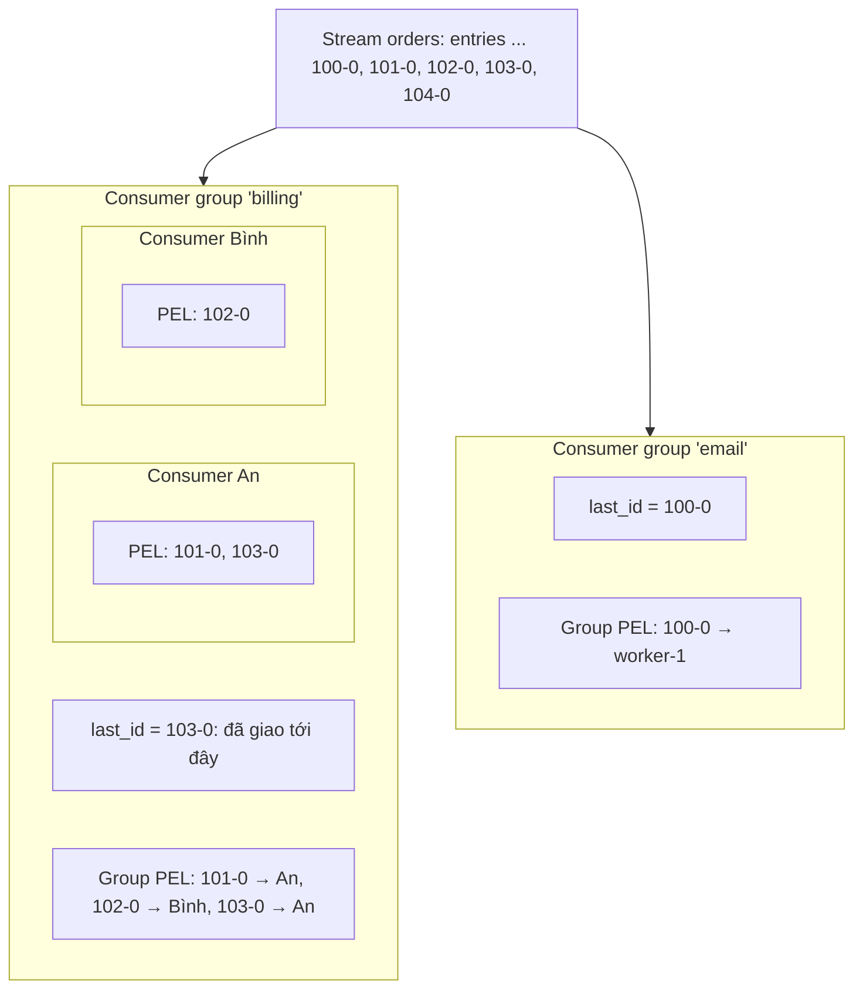
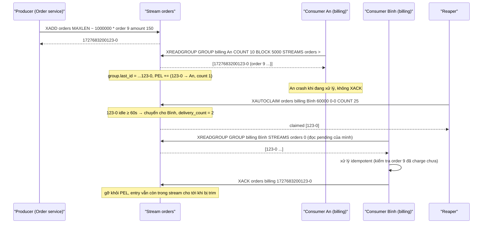

# PART 17 — STREAMS

> **Trước:** [16 — GEO](16-geo.md) · **Tiếp:** [18 — Pub/Sub](18-pubsub.md)
> **Độ ưu tiên:** Rất cao. Streams (Redis 5.0) là cấu trúc phức tạp nhất của Redis: một **append-only log** với **consumer group**, **Pending Entries List**, ack, redelivery, trimming. Nó là câu trả lời của Redis cho bài toán message queue bền vững — và hiểu giới hạn của nó là chìa khóa để chọn giữa Redis Streams và Kafka.

---

## Mục lục

1. [Simple mental model](#1-simple-mental-model)
2. [WHAT — Redis Stream](#2-what--redis-stream)
3. [WHY — Tại sao cần Streams khi đã có List và Pub/Sub](#3-why--tại-sao-cần-streams)
4. [HOW — Stream entry và ID](#4-how--stream-entry-và-id)
5. [INTERNALS 1 — Radix tree của listpack](#5-internals-1--radix-tree-của-listpack)
6. [INTERNALS 2 — Bố cục listpack node: master entry, delta ID, SAMEFIELDS](#6-internals-2--bố-cục-listpack-node)
7. [INTERNALS 3 — Sinh ID và tính đơn điệu](#7-internals-3--sinh-id-và-tính-đơn-điệu)
8. [INTERNALS 4 — Consumer group, consumer, PEL](#8-internals-4--consumer-group-consumer-pel)
9. [INTERNALS 5 — Delivery: XREADGROUP `>` và đọc lại lịch sử](#9-internals-5--delivery)
10. [INTERNALS 6 — ACK, XPENDING, XCLAIM, XAUTOCLAIM, dead letter](#10-internals-6--ack-xpending-xclaim-xautoclaim)
11. [INTERNALS 7 — Trimming và deletion](#11-internals-7--trimming-và-deletion)
12. [INTERNALS 8 — Blocking read, replication, persistence](#12-internals-8--blocking-read-replication-persistence)
13. [Commands & complexity: XADD, XREAD, XREADGROUP, XACK, XPENDING, XCLAIM](#13-commands--complexity)
14. [DATA FLOW — Vòng đời một message qua consumer group](#14-data-flow--vòng-đời-một-message)
15. [EXAMPLE — Order processing pipeline](#15-example--order-processing-pipeline)
16. [WHAT HAPPENS IF](#16-what-happens-if)
17. [PERFORMANCE IMPACT](#17-performance-impact)
18. [PRODUCTION BEHAVIOR](#18-production-behavior)
19. [Streams vs Pub/Sub vs List vs Kafka](#19-streams-vs-pubsub-vs-list-vs-kafka)
20. [TRADE-OFF](#20-trade-off)
21. [WHEN TO USE / WHEN NOT TO USE](#21-when-to-use--when-not-to-use)
22. [COMMON MISUNDERSTANDINGS](#22-common-misunderstandings)
23. [INTERVIEW QUESTIONS](#23-interview-questions)
24. [KEY TAKEAWAYS](#24-key-takeaways)

---

## 1. Simple mental model

Stream là **một cuốn sổ nhật ký chỉ được viết thêm vào cuối**, mỗi dòng có **số hiệu tăng dần** (thời điểm + số thứ tự).

- Ai cũng có thể **đọc từ bất kỳ dòng nào** trở đi (XREAD) mà không làm mất dòng đó — khác queue (đọc là lấy mất).
- Một **nhóm nhân viên** (consumer group) cùng xử lý sổ: mỗi dòng mới được giao cho **đúng một** nhân viên trong nhóm. Quản lý nhóm ghi vào **sổ giao việc** (PEL): "dòng 1005 giao cho An lúc 10:01, đã giao 1 lần".
- An làm xong thì **ký xác nhận** (XACK) → gạch khỏi sổ giao việc.
- An nghỉ ốm → dòng 1005 nằm mãi trong sổ giao việc → quản lý thấy "giao đã 10 phút chưa xong" → **chuyển cho Bình** (XCLAIM), số lần giao tăng lên 2. Dòng nào đã giao 5 lần vẫn thất bại → đưa vào "hồ sơ lỗi" (dead letter).
- Nhiều nhóm khác nhau (billing, email, analytics) đọc **cùng một sổ** độc lập, mỗi nhóm có sổ giao việc riêng.
- Sổ dài quá thì **xé bớt trang đầu** (trimming).

---

## 2. WHAT — Redis Stream

- Một key kiểu `stream` chứa dãy **entry** sắp theo **ID** tăng dần. Mỗi entry là một tập **field–value** (như một Hash nhỏ).
- **Append-only**: chỉ thêm vào cuối (XADD); có thể xóa (XDEL) hoặc cắt đầu (XTRIM), nhưng không chèn giữa hay sửa entry.
- Đọc không phá hủy: nhiều reader đọc cùng dữ liệu.
- **Consumer group**: phân phối entry cho nhiều consumer, theo dõi entry chưa ack (PEL), hỗ trợ claim lại.
- Được lưu đầy đủ trong RDB/AOF (gồm cả consumer group và PEL), được replicate.

---

## 3. WHY — Tại sao cần Streams

| Nhu cầu | List | Pub/Sub | Stream |
|---|---|---|---|
| Lưu message khi consumer offline | Có | **Không** | Có |
| Nhiều consumer đọc cùng message (fan-out) | Không (pop là mất) | Có (chỉ ai đang online) | Có (nhiều group / XREAD) |
| Chia tải message cho nhiều worker | Có (BRPOP) | Không | Có (consumer group) |
| Ack, biết message nào chưa xử lý xong | Tự làm (LMOVE + processing list) | Không | **PEL tích hợp** |
| Redelivery khi worker chết | Tự làm reaper | Không | XCLAIM/XAUTOCLAIM |
| Replay lịch sử từ một thời điểm | Không (đã pop) | Không | Có (XRANGE theo ID/thời gian) |
| Truy vấn theo thời gian | Không | Không | Có (ID chứa timestamp) |

Streams lấy cảm hứng từ Kafka (log + consumer group) nhưng thiết kế cho mô hình in-memory, một key.

---

## 4. HOW — Stream entry và ID

```
XADD orders * user_id 42 amount 150000 status created
→ "1727683200123-0"
```

- **ID** = `<millisecondsTime>-<sequenceNumber>`, hai số 64-bit.
  - Phần ms: thời điểm Unix ms khi entry được thêm (theo đồng hồ server).
  - Phần seq: phân biệt các entry trong cùng một ms.
- ID **tăng nghiêm ngặt** trong một stream.
- `*` = để Redis tự sinh. Có thể chỉ định ID thủ công (phải lớn hơn ID cuối), hoặc `<ms>-*` (7.0) để Redis tự sinh phần seq.
- ID đặc biệt khi đọc: `-` (nhỏ nhất), `+` (lớn nhất), `$` (ID cuối cùng tại thời điểm gọi — chỉ nhận entry mới hơn), `>` (trong XREADGROUP: entry chưa từng giao cho group), `0` (từ đầu / lịch sử pending).

Vì ID chứa timestamp, **XRANGE theo khoảng thời gian** tự nhiên: `XRANGE orders 1727683200000 1727686800000` = mọi order trong một giờ.

---

## 5. INTERNALS 1 — Radix tree của listpack

```c
typedef struct stream {
    rax *rax;                  /* radix tree: key = ID (128 bit big-endian) của entry đầu node → listpack */
    uint64_t length;           /* số entry hiện có */
    streamID last_id;          /* ID lớn nhất từng được thêm */
    streamID first_id;         /* 7.0 */
    streamID max_deleted_entry_id; /* 7.0 */
    uint64_t entries_added;    /* 7.0: tổng số entry từng thêm (cho tính lag) */
    rax *cgroups;              /* tên group → streamCG */
} stream;
```

**Rax** (`rax.c`) là **radix tree (compressed trie)** do antirez viết:
- Key là ID 16 byte big-endian → các ID gần nhau (cùng khoảng thời gian) chia sẻ **tiền tố dài** → nén tốt.
- Tra cứu/chèn chi phí O(độ dài key) = O(16 byte) — thực tế hằng số; hỗ trợ **seek** tới key lớn nhất ≤ X (dùng khi tìm node chứa một ID).
- Rax cũng được dùng cho: PEL, danh sách consumer, tracking table của client-side caching, cluster (slot → keys ở bản cũ), timeout của blocked clients...

Mỗi **node** của rax trỏ tới một **listpack** chứa nhiều entry (không phải mỗi entry một node) → overhead rax được chia cho hàng chục–hàng trăm entry.

```text
rax (key = ID entry đầu node)
 ├─ 1727683200000-0 → listpack [master | e1 | e2 | ... | e100]
 ├─ 1727683200900-3 → listpack [master | e101 | ... | e200]
 └─ 1727683201750-0 → listpack [master | e201 | ... ]   ← node cuối, XADD append vào đây
```

Node mới được tạo khi node cuối vượt `stream-node-max-bytes` (mặc định **4096** byte) hoặc `stream-node-max-entries` (mặc định **100**).

---

## 6. INTERNALS 2 — Bố cục listpack node

```text
Master entry (ở đầu mỗi listpack):
  count | deleted | num-master-fields | field_1 | ... | field_N | 0 (terminator)

Mỗi entry sau đó:
  flags | ms-diff | seq-diff | [num-fields | f1 | v1 | ... ]  hoặc  [v1 | ... vN nếu SAMEFIELDS] | lp-count
```

- **Master entry**: lưu danh sách field của entry đầu tiên trong node. `count` = số entry còn hợp lệ, `deleted` = số entry đã đánh dấu xóa.
- **Delta ID**: mỗi entry lưu `ms-diff`, `seq-diff` so với **ID master** (key của rax node) → các số nhỏ → listpack encode bằng 1–2 byte thay vì 16 byte.
- **SAMEFIELDS flag**: nếu entry có **đúng các field như master** (trường hợp phổ biến: mọi order có cùng schema), chỉ lưu **value** — không lặp lại tên field. Đây là lý do stream với schema đồng nhất rất tiết kiệm memory.
- **flags** gồm `DELETED` (entry bị XDEL) và `SAMEFIELDS`.
- **lp-count**: số phần tử listpack của entry, cho phép **duyệt ngược** (XREVRANGE).

Ví dụ: 100 entry `{user_id, amount, status}` → tên 3 field chỉ lưu một lần/node; mỗi entry ≈ flags (1) + ms-diff (1–3) + seq-diff (1) + 3 value (~2–10 mỗi cái) + lp-count (1) → vài chục byte.

---

## 7. INTERNALS 3 — Sinh ID và tính đơn điệu

```text
streamNextID(last_id, &new):
  ms = mstime()
  if ms > last_id.ms:  new = (ms, 0)
  else:                new = (last_id.ms, last_id.seq + 1)    # cùng ms, HOẶC đồng hồ bị lùi
```

- Nếu **đồng hồ hệ thống lùi** (NTP chỉnh, VM migrate), Redis **không** sinh ID nhỏ hơn: giữ ms cũ, tăng seq → ID vẫn tăng; timestamp trong ID có thể "đứng yên" một lúc.
- Seq 64-bit → không thể tràn trong thực tế.
- Trên replica/AOF: XADD `*` được propagate với **ID thật đã sinh** → replica có cùng ID (không tự sinh theo đồng hồ của nó).
- Sau failover, primary mới có `last_id` từ dữ liệu đã replicate → tiếp tục tăng; nhưng các entry primary cũ đã sinh mà chưa kịp replicate sẽ **mất**, và ID của chúng có thể bị **tái sử dụng** cho entry khác trên primary mới (vì last_id của primary mới nhỏ hơn). Consumer đã xử lý entry cũ có thể thấy "cùng ID, nội dung khác". Đây là hệ quả tinh tế của async replication.

---

## 8. INTERNALS 4 — Consumer group, consumer, PEL

```c
typedef struct streamCG {
    streamID last_id;          /* ID lớn nhất đã GIAO cho group (không phải đã ack) */
    long long entries_read;    /* 7.0: bộ đếm logic để tính lag */
    rax *pel;                  /* Pending Entries List của group: ID → streamNACK */
    rax *consumers;            /* tên → streamConsumer */
} streamCG;

typedef struct streamNACK {
    mstime_t delivery_time;    /* lần giao gần nhất */
    uint64_t delivery_count;   /* số lần đã giao */
    streamConsumer *consumer;  /* đang thuộc consumer nào */
} streamNACK;

typedef struct streamConsumer {
    mstime_t seen_time;        /* lần consumer tương tác gần nhất */
    mstime_t active_time;      /* 7.2: lần đọc/claim thành công gần nhất */
    sds name;
    rax *pel;                  /* PEL riêng: trỏ tới CÙNG các streamNACK */
} streamConsumer;
```



**Cách đọc diagram:**
1. Một stream, hai group **độc lập**: mỗi group có con trỏ `last_id` riêng và PEL riêng — "billing" đã giao tới 103, "email" mới tới 100. Đây là **fan-out**: cả hai group đều nhận mọi entry.
2. **Trong** một group, mỗi entry chỉ giao cho **một** consumer — **load balancing**.
3. Entry 100 đã được billing ack (không còn trong PEL billing). Entry 101, 103 đang ở An, 102 ở Bình — đã giao nhưng chưa ack.
4. Entry 104 chưa giao cho billing (> last_id).
5. PEL của group và của consumer **chia sẻ cùng đối tượng NACK** → XACK xóa ở cả hai; XCLAIM chỉ cần chuyển con trỏ `consumer` và dời giữa PEL consumer.

**Consumer** được tạo tự động khi lần đầu dùng tên trong XREADGROUP (hoặc `XGROUP CREATECONSUMER`). Consumer không tự biến mất — phải `XGROUP DELCONSUMER` (và pending của nó bị mất khỏi PEL!).

---

## 9. INTERNALS 5 — Delivery

### 9.1 `XREADGROUP GROUP billing An COUNT 10 STREAMS orders >`

1. Tìm group; tạo consumer An nếu chưa có; cập nhật `seen_time`.
2. `>` → lấy tối đa 10 entry có ID > `group.last_id`.
3. Với mỗi entry:
   - `group.last_id = entry.id`, `entries_read++`.
   - Tạo `streamNACK{delivery_time = now, delivery_count = 1, consumer = An}`, chèn vào **group PEL** và **PEL của An** (trừ khi `NOACK` — khi đó không vào PEL, semantic at-most-once).
4. Trả entry.
5. **Propagate**: thay đổi trạng thái group được ghi xuống replica/AOF dưới dạng các lệnh **XCLAIM** (cho từng entry vào PEL) và **XGROUP SETID** (cập nhật last_id) — để replica có **cùng PEL**.

### 9.2 Đọc lại lịch sử: `XREADGROUP ... STREAMS orders 0`

ID khác `>` → trả các entry **đang pending của chính consumer đó** có ID > ID chỉ định. Dùng khi consumer khởi động lại: "trước khi đọc mới, xử lý nốt những gì tôi đã nhận mà chưa ack". Đọc lịch sử không nhận entry mới và không đổi `last_id`.

Pattern chuẩn của consumer:
```text
khi khởi động: đọc với ID 0 cho tới khi rỗng (xử lý + ack pending cũ)
sau đó: lặp đọc với ">" BLOCK ... (xử lý + ack)
```

### 9.3 Redis 8.4: `XREADGROUP ... CLAIM min-idle-time`

Cho phép trong một lệnh vừa **claim entry pending đã idle quá lâu (của consumer khác)** vừa đọc entry mới → giảm độ phức tạp của vòng lặp consumer (không cần gọi XAUTOCLAIM riêng).

---

## 10. INTERNALS 6 — ACK, XPENDING, XCLAIM, XAUTOCLAIM

### 10.1 XACK

`XACK orders billing 101-0 103-0` → xóa NACK khỏi group PEL và PEL consumer. O(1) mỗi ID (thao tác rax). Entry vẫn nằm trong stream (ack ≠ xóa). Trả số entry thực sự được ack.

### 10.2 XPENDING

- Dạng tóm tắt: `XPENDING orders billing` → tổng số pending, ID nhỏ nhất, lớn nhất, số pending theo consumer.
- Dạng chi tiết: `XPENDING orders billing IDLE 60000 - + 10 [consumer]` → từng entry: ID, consumer, **idle time** (now − delivery_time), **delivery count**.

### 10.3 XCLAIM

`XCLAIM orders billing Chi 60000 101-0` → nếu entry 101-0 **idle ≥ 60 s**, chuyển sang Chi: đổi `nack->consumer`, dời giữa PEL consumer, cập nhật `delivery_time`, **tăng delivery_count** (trừ `JUSTID`). Điều kiện min-idle đảm bảo hai consumer không cùng claim một entry vừa được claim (claim thứ hai thấy idle nhỏ → bỏ qua).

### 10.4 XAUTOCLAIM (6.2)

`XAUTOCLAIM orders billing Chi 60000 0-0 COUNT 25` → quét PEL từ cursor, claim tối đa 25 entry idle ≥ 60 s, trả cursor tiếp theo (giống SCAN). Từ 7.0 còn trả danh sách ID **đã bị xóa khỏi stream** nhưng còn trong PEL (và gỡ chúng khỏi PEL).

### 10.5 Dead letter / poison message

Redis **không có** dead letter queue tích hợp. Pattern:
```text
Reaper định kỳ: XPENDING ... IDLE T
  với mỗi entry:
     if delivery_count >= MAX_RETRY:
         XADD orders:dlq * ... (copy nội dung, XRANGE để lấy)
         XACK orders billing id
     else:
         XCLAIM cho consumer khỏe (hoặc XAUTOCLAIM)
```

### 10.6 Delivery semantics

- Với ack: **at-least-once** — entry được giao lại nếu consumer chết trước khi ack → consumer phải **idempotent**.
- `NOACK`: **at-most-once**.
- **Exactly-once**: không được cung cấp; phải tự đảm bảo bằng idempotency (ví dụ ghi DB với unique constraint theo stream ID).

---

## 11. INTERNALS 7 — Trimming và deletion

### 11.1 XTRIM / XADD với trimming

```
XADD orders MAXLEN ~ 1000000 * ...        # giữ khoảng 1 triệu entry mới nhất
XTRIM orders MINID ~ 1727600000000        # xóa entry cũ hơn thời điểm này (6.2)
```
- `=` (chính xác): cắt đúng số lượng → có thể phải sửa listpack giữa chừng (O(N) trong node).
- `~` (xấp xỉ): **chỉ xóa nguyên node** (xóa cả rax node + listpack) → rẻ hơn nhiều; số entry còn lại có thể nhiều hơn ngưỡng một chút (tối đa ~một node). **Luôn dùng `~` trong production.**
- `LIMIT count` (6.2): giới hạn số entry bị xóa mỗi lần → trimming dần, không chặn lâu. Với `~`, mặc định có giới hạn (khoảng 100 × `stream-node-max-entries`).
- MAXLEN theo số lượng; MINID theo ID/thời gian (retention theo thời gian như Kafka).

### 11.2 Trimming không nhìn consumer group (trước 8.2)

XTRIM **không quan tâm** entry đã được các group ack hay chưa. Entry còn trong PEL có thể bị cắt → PEL chứa ID "mồ côi": XPENDING vẫn liệt kê, XCLAIM trả về trống/nil cho nội dung, XAUTOCLAIM (7.0+) trả chúng trong danh sách deleted. → **Message chưa xử lý có thể bị mất vì trimming** nếu consumer tụt lại quá xa.

Redis 8.2 thêm tùy chọn `KEEPREF` / `DELREF` / `ACKED` cho XADD/XTRIM và lệnh mới `XDELEX`, `XACKDEL`:
- `KEEPREF` (mặc định, hành vi cũ): xóa entry, giữ tham chiếu trong PEL.
- `DELREF`: xóa entry và gỡ tham chiếu khỏi mọi PEL.
- `ACKED`: chỉ xóa entry **đã được mọi consumer group ack** → an toàn cho mô hình "xử lý xong mới dọn".
- `XACKDEL`: ack và xóa entry trong một lệnh atomic (pattern "stream như queue làm việc").

### 11.3 XDEL

Đánh dấu flag `DELETED` trong listpack, giảm `count`, tăng `deleted` của master entry. **Memory không được giải phóng** cho tới khi **mọi entry trong node** bị xóa (khi đó xóa cả node). XDEL rải rác → memory không giảm. Streams không được thiết kế cho xóa ngẫu nhiên nhiều.

---

## 12. INTERNALS 8 — Blocking read, replication, persistence

### 12.1 Blocking

- `XREAD BLOCK 5000 STREAMS orders $` / `XREADGROUP ... BLOCK 5000 ... >` → nếu không có dữ liệu, client block (giống BLPOP: đăng ký key trong `blocking_keys`); XADD vào stream đánh thức.
- **Bẫy `$`**: `$` = ID cuối **tại thời điểm gọi**. Vòng lặp `XREAD BLOCK 0 STREAMS s $` lặp đi lặp lại sẽ **bỏ lỡ** entry thêm vào giữa hai lần gọi. Đúng: lần đầu dùng `$`, các lần sau dùng **ID cuối cùng đã nhận**.
- Nhiều client XREAD cùng stream đều được đánh thức (fan-out); với XREADGROUP `>`, mỗi entry chỉ giao cho một consumer.

### 12.2 Replication

- XADD: propagate với ID thực tế; trimming `~` được propagate dưới dạng tất định (ví dụ điều kiện trim được viết lại để replica cắt giống primary).
- XREADGROUP: propagate thành XCLAIM + XGROUP SETID (như §9.1) → PEL trên replica khớp primary.
- XACK: propagate nguyên văn.
- Vẫn **async** → failover có thể: mất entry cuối, mất ack (entry được giao lại → cần idempotency), mất cập nhật PEL.

### 12.3 Persistence

RDB lưu stream (rax + listpack gần như nguyên dạng → load nhanh), consumer group, PEL, consumer. AOF ghi lệnh (XADD, XCLAIM...). Streams hoàn toàn tồn tại qua restart (trong giới hạn của persistence đã cấu hình).

---

## 13. Commands & complexity

| Lệnh | Complexity | Behavior chính |
|---|---|---|
| `XADD` | O(1) thêm; + O(N) nếu trim (N = số entry bị xóa; `~` rẻ) | Append; tự sinh ID; có thể trim |
| `XLEN` | O(1) | |
| `XRANGE`/`XREVRANGE` | O(log N + M) | Seek rax tới node, duyệt listpack |
| `XREAD` | O(M) (N stream) | Đọc không phá hủy; BLOCK; không có group |
| `XREADGROUP` | O(M) | Giao entry, tạo NACK; propagate XCLAIM |
| `XACK` | O(1) mỗi ID | Gỡ khỏi PEL |
| `XPENDING` | O(N) với N = số entry trả về (dạng chi tiết) | Quan sát pending, idle, delivery count |
| `XCLAIM` | O(log N) mỗi ID | Chuyển sở hữu nếu idle ≥ min |
| `XAUTOCLAIM` | O(1) mỗi entry claim (quét PEL theo cursor) | |
| `XTRIM` | O(N) entry bị xóa | `~` xóa theo node |
| `XDEL` | O(1) mỗi ID (đánh dấu) | Memory giải phóng khi cả node bị xóa |
| `XINFO STREAM/GROUPS/CONSUMERS` | O(1)/O(N) | Lag (7.0), pending, idle |
| `XGROUP CREATE ... $|0 [MKSTREAM]` | O(1) | `$` chỉ nhận entry mới; `0` từ đầu |

---

## 14. DATA FLOW — Vòng đời một message



**Cách đọc diagram:**
1. Producer XADD — entry nằm trong stream, trim xấp xỉ giữ stream ~1 triệu entry.
2. An nhận entry → entry vào PEL với owner An.
3. An chết → entry ở PEL, idle tăng dần.
4. Reaper (hoặc chính các consumer) dùng XAUTOCLAIM chuyển entry idle cho Bình; delivery_count = 2.
5. Bình đọc pending của mình (ID `0`), xử lý **idempotent** (vì có thể An đã làm một phần), ack.
6. Entry vẫn tồn tại để group khác (email, analytics) đọc hoặc để replay, cho tới khi bị trim.

---

## 15. EXAMPLE — Order processing pipeline

```text
Stream: orders:{shard}    (shard 0..7 để phân tán trên Cluster)
Groups: billing, inventory, notification, analytics
Mỗi group: N consumer (pod), consumer name = pod name (ổn định qua restart)
Retention: XADD ... MINID ~ (now - 3 ngày) hoặc MAXLEN ~ 5,000,000
Reaper: mỗi 30s XAUTOCLAIM idle > 5 phút; delivery_count > 5 → DLQ
Giám sát: XINFO GROUPS → lag, pending; alert khi lag tăng liên tục
```

Lưu ý thiết kế:
- **Consumer name ổn định**: nếu dùng tên ngẫu nhiên mỗi lần restart, consumer cũ còn pending mãi → phải claim; số consumer trong group phình.
- **Shard stream** để vượt giới hạn một key/một node; thứ tự chỉ đảm bảo trong một shard (chọn shard theo order_id để event của cùng order giữ thứ tự).

---

## 16. WHAT HAPPENS IF

### 16.1 Consumer group tụt lại, stream bị trim theo MAXLEN

Entry chưa đọc bị cắt → **mất message** với group đó (không lỗi, không cảnh báo). Theo dõi lag; dùng `ACKED` (8.2) hoặc retention đủ lớn; hoặc trim theo MINID dựa trên group chậm nhất.

### 16.2 Không bao giờ ack (hoặc quên ack)

PEL phình vô hạn (mỗi NACK vài chục byte trong rax) → memory tăng; XPENDING chậm dần. Luôn ack, hoặc dùng NOACK nếu chấp nhận at-most-once.

### 16.3 Không trim

Stream tăng vô hạn → big key, memory, RDB/AOF lớn, full sync chậm. Mọi stream production phải có chính sách trim.

### 16.4 Failover

- Entry XADD cuối cùng có thể mất (producer đã nhận ID).
- XACK có thể mất → entry xuất hiện lại trong PEL → xử lý lặp.
- ID có thể bị tái sử dụng cho entry khác (§7).

### 16.5 Một stream nhận 200k XADD/s

Hot key trên một node/một thread. Shard stream.

### 16.6 Nhiều consumer group (50 group) trên cùng stream

Mỗi XADD đánh thức consumer của nhiều group; memory PEL nhân theo số group. Vẫn ổn nếu có kiểm soát, nhưng cân nhắc chuyển sang Kafka khi fan-out rất rộng và retention dài.

---

## 17. PERFORMANCE IMPACT

- XADD: O(1), rất nhanh (append vào listpack cuối); trim `~` gần như miễn phí.
- Memory: vài chục byte/entry nhỏ với schema đồng nhất (SAMEFIELDS + delta ID) — rất hiệu quả so với List chứa JSON.
- XRANGE: seek O(log N) qua rax, rồi duyệt tuần tự.
- PEL: mỗi pending entry ~ vài chục byte (NACK + rax node chia sẻ).
- Throughput một stream: hàng trăm nghìn XADD/s trên một core với payload nhỏ; nhưng một key = một thread.

---

## 18. PRODUCTION BEHAVIOR

- **Giám sát**: `XINFO GROUPS` (pending, last-delivered-id, entries-read, **lag** — 7.0), `XINFO CONSUMERS` (pending, idle, inactive), `XLEN`, `MEMORY USAGE`.
- Lag tăng dần = consumer không theo kịp → scale consumer hoặc tối ưu xử lý.
- Pending cao + idle lớn = consumer chết mà không ai claim → reaper không chạy.
- Framework dùng Redis Streams: Spring Data Redis, BullMQ (một phần), Celery (redis transport), Faust-like... đều dựa trên cùng cơ chế.

---

## 19. Streams vs Pub/Sub vs List vs Kafka

| Tiêu chí | Pub/Sub | List | Redis Streams | Kafka |
|---|---|---|---|---|
| Lưu trữ | Không | Có (RAM) | Có (RAM) | Có (disk, retention dài) |
| Consumer offline | Mất | Chờ trong list | Đọc tiếp từ vị trí | Đọc tiếp từ offset |
| Fan-out nhiều nhóm | Có (online) | Không | Có (nhiều group) | Có (nhiều group) |
| Load balancing trong nhóm | Không | Có | Có | Có (theo partition) |
| Ack/redelivery | Không | Tự làm | PEL, XCLAIM | Commit offset (theo partition, không per-message) |
| Replay | Không | Không | Có (XRANGE theo ID/thời gian) | Có (seek offset/time) |
| Ordering | Theo publish trên một node | FIFO | Theo ID trong một stream | Trong một partition |
| Scale | Broadcast (sharded 7.0) | Một key | Một key/một shard; shard thủ công | Partition tự nhiên, nhiều broker |
| Retention | — | Tới khi pop | Trim MAXLEN/MINID, giới hạn RAM | Ngày/tuần/TB trên disk |
| Durability | — | RDB/AOF + async repl | RDB/AOF + async repl | Replication ISR, acks=all |
| Latency | Rất thấp | Rất thấp | Rất thấp (sub-ms) | Thấp (ms) |

Chi tiết so sánh với Kafka: [Chương 60](60-redis-vs-kafka.md).

---

## 20. TRADE-OFF

| Được | Mất |
|---|---|
| Log + consumer group + PEL + claim, latency sub-ms | Dataset giới hạn RAM; retention ngắn |
| Memory hiệu quả (delta ID, SAMEFIELDS) | Xóa ngẫu nhiên (XDEL) không giải phóng memory |
| Persistence, replication có sẵn | Async replication: mất entry/ack khi failover |
| Nhiều group độc lập | Một stream = một key = một shard; phải tự partition |
| Trim `~` rẻ | Trim không bảo vệ entry chưa đọc (trước 8.2 ACKED) |

---

## 21. WHEN TO USE / WHEN NOT TO USE

**Dùng khi:**
- Job/task queue cần ack, retry, nhiều worker, quan sát pending.
- Event bus nhẹ giữa microservice, lượng dữ liệu vừa RAM, retention giờ–ngày.
- Activity feed, audit log ngắn hạn, IoT sensor buffer, chat message gần đây.
- Cần latency rất thấp và đã có Redis.

**Không dùng khi:**
- Event backbone toàn công ty, retention tuần/tháng, replay lớn, TB dữ liệu → Kafka/Pulsar.
- Cần exactly-once, transaction đa partition → Kafka transactions.
- Throughput vượt khả năng một shard mà không muốn tự partition.
- Không chấp nhận mất message khi failover.

---

## 22. COMMON MISUNDERSTANDINGS

| Hiểu sai | Thực tế |
|---|---|
| "XREAD lấy message ra khỏi stream" | Đọc không phá hủy |
| "XACK xóa entry" | Chỉ gỡ khỏi PEL; entry còn tới khi trim/XDEL |
| "Consumer group đảm bảo exactly-once" | At-least-once; cần idempotency |
| "Trim sẽ chờ consumer đọc xong" | Không (trừ ACKED từ 8.2) |
| "XDEL giải phóng memory" | Chỉ khi cả node bị xóa |
| "Dùng `$` trong vòng lặp XREAD là đúng" | Bỏ lỡ entry; dùng ID cuối đã nhận |
| "Stream tự scale trên Cluster" | Một stream nằm trên một shard |

---

## 23. INTERVIEW QUESTIONS

1. **Redis Streams hoạt động bên trong thế nào?** → Rax (radix tree) key = ID đầu node → listpack chứa nhiều entry; master entry, delta ID, SAMEFIELDS; node giới hạn 4 KB/100 entry.
2. **Stream ID gồm gì? Đảm bảo tăng thế nào khi đồng hồ lùi?** → ms-seq; giữ ms cũ, tăng seq.
3. **Consumer group, PEL, XACK, XCLAIM?** → Mô tả cấu trúc streamCG/NACK, pending, idle, delivery count, claim với min-idle.
4. **Delivery semantics?** → At-least-once với ack; NOACK = at-most-once; exactly-once tự làm bằng idempotency.
5. **Streams vs Pub/Sub vs Kafka?** → Bảng §19.
6. **XTRIM `~` khác `=` thế nào?** → `~` chỉ xóa nguyên node, rẻ.
7. **(Senior) Consumer chết giữa chừng — thiết kế phục hồi và dead letter?** → Đọc pending với ID 0 khi restart; XAUTOCLAIM idle; delivery_count > N → DLQ + ack.
8. **(Senior) Failover ảnh hưởng stream thế nào?** → Mất entry cuối/ack cuối, xử lý lặp, ID tái sử dụng; cần idempotency và chấp nhận rủi ro hoặc dùng WAIT/WAITAOF cho message quan trọng.

---

## 24. KEY TAKEAWAYS

- Stream = **append-only log**: rax của listpack; ID `ms-seq` tăng nghiêm ngặt; memory hiệu quả nhờ delta ID và SAMEFIELDS.
- **Consumer group**: `last_id` + PEL (NACK: consumer, delivery_time, delivery_count) + consumers; fan-out giữa group, load balancing trong group.
- **At-least-once** với XACK; phục hồi bằng đọc pending, XCLAIM/XAUTOCLAIM; dead letter tự xây.
- **Trim `~`** bắt buộc trong production; trim không bảo vệ entry chưa xử lý (trừ tùy chọn ACKED của 8.2).
- Giới hạn: RAM, một key một shard, async replication → chọn Kafka khi cần retention dài, scale partition, durability mạnh.
